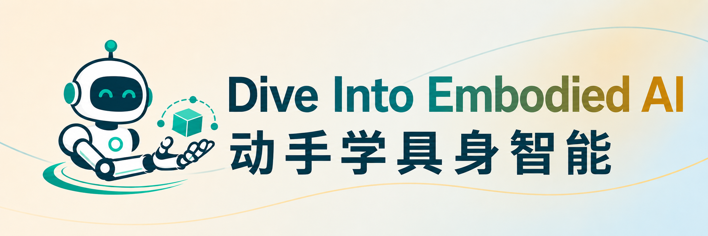

<div align="center">
  

  <p><strong>从机器人基础到 VLA、强化学习、世界模型与真机部署的教程</strong></p>

  <p>
    🤖 <a href="section/README.md">课程地图</a> ·
    🚀 <a href="#quick-start">快速开始</a> ·
    📚 <a href="#chapters">章节目录</a> ·
    👥 <a href="#contributors">参与贡献</a>
  </p>

  <p>
    <a href="https://github.com/zjunlp/dive-into-embodied-ai/stargazers">
      
    </a>
    <a href="https://github.com/zjunlp/dive-into-embodied-ai/network/members">
      
    </a>
    <a href="LICENSE">
      
    </a>
  </p>

  <p>
    <strong>系统化学习</strong> · <strong>工程化复现</strong> · <strong>代码落地</strong> · <strong>面向真机闭环</strong>
  </p>
</div>

---

## 🎯 项目定位

`动手学具身 AI` 不是论文链接合集，也不是只讲概念的入门综述。它的目标是把具身智能系统拆成能学习、能运行、能评测、能复盘的工程模块：机器人本体、三维感知、规划控制、仿真建模、数据采集、VLA、强化学习、世界模型、评测工程、真机部署和研究生态。

<table>
  <tr>
    <td width="33%" valign="top" align="center">
      <h3>🧱 系统化</h3>
      <p>按能力域组织章节，避免把论文、工具、benchmark 和真机经验混在一起。</p>
      <p><a href="section/README.md">查看课程地图</a></p>
    </td>
    <td width="33%" valign="top" align="center">
      <h3>💻 代码落地</h3>
      <p>每章尽量配套可运行示例、实验脚本或复现记录，从概念讲解走到代码实战。</p>
      <p><a href="labs/check_env.py">查看环境检查脚本</a></p>
    </td>
    <td width="33%" valign="top" align="center">
      <h3>👥 面向受众</h3>
      <p>适合希望系统进入具身智能方向的学生、研究者、算法工程师、机器人开发者和课程组织者。</p>
      <p><a href="#contributors">参与共建</a></p>
    </td>
  </tr>
</table>

<span id="quick-start"></span>

## 🚀 快速开始

### 1. 获取仓库并安装依赖

```bash
git clone https://github.com/zjunlp/dive-into-embodied-ai.git
cd dive-into-embodied-ai

conda env create -f environment.yml
conda activate embodied
```

如果已有 Python 3.10 环境，也可以直接安装依赖：

```bash
pip install -r requirements.txt
```

### 2. 启动本地文档站

```bash
python scripts/serve_docs.py --host 0.0.0.0 --port 8000
```

访问地址：

- 本机访问：`http://localhost:8000/`

<span id="chapters"></span>

## 📚 章节目录

<table>
  <tr>
    <td width="25%" valign="top">
      <h3>01 导论</h3>
      <p>具身智能是什么，任务谱系和系统闭环如何理解。</p>
      <p><a href="section/01-introduction/README.md">进入章节</a></p>
    </td>
    <td width="25%" valign="top">
      <h3>02 机器人基础</h3>
      <p>机器人本体、模型资产、坐标关系、状态观测和动作接口如何统一。</p>
      <p><a href="section/02-robotics-foundations/README.md">进入章节</a></p>
    </td>
    <td width="25%" valign="top">
      <h3>03 感知与三维视觉</h3>
      <p>如何把图像、深度、点云、对象和接触信息变成可执行观测。</p>
      <p><a href="section/03-perception-and-3d-vision/README.md">进入章节</a></p>
    </td>
    <td width="25%" valign="top">
      <h3>04 规划控制</h3>
      <p>如何从环境表示、碰撞检测、运动规划走到控制执行。</p>
      <p><a href="section/04-planning-control-and-baselines/README.md">进入章节</a></p>
    </td>
  </tr>
  <tr>
    <td width="25%" valign="top">
      <h3>05 仿真与任务建模</h3>
      <p>如何选择和使用 MuJoCo、Isaac Sim、Isaac Lab、SAPIEN、Gazebo 等仿真生态。</p>
      <p><a href="section/05-simulation-and-task-modeling/README.md">进入章节</a></p>
    </td>
    <td width="25%" valign="top">
      <h3>06 数据类型、转换与收集</h3>
      <p>机器人学习数据如何存、如何转、从哪里来、如何组织采集。</p>
      <p><a href="section/06-data-teleoperation-and-imitation-learning/README.md">进入章节</a></p>
    </td>
    <td width="25%" valign="top">
      <h3>07 模型训练与推理</h3>
      <p>如何训练和部署 VLA / robot policy，如何理解常用库和推理链路。</p>
      <p><a href="section/07-vlm-vla-and-foundation-models/README.md">进入章节</a></p>
    </td>
    <td width="25%" valign="top">
      <h3>08 评测工程</h3>
      <p>仿真 benchmark、真机 benchmark 和复现实验证据如何组织。</p>
      <p><a href="section/08-evaluation-reproducibility-and-engineering/README.md">进入章节</a></p>
    </td>
  </tr>
  <tr>
    <td width="25%" valign="top">
      <h3>09 强化学习</h3>
      <p>PPO、SAC、离线 RL、VLA-RL 和 model-based RL 如何服务机器人任务。</p>
      <p><a href="section/09-reinforcement-learning-for-robotics/README.md">进入章节</a></p>
    </td>
    <td width="25%" valign="top">
      <h3>10 世界模型</h3>
      <p>预测式、生成式、世界动作模型和世界模型 benchmark 如何归类。</p>
      <p><a href="section/10-world-models/README.md">进入章节</a></p>
    </td>
    <td width="25%" valign="top">
      <h3>11 真机实战</h3>
      <p>如何安全搭建真实机器人闭环，完成标定、采集、部署和 Sim2Real。</p>
      <p><a href="section/11-real-robot-practice/README.md">进入章节</a></p>
    </td>
    <td width="25%" valign="top">
      <h3>12 研究生态</h3>
      <p>会议期刊、团队公司、开源基础设施、硬件产业和社区入口在哪里。</p>
      <p><a href="section/12-research-ecosystem-and-resources/README.md">进入章节</a></p>
    </td>
  </tr>
</table>

<span id="contributors"></span>

## 👥 参与贡献

欢迎社区通过 Pull Request 参与共建。无论是补充章节内容、完善代码实战、修复链接、更新资料，还是提出结构和表达建议，都可以先提交 issue 讨论，或直接发起 PR。

## 🙌 贡献者名单

感谢以下小伙伴的参与和贡献，包括章节内容补充、资料校验、工程脚本、目录维护、问题反馈和文档改进：

<div align="center" style="margin-top: 30px;">
  <a href="https://github.com/zjunlp/dive-into-embodied-ai/graphs/contributors">
    
  </a>
</div>

## ⭐ Star History

<div align="center">
  <a href="https://www.star-history.com/#zjunlp/dive-into-embodied-ai&type=date">
    
  </a>
</div>
