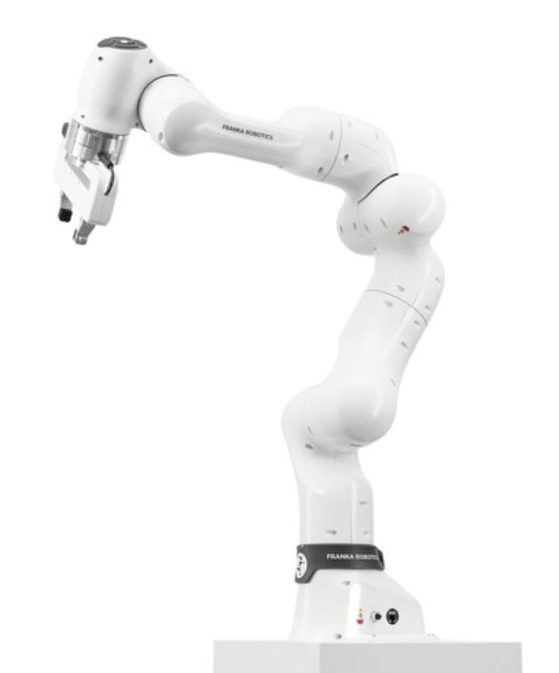
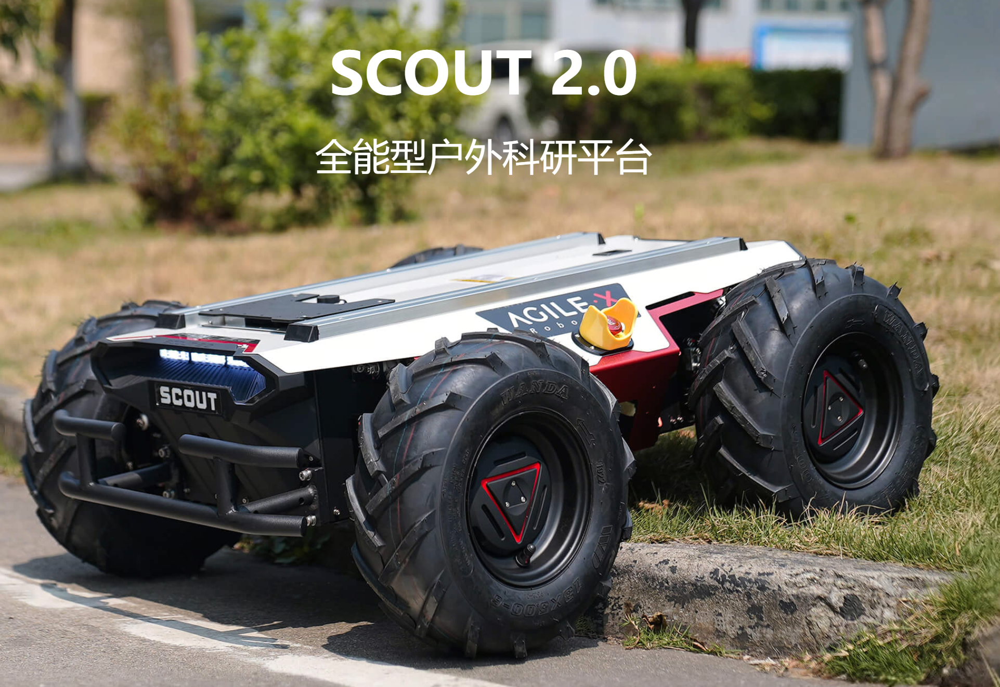
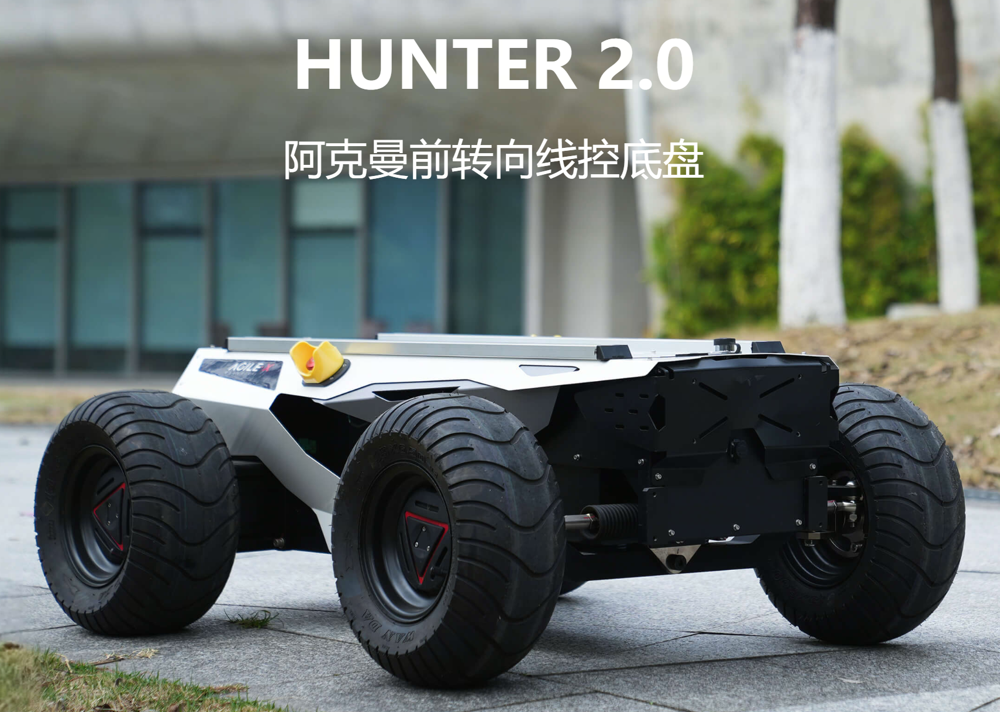
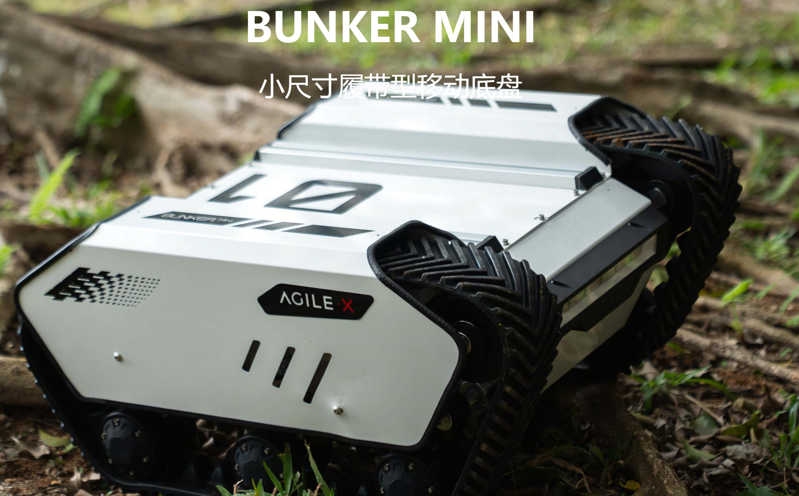
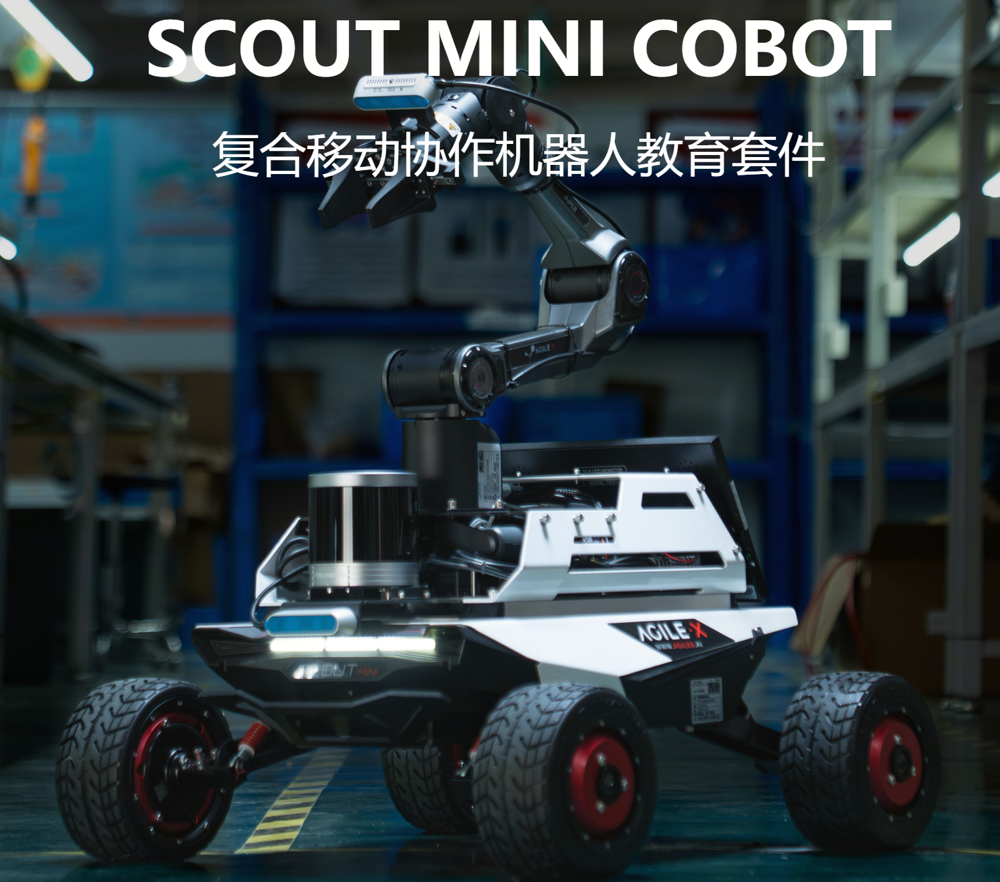
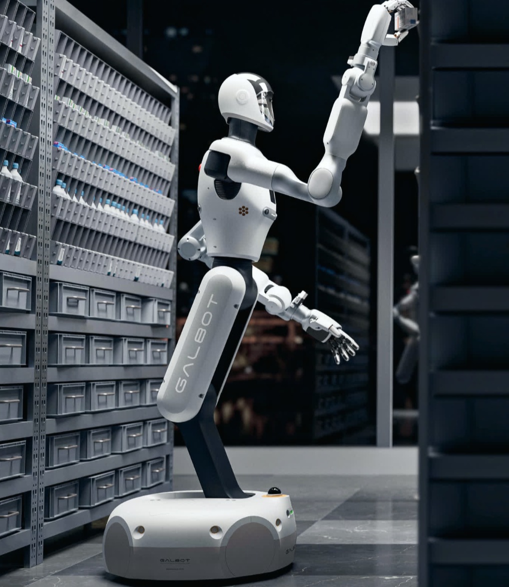
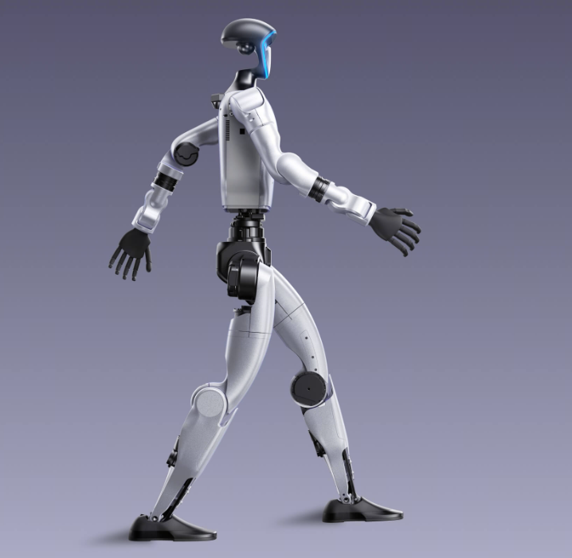
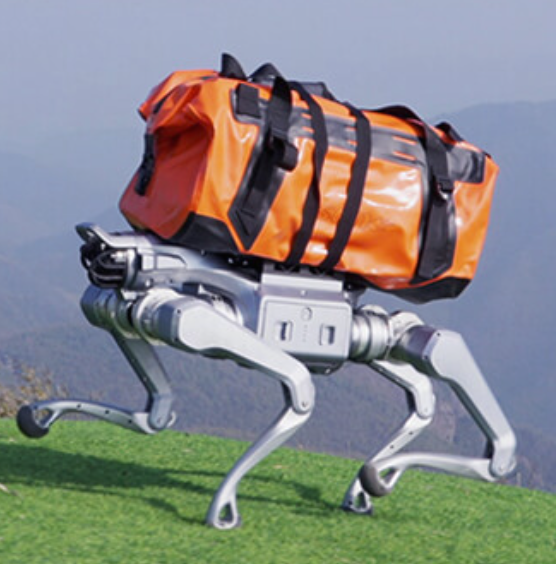
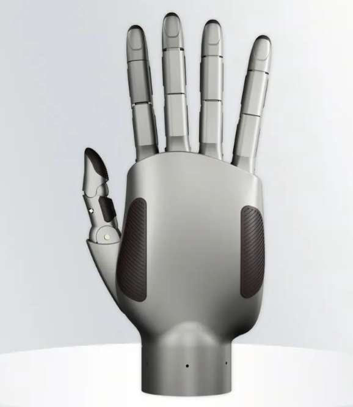

# 具身形态与本体组成

目标：理解机械臂、移动机器人、移动操作、人形机器人、灵巧手等具身形态在本体组成上的共性和差异。

## 本章概述

具身智能（Embodied AI）的核心载体是机器人本体（Robot Embodiment）。不同的机器人由于应用场景、运动方式以及任务目标不同，在机械结构、自由度数量、传感器配置和执行机构上存在较大差异。然而，从算法开发和软件接口的角度来看，大多数具身机器人都可以抽象为若干具有统一功能的模块，例如移动底盘（Base）、机械臂（Arm）、腕部（Wrist）、末端执行器（End-effector）、传感器（Sensors）、驱动器（Actuator）以及控制器（Controller）等。

理解不同机器人形态之间的组成差异，是后续学习机器人运动学、控制系统、数据采集、遥操作以及策略学习的重要基础。本章主要介绍常见具身机器人形态的本体组成，并分析不同机器人对应的状态空间（State Space）和动作空间（Action Space）的区别，为后续章节建立统一的软件接口抽象。

需要说明的是，本章仅介绍机器人本体的组成方式及接口，不涉及机械结构设计、电机选型、减速器设计、硬件采购等具体工程实现内容。

## 常见具身机器人形态

目前主流具身机器人可以根据移动能力和操作能力，大致划分为以下几种典型形态。

## 1 固定机械臂（Fixed Manipulator）

固定机械臂是工业机器人中最常见的形态，也是机器人控制算法研究的重要平台。机器人底座通常固定安装在地面、工作台或生产线上，自身不具备移动能力，仅依靠多个旋转关节完成空间操作任务。

其典型组成包括：

- Base（固定底座）
- 多自由度机械臂（Arm）
- Wrist（腕部关节）
- End-effector（夹爪、吸盘、工具）
- Joint Encoder（关节编码器）
- Force/Torque Sensor（可选）
- RGB 或 RGB-D Camera（外部视觉）
- Motor Driver（驱动器）
- Robot Controller（控制器）

固定机械臂主要适用于抓取、装配、搬运、焊接等高精度重复作业，其运动空间主要集中于机械臂工作空间内。

## 2 移动机器人（Mobile Robot）

移动机器人以自主移动为主要能力，本体通常不具备复杂操作机构。

常见底盘包括：

- 差速轮式（Differential Drive）

- 全向轮（Omnidirectional）
- 麦克纳姆轮（Mecanum）
- 四轮 Ackermann

- 履带底盘

典型组成包括：

- Mobile Base（移动底盘）
- Wheel Encoder（轮编码器）
- IMU
- LiDAR（激光雷达）
- RGB Camera
- Depth Camera（深度相机，可选）
- GPS（室外）
- Controller

移动机器人主要关注环境感知、定位建图（SLAM）、导航与路径规划。

## 3 移动操作机器人（Mobile Manipulator）

移动操作机器人是在移动底盘基础上增加机械臂，实现"移动+操作"能力，是目前具身智能研究最重要的平台之一。

典型组成包括：

- Mobile Base
- Robot Arm
- Wrist
- End-effector
- RGB-D Camera
- Head Camera（可选）
- IMU
- Wheel Encoder
- Joint Encoder
- Force/Torque Sensor
- Controller

由于同时具备移动能力和操作能力，其状态空间和动作空间均明显大于固定机械臂。

典型应用包括：

- 家庭服务机器人
- 仓储物流机器人
- 医疗辅助机器人
- 移动抓取（Mobile Manipulation）

## 4 双臂机器人（Dual-arm Robot）

双臂机器人通常拥有两套完整机械臂，可以完成双手协同操作任务。

典型组成包括：

- Base
- Left Arm
- Right Arm
- Dual Wrist
- Dual End-effector
- Multiple RGB Cameras
- Depth Camera（可选）
- Force/Torque Sensor
- Controller

双臂机器人能够执行：

- 双手抓取
- 双手装配
- 展开衣物
- 协同搬运
- 双手工具操作

相比单臂机器人，需要解决双臂协同规划、碰撞避免和双手协调控制等问题。

## 5 人形机器人（Humanoid Robot）

人形机器人拥有最完整的机器人身体结构，其运动方式最接近人类，也是当前具身智能研究的重要方向。

典型组成包括：

- Legs（双腿）
- Waist（腰）
- Torso（躯干）
- Neck
- Head
- Dual Arms
- Wrist
- Hands
- Camera
- IMU
- Force Sensor
- Joint Encoder
- Controller

完整的人形机器人通常拥有二十至五十多个自由度，部分高自由度平台甚至超过七十个自由度。

由于具有全身运动能力，其控制涉及：

- 全身平衡
- 步态控制
- 操作控制
- 全身运动规划

## 6 四足机器人（Quadruped Robot）

四足机器人主要强调地形通过能力，在复杂环境中具有较好的稳定性。

典型组成包括：

- Body
- Four Legs
- Foot Sensors
- IMU
- Joint Encoder
- Camera
- LiDAR
- Controller

近年来越来越多四足机器人开始增加机械臂，形成"四足+机械臂"的移动操作平台。

例如：机器人 = 四足底盘 + 六自由度机械臂 + 夹爪

此类平台兼具越障能力和操作能力。

## 7 灵巧手（Dexterous Hand）

灵巧手属于高自由度末端执行器，用于替代传统两指夹爪，实现复杂操作。

典型组成包括：

- Palm（手掌）
- Fingers
- Multiple Finger Joints
- Tactile Sensor（触觉传感器）
- Force Sensor
- Encoder
- Controller

自由度通常在12～24以上。

相比普通夹爪，灵巧手能够完成：

- 指尖操作
- 捏持
- 旋转物体
- 手内重定位（In-hand Manipulation）
- 工具使用

灵巧手是当前机器人精细操作的重要研究方向。

## 8 带工具末端机器人（Tool-based Robot）

很多机器人并非直接抓取物体，而是安装专用工具完成任务。

常见工具包括：

- 电钻
- 焊枪
- 打磨机
- 喷枪
- 手术器械
- 螺丝刀
- 吸盘

此时末端执行器不仅需要控制位姿，还需要控制工具自身状态，例如：

- 开关
- 转速
- 力矩
- 温度
- 流量

因此动作空间会增加工具控制维度。

## 机器人本体的统一组成

虽然机器人外形差异较大，但几乎所有具身机器人都可以抽象为若干统一模块。

## 1 Base（底座）

Base 是机器人的主体基础。

根据机器人类型不同，可分为：

- 固定底座
- 移动底盘
- 四足底盘
- 双腿底盘

Base 决定机器人整体运动能力，也是整个坐标系统的参考坐标系。

## 2 Arm（机械臂）

机械臂负责完成空间位置调整。

一般由多个旋转关节串联组成，每个关节由独立执行器驱动。

机械臂决定机器人可到达空间（Workspace）。

## 3 Wrist（腕部）

腕部通常位于机械臂末端。

主要负责调整：

- Roll
- Pitch
- Yaw

从而实现工具姿态调整，提高操作灵活性。

## 4 End-effector（末端执行器）

末端执行器直接与环境接触。

常见类型包括：

- 两指夹爪
- 三指夹爪
- 灵巧手
- 吸盘
- 工具
- 定制执行器

不同任务通常对应不同类型的末端执行器。

## 5 Camera（视觉系统）

视觉系统负责环境感知。

常见包括：

- RGB Camera
- Stereo Camera
- RGB-D Camera
- Fisheye Camera（鱼眼广角相机）
- Wrist Camera
- Head Camera

视觉通常作为策略模型的重要输入来源。

## 6 IMU（惯性测量单元）

IMU 提供：

- 加速度
- 角速度
- 姿态估计

移动机器人、人形机器人和四足机器人通常都依赖 IMU 完成状态估计和平衡控制。

## 7 Force/Torque Sensor（力觉传感器）

力觉传感器用于测量机器人与环境之间的接触力。

主要包括：

- 六维力传感器
- 指尖压力传感器
- 关节力矩估计

广泛应用于柔顺控制、插孔装配和精细操作任务。

## 8 Actuator（执行器）

执行器负责产生机器人运动。

包括：

- 电机
- 减速器
- 驱动器
- 丝杠机构
- 液压执行器（部分机器人）

算法最终输出都会转换为执行器控制命令。

## 9 Controller（控制器）

控制器负责整个机器人控制逻辑。

主要包括：

- 实时控制器
- 工控机
- MCU
- PLC（工业机器人）

控制器连接所有传感器和执行器，并负责通信、控制和安全管理。

## 不同机器人形态对应的状态空间

机器人形态不同，其状态空间（State Space）的组成也存在明显差异。

## 1 关节状态（Joint State）

适用于所有具有机械关节的机器人。

通常包括：

- Joint Position
- Joint Velocity
- Joint Acceleration
- Joint Torque

机械臂、双臂、人形机器人和灵巧手均以关节状态作为主要状态变量。

## 2 底盘状态（Base State）

移动机器人额外需要描述自身运动状态。

通常包括：

- Base Position
- Base Orientation
- Linear Velocity
- Angular Velocity

对于四足机器人和人形机器人，还需包含机身姿态信息。

## 3 末端状态（End-effector State）

描述末端执行器在空间中的状态。

通常包括：

- Position
- Orientation
- Linear Velocity
- Angular Velocity

在抓取和操作任务中，末端状态通常比关节状态更直接反映任务目标。

## 4 传感器状态（Sensor State）

传感器状态反映机器人对环境的感知信息。

主要包括：

- Camera Image
- Depth Image
- Point Cloud
- IMU Data
- Force Sensor Data
- Tactile Sensor Data

现代具身智能模型通常融合多模态传感器数据作为输入。

## 5 接触状态（Contact State）

接触状态描述机器人与环境之间的交互关系。

例如：

- 是否接触物体
- 接触位置
- 接触法向力
- 摩擦状态
- 足端接触地面状态

接触状态对于稳定抓取、步态控制和精细操作具有重要意义。

## 不同机器人形态对应的动作空间

机器人控制方式决定了动作空间（Action Space）的定义。

## 1 关节动作（Joint Action）

最基础的动作空间形式。

控制量通常包括：

- Joint Position
- Joint Velocity
- Joint Torque

适用于绝大多数机器人控制器。

## 2 末端位姿动作（End-effector Action）

直接控制末端执行器的位置和姿态。

通常表示为：

- Δx
- Δy
- Δz
- Δroll
- Δpitch
- Δyaw

底层控制器通过逆运动学将末端动作转换为关节动作。

## 3 底盘速度动作（Base Velocity Action）

移动机器人通常采用速度控制。

包括：

- vx
- vy（全向底盘）
- ω（角速度）

导航算法最终都会生成此类控制命令。

## 4 夹爪动作（Gripper Action）

夹爪控制一般只有少量自由度。

例如：

- Open
- Close
- Width
- Grip Force

灵巧手则需要同时控制多个手指关节。

## 5 全身动作（Whole-body Action）

人形机器人和移动操作机器人通常需要同时控制：

- 底盘
- 双腿
- 双臂
- 腰部
- 头部
- 灵巧手

因此动作空间由多个子系统共同组成，属于高维连续动作空间，也是当前具身智能策略学习的重要研究对象。

## 本章小结

不同具身机器人虽然在外观结构和应用场景上存在较大差异，但从系统架构角度来看，都可以抽象为底座、机械臂、腕部、末端执行器、传感器、执行器和控制器等统一模块。机器人形态的不同，直接决定了其状态空间和动作空间的组成形式，也影响着控制算法、数据采集方式以及学习策略的设计。

理解这些统一抽象，有助于后续将不同机器人平台映射到一致的软件接口，为机器人运动学、控制系统、遥操作、数据集构建以及具身智能模型训练奠定基础。
