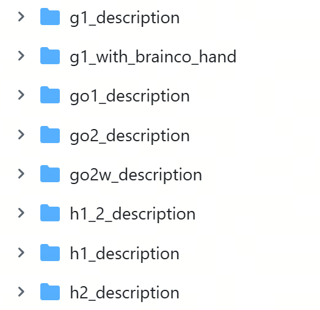

# URDF、MJCF 与 USD

## 本章概述

在机器人开发过程中，无论是机械臂、人形机器人还是移动机器人，都需要使用一种标准化的文件来描述机器人的几何结构、关节连接关系、惯性参数、碰撞模型以及传感器配置。这类文件通常被称为**机器人描述文件（Robot Description Format）**。

机器人描述文件相当于机器人的"数字模型"。它不仅决定机器人在仿真环境中的外观，还影响运动学计算、动力学仿真、路径规划、碰撞检测、控制接口以及真实机器人的软件部署。可以说，机器人软件系统中的大多数模块，都会直接或间接依赖机器人描述文件。

目前具身智能领域最常见的机器人描述格式主要包括三类：

- **URDF（Unified Robot Description Format）**
- **MJCF（MuJoCo XML Format）**
- **USD（Universal Scene Description）**

虽然三者都能够描述机器人模型，但它们诞生于不同的软件生态，设计目标和表达能力也有所不同。URDF 更偏向机器人运动学建模和 ROS 软件生态；MJCF 更强调物理仿真和控制实验；USD 则不仅能够描述机器人，还能够描述完整的三维场景，是近年来大规模机器人仿真平台的重要基础格式。

本章将介绍三种机器人描述格式的主要应用场景，对比它们在模型表达能力上的差异，分析不同格式之间转换时容易出现的信息丢失问题，并说明后续课程中各章节与这些格式之间的关系。需要强调的是，本章的目标并不是学习如何手写完整的机器人模型，而是帮助读者能够读懂常见字段，理解哪些配置会影响机器人控制和仿真结果。

## URDF：ROS 生态中的机器人描述格式

URDF（Unified Robot Description Format）是 ROS 生态中使用最广泛的机器人描述格式，也是学习机器人软件开发时最先接触的一种模型文件。

URDF 采用 XML 作为文件格式，通过 Link（连杆）和 Joint（关节）构建机器人的运动链（Kinematic Chain），能够描述机器人各个部件之间的连接关系、关节类型、几何模型、碰撞模型以及惯性参数。

由于 ROS、MoveIt、RViz 等工具都能够直接读取 URDF，因此它已经成为机器人运动学建模和路径规划中的事实标准。

URDF 最典型的使用场景包括：

- ROS 机器人建模
- MoveIt 运动规划
- RViz 可视化
- TF 坐标系管理
- Gazebo 仿真（通常配合扩展标签）

对于大多数机器人而言，官方都会提供对应的 URDF 文件，因此在 ROS 中导入机器人模型通常就是从 URDF 开始。不过，URDF 本身更加关注机器人结构描述，对复杂执行器、接触模型以及高级物理属性的支持相对有限，因此在高保真物理仿真中通常需要结合其他格式使用。



## MJCF：MuJoCo 的机器人模型格式

MJCF（MuJoCo XML Format）是 MuJoCo 物理引擎使用的机器人描述格式。

相比 URDF，MJCF 更强调机器人动力学和物理仿真能力，它不仅能够描述机器人结构，还能够定义执行器、控制器接口、接触参数、摩擦模型、约束关系以及各种物理属性。

近年来大量强化学习、模仿学习以及机器人控制论文都采用 MuJoCo 作为实验平台，因此 MJCF 已成为机器人学习领域的重要模型格式。

MJCF 主要应用于：

- MuJoCo 仿真
- 强化学习环境
- 控制算法研究
- 模仿学习训练
- 动力学分析

由于 MuJoCo 的物理模拟精度较高，MJCF 文件通常包含更多与动力学相关的配置，例如关节阻尼、执行器增益、接触参数、摩擦系数以及各种约束条件。这些内容对于机器人控制性能具有重要影响，也是 MJCF 相较于 URDF 的优势所在。

## USD：Omniverse 与 Isaac Sim 的场景描述格式

USD（Universal Scene Description）最初由 Pixar 提出，用于大型三维场景的组织和管理。随着 NVIDIA Omniverse 和 Isaac Sim 的发展，USD 逐渐成为机器人数字孪生和大规模仿真的核心描述格式。

与 URDF 和 MJCF 不同，USD 并不仅仅用于描述机器人，而是能够统一描述机器人、环境、材质、灯光、相机、传感器以及整个三维场景。因此，它更像是一种完整的数字世界描述语言，而不仅是机器人模型格式。

USD 在机器人领域主要应用于：

- Isaac Sim
- NVIDIA Omniverse
- 数字孪生
- 大规模机器人仿真
- 合成数据生成
- 多机器人场景管理

USD 支持复杂的层级组织、资产引用、实例化、版本管理以及非破坏性编辑，非常适合构建大型机器人仿真环境。例如，一个工厂场景可以同时包含几十台机器人、多个相机、复杂光照以及各种动态物体，并通过 USD 统一组织管理。随着具身智能的发展，越来越多机器人数据集和仿真平台开始采用 USD 作为底层场景描述格式。

## 三种格式的表达能力对比

虽然 URDF、MJCF 和 USD 都能够描述机器人，但它们在表达能力和关注重点上存在明显区别。

URDF 更侧重于机器人运动链和几何结构的描述，能够很好地表达 Link、Joint、惯性参数、碰撞模型以及视觉模型，因此非常适合运动学分析、路径规划和 ROS 软件开发。

MJCF 在此基础上进一步增强了动力学表达能力。除了机器人结构之外，它还能定义执行器（Actuator）、控制接口、关节驱动方式、接触约束、摩擦参数以及更多物理仿真配置，因此更适合控制算法研究和强化学习训练。

USD 的表达能力则更加全面。它不仅能够表示机器人本身，还能够统一管理场景中的材质、纹理、灯光、相机、激光雷达、IMU、物理属性以及复杂环境资产，因此更适合数字孪生和高保真仿真。

从机器人建模角度来看，三者通常具有如下特点：

| 能力 | URDF | MJCF | USD |
|------|------|------|------|
| 运动链（Link / Joint） | ✔ | ✔ | ✔ |
| 多种关节类型 | ✔ | ✔ | ✔ |
| 执行器（Actuator） | 支持较弱 | ✔ | ✔ |
| 传感器描述 | 扩展支持 | 部分支持 | ✔ |
| 材质与纹理 | 基础支持 | 基础支持 | ✔ |
| 碰撞几何 | ✔ | ✔ | ✔ |
| 惯性参数 | ✔ | ✔ | ✔ |
| 动力学参数 | 基础支持 | ✔ | ✔ |
| 场景描述 | ✘ | ✘ | ✔ |
| 大规模资产管理 | ✘ | ✘ | ✔ |

因此，这三种格式并不存在简单的优劣之分，而是针对不同的软件生态和应用场景进行了优化。

## 模型格式转换中的常见问题

由于不同软件平台采用不同的机器人描述格式，因此机器人模型在开发过程中经常需要进行格式转换，例如：

```text
URDF
   │
   ▼
MJCF

或

URDF
   │
   ▼
USD
```

虽然转换工具能够自动完成大部分工作，但不同格式之间并不能做到完全等价，因此模型转换过程中经常会出现信息丢失或语义变化的问题。

首先容易丢失的是**执行器配置（Actuator）**。URDF 本身对执行器的描述能力有限，而 MJCF 和 USD 可以定义更加复杂的驱动模型，因此在 URDF 转换为 MJCF 或 USD 时，执行器参数通常需要重新配置。

其次是 **Mimic Joint（联动关节）**。某些机器人通过 Mimic Joint 实现多个关节之间的联动关系，但不同平台对该特性的支持程度并不一致，转换后可能需要重新建立关节约束。

**碰撞模型（Collision Mesh）** 也是模型转换中容易发生变化的部分。一些平台为了提高仿真速度，会自动简化碰撞网格；而另一些平台则要求开发者单独提供低精度碰撞模型。如果碰撞模型发生变化，碰撞检测和接触模拟结果也会受到影响。

此外，**惯性参数（Inertial）** 往往是最容易被忽略却影响最大的配置之一。部分模型转换工具可能无法完整保留惯性矩阵、质心位置或质量参数，导致机器人动力学行为与原模型产生差异。

除了物理参数之外，**坐标系名称（Frame Name）** 和 **Frame ID** 也可能在转换过程中发生变化。例如某些工具会自动修改 Link 名称、增加前缀或重新组织层级结构，这可能导致控制程序无法找到对应的坐标系。

最后，还需要关注**材质（Material）** 和 **单位（Unit）**。不同平台对颜色、纹理、光照以及长度单位的默认定义可能不同，如果没有进行统一检查，模型在不同软件中的显示效果和物理尺寸可能存在明显差异。

因此，在完成模型格式转换之后，不应直接用于仿真或真机部署，而应重点检查机器人结构、关节方向、惯性参数、碰撞模型以及坐标系定义是否保持一致。

## 机器人描述格式在课程中的应用

机器人描述格式几乎贯穿整个机器人开发流程，因此后续多个章节都会涉及这些模型文件。

在机器人基础部分，将利用 URDF 理解机器人运动链、关节关系和坐标系建立方式，帮助读者理解机器人模型的基本组成。

在仿真建模章节，将介绍如何利用 URDF、MJCF 和 USD 构建机器人模型，并导入不同仿真平台进行验证，分析模型参数如何影响仿真效果。

在规划控制章节，机器人描述文件将作为运动学求解、碰撞检测和路径规划的重要输入，为控制算法提供机器人结构信息。

在真机部署章节，机器人描述模型将用于统一机器人坐标系、控制接口和关节定义，保证控制程序能够正确映射到真实机器人。

在数据记录章节，机器人模型中的关节名称、坐标系名称和传感器配置将直接影响 Observation、Robot State 以及数据集字段的定义，因此也是数据采集和数据回放的重要基础。

可以看到，虽然机器人描述文件通常只在项目初始化时编写一次，但几乎会伴随整个机器人研发流程。

## 本章建议掌握的内容

对于初学者而言，本章并不要求能够独立编写完整的 URDF、MJCF 或 USD 模型，也不需要掌握所有 XML 或 USD 语法。

更加重要的是建立以下几个基本认识：

首先，能够区分 URDF、MJCF 和 USD 分别服务于哪些软件生态，知道它们适用于 ROS、MuJoCo 还是 Isaac Sim 等平台。

其次，能够阅读机器人模型中的关键字段，例如 Link、Joint、Inertial、Collision、Visual、Actuator 等，理解这些字段分别描述机器人哪些组成部分。

再次，知道哪些配置会直接影响机器人控制和仿真，例如关节方向、惯性参数、碰撞模型、坐标系名称、单位以及执行器配置，并能够在模型转换后重点检查这些内容。

最后，理解机器人描述文件不仅决定机器人"长什么样"，更决定机器人"如何运动""如何碰撞""如何控制"以及"如何参与仿真"，它是机器人软件系统中最基础、最重要的数据描述之一。

## 本章小结

URDF、MJCF 和 USD 是当前机器人领域最常用的三种机器人描述格式，它们分别服务于不同的软件生态和应用场景。URDF 是 ROS 和 MoveIt 中最常见的机器人模型格式，适用于运动学建模、可视化和路径规划；MJCF 是 MuJoCo 的原生格式，强调动力学建模、执行器配置和高精度物理仿真；USD 则能够统一描述机器人、环境、传感器和场景资产，是 Isaac Sim、Omniverse 以及数字孪生平台的重要基础。

虽然三种格式都能够描述机器人结构，但在执行器、传感器、材质、动力学参数以及场景组织等方面具有不同的表达能力，因此模型在不同格式之间转换时，经常会出现执行器配置、联动关节、碰撞模型、惯性参数、坐标系命名以及单位定义等信息丢失或发生变化的问题。

在整个具身智能开发流程中，机器人描述文件贯穿机器人建模、仿真验证、运动规划、控制部署和数据记录等多个环节。对于学习者而言，本章的重点并不是掌握模型文件的编写方法，而是能够理解不同格式的定位，读懂机器人模型中的关键字段，并知道哪些配置会直接影响机器人控制和仿真结果，为后续深入学习机器人软件开发奠定基础。
