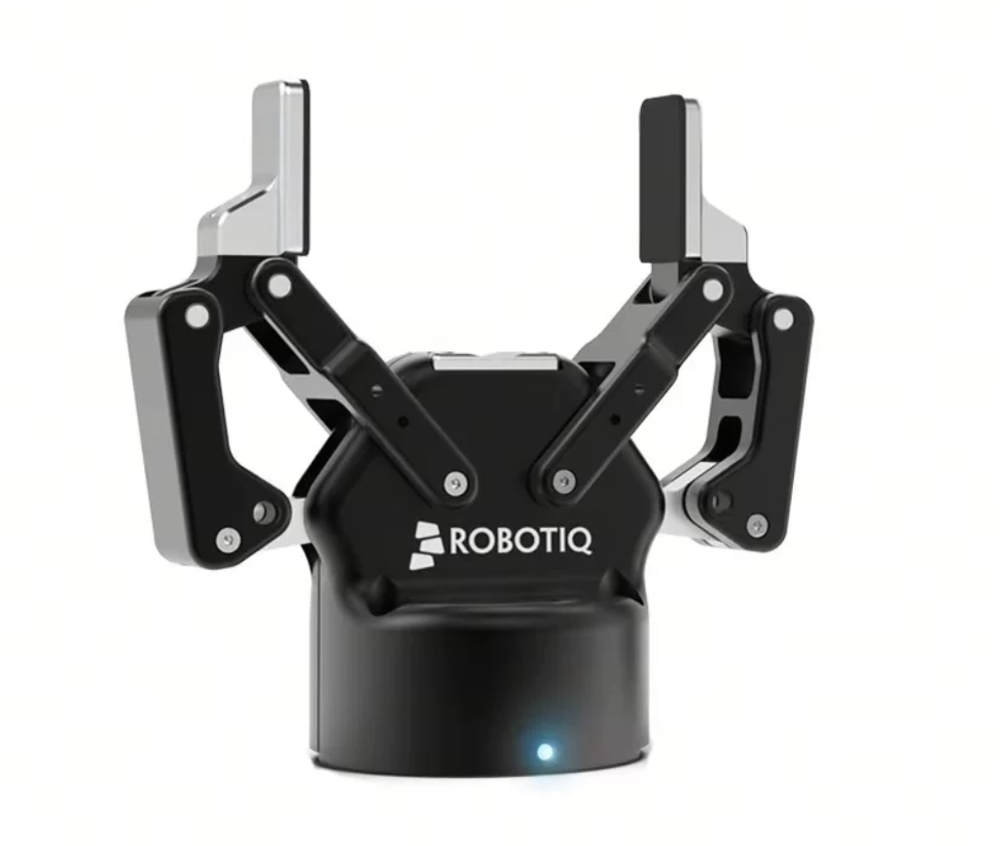
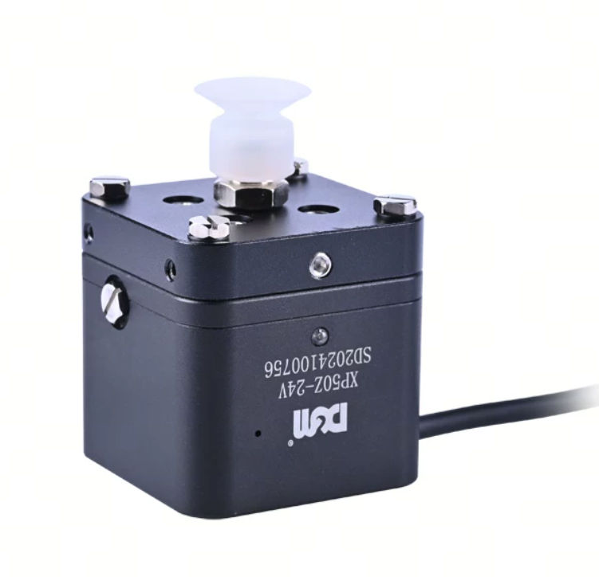
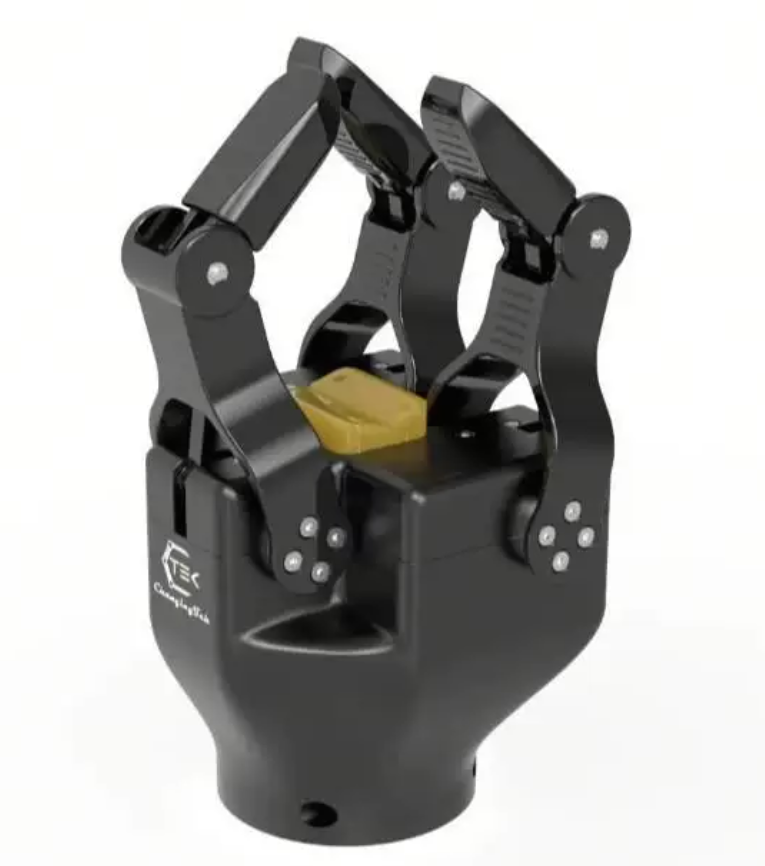
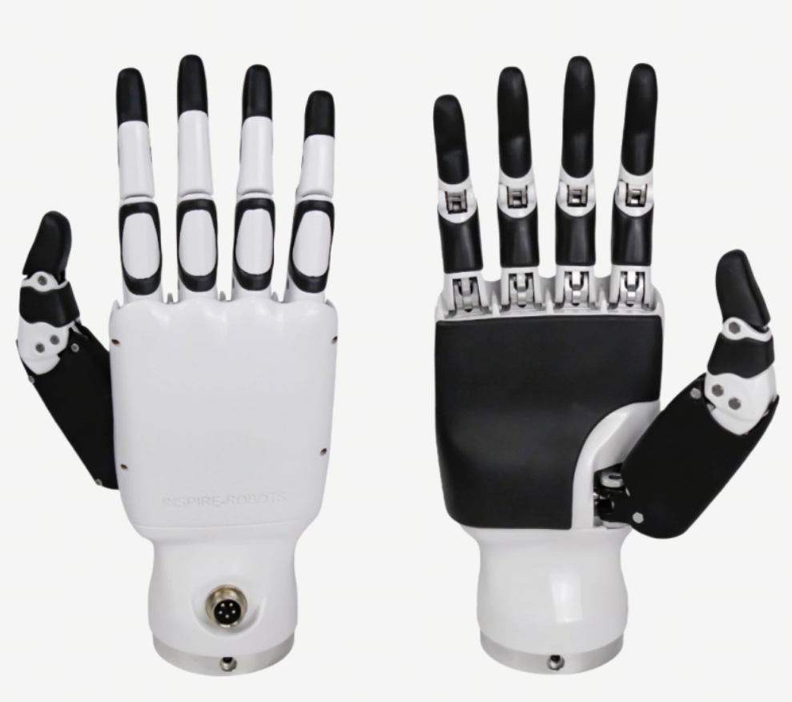

# 末端执行与接触（End-Effector and Contact）

机器人与环境之间的物理交互，最终都要通过末端执行器（End Effector）来完成。无论是抓取一个杯子、吸附一个包装盒、推动一个滑块，还是操作一个门把手，策略输出的动作指令都必须转化为末端执行器的具体控制命令，并通过末端的传感反馈来判断任务是否成功。在纯视觉或纯语言任务中，模型的输出停留在像素空间或文本空间，成功与否由视觉相似度或语言一致性来衡量；而在具身智能中，动作的成功取决于真实的物理交互——力够不够大、接触是否建立、物体是否滑落、保护是否被触发。正是这种与物理世界的"硬接触"，将具身智能与纯数字领域的 AI 任务从根本上区分开来。

本章从接口层面系统介绍末端执行器的类型与命令反馈、接触约束与力限制、执行结果的判定与失败分类，并明确本章与感知章节、控制章节之间的边界分工。

## 末端工具类型与接口

不同类型的末端工具在控制接口、状态反馈和执行能力上差异极大。策略设计如果不考虑末端工具的接口差异，很容易出现"模型输出灵巧手动作但机器人只有二指夹爪"或"策略只输出夹爪开合但机器人需要控制吸附力"的接口不匹配问题。以下概述各类末端工具的核心接口特征。

**二指平行夹爪（Parallel Gripper）**是目前具身智能领域使用最广泛的末端执行器。两个手指沿平行方向对称运动，通过改变手指间距来抓取或释放物体。其控制命令最为简洁：通常只需一个归一化的开合程度值（0 表示完全闭合，1 表示完全张开），或进一步指定目标宽度、夹持力和开合速度。状态反馈包括当前手指间距、开合速度、夹持力和是否检测到物体的信号。许多模仿学习数据集（如 ALOHA、LeRobot）和 VLA 模型都采用这种简化的归一化接口。

**吸盘（Suction Cup）**通过真空吸附方式拾取物体，不需要从两侧包夹，只需接触物体的一面即可完成拾取。其关键接口特性在于："抓取"状态不能通过机械位置判断，而必须依赖气压传感器的反馈。控制命令包括开启/关闭真空、目标气压和反向吹气释放。状态反馈包括当前气压、真空是否建立、物体是否被吸附以及泄漏速率。策略不能仅凭"已发送吸附指令"就认为物体已牢固拾取，而必须读取 vacuum_established 和 object_detected 等反馈信号进行确认。

**多指手（Multi-finger Hand）**通常具有 2～4 个手指，每个手指包含 1～3 个独立关节。相比二指夹爪，其控制维度显著增加——每个手指关节都有独立的位置和力控制通道，状态反馈也需包含各手指的关节位置、速度和接触状态。许多系统为了简化接口，会将预定义的抓取模式（如包络抓取、三指捏取）作为离散命令下发，由底层控制器自动生成手指关节轨迹。

**灵巧手（Dexterous Hand）**是多指手的进一步演进，通常具有 5 个手指和 15～25 个自由度，接近人手的运动能力。其控制接口以完整的关节向量表示（位置和力矩），状态反馈还包含触觉阵列（如 15×15 的压力矩阵）和各指节的接触状态。灵巧手在具身智能中的应用尚处于早期阶段，主要面临控制维度高、数据采集困难以及仿真到真机迁移差距大等挑战。通常需要通过接口封装和抽象简化来降低策略的学习难度。

**工具快换装置（Tool Changer）**允许机器人在运行过程中自动切换不同的末端执行器。其接口要点在于：切换工具后，控制器需要知道当前装载的是哪一种末端执行器，从而激活对应的命令和反馈字段。如果策略不知道当前装载的是吸盘还是夹爪，就可能在发送夹爪闭合命令时期望吸盘产生真空——这在接口层面是致命的语义错误。

**定制工具（Custom Tool）**涵盖焊接、涂胶、切割、测量等工业场景中的非标末端执行器。其接口没有统一标准，但通常遵循"提供专用命令字段、继承通用位姿状态、添加工具特有传感反馈"的原则，在专用性和可复用性之间权衡。

末端工具的类型直接决定了动作空间的维度设计和数据记录的字段集合——二指夹爪和灵巧手不应共用相同的动作字段模板。在工程实践中，应根据实际装载的末端工具动态配置命令接口和反馈通道，使用工具配置文件或动态接口描述来声明当前末端工具的接口字段，而不是将所有可能字段硬编码为固定维度的统一接口。

## 接触约束与力限制

在机器人执行抓取、放置、按压、插入等任务时，末端执行器与物体或环境之间会发生物理接触。与自由空间运动不同，接触状态下的机器人行为不仅取决于位置控制精度，还受到接触力、摩擦力、物体重量、表面特性以及环境约束的共同影响。仅向机器人发送末端位姿目标是不够的——接口层必须明确表达接触约束和力限制。

### 接触状态的结构化表达

接触状态（Contact State）将"机器人碰到了什么、碰得怎么样"转化为结构化的接口字段。一个完整的接触状态反馈通常包含：是否处于接触（in_contact）、接触对象标识（contact_object）、接触点在末端工具坐标系中的位置（contact_location）、法向力和切向力（contact_force）、以及接触检测的可信度（contact_confidence）。

各字段在策略层面有不同的用途：in_contact 是状态机切换的基础条件——接触前执行趋近运动，接触后切换为力控或停止；contact_object 帮助策略区分"抓到目标物体"和"碰到桌面"两种截然不同的情况；contact_force 的法向分量决定抓取牢固程度，切向分量反映滑移风险；contact_confidence 在传感器噪声较大时提示策略对接触信号持保守态度。

### 力、摩擦与滑移

接触任务的核心挑战在于力的管理。法向力（Normal Force）是垂直于接触面的力分量——对于夹爪抓取即为夹持力，法向力越大最大静摩擦力越大，但过大也会导致脆性物体碎裂或柔性物体变形。摩擦力（Friction Force）平行于接触面，是阻止物体滑落的关键力量，其上限由库仑摩擦模型 $f_{friction} \leq \mu \cdot f_{normal}$ 决定。滑移（Slip）是物体在夹持状态下发生的不可恢复的切向位移，是抓取失败的最常见表现，可通过切向力突变、物体位置偏移或触觉阵列的接触区域漂移来检测。对于吸盘，吸附力取决于真空度与有效吸附面积的乘积 $F_{suction} = \Delta P \cdot A_{effective}$。

此外，碰撞（Collision）和卡滞（Jamming）是接触任务中的两种典型异常。碰撞指末端在运动过程中意外接触障碍物，应停止或绕行；卡滞指物体在装配或插入过程中被几何约束卡住，应退让后调整姿态而非一味增加力。

### 力与运动的限制边界

力限制、力矩限制、速度限制、工作空间限制、负载限制以及保护阈值共同构成了接触任务中命令的"安全边界"。策略输出的命令必须在这个边界内执行——如果命令使机器人在这些边界上被约束，可能导致动作被裁剪、控制器拒绝命令或机器人进入保护性停机。

其中，速度限制在接触任务中比自由空间运动更加重要：接触发生时如果速度过高，冲击力远大于稳态力，很容易触发力保护或造成物体损坏。因此，在接近接触预期发生的位置时，应主动将末端速度降至自由空间速度的 10%～20%。保护阈值决定了安全保护的触发临界值，设置太敏感会频繁误触发导致任务中断，设置太宽松则可能在真正危险时来不及保护。在接口层面，所有这些限制应以可配置参数的形式暴露给上层策略，同时限制的当前状态（是否接近阈值、是否已被触发）应实时反馈给策略。

### 仿真与真机的接触差异

仿真与真机之间的接触反馈差异，是策略迁移中最容易出问题的环节。差异来源包括：接触刚度和阻尼参数在仿真中是预设数值但真实物体因材质和环境而异；力/力矩传感器在真机中存在噪声、偏置漂移和延迟，而仿真中通常可获得无噪声的理想信号；碰撞几何在仿真中被简化为凸包或基本几何体，忽略了真实表面的细节特征；真空吸盘的吸附行为在仿真中尤其难以精确建模，通常采用简化的二值吸附模型。因此，接口设计应遵循以下原则：日志中标注接触反馈的来源和置信度；接触参数以真机实测为准而非仿真默认值；策略在真机部署时从保守的力限制和低速模式起步；首次真机执行接触任务时应预期可能出现显著行为偏差并准备监控机制。

## 执行反馈与失败判定

机器人执行完一个动作之后，策略需要知道结果——成功了还是失败了？如果失败了，是什么原因？仅返回一个 success/failure 布尔值无法支撑有效的后续决策：空抓、滑落、卡滞和碰撞需要完全不同的恢复策略。因此，执行结果的反馈需要结构化、可区分，并且附带判定依据。

### 执行结果的状态字段

结构化的执行结果应以状态枚举代替简单的布尔值。推荐的状态值包括：

- **success**：动作完全按预期完成，所有关键指标均满足成功标准。
- **partial_success**：动作部分完成但未达到全部标准（如插入了一半、夹持力低于目标值），提示策略基础目标达成但质量不够理想。
- **failed**：动作执行失败，必须伴随 failure_reason 字段说明具体原因（空抓、滑落、力超限等）。
- **aborted**：动作因外部原因被中止（急停触发、任务抢占、人工介入），不表示策略输出有误。
- **timeout**：动作在预设时间限制内未能完成，提示策略检查时间预算或目标可达性。
- **unsafe**：动作触发了安全保护但尚未发生实际损坏，要求策略降低动作的激进程度。
- **unknown**：因传感器故障或数据完整性不足无法确定结果，应触发策略进入保守模式。

### 末端执行常见的判定信号

判断末端执行是否成功，需要综合多个传感器信号而不是依赖单一信号。

夹爪宽度变化是最直接的抓取判定信号——如果夹爪在到达空载闭合宽度之前就停止了变化，说明手指遇到了物体；但如果夹爪闭合到空载宽度仍未遇到阻力，则是空抓。力/压力阈值是比宽度更可靠的接触判定依据，直接反映接触质量而不受物体形状影响。接触检测信号的时序（相对于动作命令发出时刻的时间差）也是判断执行是否正常的重要线索——如果接触发生在预期时间窗口之外，可能意味着物体位置与策略的估计不符。物体运动信号是最直接的抓取成功信号，但因传感器延迟更适合作为事后确认而非实时控制反馈。滑移检测一旦触发，即使夹持力仍然存在，也应判定为抓取质量下降或即将失败。控制器状态是系统级健康信号，优先级高于任务级成功标准——控制器异常意味着底层系统可能已不稳定，不应再信任任何任务级的判定结果。

### 失败类型的可区分性

失败类型必须是可区分的，每种失败类型对应不同的信号特征和恢复策略：

- **空抓（Missed Grasp）**：夹爪闭合到空载宽度，未检测到有效接触力。恢复策略是调整抓取位姿后重试。
- **滑落（Slip / Drop）**：物体在夹持后被提起但随后脱落。恢复策略是返回拾取位置，调整夹持力或姿态后重新抓取。
- **卡滞（Jammed / Stuck）**：物体在装配或插入中运动受阻，位置变化接近零但力持续增大。恢复策略是退让后调整姿态重试，而非继续增加力。
- **碰撞（Collision）**：末端意外接触障碍物，力或力矩突然跃升。恢复策略是停止运动并沿反方向退出。
- **力超限（Force Exceeded）**：施加的力超过限制值，恢复策略取决于超限原因。
- **超时（Timeout）**：动作在预设时间内未完成，恢复策略取决于具体原因（目标不可达、速度过低或卡滞）。
- **目标不可达（Target Unreachable）**：期望位姿超出工作空间或关节限位。
- **控制器拒绝（Controller Rejected）**：控制器主动拒绝命令，需检查命令合法性和控制器状态。
- **传感器异常（Sensor Fault）**：关键传感器数据缺失或明显不合理，应进入安全状态。

在接口实现中，这些失败类型应以枚举或错误码的形式定义，由执行判定模块根据具体信号组合自动分类——策略不应自己去解析原始传感器数据来推断失败原因。

### 日志中的判定依据

仅记录一个 success 布尔值或失败枚举值对事后分析毫无帮助。日志中必须记录完整的判定依据：关键指标的实际值、目标值、判定阈值，以及哪个信号触发了失败判定。判定阈值本身也应一并记录，因为阈值可能在部署过程中被调整——如果只知道"力不够"而不知道当时的阈值，就无法判断是力确实太小还是阈值设得太高。通过这种记录方式，开发者在事后分析时可以立即定位问题，而不需要在大量原始数据中反向推断。

## 与感知章节的分工

本节与第 3 章（感知、状态估计与环境理解）在内容上有明确的边界分工。

本节聚焦于**执行接口和反馈字段**——末端工具能接收什么命令、返回什么状态、接触约束如何定义、力限制如何配置、执行结果如何判定和记录。这些内容属于机器人控制系统的接口层，是策略与硬件之间的"协议"。

第 3 章则聚焦于**感知层面的理解和生成**——如何从视觉、触觉和力觉数据中提取可供性（Affordance）、生成抓取姿态（Grasp Generation）、识别物体属性（材质、重量、表面特性），以及利用触觉传感器进行精细操作中的接触感知。这些内容属于感知和认知层面，解决的是"看到了什么、该怎么抓"的问题。

简而言之，本节定义的是"机器人能做什么、怎么反馈"，第 3 章定义的是"策略如何根据感知来决策做什么"。

## 与控制章节的分工

本节与第 4 章（运动规划、控制与执行）同样有清晰的分工边界。

本节关注**接触相关的接口和约束**——接触状态字段的定义、力限制和保护阈值的配置、执行结果的反馈结构、失败类型的分类和恢复策略的触发条件。这些内容面向的是策略层和接口设计者，帮助他们理解接触任务中命令和反馈的语义。

第 4 章则深入**控制算法的内部实现**——力控（Force Control）如何调节末端输出力、阻抗控制（Impedance Control）如何建立力与位置的动态关系、模型预测控制（MPC）如何优化未来轨迹、全身控制（WBC）如何协调多关节和多任务约束。这些内容面向的是控制工程师和算法开发者，涉及底层的数学推导和实时控制实现。

简而言之，本节回答"接触任务中接口需要传递什么信息"，第 4 章回答"控制器内部如何利用这些信息生成执行信号"。

## 典型任务与接口需求

以下是具身智能中涉及末端执行与接触的典型任务，以及它们在接口层面的核心需求：

**抓取（Grasping）**：需要同时满足夹爪（或吸盘）与物体建立有效接触、夹持力（或吸附力）达到设定阈值、物体可被提升离开支撑面、提升过程中未检测到滑移、放置后稳定释放。接口需提供夹爪宽度/真空压力命令、接触力/压力反馈和滑移检测信号。

**吸附（Suction）**：依赖真空系统而非机械夹持。接口需提供真空开关命令、目标气压、泄漏速率反馈和物体检测信号。关键挑战在于表面不平整或多孔材质导致的真空泄漏。

**按压（Pressing）**：关注力而非位置。成功的按压需要末端到达目标力值并保持稳定，位置误差的容忍度比自由空间运动更大。接口需提供力目标命令和力反馈，位置仅作为辅助参考。

**推动（Pushing）**：需要末端与物体保持持续接触且物体沿预期方向移动足够距离。判定需要结合末端力反馈（接触是否持续）和外部物体运动跟踪（物体是否移动）两个信号源。

**插入（Insertion）**：对精度要求最高。接口需同时关注插入深度和接触力——深度达到目标且力不超过安全阈值为成功，力持续增大但深度不再增加为卡滞。depth_achieved 与 depth_target 的比值是核心量化指标。

**开门（Door Opening）**：涉及机器人与可动机构的交互。成功标准既取决于机器人本身（是否抓住把手并保持接触），也取决于环境（门是否被卡住或超重）。接口需提供末端接触状态、旋转角度反馈和力监测。

**工具使用（Tool Usage）**：成功标准取决于具体工具的功能——螺丝刀关注扭矩、焊枪关注温度和持续时间、激光切割关注功率和焦点。通常需要工具自身提供专门的反馈信号，通用末端状态字段不足以完整描述其成功条件。

## 本章小结

末端执行与接触是具身智能区别于纯视觉/语言任务的根本所在——动作的成功取决于真实的物理交互，而不是像素或文本空间的匹配。本章从接口层面系统梳理了三个核心主题：

第一，末端工具类型决定了策略的控制接口和反馈通道。从最简单的二指夹爪（一个标量控制）到最复杂的灵巧手（16～24 维关节向量加触觉阵列），不同工具在接口复杂度上跨越数个数量级，必须在工程中根据实际装载的工具动态配置接口，而非硬编码统一模板。

第二，接触约束和力限制定义了接触任务中的安全边界。法向力、摩擦力、滑移、吸附力等概念是判断接触质量的物理基础；力限制、速度限制、保护阈值等约束共同决定了命令是否可执行；仿真与真机的接触差异需要在接口层通过来源标注和置信度管理来应对。

第三，执行结果的判定必须结构化、可区分。success/failed/partial_success/aborted/timeout/unsafe/unknown 的状态枚举、可区分的失败类型（空抓、滑落、卡滞、碰撞、力超限等），以及完整的判定依据日志，共同构成了从"机器人动了"到"策略知道发生了什么"的信息桥梁。策略只有接收到足够细粒度的反馈，才能做出有针对性的恢复决策，形成真正的执行闭环。
