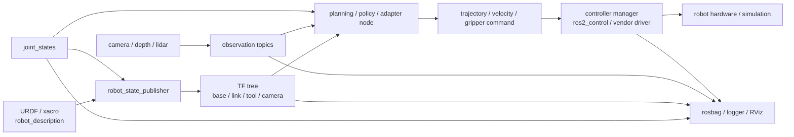

# ROS / ROS 2 系统总览

ROS 不是机器人算法库，也不等同于某个控制器，它可以理解为建立在通信中间件之上的机器人软件框架，为机器人各软件模块提供统一的通信、组织和调试机制：让感知、状态估计、规划、控制、数据记录和调试工具可以通过统一的通信和命名方式协作。具身智能课程里不需要先把 ROS 从零学成应用开发框架，但必须能读懂一套机器人系统的 ROS 图谱——知道数据从哪里来、命令往哪里去、问题从哪里查。

本节先建立 ROS 在机器人系统中的全局定位，梳理核心概念（Node、Topic、Service、Action、Parameter、TF），说明 ROS 2 相比 ROS 1 需要额外关注的关键机制，然后给出与其他章节的边界关系和贯穿全章的排查主线。

## ROS 解决什么问题

ROS 的核心价值在于为机器人软件系统提供了一套标准化的"连接件"——不需要每个团队各自发明一套通信协议、坐标约定和调试工具。下表概括了 ROS 中的典型机制及其在具身智能系统中的作用。

| 问题 | ROS 中的典型机制 | 在具身智能里的作用 |
|---|---|---|
| 多模块协作 | node、topic、service、action | 把相机、关节状态、策略、控制器和日志拆成可替换模块 |
| 状态持续发布 | topic、message type、QoS | 发布 image、joint state、point cloud、controller state 等连续数据 |
| 长时间命令执行 | action | 表达轨迹执行、导航目标、抓取任务等带反馈的命令 |
| 一次性查询或配置 | service、parameter | 查询状态、切换模式、设置阈值和启动参数 |
| 坐标统一 | TF / tf2、static transform、robot_state_publisher | 让 base、link、camera、tool、map 等 frame 可查询和转换 |
| 模型接入 | URDF / xacro、robot_description | 为 RViz、MoveIt、控制器和仿真提供机器人结构 |
| 控制执行 | ros2_control、controller manager、controller action、厂商驱动 | 把上层轨迹或速度命令交给底层硬件接口 |
| 调试复盘 | RViz、rosbag、diagnostics、CLI tools | 查看模型、坐标、话题频率、日志和错误状态 |

*注：robot_description 本身仅提供机器人模型描述，机器人连杆间的 TF 通常由 robot_state_publisher 根据模型和 joint_states 发布，其他节点也可以发布 TF*

这些机制的组合构成了一条闭合的数据链路(这里所说的"数据链路闭合"，是指机器人模型、状态、命令、反馈和日志能够形成完整的数据流，并非 ROS 官方定义的术语)：模型生成 TF → 传感器和状态被发布为 Topic → 策略订阅后输出动作 → 动作通过 Action 或 Topic 到达控制器 → 控制器驱动硬件并回报状态 → 日志记录全部数据供复盘。链路中任何一个环节断裂——Topic 停发、TF 断开、Action 被拒绝、日志未记录——都会导致系统行为不可解释。

## 最小机器人 ROS 运行图谱

以下数据流图展示了一个最小具身智能系统的 ROS 运行拓扑。图中的每个箭头代表一个 Topic 或 Action 通信通道。



ROS 系统的核心不是某一个节点，而是数据链路是否闭合：模型能生成 TF，传感器和状态能被订阅，上层命令能到控制器，日志能把一次实验复盘出来。

## 核心概念

ROS / ROS 2 系统由以下核心概念构成，每个概念在调试中都有特定的检查点。

**Node（节点）**是系统中一个独立职责的软件模块。ROS 推荐节点职责尽量单一，一个节点通常围绕一项主要功能组织——camera node 发布图像、robot_state_publisher 发布 TF、controller_manager 管理控制器。节点之间通过 Topic / Service / Action 通信，互相不知道对方的内部实现。调试时首先检查节点是否启动、名称和 namespace 是否符合预期。以下是一个最小 ROS 2 节点的代码骨架：

```python
import rclpy
from rclpy.node import Node

class MinimalNode(Node):
    def __init__(self):
        super().__init__('minimal_node')  # 节点名称
        self.get_logger().info('Node started')
        # 在此创建 publisher、subscriber、service、action client 等

def main():
    rclpy.init()
    node = MinimalNode()
    try:
        rclpy.spin(node)  # 让节点持续运行，处理回调
    except KeyboardInterrupt:
        pass
    finally:
        node.destroy_node()
        rclpy.shutdown()

if __name__ == '__main__':
    main()
```

**Topic（话题）**是节点之间异步传递消息的通信通道，通常用于持续发布状态、传感器数据和控制信息。发布者将消息写入 Topic，订阅者异步接收。Topic 的名称、消息类型以及 ROS 2 中的 QoS 配置共同决定发布者和订阅者能否建立通信。调试时检查 Topic 是否存在（`ros2 topic list`）、频率是否稳定（`ros2 topic hz`）、消息字段是否完整（`ros2 topic echo`）。

以下代码演示了一个同时包含发布者和订阅者的节点：

```python
from sensor_msgs.msg import JointState
from rclpy.node import Node

class JointStateBridge(Node):
    def __init__(self):
        super().__init__('joint_state_bridge')
        # 订阅原始关节状态
        self.subscription = self.create_subscription(
            JointState,
            '/raw_joint_states',
            self.joint_state_callback,
            10,  # queue size
        )
        # 发布处理后的关节状态
        self.publisher = self.create_publisher(
            JointState,
            '/joint_states',
            10,
        )

    def joint_state_callback(self, msg: JointState):
        # 在此进行数据转换、过滤或单位换算
        self.publisher.publish(msg)
        self.get_logger().debug(
            f'Forwarded joint states: {msg.name}'
        )
```

**Service（服务）**是一种同步的请求/响应通信模式。客户端发送请求后等待服务端处理完毕并返回结果。适合一次性查询（如获取当前关节角度）、配置切换（如切换控制模式）或触发单次操作（如触发标定流程），不适合持续控制。以下是一个 Service 服务端和客户端的示例：

```python
# 服务端
from std_srvs.srv import Trigger

class ModeSwitchServer(Node):
    def __init__(self):
        super().__init__('mode_switch_server')
        self.srv = self.create_service(
            Trigger, 'switch_to_safe_mode', self.switch_callback
        )

    def switch_callback(self, request, response):
        self.get_logger().info('Switching to safe mode')
        # 执行模式切换逻辑
        response.success = True
        response.message = 'Switched to safe mode'
        return response
```

```python
# 客户端
from std_srvs.srv import Trigger

class ModeSwitchClient(Node):
    def __init__(self):
        super().__init__('mode_switch_client')
        self.client = self.create_client(Trigger, 'switch_to_safe_mode')
        while not self.client.wait_for_service(timeout_sec=1.0):
            self.get_logger().info('Waiting for service...')

    def call_switch(self):
        request = Trigger.Request()
        future = self.client.call_async(request)
        future.add_done_callback(self.response_callback)

    def response_callback(self, future):
        response = future.result()
        self.get_logger().info(f'Result: {response.message}')
```

**Action（动作）**是 ROS 为长时间执行任务设计的一种通信机制，其底层结合了 Service 与 Topic：使用 Service 完成 Goal、Cancel 和 Result 请求，使用 Topic 持续发布 Feedback 与 Status，专门为长时间执行且需要中途反馈的任务设计。一个 Action 的完整生命周期为：发送 Goal → 服务端 Accept → 持续发送 Feedback → 最终返回 Result，全程支持 Cancel（取消）和 Preempt（被新 Goal 抢占）。轨迹执行（FollowJointTrajectory）、导航（NavigateToPose）和抓取是 Action 的典型应用场景。

以下代码演示了发送一个 Action Goal 并接收反馈：

```python
from rclpy.action import ActionClient
from control_msgs.action import FollowJointTrajectory

class TrajectoryActionClient(Node):
    def __init__(self):
        super().__init__('trajectory_action_client')
        self.action_client = ActionClient(
            self, FollowJointTrajectory,
            '/joint_trajectory_controller/follow_joint_trajectory'
        )

    def send_goal(self, trajectory):
        goal = FollowJointTrajectory.Goal()
        goal.trajectory = trajectory

        self.action_client.wait_for_server()
        self.get_logger().info('Action server available, sending goal')

        send_goal_future = self.action_client.send_goal_async(
            goal, feedback_callback=self.feedback_callback
        )
        send_goal_future.add_done_callback(self.goal_response_callback)

    def goal_response_callback(self, future):
        goal_handle = future.result()
        if not goal_handle.accepted:
            self.get_logger().error('Goal rejected')
            return
        self.get_logger().info('Goal accepted')
        goal_handle.get_result_async().add_done_callback(self.result_callback)

    def feedback_callback(self, feedback_msg):
        error = feedback_msg.feedback.error.positions
        self.get_logger().info(f'Tracking error: {error}')

    def result_callback(self, future):
        result = future.result().result
        self.get_logger().info(f'Action completed: {result.error_code}')
```

**Parameter（参数）**是节点的运行时配置项，可以在启动时通过 launch 文件或 YAML 加载，也可以在运行时动态读写。典型的 Parameter 包括 robot_description（URDF 模型字符串）、use_sim_time（是否使用仿真时间）、控制频率和关节限位。Parameter 不适合高频变化的数据——如果一个值每秒变化数十次，它应走 Topic 而非 Parameter。因此Parameter 更适合作为节点配置，而不是运行过程中的实时状态。

**Launch（启动文件）**用于一次性启动多个节点并设置其参数、namespace、remap 规则和配置文件路径。Launch 文件可以是 Python 脚本（ROS 2 推荐方式）或 YAML/XML 格式，保证了整个系统的启动顺序和配置一致性。

**Message Type（消息类型）**定义了 Topic、Service 和 Action 的数据结构。标准消息类型（如 sensor_msgs/JointState、geometry_msgs/PoseStamped）保证了不同节点对同一数据的理解一致。调试时需检查消息的字段名、数组维度、frame_id 和 timestamp 是否与订阅方期望的匹配。

## ROS 2 相比 ROS 1 需要额外关注什么

ROS 2 不仅在语法上与 ROS 1 相比有极大的不同，在通信中间件、QoS、生命周期管理和进程模型上相比 ROS 1 有根本性的变化。以下机制在调试中尤其容易成为问题来源。

**DDS 与 RMW（通信中间件）**。ROS 2 的底层通信基于 DDS（Data Distribution Service），不同的 RMW（ROS Middleware）实现（Fast DDS、Cyclone DDS、Connext）会影响节点发现速度、网络行为和多机通信的稳定性。多机部署时，不同 RMW 可能因 UDP 多播配置差异导致节点无法互相发现。排查方法：使用 `ros2 topic list` 确认远程 Topic 是否能被本地节点看到；如不可见，检查 ROS_DOMAIN_ID、防火墙和网络接口配置。

**QoS（服务质量）**控制消息传递的可靠性、历史缓存和持久性。QoS 不匹配是 ROS 2 中最常见的静默故障——发布方和订阅方的 QoS 配置不一致时，DDS 不会完成 Publisher 与 Subscriber 的匹配，因此消息无法传递，且不产生显式错误。排查方法：使用 `ros2 topic info <topic_name> --verbose` 检查两端 QoS。

以下代码演示了为不同数据类型配置合适的 QoS：

```python
from rclpy.qos import QoSProfile, ReliabilityPolicy, HistoryPolicy, DurabilityPolicy

# 传感器数据 QoS：允许丢帧，低延迟优先
sensor_qos = QoSProfile(
    reliability=ReliabilityPolicy.BEST_EFFORT,
    history=HistoryPolicy.KEEP_LAST,
    depth=5,
)

# 关键控制状态 QoS：确保送达
reliable_qos = QoSProfile(
    reliability=ReliabilityPolicy.RELIABLE,
    history=HistoryPolicy.KEEP_LAST,
    depth=10,
)

# 使用 sensor_qos 创建相机订阅
self.camera_sub = self.create_subscription(
    Image, '/camera/image_raw', self.image_callback, sensor_qos
)
```

**Lifecycle（生命周期）**是 ROS 2 对节点状态管理的增强。一个 Lifecycle 节点可以处于 unconfigured、inactive、active 和 finalized 等状态，控制器和驱动通常使用 Lifecycle 来保证在收到命令前已完成必要的配置和资源分配。控制器或驱动已启动但未进入 active 状态，是"命令发出但机器人不动"的最常见原因之一。

以下代码演示了如何通过代码检查 Lifecycle 节点的状态：

```python
from lifecycle_msgs.srv import GetState

class LifecycleChecker(Node):
    def __init__(self):
        super().__init__('lifecycle_checker')
        self.client = self.create_client(
            GetState, '/joint_trajectory_controller/get_state'
        )

    def check_controller_state(self):
        if not self.client.wait_for_service(timeout_sec=2.0):
            self.get_logger().error('Controller not reachable')
            return None

        request = GetState.Request()
        future = self.client.call_async(request)
        rclpy.spin_until_future_complete(self, future)

        state = future.result().current_state
        state_names = {
            1: 'unconfigured', 2: 'inactive',
            3: 'active', 4: 'finalized'
        }
        self.get_logger().info(
            f'Controller state: {state_names.get(state.id, "unknown")}'
        )
        return state
```

**Composition（组件组合）**允许多个节点运行在同一进程内，可减少进程间通信开销；在启用 Intra-process Communication 时，还可以进一步降低数据复制成本。。在使用 Composition 时，一个进程崩溃会影响其中所有组件，且各组件日志的输出边界不如独立进程清晰。调试时注意区分"节点崩溃"和"所在进程崩溃"——前者只影响一个组件，后者影响整个 Composition 容器。

**ROS Time / Sim Time**。仿真、回放和真实系统可以使用不同的时间源。ROS 2 通过 /clock Topic 和 use_sim_time 参数控制所有节点使用统一的时间。当 use_sim_time 为 true 但 /clock 未被发布（或发布者已挂起）时，整个系统的 ROS time 将停滞——TF lookup 失败、Action 超时判定异常、消息被丢弃。排查方法：使用 `ros2 topic echo /clock` 确认时间在推进。

## 和本课程其他章节的关系

ROS 作为中间层连接了课程的各章内容，本页承担的职责是说明 ROS 机制本身，而不展开各子系统内部的算法和实现。

| 课程位置 | ROS 相关内容 | 本页承担的边界 |
|---|---|---|
| 2.2 机器人模型资产 | URDF、xacro、robot_description | 只说明模型如何进入运行系统 |
| 2.3 坐标关系 | base、map、odom、tool、camera frame | 只说明 TF 如何发布和调试 |
| 2.5 动作空间与命令接口 | 关节、末端、速度、轨迹命令 | 只说明命令如何通过通信层到控制器 |
| 4.2 MoveIt 2 | 运动规划、Planning Scene、执行接口 | MoveIt 是 ROS 生态中的规划系统，不在本页展开 |
| 4.4 移动机器人 | Nav2、costmap、local planner、global planner | Nav2 是 ROS 生态中的导航系统，不在本页展开 |
| 5 仿真建模 | Gazebo、Isaac ROS 2 Bridge、仿真时间 | 只说明仿真和外部 ROS 图谱如何对接 |
| 11 真机实战 | 驱动、SDK、数据采集、部署、日志 | 真机步骤和安全流程放第 11 章 |

## 四类问题的排查主线

在后续各节的深入讨论中，所有调试工作始终围绕四类核心问题展开。排查任何具身智能系统的接口异常时，依次检查这四个问题即可覆盖绝大多数根因。

**状态有没有来**。关节状态、图像、点云、控制器状态——这些数据是否在预期的 Topic 上以预期的频率发布？对应的排查工具是 `ros2 topic list`（存在性）和 `ros2 topic hz`（频率）。如果状态没有来，后续的 TF 生成、策略推理和执行反馈全部无从谈起。这是调试的第一优先级。

**坐标能不能查**。当前的 TF 树是否完整且连通？所需的 frame 是否都已发布？时间戳是否在 buffer 缓存窗口内？对应的排查工具是 `ros2 run tf2_tools view_frames`（拓扑结构）和 `tf2_echo`（数值验证）。坐标查不到，感知结果无法投影、抓取位置无法计算、规划目标无法表达。

**命令有没有执行**。Action Goal 是否被 Accepted？控制器是否在 active 状态？执行过程中的跟踪误差是否在容差范围内？对应的排查工具是检查 Action 的 feedback 和 result，以及 controller_state Topic。命令发出但未执行，问题出在控制器接口层而非策略层。

**日志能不能复盘**。一次实验结束后，是否记录了足够的数据来回答"发生了什么、在什么时间、哪个环节出了问题"？对应的排查工具是 rosbag 检查 Topic 覆盖率和 RViz 回放验证。日志不全，失败分析只能是猜测。

以下排查表可作为快速索引：

| 问题 | 先查什么 | 再查什么 |
|---|---|---|
| 机器人模型不动 | `joint_states` 是否更新 | `robot_state_publisher`、TF tree、RViz fixed frame |
| 相机/点云没有数据 | topic 是否存在、频率是否正常 | QoS、driver log、timestamp、frame_id |
| 坐标转换失败 | frame 是否存在、TF 树是否连通 | 时间戳是否过旧、static transform 是否反了 |
| 轨迹不执行 | action goal 是否 accepted | controller lifecycle、joint name/order、限位和 fault state |
| rosbag 不能复盘 | 是否记录 observation、state、action、TF | `use_sim_time`、topic 命名、消息版本 |
| 仿真和真机行为不一致 | 控制模式、频率、限位是否一致 | bridge 延迟、动作单位、坐标约定 |

## 本节小结

ROS / ROS 2 在具身智能系统中的角色不是算法引擎，而是连通模型、感知、策略、控制和日志的中间层。Node、Topic、Service、Action 和 Parameter 五种通信原语各有适用场景——选错通信模式会导致数据丢失、命令被忽略或系统行为不可预测。ROS 2 相比 ROS 1 新增的 DDS、QoS、Lifecycle 和 Composition 机制在带来灵活性的同时也引入了新的调试难度，尤其需要关注 QoS 不匹配和 Lifecycle 未激活这两种静默故障。本页建立系统地图之后，后续各节将分别深入状态/命令通信、TF 发布、控制器执行、时间同步和日志复盘的具体细节。

Sources:
- [ROS 2 Documentation](https://docs.ros.org/)
- [ROS 2 QoS Settings](https://docs.ros.org/en/rolling/Concepts/Intermediate/About-Quality-of-Service-Settings.html)
- [tf2 Introduction](https://docs.ros.org/en/rolling/Tutorials/Intermediate/Tf2/Introduction-To-Tf2.html)
- [Using URDF with robot_state_publisher](https://docs.ros.org/en/rolling/Tutorials/Intermediate/URDF/Using-URDF-with-Robot-State-Publisher.html)
- [ros2_control Documentation](https://control.ros.org/)
- [rosbag2 Documentation](https://github.com/ros2/rosbag2)
- [RViz 2 Documentation](https://github.com/ros2/rviz)

- 上一级：[软件接口与运行调试](../07-software-interface-and-runtime-debugging.md)
