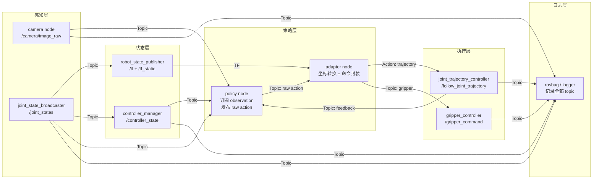

# 状态与命令通信

机器人系统不是单进程脚本，而是一组独立模块通过消息传递来协作。相机不断发布图像、关节编码器持续上报角度、策略间歇输出动作目标、控制器执行轨迹并回报进度——这些信息流如果不能在正确的时间、以正确的格式到达正确的接收方，整个系统的行为就会出现难以排查的错误。

理解状态与命令通信的核心，在于区分不同的通信模式各自适合什么场景，以及消息在传递过程中会受到哪些因素的影响。本节从 ROS / ROS 2 的通信机制出发，说明连续状态流、长时间命令、一次性查询和配置项各自的接口选择，然后给出常见消息类型的归类和一个最小机器人系统的通信拓扑。

## 通信模式的分类与选择

ROS / ROS 2 提供了四种主要的通信原语，各自对应不同的使用场景。在具身智能系统中，错误地选择通信模式会导致数据丢失、命令被忽略或系统行为不可预测。

**Topic（话题）**是一种发布/订阅模式，适用于连续、高频的数据流。发布者以固定频率将消息推送到话题上，订阅者异步接收。典型的 Topic 数据包括关节状态、相机图像、激光雷达点云和控制器状态反馈。Topic 采用发布/订阅模式，发布者通常无需感知具体有哪些订阅者。消息是否需要确认、是否允许重传等行为由 QoS 配置决定：BEST_EFFORT 更接近 fire-and-forget，而 RELIABLE 会通过 DDS 保证消息可靠传递。

**Service（服务）**提供请求/响应语义，调用方通常会等待服务端返回结果，因此适合一次性的查询或配置操作。典型用法包括查询当前关节角度、切换控制模式、读取标定参数、触发单次标定流程。Service 不适合持续控制，因为每次调用都有开销且调用方需要等待响应。

**Action（动作）**是 ROS 为长时间执行任务设计的一种通信机制，其底层结合了 Service 与 Topic，实现 Goal、Feedback、Result 和 Cancel 等完整生命周期。Action 的完整生命周期包括：发送 Goal（目标）→ 服务端 Accept（接受）→ 执行过程中持续发送 Feedback（反馈）→ 最终返回 Result（结果），同时支持中途 Cancel（取消）和 Preempt（抢占）。在机器人系统中，轨迹执行（FollowJointTrajectory）、导航目标（NavigateToPose）和抓取任务都是 Action 的典型应用。

**Parameter（参数）**用于存储节点的运行时配置。参数可以在启动时通过 launch 文件或 YAML 配置加载，也可以在运行时动态读写。典型参数包括 robot_description（URDF 模型）、控制频率、关节限位、标定偏移量和 use_sim_time 标志。参数不适合高频变化的数据——如果一个值每秒变化数十次，它应该走 Topic 而非 Parameter。

下表总结了四种通信模式的选择依据：

| 场景 | 推荐模式 | 原因 |
|---|---|---|
| 关节状态、图像、点云 | Topic | 连续高频数据流，允许丢帧 |
| 轨迹执行、导航、抓取 | Action | 长时间任务，需要反馈和取消 |
| 查询状态、切换模式 | Service | 一次性请求，需要同步确认 |
| 模型描述、控制参数 | Parameter | 启动配置，低频读写 |

## 常见消息类型的归类

在具身智能系统中，以下消息类型各有其最合适的通信载体：

**joint_states**（关节状态）应走 Topic，一般以几十到数百 Hz 发布，具体频率取决于机器人控制周期。每条消息包含关节名称数组、位置数组、速度数组和力矩数组，订阅方（如 robot_state_publisher、控制器、日志记录器）各自按需取用。

**camera image / depth / point cloud**（相机图像、深度图和点云）必须走 Topic，且带宽是首要考量。未压缩的高分辨率 RGB 图像在较高帧率下可能占用大量网络带宽，因此通常需要结合 QoS 和图像压缩机制保证实时性。点云数据量更大，建议在发布前进行降采样或 ROI 裁剪。

**TF / tf2**（坐标变换）在 ROS 2 中同时使用 Topic（/tf 和 /tf_static）和内置的 TF buffer 机制。TF 数据通过 `/tf` 和 `/tf_static` 两个 Topic 发布，tf2 在各节点内部维护 TF Buffer，用于缓存和查询坐标变换。动态变换随 joint_states 更新而持续发布，静态变换（如相机在底座上的固定位姿）仅在启动时发布一次。

**trajectory command**（轨迹命令）应通过 Action 发送。轨迹可能持续数秒到数十秒，执行期间需要反馈当前进度（已执行的路径点百分比、实际关节位置与期望的偏差），且策略可能需要中途取消或替换轨迹。

**gripper command**（夹爪命令）适合使用 Topic 或 Service，取决于夹爪控制器的实现。简单的开合命令（0～1 归一化值）可以走 Topic；需要确认夹持力达标后再继续的操作更适合 Service 或带反馈的 Action。

**controller status**（控制器状态）应走 Topic，由控制器以固定频率发布（通常 10～50 Hz）。状态消息包含控制器当前模式、是否 active、是否有 fault、当前跟踪误差等字段，供上层策略和监控模块订阅。

以下代码演示了在 ROS 2 中创建一个发布关节状态话题的典型节点：

```python
import rclpy
from rclpy.node import Node
from sensor_msgs.msg import JointState

class JointStatePublisher(Node):
    def __init__(self):
        super().__init__('joint_state_publisher')
        self.publisher = self.create_publisher(
            JointState, 'joint_states', 10
        )
        self.timer = self.create_timer(0.01, self.publish_joint_state)  # 100 Hz
        self.joint_names = ['shoulder_pan_joint', 'shoulder_lift_joint',
                            'elbow_joint', 'wrist_1_joint', 'wrist_2_joint',
                            'wrist_3_joint']
        self.joint_positions = [0.0] * len(self.joint_names)

    def publish_joint_state(self):
        msg = JointState()
        msg.header.stamp = self.get_clock().now().to_msg()
        msg.name = self.joint_names
        msg.position = self.joint_positions
        # 可选：填充 velocity 和 effort
        self.publisher.publish(msg)
```

## QoS 对传感器流和控制命令的影响

ROS 2 的 QoS（Quality of Service）配置直接影响消息传递的可靠性、延迟和资源占用。与 ROS 1 的固定 TCP 传输不同，ROS 2 基于 DDS，将 QoS 暴露为可配置项。理解 QoS 的关键在于根据数据特性做出正确的选择。

**Reliability（可靠性）**决定消息是否保证送达。RELIABLE 确保每条消息被重传直到订阅方确认收到；BEST_EFFORT 则只发送一次，不保证送达。传感器数据（图像、点云）适合 BEST_EFFORT——丢一帧远比积压数十帧后一次性送达要好，因为陈旧数据对实时控制没有价值。而关键状态变化（如 fault 告警、控制模式切换）适合 RELIABLE，确保不会被静默丢弃。

**History（历史缓存）**决定为迟到的订阅方保留多少历史消息。KEEP_LAST 仅保留最近 N 条，KEEP_ALL 保留全部。对于关节状态这类数据，KEEP_LAST 配合较小的 depth（如 10）即可——新订阅者只需要最新的状态；对于 tf_static 这类仅发布一次的数据，则需要 KEEP_ALL 配合 Transient Local Durability。

**Durability（持久性）**决定是否为晚加入的订阅方投递历史消息。TRANSIENT_LOCAL 使订阅方在订阅时立即收到发布方缓存的最新一条消息，这对/tf_static 等仅发布一次或很少更新的数据通常需要使用 Transient Local；对于 robot_description，则通常通过 Parameter 提供，而不是 Topic。 ——如果发布在订阅之前，订阅方将永远收不到。VOLATILE 则不做缓存，仅投递订阅建立之后的新消息。

以下是一个针对不同数据类型的典型 QoS 配置示例：

```python
from rclpy.qos import QoSProfile, ReliabilityPolicy, HistoryPolicy, DurabilityPolicy

# 传感器数据：允许丢帧，低延迟优先
sensor_qos = QoSProfile(
    reliability=ReliabilityPolicy.BEST_EFFORT,
    history=HistoryPolicy.KEEP_LAST,
    depth=5,
    durability=DurabilityPolicy.VOLATILE,
)

# 控制状态：确保送达
control_qos = QoSProfile(
    reliability=ReliabilityPolicy.RELIABLE,
    history=HistoryPolicy.KEEP_LAST,
    depth=10,
    durability=DurabilityPolicy.VOLATILE,
)

# 静态变换和模型描述：晚加入的节点也需要收到
static_qos = QoSProfile(
    reliability=ReliabilityPolicy.RELIABLE,
    history=HistoryPolicy.KEEP_LAST,
    depth=1,
    durability=DurabilityPolicy.TRANSIENT_LOCAL,
)
```

QoS 不匹配是 ROS 2 中常见的静默故障源——发布方和订阅方的 QoS 配置不一致时，DDS 无法完成 Publisher 与 Subscriber 的匹配，因此消息不会被传递，且不会产生显式错误信息。排查时应使用 `ros2 topic info <topic_name> --verbose` 检查两端 QoS 是否一致。

## 最小机器人系统通信拓扑

一个具身智能最小可运行系统的通信拓扑如下，涵盖从感知到执行的完整数据链路：



在这个拓扑中，每个节点承担明确且单一的职责：

- **Policy Node（策略节点）**：接收观测数据（图像、关节状态），输出原始动作（如末端位姿增量或关节目标）。策略节点不关心坐标转换和命令封装细节。
- **Adapter Node（适配节点）**：将策略输出的原始动作转换为控制器能接收的命令格式，完成坐标变换、单位转换、关节名称映射和动作裁剪。
- **Controller Node（控制器节点）**：通过 Action 或 Topic 接收命令，驱动硬件执行，并回读执行状态。
- **State Publisher（状态发布者）**：将关节编码器读数和 IMU 数据封装为标准消息发布。
- **Logger（日志记录器）**：订阅所有关键 Topic，将数据写入 rosbag 供事后回放和分析。

## 本节小结

机器人系统中的状态与命令通信，本质上是为不同特性的数据流选择正确的通道。连续高频的传感器数据走 Topic，长时间执行的任务走 Action，一次性查询走 Service，静态配置走 Parameter。QoS 配置直接影响消息能否被正确投递——传感器允许丢帧保证实时性，控制状态和静态数据则要求可靠送达。最小机器人系统的通信拓扑以策略节点为中心，通过 Adapter 将策略输出桥接到控制器接口，所有关键 Topic 由 Logger 统一记录。理解这个通信骨架，是排查后续各节中状态缺失、命令不执行和时间不同步等问题的基础。
