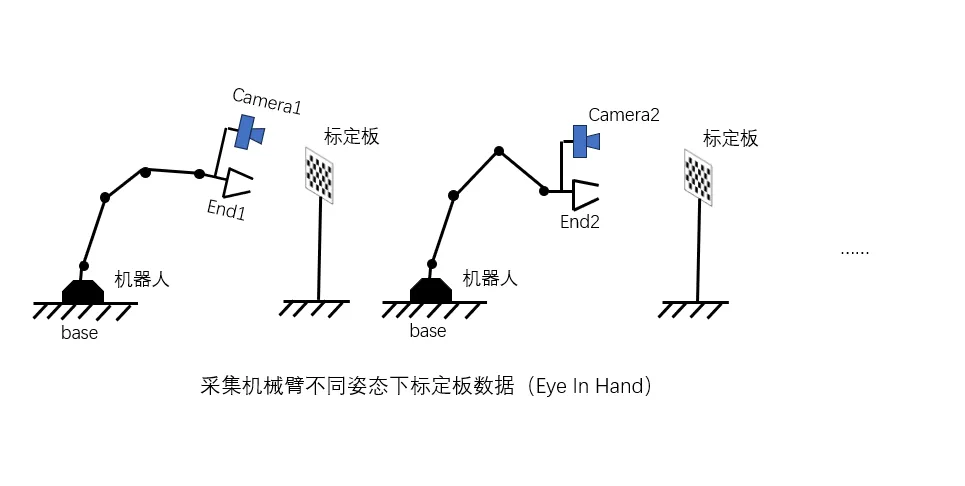
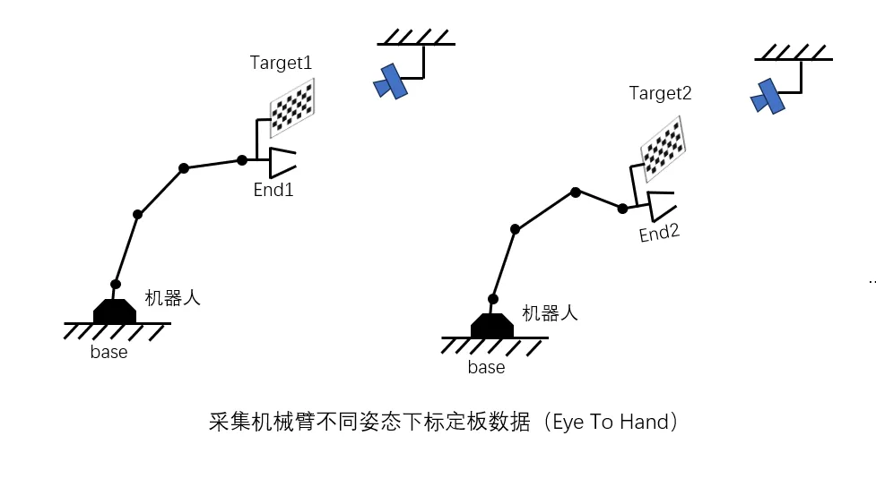
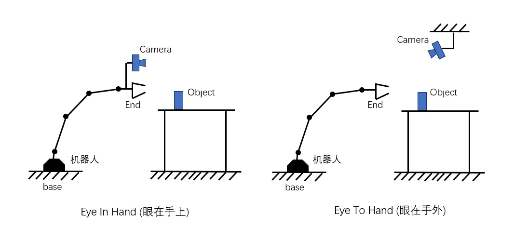

# 手眼标定

> 难度：[基础] | 预计用时：40 分钟
> 先修：[相机标定](01-camera-calibration.md)
> 建议：先运行 `python labs/04-perception/coordinate_frame_demo.py`，再运行 `python labs/04-perception/hand_eye_synthetic.py`。

目标：理解相机坐标系怎样和机器人坐标系连起来，知道为什么“图像里看到了目标”离“机械臂能安全去到那个位置”之间还差一层外参关系。

## 先建立直觉

上一页解决的是“像素为什么能对应到一条空间射线”。  
这一页要解决的是另一半问题：

**这条射线是在相机坐标系里成立的，可机械臂真正行动时需要的是机器人坐标系。**

也就是说，手眼标定的本质不是“多算一个矩阵”，而是：

**把视觉结果接进机器人本体。**

如果这一步出错，系统很容易出现一种非常危险的错觉：

- 图像上的识别结果看起来很合理；
- 3D 点的位置也“像是真的”；
- 但机械臂伸出去却总是偏一截，或者方向完全不对。

## 什么叫外参

先把一个词说准：

- 内参 `intrinsics` 解决的是相机内部的成像几何。
- 外参 `extrinsics` 解决的是两个坐标系之间的刚体关系。

在本页里，我们关心的外参通常是：

- `T_base_camera`
- `T_gripper_camera`
- `T_camera_gripper`

它们的区别不是写法不同，而是**变换方向不同**。

本章统一采用的读法是：

`T_A_B` 表示“把点在 B 坐标系中的坐标，变换到 A 坐标系中”。

例如：

- `T_base_camera`：把相机坐标系里的点变到机器人 base 坐标系。
- `T_gripper_camera`：把相机坐标系里的点变到夹爪坐标系。

方向一旦搞反，下游会直接把正确点送到错误位置。

## 先看一个最小坐标变换例子

运行：

```bash
python labs/04-perception/coordinate_frame_demo.py
```

这个脚本会构造：

- 一份固定的 `T_base_camera`
- 一个相机坐标系下的 3D 点
- 再把它变换到 `base` frame
- 再做一次反向 round-trip 检查

可以重点观察三件事：

1. `point in camera frame` 和 `point in base frame` 数值不同。
2. 这不是点“变了”，而是它被换了一种坐标表达方式。
3. round-trip 误差接近 0，说明前后方向是一致的。

这就是手眼标定最终想为系统提供的能力。

## 两种最常见的设置

### Eye-in-hand

相机固定在机械臂末端，也就是“眼在手上”。

这时真正要解的通常是：

```text
T_gripper_camera
```

因为相机和末端是一起动的，它们之间的相对关系固定，但相机相对世界的姿态会随着机械臂运动变化。



图 4.1.1-1：在 eye-in-hand 设置里，标定板通常固定不动，机械臂带着相机从多个姿态去看同一块标定板。这样采到的不是“很多块板子”，而是“同一块板子在很多相机姿态下的观测”。

### Eye-to-hand

相机固定在机械臂外部，也就是“眼在手外”。

这时通常要解的是：

```text
T_base_camera
```

因为相机本身不动，但它需要持续观察机械臂末端和工作空间。



图 4.1.1-2：在 eye-to-hand 设置里，常见做法是把标定板装在机械臂末端，让机械臂带着标定板去不同位置给固定相机看。这里变化的是末端和标定板，相机本体保持不动。



图 4.1.1-3：左边是 eye-in-hand，右边是 eye-to-hand。判断两者最简单的方法不是背名字，而是先问一句：“相机到底是跟着末端一起动，还是固定在工作空间外部？”

## 它们各自适合什么场景

| 设置 | 相机位置 | 典型优点 | 典型代价 |
|---|---|---|---|
| Eye-in-hand | 固定在末端 | 看局部细节更清楚，抓取时能贴近目标 | 视角随机械臂运动而剧烈变化 |
| Eye-to-hand | 固定在外部 | 视野稳定，容易覆盖整个工作台 | 局部遮挡和远距离精度可能更麻烦 |

我们不用把它们理解成谁更先进，而要理解成：

**它们只是视觉与机器人装配方式不同，因此外参要解的对象不同。**

## 为什么手眼标定常写成 `AX = XB`

资料里经常会看到：

```text
AX = XB
```

这不是一个“为了数学而数学”的写法，它在表达一个很朴素的事实：

- 机器人末端从姿态 1 运动到姿态 2。
- 相机观察到的目标，也会产生对应的相对运动。
- 如果相机和末端刚性固定，这两种运动之间必然满足同一个固定变换 `X`。

其中：

- `A` 通常表示机器人侧的相对运动。
- `B` 通常表示相机侧观察到的相对运动。
- `X` 就是要求的手眼外参。

所以这件事的核心不是把公式背下来，而是理解：

**手眼标定其实是在多组运动之间找那个始终不变的刚体关系。**

## 跑一次合成实验

运行：

```bash
python labs/04-perception/hand_eye_synthetic.py
```

这个脚本会模拟 eye-in-hand 设置，并输出不同 OpenCV 手眼求解器的误差结果。

可以重点看：

- `rot_err_deg`
- `t_err_mm`
- `AX-XB translation residual`

这些量的意义分别是：

| 字段 | 它在检查什么 |
|---|---|
| `rot_err_deg` | 求出来的旋转和真值差多少 |
| `t_err_mm` | 平移误差有多少毫米 |
| `AX-XB residual` | 这份外参在多组运动中是否自洽 |

这会帮助你建立一个工程直觉：

**手眼标定不是“求出一个矩阵就结束”，而是要看这个矩阵能否解释整批运动数据。**

## 数据采集比公式更容易决定成败

真实系统里，手眼标定失败更多时候不是因为求解器写错了，而是因为采样质量不够好。

建议至少遵守下面这些原则：

- 末端姿态要覆盖足够多的平移和旋转。
- 标定板不要总在图像中心。
- 不要所有姿态都几乎共面。
- 采样时必须记录机器人 pose、图像、标定板检测结果和时间戳。
- 最好留一部分数据做验证，不要全部拿去求解。

如果所有姿态都差不多，只是在一个很小范围内晃动，求出来的解通常会非常脆弱。

## 结果到底该怎么验收

一份手眼标定结果，至少要过四关：

| 检查 | 要回答的问题 |
|---|---|
| 数值误差 | 解出来的旋转和平移误差是否在任务容忍范围内 |
| 多运动自洽 | `AX = XB` 残差是否足够小 |
| 坐标落地 | 视觉点变到 `base` frame 后是否合理 |
| 真机验证 | 用这份外参去指向或抓取，实测偏差是否可接受 |

最后一关尤其重要。

因为很多外参在日志里“很好看”，一到真机就暴露问题。对机器人来说，真正重要的是：

**视觉结果进入动作系统后，能不能稳定命中。**

## 最常见的四类坑

| 错误 | 直接后果 |
|---|---|
| 把 `T_gripper_camera` 和 `T_camera_gripper` 用反 | 目标点被送到完全错误位置 |
| 标定时用的是 flange frame，执行时用的是 tool frame | 姿态整体带固定偏差 |
| 标定时和运行时图像预处理不一致 | 相机侧观测关系被破坏 |
| 相机支架松动后没重做外参 | 所有视觉结果 silently 漂移 |

这些问题的危险在于：

它们看起来都像“算法好像差一点”，但本质上是坐标链已经坏了。

## 一份最小记录模板

```yaml
hand_eye:
  setup: eye_in_hand
  solved_transform: T_gripper_camera
  camera_frame: wrist_color_optical_frame
  robot_frame: gripper_tcp
  samples: 24
  validation_samples: 8
  rotation_error_deg: 0.18
  translation_error_mm: 2.7
  residual_mm:
    mean: 1.9
    max: 4.1
```

这份记录最重要的不是“字段很多”，而是：

- 它明确说明了解的是谁到谁。
- 它把求解结果和验证结果都留下来了。

## 自检问题

1. 为什么外参错误会让视觉结果“看起来差不多对”，但机械臂动作明显偏掉？
2. `T_base_camera` 和 `T_camera_base` 为什么不是一回事？
3. 为什么手眼标定的验收不能只看求解误差，还要做真机或等价任务验证？

## 练习

### [观察] 画出一条最小坐标链

假设你已经有：

- `T_base_camera`
- 一个相机坐标系下的点 `P_camera`

请写出它变成 `P_base` 的链路。

完成后，可以先用下面几条检查这一部分是否已经到位：
- 能说明变换方向。
- 能说明如果矩阵方向写反，会发生什么。

### [复现] 跑通一个合成手眼实验

运行：

```bash
python labs/04-perception/hand_eye_synthetic.py
```

然后回答：

- 哪个求解器误差最小？
- `AX-XB residual` 在检验什么？
- 如果相机支架在真实系统中松动了，这个实验结果是否还可直接复用？

完成后，可以先用下面几条检查这一部分是否已经到位：
- 能把“相机结果进入机器人 base”的逻辑讲清楚。
- 能指出至少一个需要重新标定的实际触发条件。

## 导航

- 上一节：[相机标定](01-camera-calibration.md)
- 下一节：[RGB-D 与点云](03-rgbd-pointcloud.md)
- 返回本章：[感知与三维视觉](../README.md)

## 延伸阅读

- OpenCV `calibrateHandEye`: https://docs.opencv.org/4.x/d9/d0c/group__calib3d.html


