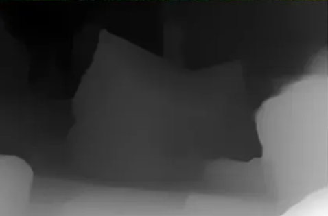
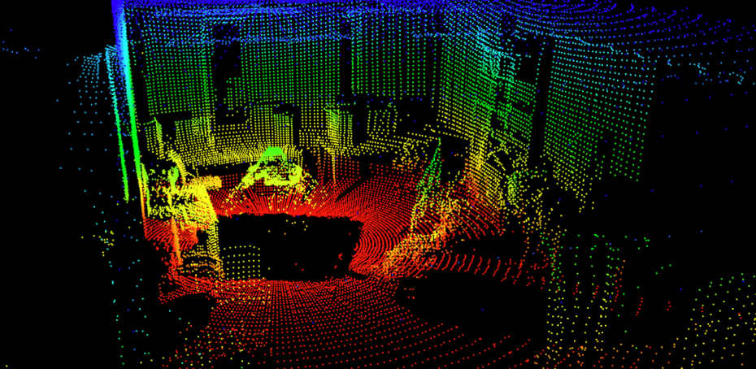

# RGB-D 与点云

> 难度：[基础] | 预计用时：50 分钟
> 先修：[相机标定](01-camera-calibration.md) → [手眼标定](02-hand-eye-calibration.md)
> 建议：先运行 `python labs/04-perception/rgbd_to_pointcloud.py`，再读本页。

目标：理解 RGB-D 图像怎样被反投影成三维点云，知道点云为什么一定要带坐标系、时间戳和有效性说明，避免把“深度图看起来正常”误当成“机器人已经得到了可靠几何”。

## 先建立直觉

RGB 图像回答的是“这一像素是什么颜色”，深度图回答的是“这一像素离相机多远”。把这两者合在一起，机器人才第一次拥有了“图像中的哪个位置，对应空间里的哪个点”的能力。

我们可以把 RGB-D 传感器想成这样一台设备：

- RGB 通道像眼睛，负责看颜色和纹理。
- Depth 通道像测距仪，负责告诉你每个方向大概有多远。
- 点云则像把“每个方向有多远”全部摊回到三维空间里。

所以本页真正要回答的问题只有一个：

**一张二维图像，怎样变成机器人可以在三维空间里计算碰撞、测量尺度、估计位姿的几何表示？**

## 先把三个概念分清

### RGB-D 是什么

RGB-D 指的是同时包含颜色和深度的观测。典型形式是两张同分辨率或可对齐的图：

- 一张 RGB 图，记录每个像素的颜色。
- 一张 Depth 图，记录每个像素离相机的距离。

常见 RGB-D 设备包括 RealSense、Kinect、iPhone LiDAR 等。它们的细节不同，但对本章来说，最重要的是下面这件事：

**Depth 图不是“额外一张好看的灰度图”，而是像素到 3D 的核心桥梁。**

先把同一场景的三种表示放在一起看一眼，会比直接背定义更容易建立直觉：


图 4.2-1：RGB 图像负责告诉你“看到了什么颜色和纹理”，但它还没有直接告诉你空间距离。



图 4.2-2：Depth 图负责告诉你“每个像素离相机多远”。亮暗本身不是重点，重点是每个像素背后都多了一维距离信息。

### 点云是什么

点云是三维空间中一组离散点的集合。每个点至少有：

- `x`
- `y`
- `z`

有时还会附带：

- 颜色
- 法向量
- 语义标签
- 特征向量

点云不是“物体模型”本身，也不是“场景已经被理解了”。它只是把二维观测恢复成了一堆三维点，后续几何处理还要在这堆点上继续做。



图 4.2-3：把 RGB-D 反投影以后，同一场景会变成三维点云。到这一步，系统才真正拿到可以做裁剪、配准、位姿估计和碰撞检测的几何中间表示。

### 为什么深度图不等于点云

这两者关系密切，但不是一回事：

| 表示 | 数据组织方式 | 适合做什么 |
|---|---|---|
| 深度图 | 按像素网格存储，每个像素一个深度值 | 与图像配准、快速访问像素深度 |
| 点云 | 按三维点集合存储，每个点一个空间位置 | 做 3D 几何、配准、位姿、碰撞与裁剪 |

一个非常重要的工程判断是：

**深度图是原料，点云才是很多三维算法真正消费的中间表示。**

## 像素怎样变成三维点

这一步叫反投影。给定：

- 像素坐标 `(u, v)`
- 深度值 `z`
- 相机内参 `fx, fy, cx, cy`

相机坐标系下的 3D 点可以这样计算：

```text
x = (u - cx) * z / fx
y = (v - cy) * z / fy
z = depth(u, v)
```

这三个式子其实来自相似三角形。它表达的直觉是：

- 像素偏离主点越远，对应的射线方向越偏。
- 深度越大，沿着这条射线走出去的距离越远。
- 最终就能恢复出相机坐标系中的一个三维点。

我们可以先把它记成一句话：

**内参负责告诉你“朝哪个方向看”，深度负责告诉你“沿这个方向走多远”。**

## 跑一次最小实验

运行：

```bash
python labs/04-perception/rgbd_to_pointcloud.py
```

这个脚本会：

- 构造一帧合成 RGB-D 场景。
- 用 pinhole 模型把有效深度像素反投影成点云。
- 保存 `scene.ply`、`scene_rgb.png`、`scene_depth_mm.png`。
- 输出点云范围和重投影自检结果。

典型输出会包括：

```text
image size = 640x480, fx=525.0, fy=525.0, cx=320.0, cy=240.0
depth range: 0.570 .. 0.750 m
valid pixels = ...
point cloud xyz bounds  min = ...
point cloud xyz bounds  max = ...
reprojection round-trip max error = ...
```

这里最值得观察的是三件事：

1. 有效深度像素比例是不是 100%。
2. 点云边界范围是否符合场景几何直觉。
3. 反投影后再重投影，误差是否接近 0。

只要第三点成立，你就可以确定：至少数学上的反投影链路是自洽的。

## 为什么有效深度比例很重要

真实相机里，并不是每个像素都有可用深度。以下情况都可能导致无效深度：

- 反光表面
- 透明表面
- 黑色材质
- 边界遮挡
- 超出传感器测距范围

所以一份点云结果如果不记录有效深度比例，下游就很难判断：

- 这是几何真的完整，还是只是“看起来有输出”。
- 物体缺了一部分，是因为本来就没拍到，还是因为 depth 掉点。

建议至少显式记录：

| 字段 | 作用 |
|---|---|
| `valid_depth_ratio` | 表示有多少目标区域拥有可用深度 |
| `depth_min_m` / `depth_max_m` | 记录当前深度范围 |
| `aligned_to_rgb` | 说明 depth 是否已经对齐到 RGB |
| `depth_scale` | 说明深度单位，例如 `0.001` 表示毫米转米 |

## 点云为什么一定要写 frame

这是本页最关键的工程要求之一。

刚反投影出来的点云，默认是在**相机坐标系**下。  
但机械臂真正关心的通常是：

- `robot_base`
- `world`
- 或者某个任务坐标系

也就是说，同一份点云至少要回答：

- 它当前在哪个 frame 下表达。
- 是否已经变换到了机器人本体坐标系。
- 这个变换用的是哪份外参。

推荐最少记录：

```yaml
pointcloud_observation:
  source_frame: camera_color_optical_frame
  target_frame: panda_link0
  timestamp: 2026-05-30T09:32:14.118Z
  depth_scale: 0.001
  aligned_to_rgb: true
```

没有 frame 的点云，通常不应直接交给下游规划器。

## 从整幅场景点云到对象级点云

很多初学者跑通点云后，会以为“已经得到 3D 感知结果了”。实际上，整幅场景点云只是第一步。后续通常还会做：

1. 过滤无效深度。
2. 裁剪工作空间。
3. 去掉桌面或背景平面。
4. 用 `mask` 只保留目标对象区域。
5. 输出对象级点云、质心、包围盒或表面法向。

所以从本章结构看：

- 本页负责“把 2D + depth 变成 3D 点”。
- [检测与分割](../02-object-perception/01-detection-segmentation.md) 负责“告诉你该裁哪块目标区域”。
- [位姿估计](../02-object-perception/05-pose-estimation.md) 负责“把目标点云进一步变成可执行姿态”。

## 一张表记住最常见的误差来源

| 误差来源 | 会让什么出错 | 常见现象 |
|---|---|---|
| 内参错误 | 反投影方向错 | 3D 尺度和空间位置整体偏移 |
| depth 单位错误 | 深度尺度错 | 结果差 1000 倍很常见 |
| RGB/depth 未对齐 | mask 裁错对象点云 | 2D 看起来对，3D 明显偏 |
| 外参错误 | 点云进错坐标系 | 机械臂去到错误位置 |
| 无效深度过多 | 几何不完整 | 点云缺边、缺面、质心漂移 |

这些问题的危险之处在于：  
很多时候图像看起来都还“差不多正常”，但下游动作会明显出错。

## 本页最小输出应该长什么样

```yaml
object_3d_observation:
  object_id: mug_01
  source_frame: camera_color_optical_frame
  target_frame: panda_link0
  pointcloud_ref: runs/04-perception/scene.ply
  centroid_xyz_m: [0.43, -0.11, 0.08]
  valid_depth_ratio: 0.88
  depth_scale: 0.001
  timestamp: 2026-05-30T09:32:14.118Z
  failure_code: null
```

注意，这还不是“最终抓取结果”，但它已经比“有一张深度图”更接近机器人可用的几何 observation。

## 工程检查清单

一份 RGB-D 到点云的结果，至少应该检查：

| 检查项 | 为什么重要 |
|---|---|
| 反投影后再重投影误差很小 | 说明几何公式实现没有写错 |
| 有效深度比例在可接受范围内 | 说明几何证据足够 |
| 桌面或已知平面拟合稳定 | 说明 depth 没有明显系统弯曲 |
| 点云已记录 frame 与时间戳 | 说明可进入下游系统 |
| 深度单位与 SDK 一致 | 避免尺度错 1000 倍 |

## 自检问题

1. 为什么深度图不等于点云？
2. 为什么反投影必须同时依赖内参和深度？
3. 为什么对象点云必须写清 `source_frame` 或 `target_frame`？

## 练习

### [观察] 跑一次 RGB-D 到点云的最小实验

运行：

```bash
python labs/04-perception/rgbd_to_pointcloud.py
```

然后回答：

- 深度图里哪些像素会被视为无效？
- 反投影得到的点云默认处在哪个坐标系？
- 为什么还不能直接把整幅场景点云交给抓取规划器？

完成后，可以先用下面几条检查这一部分是否已经到位：
- 能把“像素 + 深度 -> 3D 点”的过程讲清楚。
- 能指出至少一个点云还不能直接执行的原因。

### [复现] 写一份对象级 3D observation

为一个桌面物体写出最小对象级 3D 观测结构，至少包含：

- `pointcloud_ref`
- `source_frame`
- `target_frame`
- `valid_depth_ratio`
- `timestamp`
- `failure_code`

完成后，可以先用下面几条检查这一部分是否已经到位：
- 结构不仅有几何量，也有质量字段。
- 下游可以根据它判断是否需要继续、重观察或拒绝。

## 导航

- 上一节：[手眼标定](02-hand-eye-calibration.md)
- 下一节：[点云配准](04-pointcloud-registration.md)
- 返回本章：[感知与三维视觉](../README.md)

## 延伸阅读

- Open3D geometry documentation: https://www.open3d.org/docs/latest/
- OpenCV Camera Calibration and 3D Reconstruction: https://docs.opencv.org/4.x/d9/d0c/group__calib3d.html


