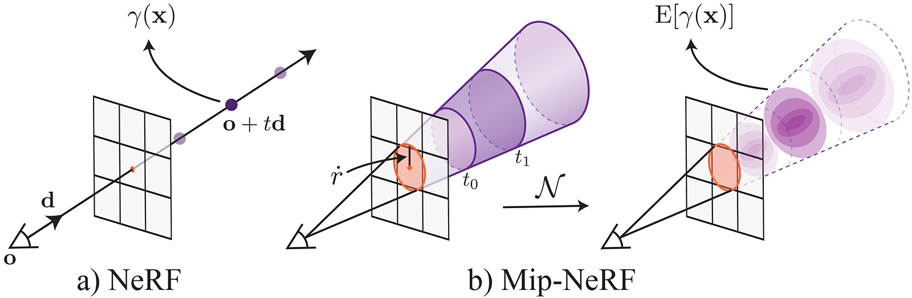
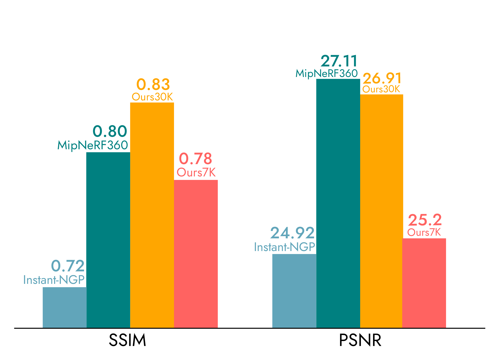

# NeRF 与 3DGS 在机器人中的应用

> 难度：[进阶] | 预计用时：50 分钟
> 先修：[三维重建与场景表征](05-3d-reconstruction.md)
> 建议：先把本页理解成“连续三维场景怎样被表示和渲染”，再去看它们如何进入机器人系统。

目标：理解 NeRF 与 3D Gaussian Splatting 分别是什么、怎样把多视角图像变成连续三维场景表示，以及它们在机器人中的典型用途和工程边界。

## 先建立直觉

前面一页已经讲过：机器人做三维重建时，常见表示有点云、TSDF、占据栅格、mesh。  
这些表示大多擅长回答几何问题，例如：

- 表面在哪里。
- 自由空间在哪里。
- 哪个方向的法向更可靠。

NeRF 和 3D Gaussian Splatting（3DGS）则来自另一条更偏“连续场景表示”的路线。  
它们更关心的是：

- 如果我站在一个新视角看这个场景，会看到什么图像。
- 场景外观与几何信息，能否被压缩进一个连续的三维表示里。

所以本页最先要讲清的一句话是：

**NeRF 和 3DGS 首先是三维场景构建方法，其次才是机器人里的高保真视觉记忆。**



这张图可以先帮助建立最基本的 NeRF 直觉：  
不是“直接存一个表面”，而是沿每条相机射线在空间里连续采样，再决定这些采样点对最终像素颜色有什么贡献。

## 本页目标

这一页读完后，我们希望能一起把下面几件事说明白：

- NeRF 到底在表示什么，输入输出分别是什么。
- 3DGS 又在表示什么，为什么它通常比 NeRF 渲染更快。
- 这两类方法怎样从多视角图像恢复出连续三维场景。
- 它们在机器人里的典型价值是什么，又为什么还不能简单等价于传统几何地图。

## 先回到问题本身：为什么要有连续场景表示

点云、体素和 mesh 很有用，但它们通常有一个共同特点：  
更偏“离散几何结果”。

如果任务更关心下面这些能力，连续场景表示会更自然：

- 新视角合成。
- 高保真回放。
- 多视角一致的外观查询。
- 从少量视角恢复连续场景外观。

也就是说，NeRF 和 3DGS 这类方法最初吸引人的地方，不是“替代点云”，而是：

> 用一种连续方式，把场景的外观和几何结构一起表示出来。

## NeRF 是什么

NeRF 是 Neural Radiance Fields 的缩写。  
它可以粗略理解成：

**用一个神经网络表示一个三维场景，让网络回答“空间中某个位置、沿某个观察方向看过去时，会发出什么颜色和密度”。**

更直白地说，NeRF 不是直接存一堆点或网格，而是学一个连续函数：

- 输入：三维位置 `x, y, z` 和观察方向。
- 输出：该位置的颜色和体密度。

然后通过体渲染，把很多采样点沿着一条相机射线积分起来，生成最终图像像素。


读这张图时最重要的不是记住每个模块名字，而是抓住方法主线：

- 输入是一组带相机位姿的训练图像。
- 中间学到的是一个连续场景函数。
- 输出可以是训练视角之外的新视角图像。

## NeRF 在做什么样的三维场景构建

如果把 NeRF 放回“场景构建”的语境里，它在做的事情可以写成：

```text
多视角图像 + 相机位姿
  -> 学习一个连续辐射场
  -> 这个辐射场能回答任意新视角会看到什么
```

因此 NeRF 的核心价值不是“导出一个文件格式”，而是：

- 场景是连续的，不依赖固定离散网格才能查询。
- 可以在训练视角之外做新视角渲染。
- 细致的外观变化可以被保留得很好。

## NeRF 和传统重建最大的不同

| 传统表示 | 更像在保存什么 |
|---|---|
| 点云 | 一堆离散 3D 点 |
| TSDF / Occupancy | 网格化空间中的几何状态 |
| Mesh | 显式表面三角片 |
| NeRF | 一个连续的“场景函数” |

所以 NeRF 的直觉不是“把场景存成一个模型文件”，而是“学会一个可以渲染这个场景的连续函数”。

## NeRF 的典型优点

从场景构建角度看，NeRF 最有代表性的优点是：

- 新视角合成自然。
- 外观细节、反光、半透明等复杂视觉现象更容易被保留。
- 场景不是若干离散点，而是连续函数，因此查询和插值很自然。

这也是为什么 NeRF 一出现就迅速在 3D 视觉里变得重要：  
它把“三维重建”从“恢复几何壳子”推进到了“恢复可渲染连续场景”。

## 3DGS 是什么

3D Gaussian Splatting（3DGS）可以粗略理解成另一种连续三维场景表示方法。  
它不再用一个隐式网络去表示整个场景，而是用很多个 3D 高斯原语来表示场景。

每个高斯大致带这些属性：

- 三维位置
- 空间尺度和方向
- 颜色
- 透明度

这些高斯在渲染时会被投影到图像平面，再通过 splatting 的方式合成最终图像。

所以如果说 NeRF 更像“把场景压进一个连续函数里”，那 3DGS 更像：

**用一大组可优化的 3D 高斯，把场景直接铺在三维空间中。**



这张图用于建立 3DGS 的基本直觉：  
场景不再主要依赖一个隐式网络回答查询，而是由大量带空间范围的 3D 高斯原语显式构成。

下面这个动态例子进一步展示了高斯原语如何逐步形成完整场景：


随着 `scale` 的增加，高斯原语从接近点状的局部表示逐步扩展成带方向和体积的椭球体，场景也由这些原语共同构成。

## 3DGS 在做什么样的三维场景构建

把 3DGS 放回同样的场景构建链路，它更像：

```text
多视角图像 + 相机位姿
  -> 优化一组 3D 高斯
  -> 用这些高斯渲染任意新视角
```

和 NeRF 一样，3DGS 也能做新视角合成；但它的表示更显式，因此通常带来一个非常重要的工程收益：

**渲染更快。**

## 为什么 3DGS 通常更快

NeRF 的渲染本质上要对大量采样点做网络查询和体渲染积分。  
3DGS 则把表示转成了一组显式高斯，渲染时不必像 NeRF 那样沿每条射线反复跑一个 MLP。

因此从工程直觉上看：

- NeRF 更偏“隐式函数表示”。
- 3DGS 更偏“显式原语表示”。

这也是为什么 3DGS 在“高保真、但又希望更接近实时”的场景里非常受欢迎。

## 把两者并排放在一起

| 方法 | 场景怎么表示 | 直觉 | 典型特点 |
|---|---|---|---|
| NeRF | 连续辐射场函数 | 学一个可渲染场景函数 | 新视角质量高，训练/渲染较重 |
| 3DGS | 一组 3D 高斯原语 | 用显式高斯铺满场景 | 渲染快，更容易靠近实时系统 |

如果只记一句话，可以记：

- NeRF：连续隐式场景函数。
- 3DGS：连续但更显式的高斯场景表示。

## 这两类方法为什么能算“三维场景构建方法”

因为它们都在做同一件核心事情：

> 从多个已知相机视角的观测，恢复一个能够代表整个三维场景的内部表示。

只不过：

- NeRF 恢复的是一个连续辐射函数。
- 3DGS 恢复的是一组可渲染的 3D 高斯。

所以它们和点云、TSDF、mesh 一样，都是“场景内部表示”；只不过它们更偏连续和可渲染。

## 它们各自适合做什么

如果从“用来干什么”看，这两类方法最适合的通常是：

| 能力 | NeRF / 3DGS 为什么合适 |
|---|---|
| 新视角合成 | 场景本来就是按可渲染方式表示的 |
| 高保真回放 | 外观和几何线索可以一起保留 |
| 数据增强 | 能从同一真实场景合成更多观察角度 |
| 视觉记忆 | 比稀疏地图更接近人类看到的场景 |
| 重定位辅助 | 多视角一致性更强，便于和真实图像比对 |

其中：

- NeRF 更像“高质量连续场景函数”。
- 3DGS 更像“高质量且更快的显式场景缓存”。

## 放到机器人里，它们有什么用

在机器人里，这两类表示的典型价值通常体现在五个方向：

### 1. 场景视觉记忆

机器人可以不只保存稀疏位姿图或低分辨率点云，还保存一份高保真连续场景记忆，用于：

- 回放
- 调试
- 长时任务上下文维护

### 2. 新视角数据生成

真实采集成本高时，可以从一个真实场景继续合成更多观察视角，用于：

- 感知训练
- 策略预训练
- 多视角鲁棒性增强

### 3. 重定位与回环辅助

如果场景表示本身能支持高质量视角合成，那么机器人就更容易回答：

- “如果我现在站在这里，我应该看到什么？”

这对重定位和视觉对齐很有帮助。

### 4. 高保真数字孪生

在需要高保真场景资产的任务中，NeRF / 3DGS 很适合构建：

- 仿真场景底图
- 场景回放资产
- 任务展示和评测材料

### 5. 多模态语义底图

它们也可以作为更高保真的场景底图，与对象检测、语义分割、开放词汇检索结合，帮助系统更稳定地把语义结果对齐到空间中。

## 但它们和传统几何地图不是同一类东西

这里一定要讲清边界，但应该放在“它们是什么、有什么用”之后。

NeRF 和 3DGS 虽然都是场景构建方法，但它们和 TSDF、占据栅格回答的问题不完全一样：

| 方法 | 更擅长回答什么 |
|---|---|
| TSDF / Occupancy | 表面、自由空间、碰撞、安全边界 |
| NeRF / 3DGS | 外观连续性、新视角、视觉记忆 |

所以它们不是谁替代谁，而是更像分工不同：

- 传统几何地图更偏执行。
- NeRF / 3DGS 更偏高保真场景表示。

## 从 NeRF / 3DGS 到执行链，中间通常还差一步

如果机器人最终要做抓取、避障或碰撞检测，常常还要把这些高保真场景表示再转一层，例如：

- 抽取 mesh
- 抽取 occupancy
- 抽取局部点云或表面法向

因此更完整的系统链路通常是：

```text
multi-view images
  -> NeRF / 3DGS
  -> geometry extraction
  -> planner-consumable representation
  -> action system
```

这不是说 NeRF / 3DGS 不好，而是说它们本来就首先是“场景表示层”，不是直接的动作接口层。

## 什么时候更值得关注 NeRF，什么时候更值得关注 3DGS

| 关注点 | 更适合先看哪一类 |
|---|---|
| 连续场景表示、隐式场景函数、新视角合成的经典路线 | NeRF |
| 更快的渲染、更接近在线系统、高保真回放与实时视觉记忆 | 3DGS |

这个区分强调的是学习和工程切入点，而不是两者只能二选一。

## 一个最小 radiance scene contract

```yaml
radiance_scene:
  scene_id: kitchen_counter_01
  frame_id: map
  timestamp: 2026-06-03T11:20:00.000Z
  representation_type: nerf
  source_views: 96
  pose_source: slam
  supports_novel_view_rendering: true
  geometry_export:
    mesh_available: true
    occupancy_available: false
  confidence: 0.79
  failure_code: null
```

这份结构想表达的是：

- 这类表示首先是一个场景表示对象。
- 它也需要说清自己处在哪个坐标系。
- 如果以后要接执行链，最好显式说明是否支持几何导出。

## 常见误区

| 误区 | 为什么错 |
|---|---|
| “NeRF 就是另一种 mesh” | NeRF 首先是连续辐射场函数，不是显式面片 |
| “3DGS 只是画图更快” | 3DGS 也是一种完整的三维场景表示方式 |
| “有了 NeRF / 3DGS，就不需要点云和 TSDF” | 它们和传统几何地图服务的问题不同 |
| “它们的主要价值只是论文演示更好看” | 在视觉记忆、回放、数据增强和重定位辅助中都很有实际价值 |

## 自检问题

1. 为什么说 NeRF 和 3DGS 首先是三维场景构建方法，而不是下游执行模块？
2. NeRF 和 3DGS 的场景表示方式有什么本质区别？
3. 为什么它们适合新视角合成，却通常还要再经过一层几何抽取才能更自然地进入规划和控制？

## 练习

### [观察] 给两类表示分工

分别判断下面几类需求更偏向：

- TSDF / Occupancy
- NeRF / 3DGS

需求包括：

- 桌面抓取前碰撞检查
- 高保真场景回放
- 新视角图像生成
- 自由空间查询

完成后，可以先用下面几条检查这一部分是否已经到位：
- 能明确区分“高保真场景表示”和“执行几何查询”。

### [复现] 写一份 radiance scene 记录

至少包含：

- `scene_id`
- `frame_id`
- `representation_type`
- `source_views`
- `pose_source`
- `supports_novel_view_rendering`
- `geometry_export`

完成后，可以先用下面几条检查这一部分是否已经到位：
- 能说清这份记录首先描述的是一种场景表示，而不是动作结果。

## 导航

- 上一节：[三维重建与场景表征](05-3d-reconstruction.md)
- 下一节：[对象感知](../02-object-perception.md)
- 返回本章：[感知与三维视觉](../README.md)
