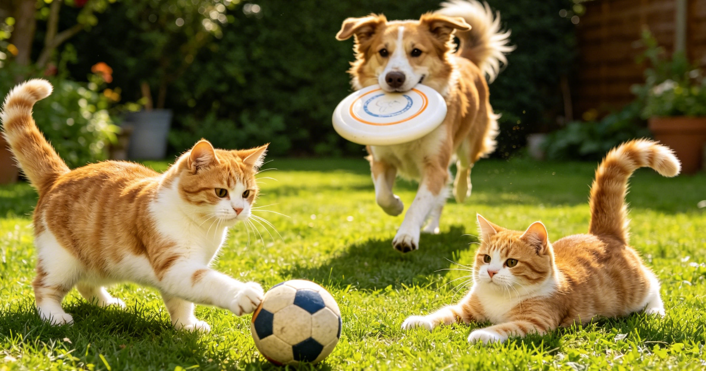
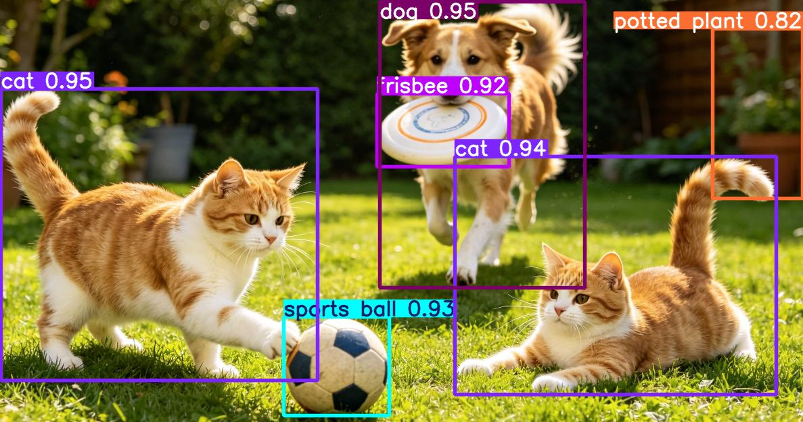
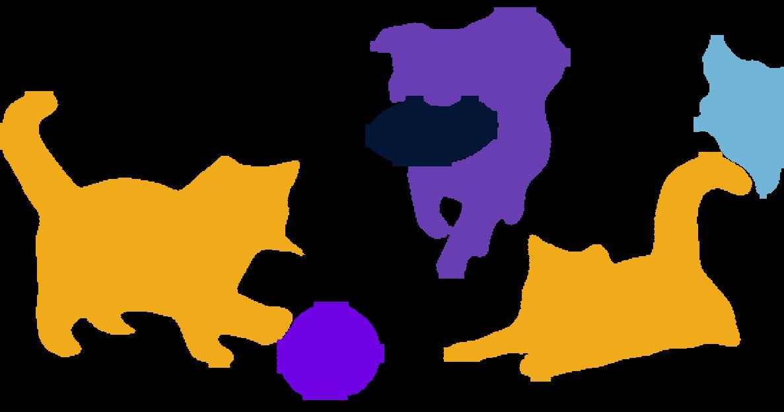
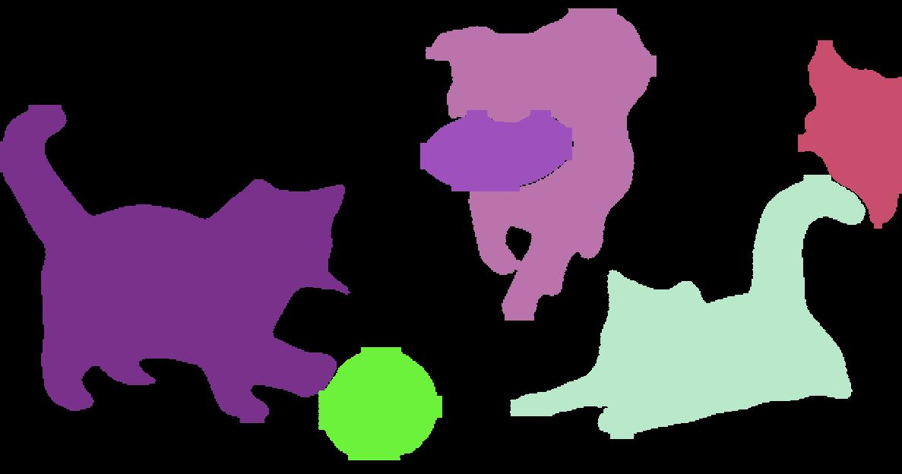
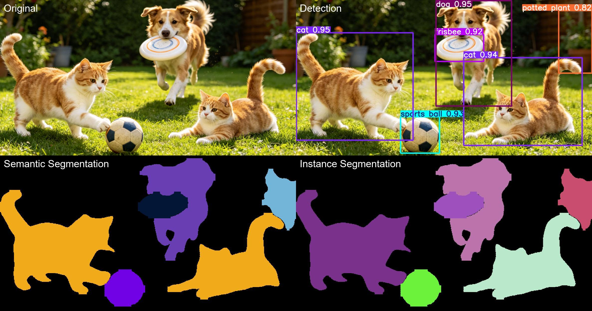

# 检测与分割

> 难度：[基础] | 预计用时：60 分钟
> 先修：[RGB-D 与点云](../01-geometric-perception-foundations/03-rgbd-pointcloud.md)
> 建议：先把本页看懂，再继续进入 [GroundingDINO 与 SAM](02-groundingdino-sam.md) 和 [Mask 质量与时序稳定](03-mask-quality.md)。

目标：把“图像里有什么”变成机器人可消费的对象候选，包括 `label`、`bbox`、`mask`、`confidence` 和最基本的时空上下文，而不是停留在“模型跑出来了几张框图”。

## 先建立直觉

面对一整张桌面图像，机器人真正关心的不是“这张图整体像什么场景”，而是：

- 任务相关物体在哪里。
- 哪块像素属于哪个实例。
- 哪些区域只是背景、桌面或干扰物。

所以检测与分割的本质，不是给图像打标签，而是给后续几何模块提供**对象候选**。

我们可以把这一层理解成“给下游提名目标”：

- 检测负责先把潜在目标圈出来。
- 分割负责把目标边界切干净。
- 跟踪负责在连续帧里保持“它还是刚才那个它”。

本页只解决一个核心问题：

**怎样把整张图像整理成后续点云、位姿、可供性模块可以继续处理的对象级输入？**

下面这张原始输入图可以先记住，后面几张检测图、语义分割图和实例分割图都来自同一个例子：



图 4.3-1：原始输入图。你现在看到的是一张普通 RGB 图像，但对机器人来说，真正有用的是后续要从中整理出的对象候选。

## 先把四个术语分清

| 术语 | 它回答的问题 | 典型输出 |
|---|---|---|
| Detection | 图里有没有这个目标，大概在哪 | `bbox`、`label`、`score` |
| Semantic Segmentation | 每个像素属于哪一类 | 类别图 |
| Instance Segmentation | 每个物体实例的像素边界在哪 | 多个独立 `mask` |
| Tracking | 当前帧这个实例是不是上一帧的同一个对象 | `track_id` |

看完这张表后，直接接同一个例子会更容易把概念和图像对上。下面四张图都来自同一张原图，可以一边看图一边记术语。

### Detection：先回答“有什么、在哪”

目标检测的任务是：

- 给出有哪些候选目标。
- 给出它们的大致位置。

Detection 最常见的输出就是 `bbox`。  
`bbox` 是边界框，通常是一个矩形框，比如：

```text
[x1, y1, x2, y2]
```

它适合快速告诉我们“目标大概在哪”，但不能精确表示目标轮廓。

对于开放场景，Detection 常常是整条链路的第一道筛选。



图 4.3-2：Detection 先给出 `bbox + label + score`。它已经能回答“图里有什么、在哪”，但还没有把对象边界切干净。

### Semantic Segmentation：再回答“这一片像素是什么类”

它适合做场景理解，例如：

- 哪些像素是桌面。
- 哪些像素是地面。
- 哪些像素属于杯子类或盒子类。

但它不一定能直接回答“我要抓的是左边这一个还是右边那一个”。



图 4.3-3：语义分割把同一类别涂成同一种颜色。它适合做场景理解，但对“抓左边哪一个、抓右边哪一个”这种实例级任务还不够。

### Instance Segmentation：继续回答“每个具体实例在哪”

它会为每个对象实例单独给一个 `mask`，所以更适合机器人对象级操作。

这里顺手把 `mask` 这个词一起记住：  
`mask` 是像素级区域，表示哪些像素真正属于目标。它比 `bbox` 更细，所以更适合：

- 裁目标点云
- 估目标几何边界
- 过滤桌面和背景



图 4.3-4：实例分割会把两个同属猫类的目标分成两个不同实例。这一步对抓取、点云裁剪和单对象位姿估计尤其关键。

这时候再回头看“语义分割”和“实例分割”的区别，就会更直观：

- 语义分割只关心“这些像素是不是杯子类”。
- 实例分割还要继续区分“左边这个杯子”和“右边那个杯子”。

对机器人抓取来说，实例分割通常更直接，因为机械臂最终要碰的是某一个具体对象，而不是某一类对象。

### Tracking：最后回答“它还是不是刚才那个它”

单帧看起来再正确，也无法替代跟踪。因为在机器人执行过程中：

- 视角会变化。
- 对象会被手臂部分遮挡。
- 相似目标会在连续帧里交换排序。

如果没有 `track_id` 或等价的时序稳定机制，下游很容易“每一帧都在追不同的目标”。

把同一张图的四种视角并排放在一起看，会更容易理解它们的职责边界：



图 4.3-5：左上是原图，右上是检测框，左下是语义分割，右下是实例分割。初学者最常见的混淆，基本都能在这张对比图里看出来。

## 为什么机器人对边界质量比普通视觉应用更敏感

现在你已经先看过几种术语和它们的例子，再回来看这个问题会更自然：

在普通图像应用里，框稍微大一点、边缘漏一点，很多时候只是评分下降。但在机器人里，这种误差会沿着链路一直放大：

| 上游误差 | 下游会发生什么 |
|---|---|
| `bbox` 太大 | 点云里混入桌面或邻近物体 |
| `mask` 漏掉把手 | 抓取点可能选不到真正可抓区域 |
| 两个实例粘成一个 | 位姿和碰撞体都不再可信 |
| 连续帧结果抖动 | 规划目标一帧一变，执行不稳定 |

所以在机器人系统里，“检测/分割结果对不对”不能只看图片本身，还要看它是否足以支持后续几何与动作计算。

## `bbox` 和 `mask` 的工程角色不同

| 结果 | 长处 | 短处 | 更适合做什么 |
|---|---|---|---|
| `bbox` | 便宜、快、稳定 | 边界粗，包含背景 | 候选筛选、粗定位、提示 SAM |
| `mask` | 边界精细 | 计算更重，质量波动大 | 点云裁剪、几何恢复、实例级操作 |

一个非常重要的实践判断是：

**机器人系统里通常不是二选一，而是两者都保留。**

因为：

- `bbox` 适合做快速筛选和可视化。
- `mask` 适合做后续精细几何。

## 一个最小对象候选应该包含什么

检测与分割的结果最终最好收束成一个对象候选结构：

```yaml
object_candidate:
  object_id: mug_01
  label: red mug
  bbox_xyxy: [412, 208, 610, 470]
  mask_ref: runs/04-perception/masks/mug_01.png
  confidence: 0.87
  frame_id: camera_color_optical_frame
  timestamp: 2026-05-30T10:32:14.120Z
  failure_code: null
```

这份结构有两个关键作用：

1. 它把“图像里的某个目标”变成了结构化对象记录。
2. 它为下游点云裁剪、位姿估计、可供性推理提供了稳定入口。

注意 `frame_id` 和 `timestamp` 的重要性不亚于 `label` 和 `confidence`。因为对象候选不是给人看图用的，而是给系统继续处理用的。

## 一个简单的对象候选流水线

```text
RGB image
  -> detector
  -> bbox candidates
  -> segmenter
  -> instance masks
  -> depth intersection
  -> object point cloud crop
  -> pose / affordance / planner
```

这条链路说明了一个经常被忽略的事实：

**检测与分割并不是终点，它们只是后续几何链路的入口。**

## 最小代码入口

如果想看一个“检测与分割到底产出什么文件”的最小示例，可以参考：

```bash
python labs/04-perception/detection_segmentation_real.py
```

这个脚本会基于 YOLOv8 segmentation model 输出：

- `detection.jpg`
- `semantic_mask.jpg`
- `instance_mask.jpg`
- `four_grid.jpg`

不过从教学角度看，本页不要求你立刻依赖某个具体库。你更应该先看懂：

- 为什么需要 `bbox`。
- 为什么需要 `mask`。
- 为什么 mask 质量还要专门设门禁。

## 什么时候“检测到了对象”仍然不够

下面几种情况，即使系统已经给出目标，也不应直接进入执行：

| 情况 | 为什么不够 |
|---|---|
| `bbox` 里混入大量背景 | 3D 裁剪会污染 |
| `mask` 与 depth 严重错位 | 点云不是目标本体 |
| 两个相似对象都被检出 | 需要消歧或跟踪 |
| 结果缺少 frame 或 timestamp | 无法安全进入下游 |
| 连续帧候选不稳定 | 抓取目标会跳 |

这也是为什么下一页我们要继续讲：

- 如何用 GroundingDINO + SAM 把语言目标变成 `bbox + mask`
- 如何给 mask 增加质量门禁和时序稳定机制

## 常见失败模式

| 失败类型 | 表现 | 常见原因 |
|---|---|---|
| False Positive | 把背景或无关物体当成目标 | 语义提示太宽、外观相似 |
| False Negative | 目标存在但没检出来 | 遮挡、光照变化、尺度太小 |
| Mask Leakage | mask 混入桌面或邻近物体 | 边界不清、深度错位 |
| Instance Merge | 两个实例被并成一个 | 目标靠太近、遮挡严重 |
| Temporal Flicker | 连续帧结果来回跳 | 缺少跟踪或阈值不稳 |

## 自检问题

1. 为什么 `bbox` 在很多普通视觉场景里够用，但在机器人抓取里常常不够？
2. 语义分割和实例分割的根本区别是什么？
3. 为什么对象候选里最好同时保留 `frame_id` 和 `timestamp`？

## 练习

### [观察] 画出对象候选到位姿的链路

从 `RGB image` 出发，画出：

```text
detection -> segmentation -> depth crop -> pose
```

并说明每一步输出的对象是什么。

完成后，可以先用下面几条检查这一部分是否已经到位：
- 能说清 `bbox` 和 `mask` 在链路里的分工。
- 能指出哪一步开始真正进入几何空间。

### [复现] 写一份最小对象候选记录

为“桌上的红杯子”写一份对象候选记录，至少包含：

- `object_id`
- `label`
- `bbox_xyxy`
- `mask_ref`
- `confidence`
- `frame_id`
- `timestamp`

完成后，可以先用下面几条检查这一部分是否已经到位：
- 结构可以直接给后续几何模块使用。
- 能说明如果 `mask_ref` 缺失，会影响哪一步。

## 导航

- 上一节：[三维重建与场景表征](../01-geometric-perception-foundations/05-3d-reconstruction.md)
- 下一节：[GroundingDINO 与 SAM](02-groundingdino-sam.md)
- 返回本章：[感知与三维视觉](../README.md)

