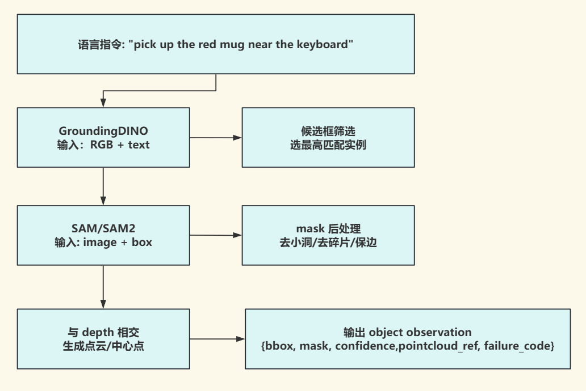

# GroundingDINO 与 SAM

> 难度：[中级] | 预计用时：65 分钟
> 先修：[检测与分割](01-detection-segmentation.md) → [RGB-D 与点云](../01-geometric-perception-foundations/03-rgbd-pointcloud.md)

目标：理解为什么开放词汇检测和通用分割经常要组合使用，知道怎样把一句语言目标稳定地变成 `bbox`、`mask`、`confidence` 和后续几何模块可继续消费的对象记录。

## 先抓住主问题

这一页只回答一个问题：

**如果用户给机器人一句自然语言目标，比如“桌上的红色杯子”，视觉系统怎样把它变成一块可继续处理的对象区域？**

单靠传统检测模型，通常会遇到两个问题：

- 它只认识固定类别，不一定懂“红色杯子”“左边那个杯子”。
- 它就算找到目标，也通常只给一个矩形框，不够精细。

于是一个非常自然的组合就出现了：

- `GroundingDINO` 先根据语言给你一个目标框。
- `SAM` 再根据这个框把对象边界切出来。

我们可以把它们理解成：

- GroundingDINO 负责“先找对人”。
- SAM 负责“再把边界抠干净”。



图 4.3.1-1：这条流水线的重点不是“串了两个热门模型”，而是把一句自然语言目标一步步压缩成 `bbox`、`mask`、点云裁剪和结构化 observation。

## 为什么两者经常搭配出现

### GroundingDINO 负责什么

GroundingDINO 的特点是：

- 接受文本提示；
- 做开放词汇检测；
- 输出文本条件下的目标框。

它适合回答：

> “根据这句话，目标大概在哪里？”

但它通常不擅长直接给出精细像素边界。

### SAM 负责什么

SAM 的特点是：

- 接受点、框、mask 等提示；
- 输出高质量分割边界。

它适合回答：

> “既然你已经提示我这大概是目标，那我把边界切出来。”

但它本身并不擅长决定“哪一个对象才是你真正要找的那个”。

所以两者的组合刚好互补：

```text
语言目标 -> GroundingDINO 找框 -> SAM 切边界
```

## 什么叫 prompt

在本页语境里，`prompt` 指传给模型、用于约束输出对象的条件信息。

对 GroundingDINO 来说，prompt 往往是文本，比如：

- `red mug`
- `drawer handle`
- `white bowl near the sink`

对 SAM 来说，prompt 往往是框、点或已有区域，比如：

- 一个 `bbox`
- 一个中心点
- 一块粗略 mask

prompt 不是“可有可无的小参数”，而是直接决定模型在看谁。

## GroundingDINO 的最小输入输出

从工程视角看，GroundingDINO 最值得记住的不是训练细节，而是它的 I/O 形态：

```python
boxes, logits, phrases = predict(
    model=model,
    image=image_tensor,
    caption="red mug . keyboard .",
    box_threshold=0.35,
    text_threshold=0.25,
)
```

这里最关键的点有两个：

1. 它的框常常先以归一化格式输出，而不是最终像素框。
2. 文本阈值和框阈值都会直接改变你保留下来的候选。

如果后面要把框送给 SAM，就需要先把这些框正确地还原回当前图像分辨率。

## 坐标还原为什么是高频坑

这一步看起来只是“坐标格式转换”，但实际是整条链路最容易出错的地方之一。

常见流程是：

1. 图像先被 resize、pad 或 letterbox。
2. GroundingDINO 在预处理后的图像上输出框。
3. 再把这些框还原到原图坐标系。
4. 再把还原后的框交给 SAM。

任何一步方向搞反，都会出现：

- 框看起来大致像对，但偏了一截；
- SAM 切出来的区域总在旁边；
- 2D 上勉强还行，3D 一裁点云就明显错。

所以请把这条原则记牢：

**所有 `bbox` 都必须明确它属于哪一个图像分辨率和预处理坐标系。**

## 一个最小的检测记录

```python
def build_detection_record(image_w, image_h, boxes_cxcywh, logits, phrases):
    records = []
    for box, score, phrase in zip(boxes_cxcywh, logits, phrases):
        cx, cy, w, h = box
        x1 = (cx - w / 2.0) * image_w
        y1 = (cy - h / 2.0) * image_h
        x2 = (cx + w / 2.0) * image_w
        y2 = (cy + h / 2.0) * image_h
        records.append(
            {
                "label": phrase,
                "bbox_xyxy": [round(x1), round(y1), round(x2), round(y2)],
                "confidence": float(score),
            }
        )
    return records
```

这段代码看起来很简单，但它承担的作用非常关键：

- 把模型输出变成系统内部统一字段；
- 明确坐标格式；
- 为后续 SAM、点云裁剪和日志回放保留证据。

## 为什么光有 `bbox` 仍然不够

`bbox` 最大的问题是：它把目标和周围一部分背景一起包进来了。

这对机器人尤其危险，因为后续几何往往会直接使用这个区域：

| 下游任务 | 只用 `bbox` 会怎样 |
|---|---|
| 点云裁剪 | 把桌面或邻近物体一起裁进去 |
| 位姿估计 | 目标中心和形状都被背景污染 |
| 可供性推理 | 交互区域会偏到背景上 |
| 抓取规划 | 碰撞体和目标几何都可能错 |

所以 SAM 的意义，不是“让图更好看”，而是：

**把目标边界切到足够干净，好让后续几何真正只看目标本体。**

## 一条典型的 Grounded-SAM 流水线

```text
RGB image
  -> GroundingDINO(text-conditioned detection)
  -> candidate bbox
  -> SAM(box-prompt segmentation)
  -> binary mask
  -> depth intersection
  -> object point cloud crop
```

注意：这条流水线的真正价值，不在于“用了两个明星模型”，而在于它把语义目标稳定压缩成了一块对象级区域。

## 阈值不是细枝末节，而是任务定义的一部分

最常见的两个阈值是：

- `box_threshold`
- `text_threshold`

它们带来的差别不是小数点调参，而是系统在定义：

- 宁可漏掉一些候选，也不要误检；
- 还是宁可保留更多候选，留给后续再筛。

从机器人任务角度看：

| 任务特点 | 阈值策略倾向 |
|---|---|
| 误抓代价很高 | 更保守 |
| 可以多候选重排序 | 可略放宽 |
| 开放词汇非常复杂 | 文本阈值不能盲目拉太高 |

一个非常实际的原则是：

**高风险动作往往更怕高置信误检，而不是低置信漏检。**

## 和深度结合时最容易错的三件事

GroundingDINO + SAM 自己只在 2D 图像平面里工作。  
一旦要把 mask 和 depth 结合，就需要额外检查：

| 检查项 | 错了会怎样 |
|---|---|
| RGB 与 depth 分辨率是否一致 | mask 和点云对不上 |
| depth 是否已经对齐到 RGB | 2D 分割到 3D 时整体偏移 |
| 时间戳是否一致 | 手臂运动时目标会错位 |

这也是为什么很多“模型看起来都正常，但点云裁出来不对”的问题，根源根本不在模型，而在 RGB / depth 几何链。

## 一份对象记录最好长什么样

```yaml
object_observation:
  object_id: mug_candidate_01
  query: red mug
  label: red mug
  bbox_xyxy: [412, 208, 610, 470]
  mask_ref: runs/04-perception/masks/mug_candidate_01.png
  confidence: 0.61
  frame_id: camera_color_optical_frame
  timestamp: 2026-05-30T10:30:15.182Z
  source:
    detector: groundingdino_swint_ogc
    segmenter: sam_vit_h
    box_threshold: 0.35
    text_threshold: 0.25
  failure_code: null
```

重点不是字段越多越好，而是：

- 语言目标要记录下来；
- 生成这份结果的模型和阈值要记录下来；
- 它要能被后续点云和位姿模块继续消费。

## 常见失败模式

| 失败模式 | 现象 | 常见原因 |
|---|---|---|
| prompt 太宽 | 多个相似物体一起被检出 | 语言目标不够具体 |
| 框对了，mask 错了 | 桌面也被包进去 | 框太松、边界模糊 |
| mask 对了，但实例错了 | 抓了邻近相似物体 | 缺少历史跟踪或空间消歧 |
| resize 后没还原坐标 | SAM 总是切偏 | 坐标系没还原干净 |
| depth 对齐错 | 2D 看起来对，3D 裁出来不对 | RGB/depth 链断了 |

## 自检问题

1. 为什么 GroundingDINO 和 SAM 经常要组合使用，而不是二选一？
2. 为什么 `bbox` 坐标格式和图像分辨率记录错误，会直接影响后续几何模块？
3. 为什么一个“看起来很准的 mask”如果和 depth 错位，仍然不能直接进入位姿估计？

## 练习

### [观察] 读懂一次文本到对象区域的链路

请选择一个语言目标，例如：

- `red mug`
- `drawer handle`

然后口头描述这条路径：

```text
caption -> GroundingDINO bbox -> SAM mask -> point cloud crop
```

完成后，可以先用下面几条检查这一部分是否已经到位：
- 能指出哪一步在做“找谁”，哪一步在做“切边界”。
- 能指出至少一个最容易导致坐标错位的环节。

### [复现] 写一份最小 Grounded-SAM 对象记录

写出一份对象记录，至少包含：

- `query`
- `label`
- `bbox_xyxy`
- `mask_ref`
- `confidence`
- `source.detector`
- `source.segmenter`

完成后，可以先用下面几条检查这一部分是否已经到位：
- 记录能被后续 3D 模块消费。
- 能说明如果不保留 `query` 和阈值，复盘时会丢掉什么。

## 导航

- 上一节：[检测与分割](01-detection-segmentation.md)
- 下一节：[Mask 质量与时序稳定](03-mask-quality.md)
- 返回本章：[感知与三维视觉](../README.md)
