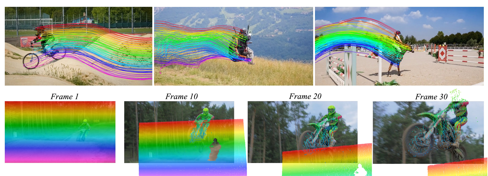
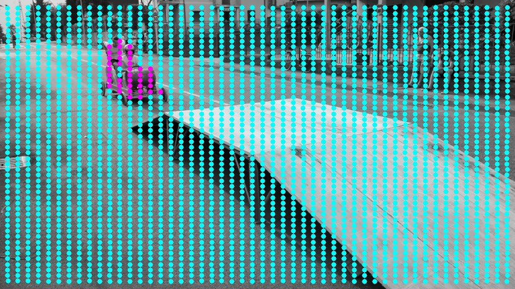

# 点跟踪

> 难度：[中级] | 预计用时：40 分钟
> 先修：[Mask 质量与时序稳定](03-mask-quality.md)
> 建议：把本页当成“对象感知里的时序层”来看，它补的是跨帧对应，而不是单帧检测。

目标：理解视频点跟踪在机器人里的工程角色，区分它与光流、目标跟踪的边界，并知道 CoTracker、TAPIR 这类方法怎样服务自动标注、状态估计和策略表征。

## 先建立直觉

单帧检测能回答“这一帧里对象大概在哪”。  
但很多机器人任务还需要回答更细的问题：

- 同一个把手在连续帧里还是不是同一块局部结构。
- 某个接触点是沿着表面滑了，还是已经脱离目标。
- 一组局部轨迹是否足够说明物体正在被稳定推进。

这类问题里，单独的 `bbox` 或 `mask` 经常不够，因为它们更偏对象级区域，而不是局部运动对应。

视频点跟踪做的事情，是在连续帧里维护“这一点还是不是那一点”的时序关系。



这张图表达了三件事：

- 点跟踪不是只跟 1 个关键点，而是可以同时跟很多点。
- 这些点可以跨长时间片段持续被维护。
- 即使发生遮挡，或者点短暂离开画面，轨迹也不一定立刻断掉。

## 本页目标

这一页读完后，我们希望能一起把下面几件事说明白：

- 区分 point tracking、optical flow、multi-object tracking 各自负责什么。
- 理解 CoTracker、TAPIR 这类任意点跟踪方法为什么适合机器人视频。
- 解释点轨迹怎样服务自动标注、接触分析和策略输入表征。
- 写出一份最小 `track_observation`，并知道什么时候轨迹已经不该继续用。

## 先把三类时序问题分开

| 方法 | 更偏回答什么 |
|---|---|
| Optical Flow | 每个像素附近短时往哪里动了 |
| Multi-Object Tracking | 这个实例级目标在视频里是不是同一个对象 |
| Point Tracking | 这一个局部点或局部结构在长时间里如何运动 |

所以 point tracking 不是“更细的目标跟踪”，也不是“更长的光流”，而是专门维护局部对应关系的一层时序表示。

## 为什么机器人里特别需要任意点跟踪

在具身任务里，很多关键线索恰好是“对象局部结构的运动”，例如：

- 抽屉把手相对柜体是否真的开始移动。
- 杯沿某一点是否在接近夹爪。
- 布料局部褶皱和边缘如何随动作变化。

这些情况里，实例框往往太粗，光流又太局部、太短时。  
任意点长时跟踪的好处是：

- 不要求目标天然就是一个标准实例。
- 能直接追踪边缘、角点、接触附近局部纹理。
- 更适合从操作视频中抽“局部运动证据”。

## CoTracker 和 TAPIR 这类方法在做什么

这一类方法的共同目标是：

> 给定一批初始点，跨整段视频预测这些点在后续帧里的对应位置和可见性。

它们最重要的工程意义在于两点：

- 支持长时间、多点、一致性更强的时序追踪。
- 不必先把所有东西都做成对象实例，才能建立时序关系。

两者的侧重点可以概括成：

- TAPIR 更强调任意点跟踪与可见性建模。
- CoTracker 更强调联合建模多点轨迹，使整组点的时序更一致。

这两类方法并不是要替代对象检测，而是补上“对象内部局部结构如何持续变化”这一层。

## 先按方法主线看 CoTracker 在解决什么

CoTracker 的核心思想可以压缩成一句话：

**与其把每个点当成彼此独立的小任务分别追，不如把很多点放在一起联合追踪。**

点和点之间通常并不是统计独立的：

- 它们可能属于同一个刚体。
- 它们可能位于同一个背景平面。
- 它们在遮挡前后往往共享运动上下文。

如果忽略这些依赖关系，单点跟踪在遮挡、出视野、背景和前景纠缠时更容易漂。

## 为什么 joint tracking 是 CoTracker 的关键

传统 point tracker 常把每个查询点独立追踪。  
CoTracker 的关键改动是：

- 让大量点一起进入同一个 transformer。
- 让这些点之间通过 attention 交换信息。
- 让“其他点怎么动”帮助当前点判断自己该怎么动。

这就是论文标题里 “It is Better to Track Together” 的真正含义。



这张图展示了联合跟踪和独立跟踪的差别。  
上半部分是非联合跟踪，下半部分是联合跟踪。图中的现象是：

- 如果把点彼此独立处理，背景点更容易被前景物体带跑。
- 把点放在一起追踪后，前景和背景的边界会更稳定。

这说明 CoTracker 的改进不只是“模型更大”，而是把建模假设直接改成了“点之间存在依赖关系”。

## CoTracker 的三条核心方法线

按照论文主线，可以把 CoTracker 拆成三条最重要的设计：

### 1. Joint tracking

很多点一起追，而不是一个点一个点独立追。

### 2. Sliding window + recurrent propagation

它不是一次性看完整个超长视频，而是在短窗口上在线处理：

- 当前窗口里做多次 refinement。
- 相邻窗口部分重叠。
- 后一个窗口继承前一个窗口的轨迹状态。

所以它虽然是 causal online tracker，却能通过窗口间传递，把轨迹保持得很长。

### 3. Proxy tokens 和 support points

这是论文里两个特别重要、也最容易被教程略过的点。

#### Proxy tokens

如果把几万个点全做两两 self-attention，显存会非常贵。  
论文引入 proxy tokens，本质上是用少量代理 token 帮大量真实轨迹交换信息，从而把复杂度压下来。

它们的作用可以粗略理解成：

- 不让每个点直接和所有点都全连。
- 先让点和代理 token 交互。
- 再通过代理 token 汇总和传播全局上下文。

这也是为什么 CoTracker 能在单卡上联合追踪非常多的点。

#### Support points

论文还发现，即使用户只关心一个目标点，额外加入一些 support points 也会更稳。

原因很直观：

- 单个点自己的局部证据可能不够。
- 但附近点、背景点、甚至更大范围的参考点可以提供上下文。

所以 support points 本质上是在给点跟踪“补场景上下文”。

## 为什么它能跨遮挡甚至出视野

论文里 CoTracker 的一个显著卖点是：

- 点被遮挡后还能继续维护。
- 点短暂离开画面后也不一定立刻丢失。

这背后不是一个单独技巧，而是上面三条方法线叠加出来的结果：

- 联合跟踪提供点间依赖。
- 窗口重叠和 recurrent 传播提供长时记忆。
- support points 提供更大范围上下文。

所以它不是“靠一帧猜下一帧”，而是在一个短时在线框架里持续积累轨迹状态。

## TAPIR 和 CoTracker 的差别，应该怎么讲才不误导

如果只用一句话区分：

- TAPIR 侧重任意点跟踪、可见性预测和逐步精修。
- CoTracker 侧重多点联合建模、窗口递推和长时轨迹维护。

这不是说谁绝对替代谁，而是它们强调的强项不同：

| 方法 | 更突出的点 |
|---|---|
| TAPIR | 任意点、可见性预测、精修稳定 |
| CoTracker | 多点联合、长时追踪、遮挡与出视野鲁棒性 |

所以在教程里不应把它们写成“同一个东西换个模型名”，而应明确两条方法线。

## 它和机器人中的三类典型用途

### 1. 自动标注与轨迹监督

从操作数据角度看，点轨迹可用来自动构造更细的监督：

- 把示教视频里的局部运动变成时序标签。
- 估计物体关键区域是否真的在被推动、拉动或转动。
- 构造稀疏但高价值的接触附近轨迹。

这使它很适合做：

- 行为克隆数据增强。
- 接触前后的轨迹切片。
- 对象局部交互区域自动对齐。

### 2. 接触与交互证据

对机器人来说，点轨迹还有一个很实用但经常被低估的用途：  
它能补上“局部交互到底有没有发生”的证据层。

例如：

- 抽屉把手上的点是否真的沿抽出方向移动。
- 杯口边缘点是否在持续靠近夹爪闭合区域。
- 柔性物体上的局部点是否出现了预期形变。

这类信息常常比一个整体 bbox 更接近动作层需要的事实。

### 3. 轨迹作为表征

另一类用途更偏策略输入：

- 不直接把原始图像当唯一输入。
- 而是把一组被跟住的关键点轨迹作为更结构化的中间表征。

这种“track-as-representation”思路适合：

- 操作关注的是局部形变或局部接触演化。
- 视频变化比单帧外观更重要。
- 需要让策略显式看到“目标正在怎样移动”。

## 一个更贴近论文的最小心智模型

把 CoTracker 的主线压缩成一张心智图，可以写成：

```text
query points
  + support points
  -> sliding window transformer
  -> joint refinement of all tracks
  -> visibility + position update
  -> overlap to next window
```

这张心智图比记住所有实现细节更重要，因为它解释了：

- 为什么它能在线工作。
- 为什么它能联合追踪大量点。
- 为什么它在长时间遮挡下更稳。

## 一个最小轨迹结果长什么样

```yaml
track_observation:
  track_id: handle_tip_track_01
  frame_id: camera_color_optical_frame
  query_frame: 0
  points_uv:
    - [412.0, 238.0]
    - [415.5, 239.0]
    - [420.2, 241.3]
  visibility:
    - 1.0
    - 1.0
    - 0.82
  confidence: 0.79
  staleness_ms: 18
  failure_code: null
```

这份结构最关键的不是“轨迹有几个点”，而是：

- `frame_id` 要清楚。
- 可见性要显式给出。
- 轨迹也一样要带 `confidence` 和 `failure_code`。

## 什么时候轨迹不能继续往下传

下面这些情况，轨迹虽然“还在输出”，但通常不应直接被下游继续相信：

| 情况 | 风险 |
|---|---|
| 可见性长期很低 | 点已经被遮挡或漂走 |
| 多点轨迹突然分叉 | 局部对应不再一致 |
| 点落到目标实例外 | mask 或跟踪已经错位 |
| 轨迹在静态区域剧烈跳动 | 说明时序对应不稳定 |

因此点轨迹和 mask 一样，也需要质量 gate，而不能默认所有轨迹都可信。

## 点跟踪和对象管线怎么配合

一条更靠谱的系统链路通常是：

```text
detection / mask
  -> choose key regions or query points
  -> point tracking
  -> local motion evidence
  -> pose / affordance / supervisor
```

它在系统里的作用通常有三种：

- 给 pose 或接触分析提供局部时序证据。
- 给数据标注和轨迹监督提供自动化工具。
- 给策略模型提供更结构化的动态输入。

## 常见误区

| 误区 | 为什么错 |
|---|---|
| “点跟踪就是光流” | 光流偏短时像素运动，点跟踪更强调长时对应 |
| “有实例跟踪就不需要点跟踪” | 实例跟踪解决对象身份，不解决对象内部局部结构时序 |
| “轨迹能跟住，就说明几何一定对” | 轨迹稳定不等于已经有执行级 pose |
| “轨迹越多越好” | 无筛选的轨迹会把无关背景运动也带进来 |

## 自检问题

1. 为什么点跟踪在机器人里常被用来补对象级检测的时序盲区？
2. Point tracking、optical flow、multi-object tracking 三者最大的职责差异是什么？
3. 为什么“有轨迹”仍然不等于“已经有可执行几何结果”？

## 练习

### [观察] 为任务选择时序表示

分别判断下面几类任务更需要：

- optical flow
- multi-object tracking
- point tracking

任务包括：

- 跟住整只杯子是不是还是同一对象
- 跟住抽屉把手尖端有没有真正开始移动
- 估计连续两帧内大范围像素运动方向

完成后，可以先用下面几条检查这一部分是否已经到位：
- 能解释为什么三种方法不能互相简单替代。

### [复现] 写一份最小 track observation

至少包含：

- `track_id`
- `frame_id`
- `points_uv`
- `visibility`
- `confidence`
- `failure_code`

完成后，可以先用下面几条检查这一部分是否已经到位：
- 能指出什么时候应把轨迹结果拒收，而不是继续传给 pose 或 supervisor。

## 导航

- 上一节：[Mask 质量与时序稳定](03-mask-quality.md)
- 下一节：[位姿估计](05-pose-estimation.md)
- 返回本章：[感知与三维视觉](../README.md)
