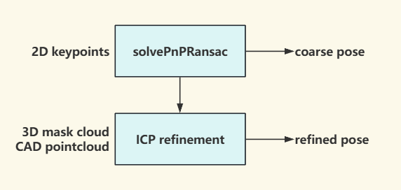

# PnP 与 ICP

> 难度：[中级] | 预计用时：70 分钟
> 先修：[位姿估计](05-pose-estimation.md)

目标：理解 PnP 和 ICP 如何把 2D/3D 对应关系变成 6D pose，并知道各自什么时候可信、什么时候必须拒收。

## 先建立直觉

PnP 像“拿着图纸在照片上对点”，只要你知道物体模型上的几个关键点和它们在图像里的位置，就能反推出物体相对相机的姿态。ICP 更像“拿两团 3D 点慢慢对齐”，它依赖一个还不错的初始位置，然后通过反复匹配最近点把误差压小。前者吃的是 2D-3D 对应，后者吃的是 3D-3D 对应；前者常用来给出初值，后者常用来做精修。

## 本页目标

这一页读完后，我们希望能一起把下面几件事说明白：

- 解释 PnP 与 ICP 的输入假设和失败条件有何不同。
- 用 `labs/04-perception/pnp_pose.py` 与 `labs/04-perception/icp_demo.py` 理解两条位姿路线。
- 判断一个 pose 是可直接交给规划器，还是还需要 refinement、滤波或拒绝。
- 写出 `T_camera_object -> T_base_object` 的变换路径，并指出容易出错的方向。

## 先区分两条路线

| 方法 | 最少输入 | 优势 | 典型风险 |
|---|---|---|---|
| PnP | 物体 3D 点、2D 像素点、相机内参 | 单帧就能解，速度快 | 对应点错、平面退化、内参误差 |
| ICP | 源点云、目标点云、初始位姿 | 可做毫米级 refinement | 初值差、局部极小、遮挡敏感 |

```text
PnP:
CAD / keypoints + image pixels + K
          -> solvePnP / RANSAC PnP
          -> T_camera_object

ICP:
source CAD cloud + observed cloud + init pose
          -> iterative closest point
          -> refined T_camera_object
```

工程上很常见的一条完整路径是：

```text
detector/mask -> keypoints or crop
             -> RANSAC PnP 得到粗 pose
             -> mask 点云 + CAD 点云做 ICP refinement
             -> 输出 pose + quality metrics
```

## 从仓库里的 PnP 实验看输入输出

`labs/04-perception/pnp_pose.py` 构造了一个小长方体，在已知真值 pose 下投影到合成相机，再加噪声和外点测试多个 PnP solver。它把问题拆得很清楚：

```python
# 从 labs/04-perception/pnp_pose.py 提炼的最小 PnP 核心
ok, rvec, tvec = cv2.solvePnP(
    object_points,   # Nx3，物体坐标系下的 3D 点
    image_points,    # Nx2，图像像素点
    K,               # 相机内参
    DIST,            # 畸变参数
    flags=cv2.SOLVEPNP_ITERATIVE,
)

# 预期输出:
# ok=True
# rvec: 3x1 旋转向量
# tvec: 3x1 平移，单位与 object_points 一致
```

这里的三个“单位一致”特别关键：

| 量 | 必须一致什么 |
|---|---|
| `object_points` | 长度单位，通常是米 |
| `tvec` | 与 `object_points` 同单位 |
| `K` 与 `image_points` | 同一图像分辨率 |

如果拿毫米建模、用米解释 `tvec`，结果会整整差 1000 倍，但数学上不会报错。

## PnP 为什么常和 RANSAC 一起出现

真实标注里很少所有对应点都干净。`labs/04-perception/pnp_pose.py` 还专门构造了 20% 外点，然后用 `solvePnPRansac` 去挡住坏对应。

**RANSAC（Random Sample Consensus，随机采样一致性）**：一种从包含噪声的数据中估计模型参数的迭代方法。每次迭代随机选取最小数据集，计算模型，然后统计有多少内点。反复迭代直到找到内点最多的模型。

| 情况 | 普通 PnP | RANSAC PnP |
|---|---|---|
| 关键点都准确 | 都能工作 | 代价稍高 |
| 有少量错点 | 容易被拉偏 | 可把外点剔除 |
| 点太少或分布太集中 | 都会不稳定 | 只能缓解，不能救退化 |

所以当你不知道关键点质量是否可靠时，默认先用 RANSAC 更稳。

## ICP 不是”自动更准”，它依赖初值

`labs/04-perception/icp_demo.py` 展示了另一个事实：ICP 的本质是局部对齐。如果初始姿态已经离得比较近，点云会越对越准；如果初始差太大，它很容易收敛到错误局部极小。

**初值（initial guess）**：ICP 开始迭代前的初始位姿估计。初值差太大时，ICP 可能收敛到”看起来对齐了但实际错位”的结果。例如把两个相似盒子错位180度放置，ICP可能把它们完全反向对齐。

```python
# 从 labs/04-perception/icp_demo.py 提炼的最小思想
T_est, history = icp(source_cloud, target_cloud, max_iter=40)

# 预期输出:
# T_est: 4x4 刚体变换矩阵
# history: [(iter, rmse), ...]
```

RMSE 历史比“最后一个姿态值”更值得看，因为它能告诉你：

- 误差是否稳定下降；
- 是否很早就停滞；
- 是否在低误差下仍然对错对象表面对齐。

## PnP 与 ICP 的组合关系



这个组合在机器人里很自然，因为：

- PnP 不需要完整点云，单帧 RGB 也能出粗姿态。
- ICP 能利用 depth，把粗姿态精修到更适合抓取的程度。

但如果目标是严重对称的圆柱或光滑杯子，ICP 可能只把“某个对称姿态”修得很好，而不是恢复唯一姿态。

## 对称物体与 pose 可解释性

| 物体 | 哪些角度不可区分 | 下游是否一定受影响 |
|---|---|---|
| 圆柱杯身 | 绕竖直轴 yaw | 侧抓未必受影响 |
| 方盒 | 90° 旋转可能等价 | 放置朝向可能受影响 |
| 带把手杯子 | 杯身近似对称，但把手打破对称 | 若把手被遮挡，姿态仍不稳 |

因此你不应该盲目输出“完整 6D 真值姿态”。更好的做法是显式写出 symmetry class 或旋转不确定性。

## 从相机 pose 到机器人 base pose

大多数视觉算法直接输出 `T_camera_object`，但规划器通常要 `T_base_object`：

```text
T_base_object = T_base_camera @ T_camera_object
```

这条式子短，但最容易错的地方有两个：

1. 你手里其实是 `T_camera_base`，方向反了。
2. 相机 frame 用的是 `camera_color_optical_frame`，而外参标的是壳体 frame。

如果 pose 看起来“差一点点”，先别急着怪算法，先把 frame 树画出来。

## 一个可交付的 pose 记录

```yaml
pose_estimate:
  object_id: beaker_01
  source_frame: camera_color_optical_frame
  target_frame: panda_link0
  pose_camera_object:
    xyz: [0.041, -0.031, 0.548]
    quat_xyzw: [0.159, -0.124, 0.274, 0.941]
  refinement: icp_point_to_point
  metrics:
    reprojection_error_px: 0.82
    icp_rmse_m: 0.0034
    inlier_ratio: 0.79
  symmetry: axial_z
  confidence: 0.84
  failure_code: null
```

## 什么时候不能交给规划器

| 现象 | 解释 | 处理 |
|---|---|---|
| PnP 重投影误差大 | 对应点或内参有问题 | 重标关键点或检查标定 |
| ICP RMSE 不降 | 初值太差或点云不匹配 | 重新初始化或换方法 |
| 连续帧姿态跳变大 | 跟踪不稳定 | 引入时序滤波或等待稳定 |
| pose 在错误 frame | 数值看似正常但物理位置错 | 立即阻塞执行 |
| 对称物体输出“过于自信” | 旋转自由度不可观 | 降低旋转置信度，显式标注 symmetry |

## 自检问题

1. 为什么 ICP 常被放在 PnP 后面，而不是完全替代 PnP？
2. 如果 `solvePnPRansac` 的结果看起来平移正确、旋转很怪，会先怀疑哪些输入？
3. 当圆柱体的 yaw 不可观时，输出一个“完整且高置信”的旋转为什么反而会误导系统？

## 练习

### [观察] 跑通 PnP 与 ICP 示例

1. 运行 `python labs/04-perception/pnp_pose.py`。
2. 观察不同 solver 在不同噪声下的 `rot_err_deg`、`t_err_mm`、`reproj_px`。
3. 运行 `python labs/04-perception/icp_demo.py`。
4. 观察 ICP 的 RMSE 是否单调下降，以及最终误差量级。

完成后，可以先用下面几条检查这一部分是否已经到位：
- 能说出 PnP 更依赖什么证据，ICP 更依赖什么证据。
- 能解释为什么 ICP 日志里必须保留迭代误差历史。

### [复现] 设计一个粗到细 pose pipeline

1. 任选一个已知尺寸的桌面物体，列出其 3D 模型点或关键点。
2. 设计 `detection/mask -> keypoints -> RANSAC PnP -> ICP refinement` 的数据流。
3. 明确每一步的输入、输出、单位和 frame。

完成后，可以先用下面几条检查这一部分是否已经到位：
-  pipeline 至少写清 `T_camera_object` 与 `T_base_object` 的转换关系。
- 能指出其中一个必须显式记录的失败码，例如 `pose_unstable` 或 `frame_mismatch`。

## 导航

- 上一节：[位姿估计](05-pose-estimation.md)
- 返回本章：[感知与三维视觉](../README.md)
- 下一节：[FoundationPose 类方法](07-foundationpose.md)


