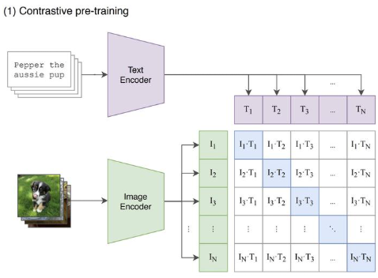
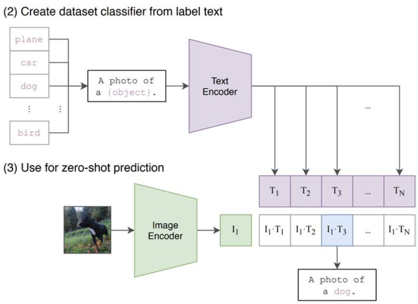

# CLIP 与 SigLIP

> 难度：[中级] | 预计用时：90 分钟
> 先修：[视觉基础模型](../03-vision-foundation-models.md)
> 阅读提示：本页重点是图文对齐、embedding、zero-shot 和工程边界。

目标：讲清 CLIP 与 SigLIP 这类图文对齐模型为什么能让自然语言进入视觉系统、它们的核心原理是什么，以及为什么它们仍然不能直接替代检测、分割、深度和位姿估计。

## 先建立直觉

假设任务是“抓桌上的红色杯子”。  
如果系统只能从固定类别里选 `cup`、`bottle`、`box`，那么“红色”“左边”“靠近水槽”这些语言条件就很难直接进入视觉模块。

CLIP 与 SigLIP 这类模型最重要的价值，就是把下面这类自然语言查询直接接到感知前端：

- `the red mug`
- `the left screwdriver`
- `the drawer handle`
- `the white bowl near the sink`

因此，这一类模型最擅长回答的问题不是“精确边界在哪”，而是：

**这张图像或这个候选区域，和这句文本描述是否在说同一个对象。**

## 什么是图文对齐

图文对齐可以先理解成：

**把图像语义和文本语义放进同一个可比较的表示空间。**

只要图像和文本能进入同一个空间，系统就可以直接比较：

- 一张红色杯子图像，和 `red mug` 是否接近。
- 多个候选区域里，哪个最像 `drawer handle`。
- 当前画面里是否存在和 `left screwdriver` 语义接近的对象。

这和传统闭集分类非常不同。  
传统分类更像“从固定标签表里选一类”；图文对齐更像“用一句文本作为查询条件，在视觉候选里做语义匹配”。

## 先把 embedding 讲清楚，并立刻接例子

`embedding` 指的是模型把输入内容压缩成向量表示。

这里的关键不是“向量有多少维”，而是“相似内容会不会靠近”。例如：

- 一张红色杯子的图像经过编码后，会得到一个 `image embedding`。
- 文本 `red mug` 经过编码后，会得到一个 `text embedding`。
- 如果图像和文本描述的是同一类内容，这两个向量的相似度就会更高。

因此，embedding 很适合用来做：

- 图文检索
- 候选重排序
- 开放词汇语义筛选
- zero-shot 分类

但 embedding 不是下列结果：

- `bbox`
- `mask`
- `depth`
- `pose`

这一点必须立刻记住，否则后面最容易误用。

## CLIP 的最小架构

CLIP 通常由两个编码器组成：

- 图像编码器 `Image Encoder`
- 文本编码器 `Text Encoder`

先看一张CLIP的预训练结构示意图：



图 4.4.1-1：图像和文本分别被编码成向量，再在共享语义空间中比较相似度。

## 为什么是双编码器，并立刻接工程例子

双编码器结构有两个直接好处：

- 图像和文本可以分开编码。
- 推理时主要做向量比较，适合检索与排序。

工程里最常见的例子是：

1. 先把场景中的多个候选区域裁成若干 crop。
2. 把每个 crop 编成 `image embedding`。
3. 把文本 `red mug` 编成 `text embedding`。
4. 比较每个 crop 和文本的相似度。
5. 选择语义上最接近的候选，再交给检测、分割、深度和位姿模块继续处理。

所以 CLIP 更像一个语义前端，而不是执行末端。

## 训练时到底学了什么

CLIP 的训练目标可以先压缩成一句话：

**让正确的图文对更近，让错误的图文对更远。**

例如一批训练数据里有：

- 图片 A：一只狗
- 文本 A：`a photo of a dog`
- 文本 B：`a photo of a blue bottle`

训练时，模型会被推动去学习：

- 图片 A 和文本 A 应该高相似
- 图片 A 和文本 B 应该低相似

这类思路通常归到对比学习范畴。  
对初学者来说，最重要的不是公式，而是记住训练目标并不是“背固定类目”，而是“学会对齐图像和文本语义”。

## 什么是 zero-shot，并立刻接例子

`zero-shot` 指的是：

**不为某个新类别单独再训练分类头，只靠文本描述就直接完成识别或排序。**

例子最直接：

- 没有单独训练一个“狗狗分类器”
- 只给模型一组文本：`a photo of a dog`、`a blue bottle`、`a screwdriver`
- 然后比较当前图像和哪一条文本最接近



图 4.4.1-2：匹配的图文对会得到最高的相似度分数。

这就是 zero-shot 的核心直觉。

因此，CLIP 的强项是“用开放文本去发起查询”，而不是“对固定封闭标签做最终分类”。

## `clip_zero_shot.py` 里发生了什么

运行：

```bash
python labs/04-perception/clip_zero_shot.py
```

这个脚本最值得反复看的，是下面这段逻辑：

```python
text_features = model.encode_text(text)
text_features = text_features / text_features.norm(dim=-1, keepdim=True)

image_features = model.encode_image(x)
image_features = image_features / image_features.norm(dim=-1, keepdim=True)

logits = (100.0 * image_features @ text_features.T).softmax(dim=-1)
```

逐行理解即可：

1. 文本被编码成 `text_features`。
2. 图像被编码成 `image_features`。
3. 归一化后，更容易用方向相似度比较语义接近程度。
4. 点积得到排序分数，再选最匹配的文本。

如果这四步已经能复述清楚，CLIP 的工程逻辑就已经掌握了大半。

## 为什么 prompt 写法会影响结果，并立刻接例子

CLIP 匹配的不是一个僵硬的 `class id`，而是一整句文本的语义。

因此下面三种 prompt 往往会得到不同排序：

- `a mug`
- `a red mug`
- `a ceramic mug on a table`

这意味着两个很重要的工程习惯：

- `prompt` 要保存
- `prompt` 要版本化

否则很难解释系统为什么“今天能找到，明天又找错了”。

## SigLIP 与 CLIP 的关系

SigLIP 可以看成和 CLIP 同路线的图文对齐模型。  
从本章角度，最重要的共同点有三条：

- 都处理图像与文本的语义匹配
- 都输出可比较的图文 embedding
- 都适合开放词汇检索与候选排序

它和 CLIP 的主要差异在训练目标设计上：  
SigLIP 不完全依赖 CLIP 那种批内对比式 softmax 目标，而是把图文配对判断写成更直接的匹配学习任务。

对初学者来说，这里最需要记住的不是损失函数细节，而是职责边界：

**无论选 CLIP 还是 SigLIP，它们首先都是语义前端，而不是几何执行层。**

## CLIP / SigLIP 在机器人链里的正确位置

最常见的用法是：

```text
语言目标
  -> CLIP / SigLIP 语义打分
  -> 候选重排序
  -> 交给检测 / 分割 / 深度 / pose 模块
```

典型场景包括：

- 用自然语言从多个候选框里选“谁更像目标”
- 给开放词汇检测提供语义先验
- 在对象数据库里做图文检索
- 在多实例场景里根据语言条件选中唯一目标

## 它们不能直接替代什么

这部分必须单独拎出来讲。

CLIP / SigLIP 默认不直接给出：

- `bbox`
- `mask`
- `depth`
- `pose`
- `contact_point`

因此，它们能回答的是：

> “谁更像我要找的对象？”

而不能直接回答：

> “目标的像素边界在哪？”

更不能直接回答：

> “机械臂下一步该移动到哪个 6D 姿态？”

## 为什么 CLIP 分数不是抓取置信度

一个候选区域的 CLIP 分数很高，只表示：

- 这个候选和文本描述在语义上更接近

它并不表示：

- 目标边界已经完整
- 深度已经有效
- 位姿已经稳定
- 接触已经可执行

例如完全可能出现这样的情况：

- 语义上像“红色杯子”
- 但目标被桌沿遮挡了一半
- 或者深度空洞严重
- 或者位姿仍然没有恢复出来

所以 CLIP 分数不能直接当抓取置信度，也不能直接当执行开关。

## 一份更合理的记录长什么样

```yaml
semantic_candidate:
  query: red mug
  image_region_ref: runs/04-perception/crops/candidate_03.png
  similarity_score: 0.81
  model: clip_vit_b32
  prompt_version: v2
  feature_ref: runs/04-perception/features/candidate_03_clip.npy
  geometry_ready: false
  failure_code: needs_detection_and_pose
```

这份记录承认了一件很重要的事实：

- 现在只有语义候选
- 还没有进入几何执行阶段

## 常见误解

| 误解 | 为什么错 |
|---|---|
| “CLIP 很强，所以可以替代检测器” | 它不是天然的像素定位器 |
| “CLIP 分数高，就说明一定能抓” | 语义相似不等于几何可执行 |
| “zero-shot 就是不需要设计 prompt” | prompt 本身就是任务定义的一部分 |
| “有了图文对齐，就不需要标定和深度” | 执行仍然依赖坐标系和几何量 |

## 自检问题

1. CLIP 的双编码器结构为什么适合图文检索与 zero-shot？
2. 为什么 zero-shot 并不等于“什么都不用设计”？
3. 为什么 CLIP / SigLIP 的高分结果仍然必须继续经过几何模块？

## 练习

### [观察] 运行一次 CLIP zero-shot 实验

运行：

```bash
python labs/04-perception/clip_zero_shot.py
```

然后回答：

- 这段代码为什么不需要重训一个分类头？
- 文本 prompt 变化为什么会改变排序？
- 为什么高分结果还不能直接交给抓取控制器？

完成后，可以先用下面几条检查这一部分是否已经到位：
- 能把图文对齐、zero-shot 和执行边界三件事说清楚。

### [复现] 写一份语义候选记录

以“找桌上的红色杯子”为例，写出一份只由 CLIP / SigLIP 这一层能可靠提供的记录。

完成后，可以先用下面几条检查这一部分是否已经到位：
- 不把 `mask`、`pose` 这类几何字段硬塞给语义模型。
- 能明确写出还需要哪些后续模块补信息。

## 导航

- 上一节：[视觉基础模型](../03-vision-foundation-models.md)
- 下一节：[DINO 与 DINOv2](02-dino-and-dinov2.md)
- 返回本章：[感知与三维视觉](../README.md)


