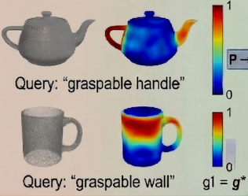

# 可供性与交互区域

> 难度：[中级] | 预计用时：55 分钟
> 先修：[视觉基础模型](../03-vision-foundation-models.md)
> 建议：把这一节理解成“从认知物体到决定动作”的桥梁。

目标：讲清从“看见物体”到“知道哪里能抓、推、拉、按、放”的中间表示，以及这类交互区域如何继续进入 3D 接触建模、抓取位姿生成和控制。

## 先建立直觉

检测、分割和位姿估计已经告诉我们：

- 这是什么物体。
- 它的边界在哪里。
- 它在空间里的姿态是什么。

但这些信息仍然没有直接回答一个操作系统最关心的问题：

**我应该碰它的哪里，沿什么方向接近，才能完成当前动作？**

这正是可供性要解决的问题。

我们可以把 affordance 理解成“物体在当前任务下，对机器人提供了哪些可行动机会”。注意，它不是物体孤立的属性，而是“物体 + 动作 + 场景”共同决定的关系。

## 为什么同一个物体会有多种 affordance

以杯子为例：

| 动作 | 可能的可供区域 |
|---|---|
| 抓起 | 杯身侧壁、把手附近 |
| 倒水 | 杯口和朝向相关 |
| 放到托盘上 | 杯底周围的稳定支撑关系更重要 |
| 推开 | 杯身中下部更适合施力 |

这说明 affordance 不是“这个物体是什么”，而是“对于当前动作，哪里最合适”。

也正因为如此，一份 affordance 结果如果没有 `action_type`，通常是不完整的。因为离开动作类型，所谓“高亮区域”就失去了语义。

## 先把 affordance 和前几层结果区分开

| 层级 | 它回答的问题 |
|---|---|
| detection | 这是什么，粗略在哪 |
| segmentation | 它的像素边界在哪里 |
| pose | 它在 3D 空间中的位置和朝向是什么 |
| affordance | 对当前动作来说，哪里最适合交互 |

很多新手会把 pose 和 affordance 混淆。更准确地说：

- pose 告诉你“物体整体在哪里”。
- affordance 告诉你“该在整体中的哪一块区域、以什么方式交互”。

## 两类最常见的可供性输出

本章把可供性拆成两个层次：

| 输出类型 | 典型形式 | 更适合做什么 |
|---|---|---|
| 2D affordance heatmap | 图像平面中的高亮区域 | 先在图像中圈出候选交互区 |
| 3D contact point / normal / approach | 三维接触点与方向约束 | 真正交给规划器和控制器 |

我们可以把它们理解成：

- heatmap 更像“图像中的候选建议”。
- 3D contact point 更像“可执行的几何指令”。

因此这一组子页面有明确先后关系：

- [Affordance Heatmap](02-affordance-heatmap.md)
- [3D Contact Point](03-contact-point.md)
- [抓取位姿生成](04-grasp-pose-generation.md)

需要特别说明的是：  
本页聚焦“交互区域是什么、怎样表达”；真正的 grasp candidate 构造和筛选留到 [抓取位姿生成](04-grasp-pose-generation.md) 专页展开。

## 为什么机器人不能只停留在 2D heatmap

热力图很有用，但它本质上还是图像平面结果。机器人真正执行动作时至少还需要：

- 对应的 3D 接触点。
- 接触表面的法向。
- 接近方向。
- 可能的预抓取姿态。
- 与桌面、障碍物、夹爪几何的约束关系。

举个例子：  
你知道抽屉把手在图像里哪里“最热”，并不等于你已经知道机械臂要从哪个方向靠近把手、是否会撞到抽屉前板、夹爪是否有足够空间闭合。

所以从 2D 到 3D 的这一步，是 affordance 真正进入机器人执行链的关键。

## 一个最小 affordance contract

```yaml
affordance_candidate:
  object_id: drawer_01
  action_type: pull
  region_ref: runs/04-perception/heatmaps/drawer_handle.png
  contact_point_xyz_m: [0.62, -0.05, 0.31]
  normal_xyz: [0.0, 0.0, 1.0]
  approach_xyz: [-1.0, 0.0, 0.0]
  confidence: 0.76
  failure_code: null
```

这个结构里最重要的其实是三件事：

- 必须写明 `action_type`。
- 最终最好能落到 3D。
- 必须允许“不知道”或“不能执行”的状态。

## Affordance map



左列为物体原始三维点云，右列为对应文本查询的可供性热力图，暖色代表高抓取置信区域。针对茶壶与马克杯，指令graspable handle激活把手抓取可供性，指令graspable wall激活杯身侧壁托举抓取可供性，直观体现了可供性是任务 - 物体耦合的关系属性。

## 为什么这层在机器人里非常关键

如果没有 affordance，中间会出现一个很尴尬的断层：

- 视觉系统已经认出物体了。
- 位姿系统已经恢复整体姿态了。
- 但规划器仍然不知道该接触哪里。

这个断层在很多操作任务中都会暴露出来：

| 任务 | 没有 affordance 时会怎样 |
|---|---|
| 抓杯子 | 可能抓到杯口、抓到碰撞区域或抓到不稳定位置 |
| 拉抽屉 | 可能去推抽屉正面而不是拉把手 |
| 按按钮 | 可能到达面板附近，但对不准按压点 |
| 放置 | 不知道哪里是稳定落点或安全支撑区 |

换句话说，可供性是“物体理解”通往“动作理解”的桥，而不是抓取生成本身。

## 和后面控制与接口章节的关系

后面的章节里还会继续看到：

- 规划器关心的是接触点、接近方向、碰撞约束。
- 抓取模块关心的是怎样从局部接触约束筛出可执行 grasp candidate。
- 控制器关心的是接触后的力学反馈。
- observation contract 关心的是这些结果如何被统一编码。

所以 affordance 虽然看起来像视觉任务，但它天然连接的是后面的执行层。

## 自检问题

- 为什么“知道是什么物体”并不等于“知道该如何对它动作”？
- 为什么 affordance 结果必须带 `action_type`？
- 为什么 2D heatmap 往往还不足以直接交给规划器？

## 练习

### [观察] 为三个日常物体定义 affordance

选择：

- 杯子
- 抽屉
- 按钮面板

分别写出至少一种动作，以及这个动作对应的可供区域和需要的 3D 约束。

读到这里时，我们最好已经能清楚说明同一物体在不同动作下 affordance 为什么不同。

### [复现] 画一张 affordance 数据流图

从 `detection -> mask -> pose -> affordance -> planner` 画出完整链路，并标出每一步的输出类型。

读到这里时，我们最好已经能指出哪一步还是 2D，哪一步已经进入 3D。

## 导航

- 上一节：[不同模型的差异与选型](../03-vision-foundation-models/05-model-selection-and-comparison.md)
- 下一节：[Affordance Heatmap](02-affordance-heatmap.md)
- 返回本章：[感知与三维视觉](../README.md)

