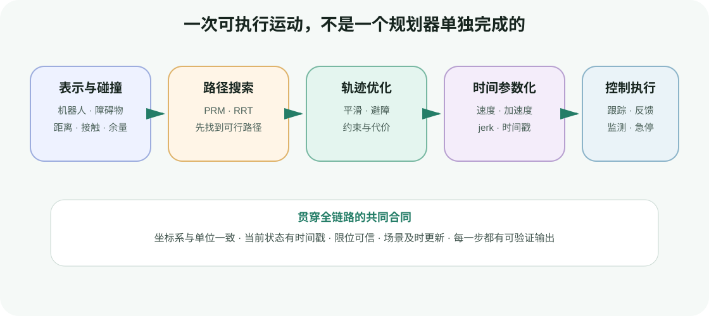

# 运动规划基础

目标：建立一条从“世界里有什么”到“机器人何时到达每个关节位置”的完整心智链路，为后面的 MoveIt 2、cuRobo 与 RMPflow 实战准备共同语言。

运动规划最容易被一句话掩盖：“让机械臂从 A 移动到 B”。真正交给系统后，这句话至少会被拆成四个问题：

1. 哪些机器人姿态是安全的，世界和机器人用什么几何表示？
2. 在高维关节空间中，怎样找到一条从起点到终点的无碰撞路径？
3. 已经找到的路径怎样变得更短、更平滑，并与障碍保持合理余量？
4. 路径上的每个点应该在什么时刻到达，速度、加速度和 jerk 是否满足限制？



<div class="image-caption">本组四节对应一条完整流水线：表示与碰撞提供可行性判断，采样式规划负责探索通路，优化式规划改善路径质量，时间参数化把几何路径变成可执行轨迹。</div>

## 用一个任务贯穿四节

假设 Franka Panda 当前位于桌子左侧，需要把夹爪移动到桌子右侧的杯子上方，中间有一个纸箱。

- 在第一节中，我们把机器人、桌面、纸箱和附着在夹爪上的工具转换成碰撞几何，并判断任意关节状态是否安全。
- 在第二节中，我们不直接在三维画面里绕纸箱，而是在七维关节构型空间中采样、连接和验证，找到一条可行路径。
- 在第三节中，我们把整条离散路径作为优化变量，减少不必要的弯折，并增加与纸箱的安全余量。
- 在第四节中，我们依据每个关节的速度、加速度和 jerk 限制分配时间戳，再把轨迹交给控制器。

这四步不是互相替代的算法流派。工程系统往往把它们组合起来：MoveIt 2 可以用 OMPL 找路、用 CHOMP 或 STOMP 优化、用 TOTG 和 Ruckig 处理时间；cuRobo 将批量碰撞、IK、图搜索和轨迹优化组织在 GPU 流水线中；RMPflow 则更靠近局部反应与逐帧运动策略。

## 学习路径

| 小节 | 首要问题 | 学完后应能验证什么 |
|---|---|---|
| [环境表示与碰撞检测](01-motion-planning-foundations/01-environment-representation-and-collision-detection.md) | “这个状态或这段运动安全吗？” | 能区分 mesh、BVH、OctoMap、TSDF/ESDF 和碰撞球，并解释离散检查为何会漏碰撞 |
| [采样式运动规划](01-motion-planning-foundations/02-sampling-based-planning.md) | “自由空间里是否存在一条通路？” | 能画出 PRM/RRT 的搜索过程，理解概率完备、渐进最优和关键参数 |
| [优化式运动规划](01-motion-planning-foundations/03-optimization-based-planning.md) | “怎样系统地改善整条路径？” | 能写出平滑、避障和目标代价，解释 CHOMP、TrajOpt、STOMP 的差异及局部最小值 |
| [轨迹时间参数化](01-motion-planning-foundations/04-trajectory-time-parameterization.md) | “路径上的点何时到达？” | 能区分 path、trajectory 和 control command，检查时间戳及速度/加速度/jerk 限制 |

## 先固定四个术语

| 术语 | 本组中的含义 | 常见误解 |
|---|---|---|
| 状态 / 构型 `q` | 一组完整关节变量；它确定整台机器人的姿态 | 只看末端位置就能判断碰撞 |
| 路径 `q(s)` | 从起点到终点的几何曲线，只有顺序，没有时间 | waypoint 自带速度和到达时间 |
| 轨迹 `q(t)` | 带时间的状态序列，通常还包含速度和加速度 | 轨迹生成完就一定能被真实机器人精确跟踪 |
| 控制命令 | 控制器在某个周期接收的位置、速度、力矩等目标 | 规划器直接驱动电机 |

<div class="concept-note concept-orange">本组以运动学规划为主。路径无碰撞、速度和加速度不超限，只说明规划结果在模型中可执行；真实机器人仍需要控制跟踪、碰撞监测、速度限制、故障处理与急停。</div>

## 配套最小实验

四节各提供一个二维脚本。二维示例不是为了把七自由度机械臂“降级”为平面机器人，而是为了让一个变量变化时，结果能被直接画出来。

```bash
python labs/04-motion-planning-foundations/collision_distance_field.py
python labs/04-motion-planning-foundations/rrt_2d.py
python labs/04-motion-planning-foundations/trajectory_optimization_2d.py
python labs/04-motion-planning-foundations/time_scaling_demo.py
```

它们只依赖课程环境中的 NumPy、SciPy 和 Matplotlib，不需要 ROS 2、Isaac Sim 或 NVIDIA GPU。先用这些脚本理解变量、输出和失败信号，再进入 4.2 的完整系统，排错范围会小得多。

## 阅读原则

每节都按同一顺序展开：先用具体任务定义输入和输出，再解释数据结构与算法，随后运行一个可观察实验，最后映射到 MoveIt 2、cuRobo 和 RMPflow。阅读时不要只记算法名字，至少保留以下证据：

- 使用的坐标系、单位和机器人关节顺序；
- 障碍物表示、机器人安全余量和碰撞检查分辨率；
- 随机种子、规划时间、成功率、路径长度和最小余量；
- 优化初值、各项代价、迭代次数与终止原因；
- 轨迹的总时长、采样周期、速度/加速度/jerk 峰值与控制器结果。

这些记录比“规划成功”四个字更有复现价值。
