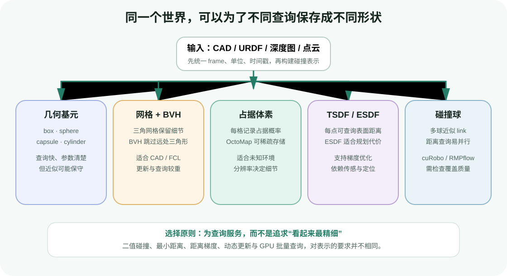
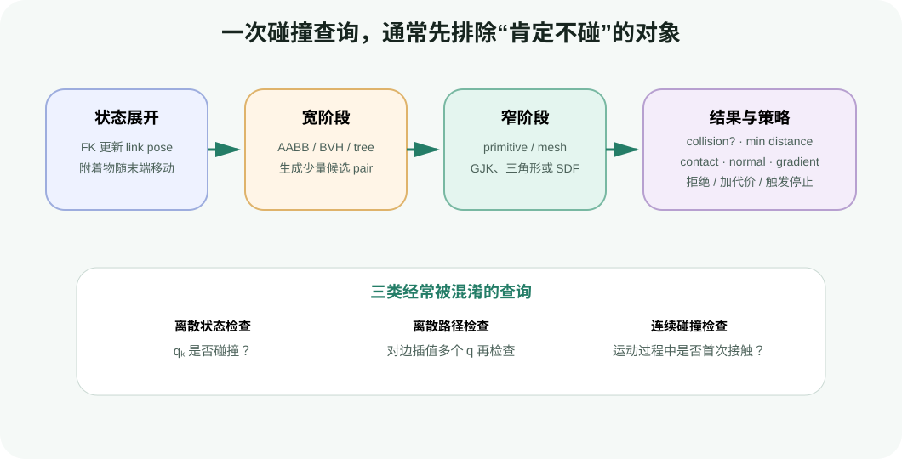
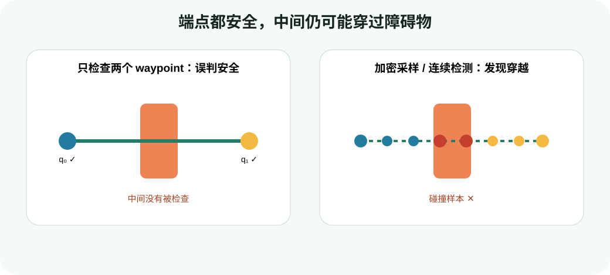

# 环境表示与碰撞检测：把“看得见”变成“能查询”

目标：理解机器人规划器如何表示机器人和环境，能够区分二值碰撞、最小距离与连续碰撞查询，并用一个二维距离场实验检查整条路径的安全余量。

## 先从“夹爪绕过纸箱”开始

假设 Franka 的夹爪要从桌子左侧移动到杯子上方。相机画面里能看到桌子、纸箱和杯子，但规划器不能直接对一张 RGB 图像提问“会不会撞”。它需要一套可计算的合同：

| 输入 | 最少要明确的内容 | 错误时的典型现象 |
|---|---|---|
| 机器人模型 | link、joint、关节顺序、碰撞几何、关节限位 | mesh 与关节运动分离，或所有状态都自碰撞 |
| 当前状态 | 每个关节的位置，必要时还包括速度和时间戳 | 用过期姿态规划，起点检查失败 |
| 世界几何 | 障碍物形状、尺寸、pose、是否动态 | 画面有物体但规划器完全忽略 |
| 坐标关系 | robot base、world、sensor、object frame 之间的变换 | 障碍物整体平移或旋转到错误位置 |
| 物理口径 | 长度/角度单位、padding、安全余量 | 米和毫米混用，场景放大一千倍 |

第一条原则是：**可视几何不等于碰撞几何**。高精度渲染 mesh 适合显示材质和外观，碰撞查询则需要稳定、封闭、更新成本可控的几何表示。二者可以来自同一个 CAD 模型，但通常不应直接共用同一份高面数网格。

## 为什么要在构型空间里判断碰撞

对一个 `n` 自由度机器人，关节状态写成：

$$
\mathbf{q}=[q_1,q_2,\ldots,q_n]^T
$$

正运动学把 `q` 展开成所有 link 的位姿。若其中任意一对不允许接触的机器人 link 相交，或者机器人与环境相交，这个 `q` 就属于碰撞空间 $C_{obs}$；其余状态组成自由空间 $C_{free}$：

$$
C_{free}=C\setminus C_{obs}
$$

这解释了一个重要现象：末端位置看起来离纸箱很远，肘部仍可能撞上纸箱；两个末端位姿相同的 IK 解，也可能一个安全、一个自碰撞。碰撞检查必须基于完整机器人状态，而不是只计算末端点到障碍物的距离。

## 五类常见表示怎样选择



<div class="image-caption">表示没有绝对的“最高级”：几何基元、网格、体素、距离场和碰撞球分别服务于不同查询、更新频率与硬件预算。</div>

### 几何基元：少量参数换来稳定查询

box、sphere、capsule、cylinder 等基元只需少量参数。桌面可以近似成薄 box，机械臂 link 可以近似成 capsule，人的安全区域可以近似成膨胀 sphere。

优点是构建和更新快、碰撞法向和距离容易计算；缺点是复杂物体需要多个基元组合，近似过松会误报碰撞，近似过紧会漏掉真实几何。

### 三角网格与 BVH：保留细节，但不要逐三角形穷举

CAD/URDF 的 mesh 能保留复杂外形。实际查询不会让机器人每个三角形与环境每个三角形两两比较，而是先为网格建立包围体层次结构（Bounding Volume Hierarchy, BVH）。查询从较大的 AABB/OBB 开始；两个包围体不相交时，其内部全部三角形都可跳过。

FCL 支持 mesh、几何基元、OctoMap 等模型，并提供碰撞、距离、容差验证和连续碰撞查询。MoveIt 的 PlanningScene 把这类底层能力封装成机器人自碰撞和机器人—环境碰撞接口。

### 占据栅格与 OctoMap：表达“哪里被观测为占据”

占据地图为每个栅格/体素保存占据概率或占据状态。OctoMap 使用八叉树稀疏组织三维空间，适合从深度传感器不断更新未知环境。

分辨率是核心参数。体素边长从 5 cm 降到 2.5 cm，单轴格数翻倍，完整三维网格的潜在体素数会增至约 8 倍。分辨率越高不代表地图一定越可信：深度噪声、位姿漂移和遮挡仍会造成伪障碍或空洞。

### TSDF 与 ESDF：从表面重建走向距离查询

截断符号距离场（TSDF）在表面附近保存带符号距离，常用于融合深度图并提取表面；欧氏符号距离场（ESDF）则希望每个位置都能查询到最近障碍的欧氏距离，更直接服务于规划和优化。

若 $d(\mathbf{x})$ 表示点 `x` 到障碍表面的带符号距离，可以约定障碍外为正、内部为负。半径为 `r` 的机器人碰撞球在 `x` 处的安全余量是：

$$
c(\mathbf{x})=d(\mathbf{x})-r-d_{safe}
$$

- $c>0$：还有正余量；
- $c=0$：到达设定的安全边界；
- $c<0$：进入安全缓冲区或已经碰撞。

nvblox 可以从深度图、相机内参和传感器位姿构建 TSDF，再更新 ESDF，且提供 GPU 加速与增量更新。这里的关键不是“GPU”三个字，而是下游规划器能高频批量查询距离。

### 碰撞球：把机器人变成大量简单距离查询

cuRobo 与 RMPflow 都广泛使用 collision spheres 近似机器人 link。球与基元、球与距离场的查询结构简单，适合并行计算和梯度优化。

碰撞球需要同时检查两件事：

1. 覆盖不足：球完全藏在 mesh 内，真实凸起可能先发生碰撞；
2. 过度覆盖：球伸出 mesh 太多，狭窄但真实可行的通道会被错误封死。

后面的 cuRobo 与 RMPflow 实战都提供碰撞球可视化。看到“规划失败”时，不要先增加迭代次数，应先检查球是否与真实 link 对齐。

## 一次查询为什么分成宽阶段和窄阶段



<div class="image-caption">宽阶段只负责快速筛出“可能相碰”的对象对；窄阶段才对这些候选做几何精查。需要接触点和法向时，代价通常高于只返回布尔值。</div>

碰撞查询通常按以下顺序执行：

1. 用 FK 根据 `q` 更新所有机器人 link 和附着物的世界位姿；
2. 用 AABB tree、BVH 或空间哈希执行 broad phase，排除相距很远的对象对；
3. 对候选 pair 执行 narrow phase，例如几何基元解析查询、凸体 GJK、穿透深度 EPA、mesh 三角形或 SDF 距离查询；
4. 根据请求返回布尔碰撞、最小距离、接触点、法向、穿透深度或距离梯度；
5. 规划器据此拒绝一个状态、给轨迹增加代价，或触发执行停止。

GJK 常用于凸体的分离/相交与距离问题；当凸体已经重叠并需要穿透信息时，可接 EPA 一类算法。复杂非凸 mesh 通常先被分解、使用 BVH 管理，或直接转成其他近似。初学者不应把“FCL、GJK、EPA、BVH”当成同一层的替代关系：FCL 是查询库，BVH 是层次加速结构，GJK/EPA 是窄阶段算法家族。

## 自碰撞、环境碰撞和附着物是三套语义

### 自碰撞

相邻 link 在关节处常常几何重叠，某些 link pair 因机械结构永远不会相碰。Allowed Collision Matrix（ACM）或 self-collision ignore matrix 可以跳过这些 pair。

<div class="concept-note concept-orange">允许碰撞矩阵是“有证据的例外清单”，不是规划失败时随手关闭检查的开关。错误忽略一个真实可能相撞的 link pair，会制造永久安全盲区。</div>

### 机器人—环境碰撞

环境碰撞通常要使用 padding，把模型误差、标定误差和控制跟踪误差折算为几何膨胀。MoveIt 的完整环境碰撞检查可使用带 padding 的机器人，而自碰撞接口通常使用未膨胀模型；具体语义必须以所用接口为准。

### 附着物

夹爪拿起工具或工件后，它不再是静止环境物体，而应附着到某个 link 并随机器人 FK 更新。常见错误是视觉上把物体“绑”在夹爪上，却仍在 PlanningScene 里保留原位置的世界障碍，导致重复碰撞；或者只删除世界物体，没有添加 attached collision object，规划器以为夹爪是空的。

## 端点安全为什么仍会穿模



<div class="image-caption">只检查相邻 waypoint 的两个端点会漏掉中间碰撞。加密插值能降低风险；连续碰撞检测则直接研究两个姿态之间的运动是否发生首次接触。</div>

路径是连续曲线，但计算机只保存有限 waypoint。若只检查 $q_k$ 和 $q_{k+1}$，机器人在两点之间可能扫过障碍物。这类错误常被称为 tunneling。

常用处理方式有三类：

- 固定构型空间分辨率，对每条边插值并逐状态检查；
- 根据 link 的最大工作空间位移自适应细分，避免某些长 link 在很小关节变化下扫过较大区域；
- 使用 continuous collision detection，查询从起始 transform 到目标 transform 的运动是否碰撞及首次接触时间。

分辨率太粗会漏碰撞，太细会让规划时间被碰撞查询占满。应记录“关节插值步长”或“最长有效边比例”，不能只记录规划器名称。

## 最小实验：占据地图、SDF 与路径余量

课程脚本把机器人简化为半径固定的圆盘，把环境简化为二维栅格。这不是机械臂算法实现，而是用于观察三件事：占据、带符号距离与整条路径最小余量。

### 第一步：运行默认实验

在项目根目录执行：

```bash
python labs/04-motion-planning-foundations/collision_distance_field.py
```

默认会输出：

```text
samples=241
minimum_clearance_m=...
collision=False
saved=...collision_clearance.png
```

输出图左侧是 occupancy 与采样路径，右侧是 SDF。黑色等值线不是障碍表面，而是“障碍表面向外膨胀一个机器人半径”后的中心可行边界。

### 第二步：改变机器人半径

```bash
python labs/04-motion-planning-foundations/collision_distance_field.py \
  --robot-radius 0.16 \
  --output runs/04-planning-foundations/collision_large_robot.png
```

路径点完全不变，但最小余量会下降，甚至变成碰撞。这说明“同一条几何中心线”是否安全取决于机器人的碰撞体积。

### 第三步：改变采样密度

```bash
python labs/04-motion-planning-foundations/collision_distance_field.py \
  --samples-per-segment 8 \
  --output runs/04-planning-foundations/collision_sparse_sampling.png
```

稀疏采样的最小余量可能比密集采样更乐观。调试时至少同时记录：路径段长度、采样间距、机器人半径和最小余量。

### 代码里最值得读的四行

```python
outside = distance_transform_edt(~occupancy) * resolution
inside = distance_transform_edt(occupancy) * resolution
sdf = outside - inside
clearance = sdf[path_row, path_col] - robot_radius
```

`distance_transform_edt` 让每个栅格得到最近边界距离；障碍内外两个距离相减得到带符号距离；再减去机器人半径，才是机器人中心路径的真实余量。

<div class="concept-note concept-blue">二维脚本直接用最近栅格读取 SDF。真实系统还要考虑三线性插值、地图边界、unknown space、动态更新、传感器时间同步和机器人每个 collision sphere 的批量查询。</div>

## 映射到 4.2 的三个工具

| 基础概念 | MoveIt 2 | cuRobo | RMPflow |
|---|---|---|---|
| 机器人几何 | URDF collision mesh/primitive、RobotModel | robot YAML/XRDF、collision spheres | URDF + robot description YAML 中的 spheres |
| 世界表示 | PlanningScene、CollisionObject、OctoMap | `Scene` 中的 cuboid/sphere/mesh 等 | 显式注册的 sphere/capsule/cuboid |
| 查询用途 | 状态有效性、路径检查、接触与距离 | 批量 IK/轨迹优化中的距离与碰撞代价 | 局部 collision RMP 的排斥策略 |
| 动态更新 | PlanningSceneMonitor / scene diff | `update_world()` 与预分配 cache | `add_obstacle()` 后逐帧 `update_world()` |
| 常见盲点 | ACM、附着物、scene 时间戳 | sphere 覆盖、frame、cache 容量 | Stage 中可见但未注册、base pose 未同步 |

尤其要记住：MoveIt PlanningScene、cuRobo Scene 与 Isaac Sim USD Stage 不是自动同步的同一个对象。每个系统都有自己的世界状态，必须明确谁是事实来源、何时转换、何时提交更新。

## 工程排错表

| 现象 | 优先检查 | 不要先做什么 |
|---|---|---|
| 所有姿态都碰撞 | 初始关节顺序、base frame、相邻 link pair、桌面是否穿过 base | 关闭自碰撞 |
| 画面有障碍但结果不变 | 障碍是否进入规划器世界、pose 是否更新、时间戳是否新鲜 | 怀疑随机规划器 |
| 路径 waypoint 都安全但执行穿模 | 边插值分辨率、连续碰撞、控制跟踪误差 | 只增加 waypoint 显示大小 |
| 狭窄通道总失败 | padding、collision sphere protrusion、地图分辨率 | 把安全余量设为零 |
| 碰撞查询突然很慢 | mesh 面数、broad-phase manager、请求是否索要全部接触点 | 先增加规划超时 |
| 拿起物体后规划异常 | world object 与 attached object 是否正确切换 | 只改可视 prim 的 parent |
| 深度地图抖动 | 相机 pose、时间同步、过滤和动态物体处理 | 盲目提高 ESDF 分辨率 |

## 验收清单

进入采样规划之前，至少完成以下检查：

1. 随机采样一批合法关节状态，碰撞率不是 0% 或 100% 的异常极端值；
2. 可视化机器人 collision geometry，与 link mesh 基本重合；
3. 将一个已知障碍物平移 10 cm，最小距离随之改变；
4. 对一条故意穿过障碍的边，密集离散检查能报告碰撞；
5. 添加和移除附着物后，PlanningScene/Scene 中对象数量与语义一致；
6. 日志保存 frame、单位、分辨率、padding、最小余量与查询耗时。

## 小结与自查

环境表示的目标不是复刻一份视觉世界，而是为碰撞、距离和梯度查询提供稳定数据。规划器检查的是完整构型，碰撞查询通常经过 FK、宽阶段、窄阶段和结果汇总；离散 waypoint 安全也不代表中间运动安全。

1. 为什么视觉 mesh 和 collision mesh 不一定应该相同？
2. OctoMap、TSDF 和 ESDF 分别更接近“占据”“表面融合”还是“规划距离”？
3. BVH、FCL 与 GJK 分别处在哪一层？
4. 为什么末端远离障碍时，机械臂仍可能碰撞？
5. 为什么把 padding 降为零不是解决窄通道问题的首选？
6. 一个物体附着到夹爪后，世界对象和附着物应该怎样变化？

## 参考资料

- [MoveIt Planning Scene](https://moveit.picknik.ai/main/doc/examples/planning_scene/planning_scene_tutorial.html)
- [Flexible Collision Library](https://github.com/flexible-collision-library/fcl)
- [nvblox Technical Details](https://nvblox.readthedocs.io/en/public/md_pages_technical.html)
- [nvblox Library Interface](https://nvblox.readthedocs.io/en/public/md_pages_tutorial_library_interface.html)
- [cuRobo Robot Self-Collision](https://nvlabs.github.io/curobo/latest/reference/self_collision.html)
- [Isaac Sim RMPflow](https://docs.isaacsim.omniverse.nvidia.com/4.5.0/manipulators/concepts/rmpflow.html)
