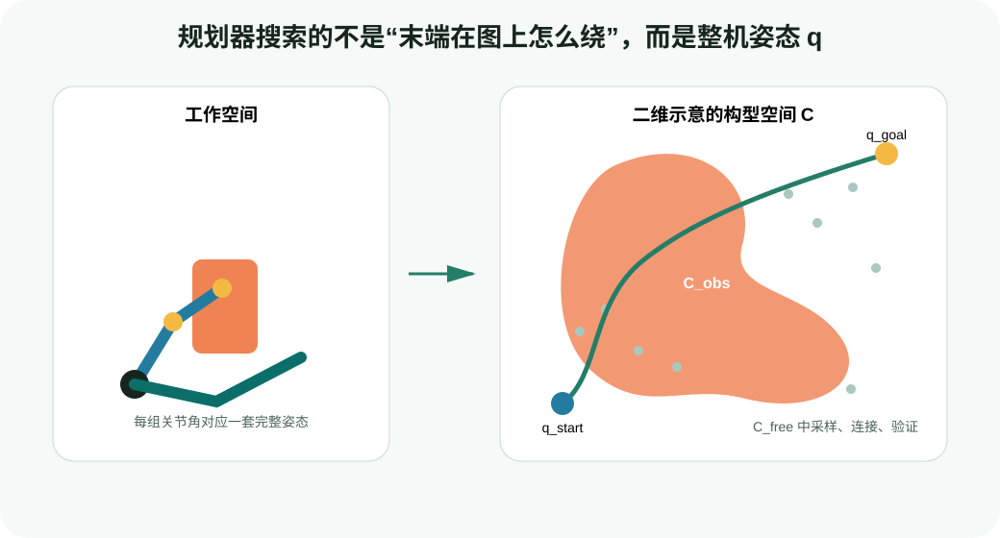
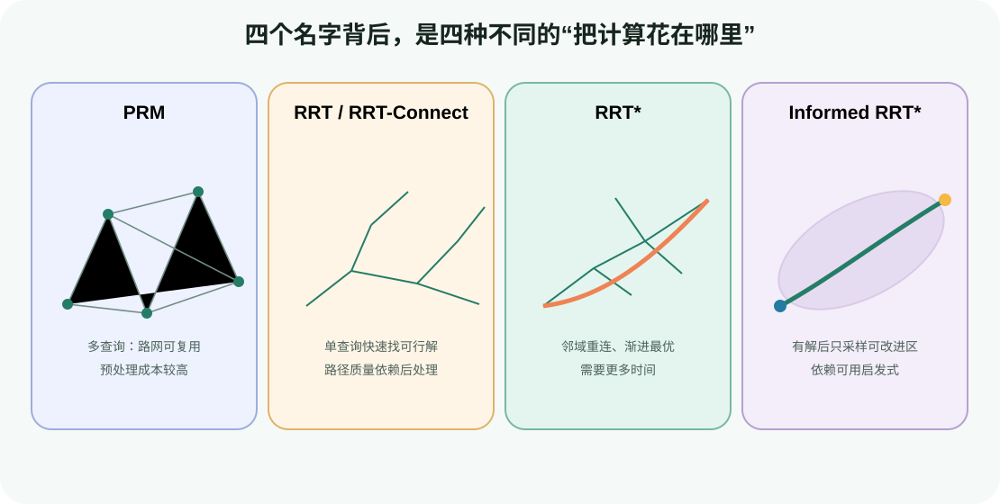

# 采样式运动规划：在高维自由空间中寻找通路

目标：理解采样式规划器如何通过“采样—找近邻—连接—碰撞验证”探索构型空间，能够区分 PRM、RRT、RRT-Connect、RRT* 与 Informed RRT*，并用可复现实验解释参数对成功率和路径质量的影响。

## 为什么不直接在三维画面上画一条线

机械臂末端从杯子左侧移动到右侧时，真正变化的是所有关节组成的构型：

$$
\mathbf{q}=[q_1,q_2,\ldots,q_n]^T
$$

七自由度 Franka 的一个候选状态是七维空间中的一个点。纸箱在工作空间里只是一个三维物体，但所有会让任意 link 撞到纸箱的关节组合，会在七维构型空间中形成一片复杂的 $C_{obs}$。规划任务是：在 $C_{free}$ 中连接 $q_{start}$ 和 $q_{goal}$。



<div class="image-caption">工作空间用于理解机器人和障碍物；规划器通常在构型空间中搜索。每个采样点代表整台机器人的姿态，边是否有效要检查中间所有姿态。</div>

网格搜索在二维地图中很自然，但七维关节空间若每维只离散 20 个值，就有 $20^7=1.28\times10^9$ 个格点。采样式方法不预先铺满整个空间，而是只生成一部分状态，并优先扩展已经探索到的自由区域。

## 一个采样规划器至少需要六个部件

OMPL 本身不理解 URDF、link、桌面或夹爪。它提供状态空间、采样器、近邻结构与多种规划算法；MoveIt 负责把机器人问题适配给 OMPL。无论使用哪个框架，一个几何规划问题都至少需要：

| 部件 | 回答的问题 | 机械臂中的例子 |
|---|---|---|
| state space | 一个状态长什么样、怎样计算距离？ | 7 个关节角及其周期性/限位 |
| sampler | 从哪里产生候选状态？ | 在关节上下限内随机采样 |
| state validity checker | 单个状态是否合法？ | 关节限位、约束、自碰撞、环境碰撞 |
| local planner / motion validator | 两个状态能否直接连接？ | 在关节空间插值并逐点碰撞检查 |
| start / goal | 从哪里出发、什么算到达？ | 当前关节状态与一组 IK 目标解 |
| termination condition | 什么时候停止？ | 找到首个解、超时、代价收敛或外部取消 |

<div class="concept-note concept-orange">状态有效不等于边有效。`q_a` 与 `q_b` 都无碰撞，只能证明两个端点安全；local planner 仍要检查从 `q_a` 到 `q_b` 的插值运动。</div>

## 最小循环：采样、连接、验证

以单树 RRT 为例，核心过程可以写成：

```text
tree ← {q_start}
repeat until timeout:
    q_rand ← sample(), 偶尔直接取 q_goal
    q_near ← nearest(tree, q_rand)
    q_new  ← steer(q_near, q_rand, range)
    if state_valid(q_new) and motion_valid(q_near, q_new):
        tree.add(q_new, parent=q_near)
        if q_new 可以连接 goal:
            return 从 parent 指针回溯得到的路径
return failure
```

这段伪代码里最昂贵的往往不是随机数，而是 `motion_valid` 触发的大量 FK 与碰撞查询。规划器参数必须与上一节的碰撞表示和检查分辨率一起讨论。

## PRM：先铺路网，再回答多次查询

概率路图（Probabilistic Roadmap, PRM）通常分两阶段：

1. roadmap construction：在 $C_{free}$ 中采样节点，把彼此接近且可直连的节点连成图；
2. query：将起点和终点接入路网，再用图搜索寻找通路。

PRM 适合静态场景中的多次查询，例如同一工作站反复执行不同抓放任务。前期构图成本可以被后续请求摊薄。场景改变后，旧边可能失效，需要重新验证、局部修复或重建。

关键参数包括采样数量、每个节点连接的近邻数量/半径和碰撞检查分辨率。连接太少会得到多个孤立分量；连接太多会把时间浪费在大量不可行边检查上。

PRM* 通过随样本数调整连接半径或近邻数，具备渐进最优性质：计算时间趋于无穷时，最优路径代价趋向全局最优值。它不代表有限时间内一定得到最优解。

## RRT 与 RRT-Connect：快速探索单次查询

快速扩展随机树（Rapidly-exploring Random Tree, RRT）从起点生长。随机样本在空间中的 Voronoi 偏置使稀疏、未探索区域更容易被扩展，因此树能快速铺向远处。

`range`/step size 决定一次扩展走多远：

- 太小：树节点很多，近邻与碰撞查询次数上升；
- 太大：每条边更容易穿过障碍，窄通道入口也容易被跨过；
- 自动值：可以作为起点，但必须结合关节量纲、状态空间 extent 和场景复测。

RRT-Connect 从起点与终点各生长一棵树，并尝试把两棵树快速连起来。机械臂点到点规划中，它常用于快速找到首条可行路径。它的优势是“找到通路快”，不是“路径天然最短或最平滑”。MoveIt/OMPL 后续通常还会做 shortcut、路径简化与时间参数化。

## RRT*：用重连换取路径质量

RRT* 在加入 `q_new` 时不只选择最近节点作为 parent，而是在一个邻域中：

1. 选择“到达 `q_new` 的累计代价最低且可直连”的 parent；
2. 检查附近旧节点是否能通过 `q_new` 获得更低代价，若可以则 rewiring。

因此找到第一条路径后，树还能继续降低路径长度或其他优化目标。代价是每次插入要检查更多邻居和边。若 `allowed_planning_time` 很短，RRT* 可能尚未体现渐进最优优势就被终止。

## Informed RRT*：有解以后只关注可能改进的区域

当目标是最短路径且已经有一条长度为 $c_{best}$ 的解时，任何可能更好的状态都位于以起终点为焦点的超椭球子集内。Informed RRT* 在首个解之后从这个子集采样，并可裁剪不可能改善当前解的树枝。



<div class="image-caption">PRM 把计算投入可复用路网；RRT 系列服务单次查询；RRT* 通过邻域重连改善代价；Informed RRT* 在有解后用启发式缩小采样区域。</div>

Informed 策略依赖可计算的启发式和优化目标。它不是“所有采样都围绕目标点”，也不会解决错误碰撞模型、不可达目标或严格路径约束。

## 三个经常混用的理论词

### 概率完备

对满足相应条件的规划问题，如果可行路径存在，随着采样数/时间增长，规划器找到路径的概率趋近 1。它不保证在给定的 2 秒内成功，也不能在超时后证明“无解”。

### 分辨率完备

在某个固定离散分辨率下，如果该离散问题有解，算法能找到。采样式方法通常讨论概率完备，不要把二者混称。

### 渐进最优

随着计算无限增加，返回解的代价趋向全局最优。RRT*、PRM* 与部分 informed/optimal planner 讨论这一性质。RRT-Connect 快速找到可行解，但不是渐进最优规划器。

## 目标不是一个点时怎样处理

机械臂的 goal 往往来自末端 pose。逆运动学可能返回多组关节解：肘部在上、在下，或绕腕部旋转。若只把第一组 IK 解交给规划器，可能恰好选择了被障碍封死的构型。

可用策略包括：

- 生成多个无碰撞 IK goal states，让规划器连接任意一个；
- 对位置/姿态容差定义 goal region，而不是固定单点；
- 将抓取姿态候选的质量与可达性一起排序；
- 对有路径约束的任务使用 constrained state space 或投影方法。

“IK 成功但规划失败”并不矛盾：IK 只证明终点存在，规划还要证明从当前连通分量能到达该终点。

## 最小实验：亲手跑一棵二维 RRT

配套脚本将二维坐标视作两个关节变量，三个圆形区域视作 $C_{obs}$。默认随机种子固定，因此输出可复现。

### 第一步：运行默认配置

```bash
python labs/04-motion-planning-foundations/rrt_2d.py \
  --output runs/04-planning-foundations/rrt_default.png
```

输出包括：

```text
solved_iteration=...
tree_nodes=...
path_waypoints=...
path_length=...
saved=...
```

图中的浅色边是搜索树，深绿色折线是第一条可行路径。注意它通常不平滑，也不一定最短。

### 第二步：改变 step size

```bash
python labs/04-motion-planning-foundations/rrt_2d.py \
  --step-size 0.03 \
  --seed 7 \
  --output runs/04-planning-foundations/rrt_small_step.png
```

再运行：

```bash
python labs/04-motion-planning-foundations/rrt_2d.py \
  --step-size 0.16 \
  --seed 7 \
  --output runs/04-planning-foundations/rrt_large_step.png
```

比较树节点数、找到解的迭代次数和路径长度。不要只看哪张图“更直”：同一参数至少测试多组 seed，统计成功率和分位数。

### 第三步：改变 goal bias

```bash
python labs/04-motion-planning-foundations/rrt_2d.py \
  --goal-bias 0.30 \
  --seed 11 \
  --output runs/04-planning-foundations/rrt_high_goal_bias.png
```

较高 goal bias 会让树更频繁向目标扩展。在开阔空间可能更快，在目标被障碍遮挡时也可能反复撞向同一片障碍。goal bias 不是越大越好；设为 1 会失去随机探索。

### 第四步：读懂边检查

```python
def motion_is_valid(start, goal, resolution, robot_radius):
    distance = np.linalg.norm(goal - start)
    count = max(2, int(np.ceil(distance / resolution)) + 1)
    for alpha in np.linspace(0.0, 1.0, count):
        q = (1.0 - alpha) * start + alpha * goal
        if not state_is_valid(q, robot_radius):
            return False
    return True
```

这段 local planner 沿直线插值。真实机械臂的“直线”通常指关节空间插值，不是末端在笛卡尔空间走直线；两个概念必须分开。

<div class="concept-note concept-blue">教学脚本的欧氏距离适合二维同量纲状态。真实复合状态空间可能同时含转动、平移或不同关节范围，需要框架定义合理的 distance、interpolate 和 bounds。</div>

## 在 MoveIt 2 中对应哪些配置

MoveIt 的 OMPL 配置常见形式如下：

```yaml
planner_configs:
  RRTConnectkConfigDefault:
    type: geometric::RRTConnect
    range: 0.0       # 0 通常表示让 OMPL 选择默认值

  RRTstarkConfigDefault:
    type: geometric::RRTstar
    range: 0.0
    goal_bias: 0.05
    delay_collision_checking: 1

panda_arm:
  planner_configs:
    - RRTConnectkConfigDefault
    - RRTstarkConfigDefault
```

请求侧还应记录：

```python
plan_request_parameters.planning_pipeline = "ompl"
plan_request_parameters.planner_id = "RRTConnectkConfigDefault"
plan_request_parameters.planning_time = 2.0
plan_request_parameters.planning_attempts = 5
```

配置名受具体 MoveIt config package 影响，不能只复制 YAML 后假设插件已经加载。运行时应检查实际 pipeline、planner id、allowed planning time 和返回错误码。

## 如何公平比较规划器

至少固定以下条件：同一机器人模型、同一 PlanningScene、同一起点/目标集合、同一碰撞分辨率、同一机器与线程设置。对随机规划器使用多组 seed，记录：

| 指标 | 为什么重要 |
|---|---|
| success rate | 一次成功不能代表鲁棒性 |
| planning time 的中位数与 P90/P95 | 平均值容易被极慢样本影响 |
| 首解时间 | 衡量快速找到通路的能力 |
| 最终路径长度 | 衡量在剩余时间内改善了多少 |
| 最小碰撞余量 | 短路径可能贴障碍太近 |
| waypoint 数与平滑性 | 影响后处理和控制执行 |
| collision check 次数 | 帮助定位真正瓶颈 |

同一随机种子在不同算法中不意味着采样序列完全可比；seed 的作用是复现某次运行，不是保证公平的唯一条件。

## 窄通道为什么困难

自由空间体积很大，而通道入口在构型空间中可能占比极小。均匀采样很少落到入口，长扩展又容易撞墙。可尝试：

- 缩小 `range`，但接受更多节点与查询；
- 增加规划时间和 attempts；
- 使用 bridge test、Gaussian sampling 等窄通道采样策略；
- 提供中间 waypoint 或更好的 goal states；
- 使用多 pipeline 并行或采样 + 优化组合；
- 首先检查碰撞 padding 是否把真实通道完全封死。

不要把一个被碰撞模型封死的问题归因于“RRT 不够聪明”。先验证通道在 $C_{free}$ 中确实存在。

## 从采样路径到后续 4.2

| 4.1 概念 | 4.2 中的落点 |
|---|---|
| state validity / motion validity | MoveIt PlanningScene 为 OMPL 提供机器人状态与边的有效性检查 |
| 多 IK goals | MoveIt goal constraints、cuRobo 并行 IK seeds/goal set |
| 单树/双树图搜索 | OMPL RRT/RRT-Connect；cuRobo 在直接优化困难时使用图规划 seed |
| 局部反应不是全局搜索 | RMPflow 遇到 U 形障碍可能停在局部平衡，需要全局 waypoint/重规划 |
| path simplification | OMPL shortcut/hybridization 后还需碰撞复验与时间参数化 |

## 常见失败与排错

| 现象 | 可能原因 | 优先动作 |
|---|---|---|
| `START_STATE_IN_COLLISION` | 当前状态、附着物或 scene 错误 | 单独检查起点，不要调 planner 参数 |
| `GOAL_IN_COLLISION` | IK 解碰撞或容差太小 | 可视化所有 goal states，增加合理候选 |
| 经常超时、偶尔成功 | 窄通道、range 不合适、碰撞查询慢 | 统计 seed，分析碰撞检查占比 |
| 很快成功但路径绕远 | 使用首解型规划器、后处理不足 | 增加简化/优化阶段，而非只换 seed |
| 相同配置结果变化大 | 随机性、线程、scene 更新 | 固定 seed/快照，记录完整请求 |
| 规划器返回路径但插值碰撞 | 检查分辨率过粗或后处理改变路径 | 加密验证，执行前再次校验 |
| RRT* 与 RRT-Connect 看起来一样 | 规划时间太短、优化目标/终止条件不匹配 | 记录首解和最终解的代价曲线 |

## 小结与自查

采样式规划把高维连续空间压缩成有限的树或图。算法能否成功，不只取决于 RRT/PRM 名字，还取决于状态空间、目标集合、距离函数、碰撞表示、边验证分辨率与终止条件。

1. 为什么机械臂规划通常在关节构型空间中进行？
2. `state_is_valid(q_a)` 与 `state_is_valid(q_b)` 都为真，为什么仍要检查边？
3. PRM 与 RRT-Connect 分别更适合哪类查询？
4. 概率完备为什么不能在超时后证明问题无解？
5. RRT* 的 rewiring 在优化什么，代价是什么？
6. goal bias 为什么不能简单设成 1？
7. IK 成功、规划失败可能意味着什么？

## 参考资料

- [OMPL Primer](https://ompl.kavrakilab.org/OMPL_Primer.pdf)
- [OMPL InformedRRTstar](https://ompl.kavrakilab.org/classompl_1_1geometric_1_1InformedRRTstar.html)
- [MoveIt OMPL Planner](https://moveit.picknik.ai/main/doc/examples/ompl_interface/ompl_interface_tutorial.html)
- [MoveIt Motion Planning Pipeline](https://moveit.picknik.ai/main/doc/examples/motion_planning_pipeline/motion_planning_pipeline_tutorial.html)
- [PythonRobotics Sampling-based Planning](https://github.com/AtsushiSakai/PythonRobotics/tree/master/PathPlanning)
