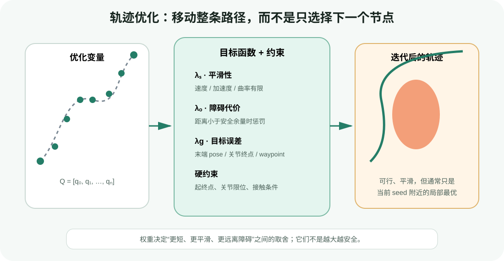
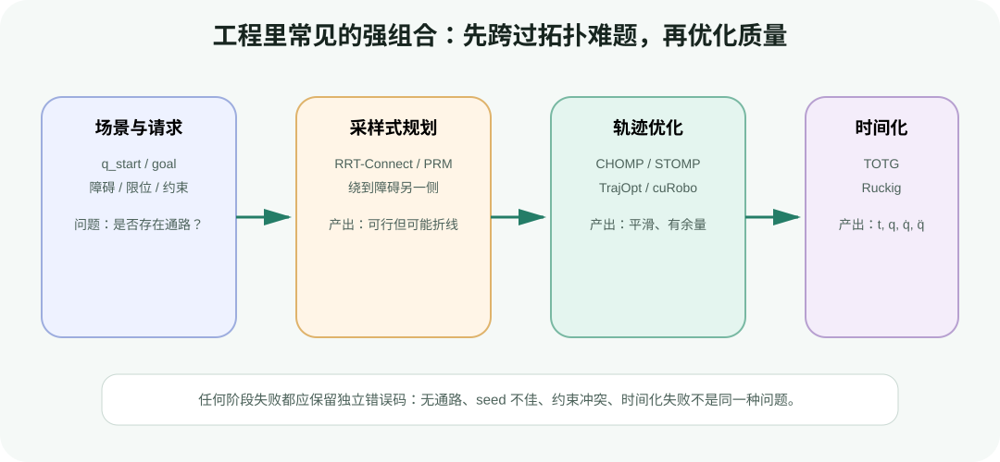

# 优化式运动规划：把整条路径写成代价与约束

目标：理解轨迹优化的变量、代价、约束、初值和终止条件，能够比较 CHOMP、TrajOpt、STOMP 的核心思路，并通过二维实验观察平滑性与避障余量如何竞争。

## 从“能绕过去”到“怎样绕得更好”

上一节的 RRT 可能很快找到一条无碰撞折线。它证明自由空间中存在通路，但没有自动回答：

- 能否减少不必要的关节摆动？
- 能否与障碍保持更大余量？
- 能否保持夹持杯子的姿态或让焊枪沿曲面运动？
- 能否让多个关节协调，减少速度/加速度变化？
- 能否在给定中间 waypoint、接触或任务约束下找到更好的解？

优化式规划的基本思想是：把整条离散路径当作变量，把“平滑、避障、到达目标、满足限位”写成数学目标，再迭代更新所有中间点。



<div class="image-caption">轨迹优化不是沿路径顺序检查一次，而是根据各项代价和约束反复移动内部 waypoint。最终解通常是当前初值附近的局部最优。</div>

## 优化变量究竟是什么

最常见的运动学轨迹离散形式是：

$$
\mathbf{Q}=[\mathbf{q}_0,\mathbf{q}_1,\ldots,\mathbf{q}_{N-1}]\in\mathbb{R}^{N\times d}
$$

- `d`：机器人规划自由度；
- `N`：knot/waypoint 数；
- $\mathbf{q}_0$ 与 $\mathbf{q}_{N-1}$：通常固定为起点和终点；
- 中间 $N-2$ 个状态：优化器要移动的变量。

有些方法还把每段持续时间、速度、加速度、接触力或控制量放进变量。本文先讨论最容易与 MoveIt、cuRobo 对齐的关节路径优化。

`N` 决定表达能力和计算量：

- 太少：轨迹无法绕出细致形状，两个 knot 之间还可能穿过障碍；
- 太多：变量和碰撞查询增多，优化变慢，也更容易出现锯齿或病态缩放；
- 只增加插值点：不等于增加独立优化变量，应确认 planner 的 horizon 与输出 resampling 各是什么。

## 一条教学用目标函数

可以先写成加权和：

$$
J(\mathbf{Q})=
\lambda_s J_{smooth}+
\lambda_o J_{obstacle}+
\lambda_g J_{goal}+
\lambda_r J_{regularization}
$$

权重 $\lambda$ 决定目标间的相对尺度。它们不是“越大越好”的安全旋钮。

### 平滑性：惩罚一阶、二阶或更高差分

一阶差分近似路径速度：

$$
\Delta \mathbf{q}_k=\mathbf{q}_{k+1}-\mathbf{q}_k
$$

二阶差分近似曲率/加速度形状：

$$
\Delta^2 \mathbf{q}_k=\mathbf{q}_{k-1}-2\mathbf{q}_k+\mathbf{q}_{k+1}
$$

一个常见平滑代价是：

$$
J_{smooth}=\sum_{k=1}^{N-2}\|\Delta^2\mathbf{q}_k\|^2
$$

它会压低折线的尖角，但不直接保证真实时间域速度和加速度满足限位；时间参数化仍在下一节完成。

### 避障：将距离变成可优化代价

设机器人某个 collision point/sphere 到障碍的安全余量为 $c_k$，希望至少大于 `margin`。可使用 hinge loss：

$$
\phi(c_k)=\max(0, d_{safe}-c_k)^2
$$

$$
J_{obstacle}=\sum_k\phi(c_k)
$$

距离足够大时不惩罚；进入安全区后，越接近或穿入障碍，惩罚越大。若距离场可微，$\nabla d(\mathbf{x})$ 给出远离障碍的工作空间方向，再经机器人 Jacobian 转回关节空间梯度。

### 目标与任务约束

终点可以是关节目标，也可以是末端 pose：

$$
J_{goal}=w_p\|\mathbf{p}(\mathbf{q}_{N-1})-\mathbf{p}^*\|^2 + w_R\,d_R(R(\mathbf{q}_{N-1}),R^*)^2
$$

焊接、倒水或搬运开口容器时，姿态约束可能作用于整条路径，而不只是终点。位置误差的单位是米，关节误差是弧度，旋转误差的表示又不同；直接相加前必须进行尺度设计。

### 正则项与参考轨迹

为了避免解偏离已有安全路径太远，可增加：

$$
J_{reference}=\sum_k\|\mathbf{q}_k-\mathbf{q}^{ref}_k\|^2
$$

它能稳定局部优化，也可能让优化器不愿绕到另一条更好的拓扑通路。参考权重应随任务而定。

## 代价和约束不是同一件事

| 表达 | 含义 | 失败语义 |
|---|---|---|
| soft cost | 允许违反，但要付出代价 | 求解可能成功，结果仍有少量误差 |
| hard equality | 必须满足 $h(Q)=0$ | 不可行时求解失败或残差超限 |
| hard inequality | 必须满足 $g(Q)\le 0$ | 需要可行性检查与约束处理 |
| penalty / barrier | 用快速增大的代价近似硬约束 | 权重有限时不保证绝对满足 |

碰撞在某些系统里作为硬约束，在另一些系统里作为代价并在输出端再次做严格碰撞验证。无论内部怎么求，执行前都应把结果交给独立 validity checker 复验。

<div class="concept-note concept-orange">“碰撞代价很大”不等于“结果必然无碰撞”。若优化器因为迭代上限、局部最小值或数值问题提前停止，必须检查最终约束残差、整段连续碰撞和返回状态。</div>

## 初值为什么决定结果走哪一边

障碍物让运动规划问题成为非凸问题。纸箱左边和右边可能是两类拓扑不同的通路；从一条直线初值出发的局部梯度，只能告诉优化器“附近怎样下降”，不一定能把整条轨迹推到障碍另一侧。

常见初值包括：

- 起终点关节空间直线插值：便宜，但可能深度穿障碍；
- 当前执行轨迹的剩余段：适合滚动重规划；
- 上一次相似任务的缓存轨迹：快，但要先验证当前场景；
- OMPL/RRT 产生的可行路径：能提供正确拓扑，再由优化器平滑；
- 多组随机/结构化 seeds：提高覆盖率，但增加计算和显存。

优化失败时先保存初值图。只保存最终失败状态，会丢掉判断“初值穿过哪里、卡在哪个局部极值”的关键证据。

## CHOMP：沿协变梯度移动整条轨迹

CHOMP（Covariant Hamiltonian Optimization for Motion Planning）用函数梯度同时处理平滑与障碍代价，并在轨迹空间的度量下做协变更新。直观上，普通逐点梯度容易让局部 waypoint 抖动；轨迹度量会把更新沿路径传播，使整条曲线更协调地离开障碍。

CHOMP 能从不可行直线初值开始，把轨迹拉出障碍并变平滑；但它仍是局部优化方法，坏初值可能卡在局部最小值。MoveIt 官方教程也建议在困难场景中用 OMPL 先产生无碰撞 seed，再交给 CHOMP 改善。

理解 CHOMP 时抓住三点即可：

1. 需要可用的障碍距离/梯度信息；
2. 平滑项不仅是显示后处理，而是优化目标的一部分；
3. learning rate、smoothness 权重、obstacle 权重和 ridge factor 共同影响收敛。

## TrajOpt：反复凸化非凸问题

TrajOpt 将轨迹规划写成带代价与约束的优化问题，采用 sequential convex optimization / SQP 风格方法：

1. 在当前轨迹附近线性化或凸近似非凸项；
2. 在 trust region 内求一个凸子问题；
3. 比较新旧解，接受、拒绝或调整 trust region；
4. 重复直到收敛或触发终止条件。

TrajOpt 适合表达关节目标、末端 pose、笛卡尔 waypoint、碰撞与平滑等组合。Tesseract TrajOpt 使用凸优化器求内部子问题，并区分 cost term 与 constraint term。

它的优势是约束表达清晰；风险仍是非凸性和初值依赖。线性化只在局部可信，trust region 太大可能让近似失真，太小则收敛缓慢。

## STOMP：用噪声 rollout 比较代价，不依赖解析梯度

STOMP（Stochastic Trajectory Optimization for Motion Planning）从参考轨迹产生一批带相关噪声的 rollout，对每条候选计算代价，再用较低代价候选加权更新参考轨迹。

简化过程是：

```text
Q_ref ← initial trajectory
repeat:
    Q_i ← Q_ref + smooth_noise_i       # 多条 rollout
    cost_i ← evaluate(Q_i)             # 碰撞、平滑、任务代价
    weights ← softmin(cost_i)
    Q_ref ← Q_ref + Σ weights_i * noise_i
until valid and converged / timeout
```

STOMP 不要求每项代价都有解析梯度，因此能加入扭矩、能耗、工具约束等难以求导的评价。代价是每轮需要评估多条 rollout；`num_rollouts × num_timesteps` 会直接放大 FK 与碰撞查询量。

随机性可以帮助跳出部分局部最小值，但不保证全局最优。应固定并记录 seed、rollout 数、迭代数、代价灵敏度与最终有效性。

## 三类方法放在一张表里

| 方法 | 更新信息 | 强项 | 主要风险 | 常见工程角色 |
|---|---|---|---|---|
| CHOMP | 障碍/平滑函数梯度 + 轨迹度量 | 平滑更新、能从部分碰撞初值恢复 | 局部最小值、梯度和权重敏感 | 独立规划或 OMPL 后优化 |
| TrajOpt | 局部线性/凸近似、trust region、QP/SQP | 代价与约束表达清楚 | 初值与凸化区域敏感 | 工业路径、笛卡尔与碰撞约束 |
| STOMP | 随机 rollout 的代价 | 不需要解析梯度，可容纳黑盒代价 | 评估量大、结果有随机性 | 平滑与多目标代价优化 |
| cuRobo 优化流水线 | GPU 批量 rollout、梯度与多 seed | 批量 IK/碰撞/轨迹优化吞吐高 | 版本/API、显存、碰撞球与 seed | GPU 运动生成 |
| RMPflow | 当前状态下的局部加速度策略 | 动态目标和障碍的逐帧反应 | 局部平衡，不生成全局离线轨迹 | 局部运动策略/控制参考 |

RMPflow 虽然也在组合目标、避障、限位和平滑倾向，但它输出当前状态下的局部策略，不应与“优化整段离散轨迹 Q”的 CHOMP/STOMP/TrajOpt 混称。

## 最小实验：平滑项与障碍项怎样拉扯

配套脚本使用两个圆形障碍，把 70 个二维 waypoint 作为变量。它实现透明的梯度下降，不是 CHOMP 或 TrajOpt 的完整复刻。

### 第一步：运行默认实验

```bash
python labs/04-motion-planning-foundations/trajectory_optimization_2d.py \
  --output runs/04-planning-foundations/trajectory_optimization.png
```

日志会在第 0 次、中间和最后一次迭代输出：

```text
iteration=0000 total_cost=... clearance=...
iteration=0450 total_cost=... clearance=...
iteration=0899 total_cost=... clearance=...
minimum_clearance=...
```

图中虚线是初值，绿色是优化结果，障碍外的浅色环表示安全 margin。

### 第二步：只强调平滑

```bash
python labs/04-motion-planning-foundations/trajectory_optimization_2d.py \
  --obstacle-weight 2 \
  --smoothness-weight 4 \
  --output runs/04-planning-foundations/optimization_too_smooth.png
```

路径可能更接近直线，却无法获得足够余量。代价下降不等于碰撞约束满足。

### 第三步：只强调避障

```bash
python labs/04-motion-planning-foundations/trajectory_optimization_2d.py \
  --obstacle-weight 80 \
  --smoothness-weight 0.1 \
  --output runs/04-planning-foundations/optimization_obstacle_heavy.png
```

路径会强烈离开障碍，但 waypoint 可能形成不必要弯折。权重增加还会改变梯度尺度；若 step size 不变，可能振荡或数值发散。

### 第四步：读懂两类梯度

```python
smooth_cost, smooth_gradient = smoothness_cost_and_gradient(path)
obstacle_cost, obstacle_gradient = obstacle_cost_and_gradient(path, margin)

gradient = (
    smoothness_weight * smooth_gradient
    + obstacle_weight * obstacle_gradient
)

gradient[0] = 0.0
gradient[-1] = 0.0
path[1:-1] -= step_size * gradient[1:-1]
```

起终点梯度被置零，所以优化器只能移动内部点。真实求解器还会处理 joint bounds、线搜索/trust region、碰撞梯度经过 Jacobian 的变换和收敛判据。

<div class="concept-note concept-blue">脚本只在 knot 上计算障碍代价。生产系统必须检查 knot 之间的 sweep/插值，否则相邻点都安全时，中间仍可能穿过细障碍。</div>

## 权重调整要先做量纲检查

假设平滑项数量级为 `1e-3`，碰撞项为 `10`。即使两个权重都设为 1，碰撞项也会完全主导。推荐流程：

1. 在初始轨迹上分别打印每项 raw cost 和 gradient norm；
2. 检查米、毫米、弧度是否混用；
3. 先让每项的尺度处在可比较范围，再调任务偏好；
4. 每次只改一个参数，保存代价曲线、最小余量与路径图；
5. 对多组起终点和场景验证，不要只针对一个 demo 过拟合。

可记录：

```text
iteration, total_cost, smooth_cost, obstacle_cost,
goal_error, min_clearance, max_joint_step, gradient_norm,
constraint_violation, accepted_step, solve_time_ms
```

如果总 cost 下降但 min clearance 仍为负，说明“优化在工作”与“轨迹可执行”是两件事。

## 采样 + 优化为什么常比单独使用更稳



<div class="image-caption">采样式规划解决“从障碍哪一侧绕”的拓扑探索，优化式规划改善连续路径质量，再由时间参数化加入运动学限制。</div>

一个常见流水线是：

1. RRT-Connect/PRM 快速找到无碰撞通路；
2. shortcut 和 resampling 去掉明显冗余；
3. CHOMP/STOMP/TrajOpt/curobo 优化平滑与安全余量；
4. 对整条结果重新碰撞检查；
5. TOTG/Ruckig 添加时间信息；
6. 执行前用最新 PlanningScene 再验证。

采样路径与优化器的 waypoint 数可能不同，resampling 时要防止把原本绕过障碍的折线“切角”进障碍。

## 与 4.2 工具的对应关系

### MoveIt 2

MoveIt 将 CHOMP、STOMP、TrajOpt 等作为不同 planning pipeline/plugin 使用，也可以让 OMPL 先产生 seed 再做后处理。配置时要确认 pipeline 真正被加载，而不只是 RViz 下拉框显示了一个名字。

### cuRobo

cuRobo 把多个 seeds、trajectory horizon、机器人碰撞球和场景距离查询组织为 GPU 批量优化。显存开销大致随 batch、seed 和 horizon 共同增加。失败时应区分目标 IK 不可行、图搜索没找到 seed、优化未收敛和最终插值轨迹无效。

### RMPflow

RMPflow 的 target、collision、joint limit 与 damping RMP 会在每帧组合。它适合局部反应；若目标在 U 形障碍另一侧，局部目标吸引与避障排斥可能形成平衡，应由全局规划器提供 waypoint 或触发重规划，而不是无限增加局部 gain。

## 常见失败与排错

| 现象 | 可能原因 | 优先动作 |
|---|---|---|
| cost 下降但仍碰撞 | 碰撞是软代价、权重/尺度不足、只查 knot | 独立连续碰撞复验，打印 min clearance |
| 轨迹在障碍前不动 | 直线 seed 深度穿障碍、局部最小值 | 换可行 seed 或多 seed，不只增迭代 |
| 路径剧烈抖动 | smoothness 太弱、step 太大、梯度噪声 | 看各项 gradient norm，减步长/加正则 |
| 路径远离所有障碍 | padding/margin 太大或 obstacle 权重压倒其他项 | 可视化膨胀几何，核对单位 |
| 终点姿态漂移 | goal 是 soft cost、旋转误差/权重不当 | 改硬约束或检查最终残差 |
| 数值出现 NaN | 零距离梯度、非法 quaternion、尺度过大 | 输入验证、epsilon、有限值检查 |
| 优化轨迹安全但 resample 后碰撞 | 插值切角、输出分辨率不足 | 对最终表示重新做边检查 |
| 每次结果差异大 | STOMP seed/rollout、并行非确定性 | 固定 seed，统计分布而非单次结果 |

## 小结与自查

优化式规划把整条路径作为变量，用代价表达偏好、用约束表达必须满足的条件。CHOMP 依赖轨迹空间梯度，TrajOpt 反复求局部凸近似，STOMP 用随机 rollout 比较黑盒代价。三者都不能绕开非凸性、初值和最终有效性检查。

1. 为什么 waypoint 数太少和太多都会带来问题？
2. 平滑代价小是否能证明速度和加速度满足硬件限制？
3. 碰撞作为 soft cost 时，为什么必须独立复验？
4. CHOMP、TrajOpt、STOMP 分别依赖什么更新信息？
5. 为什么 OMPL seed 能帮助局部优化器跨越拓扑困难？
6. total cost 下降但结果更危险，可能是什么原因？
7. RMPflow 为什么不等于离线轨迹优化器？

## 参考资料

- [CHOMP: Covariant Hamiltonian Optimization for Motion Planning](https://publications.ri.cmu.edu/chomp-covariant-hamiltonian-optimization-for-motion-planning)
- [MoveIt CHOMP Planner](https://moveit.picknik.ai/main/doc/how_to_guides/chomp_planner/chomp_planner_tutorial.html)
- [MoveIt STOMP Motion Planner](https://moveit.picknik.ai/main/doc/how_to_guides/stomp_planner/stomp_planner.html)
- [Tesseract TrajOpt](https://github.com/tesseract-robotics/trajopt)
- [MoveIt TrajOpt Planner](https://moveit.picknik.ai/main/doc/examples/trajopt_planner/trajopt_planner_tutorial.html)
- [Isaac Sim RMPflow](https://docs.isaacsim.omniverse.nvidia.com/4.5.0/manipulators/concepts/rmpflow.html)
