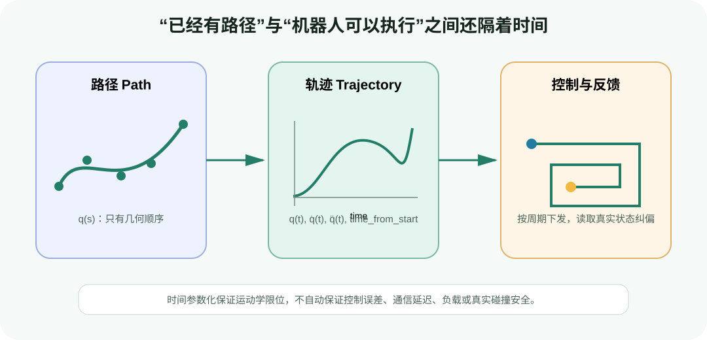
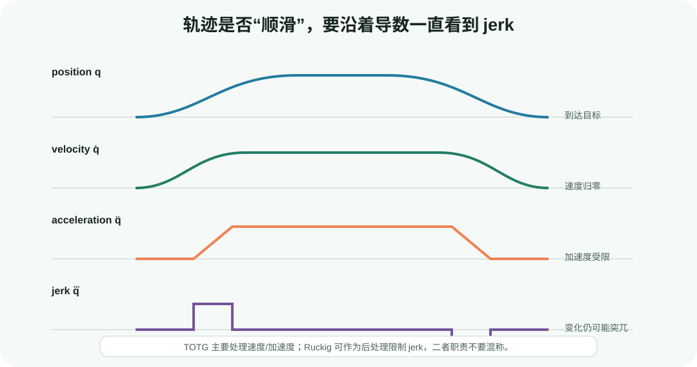

# 轨迹时间参数化：从几何路径到可执行关节轨迹

目标：区分路径、时间轨迹和控制命令，理解速度、加速度与 jerk 限制怎样决定轨迹时长，能够运行多关节同步实验，并正确解释 MoveIt TOTG、Ruckig 与 JointTrajectoryController 的职责边界。

## 为什么“路径已经规划好”还不能发送给机器人

采样或优化规划器可能输出：

```text
q0 → q1 → q2 → ... → qN
```

它只说明关节状态应按这个顺序经过。控制器还不知道：

- `q1` 应在 0.1 秒还是 2 秒后到达？
- 相邻点之间的速度是否超过电机/减速器限制？
- 速度变化是否让加速度过大？
- 加速度是否突然跳变，产生过大的 jerk 和机械冲击？
- 多个关节是否同时到达，还是某个关节提前停止等待？



<div class="image-caption">Path 只有几何顺序；Trajectory 加入时间、速度与加速度；控制器再按固定周期消费目标并利用真实状态反馈跟踪。</div>

因此，时间参数化不是“给每个点平均分配时间”这么简单。它要在尽量快的同时满足每个关节的运动学限制，并为后续控制提供单调、连续、可采样的参考。

## 用路径参数把几何与时间分开

设几何路径写成 $\mathbf{q}(s)$，其中 $s$ 是从 0 到 1 的路径进度；时间规律写成 $s(t)$。组合后：

$$
\mathbf{q}(t)=\mathbf{q}(s(t))
$$

根据链式法则：

$$
\dot{\mathbf{q}}=\frac{d\mathbf{q}}{ds}\dot{s}
$$

$$
\ddot{\mathbf{q}}=\frac{d^2\mathbf{q}}{ds^2}\dot{s}^{2}+\frac{d\mathbf{q}}{ds}\ddot{s}
$$

时间参数化可以理解为：几何路径 $\mathbf{q}(s)$ 已经固定，在沿路径前进时选择安全的 $\dot{s}$ 与 $\ddot{s}$。路径弯曲大、某个关节变化快或限位紧的区域，需要降低路径速度。

严格的“只做时间参数化”不会改变几何路径；但某些工程算法会拟合路径段并重新采样，允许 waypoint 在容差内移动。使用这类算法后必须重新碰撞检查。

## 四个导数分别意味着什么



<div class="image-caption">位置连续不代表运动平顺。速度是位置斜率，加速度是速度斜率，jerk 是加速度斜率；高阶导数的突变会逐步传到机械冲击与跟踪误差。</div>

| 量 | 物理意义 | 超限/不连续的常见后果 |
|---|---|---|
| position `q` | 关节目标位置 | 撞限位、IK/轨迹不可执行 |
| velocity `q̇` | 运动快慢和方向 | 电机饱和、跟踪滞后 |
| acceleration `q̈` | 速度变化率 | 力矩需求上升、负载晃动 |
| jerk `q⃛` | 加速度变化率 | 冲击、振动、机械噪声、控制误差尖峰 |

运动学限位不等于动力学保证。即使 `q̇`、`q̈`、`q⃛` 都满足配置，重载时所需力矩仍可能超过硬件能力。对动力学敏感任务还要进行 torque/effort、接触与稳定性检查。

## 限位从哪里来

真实工程中常见三层：

1. URDF 给出关节位置和速度等基础限制；
2. MoveIt `joint_limits.yaml` 可以启用并收紧速度、加速度和 jerk 限制；
3. 单次请求再使用 `max_velocity_scaling_factor` 与 `max_acceleration_scaling_factor` 做 0～1 范围的缩放。

配置示意：

```yaml
joint_limits:
  panda_joint1:
    has_velocity_limits: true
    max_velocity: 1.6
    has_acceleration_limits: true
    max_acceleration: 2.5
    has_jerk_limits: true
    max_jerk: 12.0
```

这些数字只是格式示例，不是 Franka 真机推荐值。正式配置应来自机器人厂商手册、驱动限制和本机安全策略，并取更保守的一侧。

常见错误包括：

- 把 degree/s 填进以 rad/s 为口径的字段；
- `max_acceleration` 有值，但 `has_acceleration_limits` 仍为 false；
- YAML 中把上限放大到高于 URDF/硬件允许值；
- 缩放因子填 20，误以为表示 20%，实际合法范围是 0～1；
- 只为部分关节配置 jerk，其他关节依赖默认值却没有记录。

## 单关节：三角形与梯形速度轮廓

对静止起步、静止结束的一维位移 $\Delta q$，若距离足够长，常见的梯形速度轮廓包括：加速、匀速、减速。若位移太短，尚未达到最大速度就必须减速，轮廓退化为三角形。

对称加减速、最大加速度 $a_{max}$ 下，达到最大速度 $v_{max}$ 所需时间：

$$
t_a=\frac{v_{max}}{a_{max}}
$$

加速和减速合计位移：

$$
\Delta q_{acc+dec}=\frac{v_{max}^{2}}{a_{max}}
$$

若 $|\Delta q|<v_{max}^{2}/a_{max}$，就没有匀速段。这个简单判断说明：不能给每个 waypoint 固定相同时间后再“截断速度”，因为速度和加速度约束共同决定阶段时长。

梯形速度的加速度在阶段边界瞬间跳变，jerk 理论上含脉冲。S 曲线或 jerk-limited generator 会让加速度也平滑变化。

## 多关节为什么需要同步

假设三个关节独立计算的最短时长分别为 1.0、1.4、2.2 秒。如果每个关节按自己的时长运行：

- 前两个关节会提前到达并等待；
- 末端走出的笛卡尔路径可能与规划时不同；
- 中途机器人构型不再对应原始关节路径的同一进度。

常见做法是让所有关节共享至少 2.2 秒的总时长，再为较快关节降低速度/加速度，使它们同步完成。Ruckig 还提供 time、phase 或无同步等行为；选择要与任务语义一致。

## 最小实验：多关节同步 cubic time scaling

配套脚本使用三次时间缩放：

$$
q(u)=q_0+\Delta q(3u^2-2u^3),\quad u=t/T
$$

它保证起终点速度为零，并根据所有关节的速度/加速度限制求一个共享时长。它用于理解同步与限位检查，不是 TOTG 或 Ruckig 的替代实现。

### 第一步：运行默认配置

```bash
python labs/04-motion-planning-foundations/time_scaling_demo.py \
  --output runs/04-planning-foundations/time_scaling.png
```

日志会输出：

```text
duration_s=...
samples=...
max_velocity=[...]
max_acceleration=[...]
velocity_limits=[...]
acceleration_limits=[...]
```

图中的灰色线是每个关节的正负限位。三个关节共用一个时间轴，并在同一时刻到达目标。

### 第二步：降低速度缩放

```bash
python labs/04-motion-planning-foundations/time_scaling_demo.py \
  --speed-scale 0.25 \
  --output runs/04-planning-foundations/time_scaling_slow.png
```

比较总时长和速度/加速度峰值。脚本同时缩放 `vmax` 和 `amax`，所以总时长不一定简单变为四倍；哪个限制成为瓶颈取决于位移与公式。

### 第三步：改变控制采样周期

```bash
python labs/04-motion-planning-foundations/time_scaling_demo.py \
  --dt 0.05 \
  --output runs/04-planning-foundations/time_scaling_coarse.png
```

理论曲线相同，但输出样本更稀疏。真实控制器若只按这些稀疏点零阶保持，跟踪效果会改变；多数轨迹控制器会在点间插值，但具体插值语义要查看控制器文档。

### 代码中的共享时长

```python
velocity_time = 1.5 * np.abs(delta) / vmax
acceleration_time = np.sqrt(6.0 * np.abs(delta) / amax)
duration = np.max(np.maximum(velocity_time, acceleration_time))
```

`max` 取所有关节最严格的时长，其他关节使用同一个 `duration`。若输出峰值仍超限，应先检查公式、离散采样与浮点容差，而不是在执行端裁剪命令。

<div class="concept-note concept-blue">三次曲线在区间内 jerk 为常数，但与区间外静止状态衔接时，加速度会跳变，因此不是完整 jerk-limited S 曲线。需要 jerk 约束时应使用成熟实现。</div>

## TOTG 在 MoveIt 流水线中的角色

MoveIt 的运动规划器主要生成运动学路径。Time-Optimal Trajectory Generation（TOTG）作为后处理，根据关节速度和加速度限制增加时间、速度与加速度。

当前 MoveIt 文档强调两点：

1. TOTG 是 MoveIt 2 的默认时间参数化选择；
2. 它会拟合路径段并从优化路径重新采样，新 waypoint 可能在 `path_tolerance` 内偏离原始 waypoint，因此可能需要额外碰撞检查。

典型参数含义：

| 参数 | 作用 | 风险 |
|---|---|---|
| velocity scaling | 缩放速度上限 | 太小会显著拉长时间，0 或越界值无效 |
| acceleration scaling | 缩放加速度上限 | 不能用它替代 jerk 限制 |
| `path_tolerance` | 新路径允许偏离原路径的容差 | 太大可能在障碍旁切角 |
| `resample_dt` | 输出采样时间间隔 | 太大时输出稀疏，太小增加点数 |
| `min_angle_change` | 忽略过小关节变化的阈值 | 与数值噪声和轨迹细节有关 |

TOTG 的使用条件和实现细节随 MoveIt 版本演进，配置时应以当前发行版文档和实际加载的 response adapter 为准。

## Ruckig：限制 jerk 的在线/离线轨迹生成

Ruckig 从当前状态、目标状态和运动学限制生成 jerk-constrained 轨迹。核心输入分三组：

```python
from ruckig import InputParameter, OutputParameter, Result, Ruckig

dofs = 3
otg = Ruckig(dofs, 0.001)  # 1 ms control cycle
inp = InputParameter(dofs)
out = OutputParameter(dofs)

inp.current_position = [0.0, -0.7, 0.4]
inp.current_velocity = [0.0, 0.0, 0.0]
inp.current_acceleration = [0.0, 0.0, 0.0]

inp.target_position = [1.2, 0.4, -0.5]
inp.target_velocity = [0.0, 0.0, 0.0]
inp.target_acceleration = [0.0, 0.0, 0.0]

inp.max_velocity = [1.2, 1.0, 1.4]
inp.max_acceleration = [2.2, 1.8, 2.4]
inp.max_jerk = [12.0, 10.0, 14.0]

while otg.update(inp, out) == Result.Working:
    send_to_controller(out.new_position, out.new_velocity)
    out.pass_to_input(inp)
```

最后一行非常重要：`pass_to_input` 把本周期的新状态复制为下一周期的当前状态。若真实机器人没有跟上预测轨迹，在线系统应使用测得状态或根据架构触发重新计算，不能长期假设完美跟踪。

安装 Python 绑定可用于开发验证：

```bash
pip install ruckig
```

不同 Ruckig 版本、Community/Pro 功能和中间 waypoint 支持存在差异。尤其是含 intermediate waypoints 的接口是否本地实时计算，应查阅所用版本的官方 README，不要把 state-to-state 的实时保证直接外推到任意 waypoint 列表。

## MoveIt 中 TOTG 与 Ruckig 怎样串联

MoveIt 官方时间参数化示例使用 response adapters：先进行 TOTG 时间参数化，再由 Ruckig 做 jerk-limited smoothing。配置列表的执行顺序可能与直觉不同；官方当前示例要求 Ruckig 最后运行，并将其写在列表顶部：

```yaml
response_adapters:
  - default_planning_request_adapters/AddRuckigTrajectorySmoothing
  - default_planning_request_adapters/AddTimeOptimalParameterization
  - default_planning_request_adapters/ValidateSolution
```

不同 MoveIt 版本中的插件命名空间和 adapter 顺序可能变化，必须对照当前配置模板和启动日志。验收时不要只看 YAML：检查最终轨迹是否真的带 jerk 限制，以及 adapter 是否成功返回。

## 从 RobotTrajectory 到 JointTrajectoryController

ROS 2 常用 `trajectory_msgs/JointTrajectory` 表达执行参考。每个 point 通常包含：

```yaml
joint_names: [panda_joint1, panda_joint2, panda_joint3]
points:
  - positions: [0.0, -0.7, 0.4]
    velocities: [0.0, 0.0, 0.0]
    time_from_start: {sec: 0, nanosec: 0}
  - positions: [0.3, -0.4, 0.1]
    velocities: [0.4, 0.3, -0.2]
    time_from_start: {sec: 1, nanosec: 200000000}
```

发送前至少检查：

1. `joint_names` 与 controller joints 名称和顺序完全一致；
2. 每个 point 数组长度等于关节数；
3. `time_from_start` 严格递增；
4. 第一时刻与当前测量状态足够接近；
5. 最后一点的速度/加速度语义符合控制器期待；
6. header timestamp、action goal tolerance 与 controller update rate 合理；
7. 最终轨迹使用最新场景重新通过碰撞与限位检查。

一个最小的离线时间戳检查：

```python
times = np.array([0.0, 0.42, 0.90, 1.35])
positions = np.asarray(points)  # shape: (N, dof)

assert np.all(np.diff(times) > 0.0), "timestamps must increase"
velocity = np.diff(positions, axis=0) / np.diff(times)[:, None]
assert np.all(np.abs(velocity) <= vmax[None, :] + 1e-6)
```

这是有限差分的粗检，不替代生成器给出的连续轨迹极值检查；峰值可能出现在两个采样点之间。

## 在线重规划与当前状态不一致

机器人执行中途收到新目标时，新的时间参数化不能默认从零速度开始。应使用当前测得或可靠估计的：

```text
q_current, qd_current, qdd_current
```

若把运动中的机器人当成静止状态，会在切换点产生速度/加速度不连续。Ruckig 支持任意当前与目标位置、速度、加速度状态，正适合处理 state-to-state 过渡；但上游仍需决定旧轨迹何时取消、控制器怎样切换以及新场景是否有效。

对网络延迟较大的系统，还要明确测量时间戳到轨迹起始时刻之间的状态预测。简单使用“最近收到的一帧”可能已经过期。

## 路径时间化后为什么要重新验证碰撞

理论上只改变 $s(t)$ 不改变 $q(s)$，碰撞状态不变。但工程中可能发生：

- TOTG 拟合与 resampling 让 waypoint 在 tolerance 内偏移；
- Ruckig/滤波器平滑改变点间曲线；
- 控制器插值方式与上游假设不同；
- 新轨迹开始前环境或机器人状态已经变化；
- 轨迹跟踪误差让实际机器人偏离计划路径。

因此，推荐流水线是：时间参数化 → 对最终离散/连续表示复验 → 发送控制器 → 执行时监测，而不是参数化完成后直接认为安全。

## 常见失败与排错

| 现象 | 可能原因 | 优先检查 |
|---|---|---|
| 时间参数化失败 | 重复 waypoint、零/负限位、起终速度不满足假设 | 输入路径、joint limits、返回码 |
| 轨迹总时长异常长 | 某个关节限位过低、单位错误、缩放因子过小 | 每个 DOF 的独立最短时长 |
| 速度不超限但动作冲击大 | 加速度跳变或未限制 jerk | q̈/q⃛ 曲线、Ruckig adapter 是否执行 |
| 控制器拒绝 goal | 关节名/顺序不符、时间不递增、首点过旧 | action error code 与 controller 日志 |
| 起步瞬间跳动 | 首点与当前状态差距大，或假设零速度 | 用当前 q/qd/qdd 重新生成 |
| TOTG 后贴近/穿过障碍 | path tolerance、重新采样、碰撞复验缺失 | 对最终轨迹加密检查 |
| Ruckig 返回 invalid input | 当前状态已在限位边缘且加速度方向不允许、限制为零 | `validate_input` 与每个 DOF 状态 |
| RViz 看着平滑、真机抖动 | 显示插值与控制周期不同、PD/负载/通信问题 | 分离规划参考与实测跟踪误差 |
| 降低速度后仍不安全 | 模型误差、环境动态、控制安全链缺失 | 不要把 scaling 当作唯一安全措施 |

## 与 4.2 三个工具的对应关系

| 基础概念 | MoveIt 2 | cuRobo | RMPflow |
|---|---|---|---|
| 几何路径 | planner 输出 RobotTrajectory 中的关节点 | MotionPlanner 的 optimized/interpolated trajectory | 通常不先生成完整全局路径 |
| 时间处理 | TOTG response adapter，Ruckig jerk smoothing | 优化与插值结果带运动学配置，执行前仍需检查接口语义 | 数值积分从加速度策略得到逐帧位置/速度目标 |
| 当前状态 | PlanningSceneMonitor / current state monitor | 输入 `JointState` | 每帧读取 articulation active joints |
| 执行端 | FollowJointTrajectory / ros2_control | 仿真器或机器人控制器消费轨迹 | `ArticulationMotionPolicy` → controller |
| 常见误区 | Plan 成功就等于 Execute 安全 | interpolated trajectory 可直接无条件下发真机 | 局部 policy 等于全局时间最优轨迹 |

## 验收清单

一条准备执行的关节轨迹，至少应保存并检查：

- 起始状态时间戳与当前位置误差；
- 总时长、点数、采样周期和严格递增时间戳；
- 每个关节的 position/velocity/acceleration/jerk 峰值与限制；
- 参数化前后的几何偏差和最小碰撞余量；
- generator/adapter 名称、版本、缩放因子与返回状态；
- controller 接受/拒绝结果、最大跟踪误差和停止原因；
- 场景版本与最终碰撞复验时间。

## 小结与自查

路径只描述“从哪里经过”，时间参数化才描述“何时经过”。TOTG 主要依据速度和加速度限制为 MoveIt 路径赋时并重新采样；Ruckig 可进一步生成/平滑 jerk-constrained 运动；控制器负责按周期跟踪参考，而不是重新解决全局规划问题。

1. $q(s)$ 与 $q(t)$ 的区别是什么？
2. 为什么多个关节各自按最短时间运动可能改变末端路径？
3. 梯形速度轮廓为什么仍可能有很大 jerk？
4. TOTG 为什么可能需要额外碰撞检查？
5. Ruckig 循环中的 `pass_to_input` 有什么作用？
6. `time_from_start` 单调递增为何仍不足以证明轨迹安全？
7. 在线重规划时为什么不能总是假设当前速度为零？

## 参考资料

- [MoveIt Time Parameterization](https://moveit.picknik.ai/main/doc/examples/time_parameterization/time_parameterization_tutorial.html)
- [MoveIt Trajectory Processing](https://moveit.picknik.ai/main/doc/concepts/trajectory_processing.html)
- [Ruckig](https://github.com/pantor/ruckig)
- [ros2_controllers JointTrajectoryController](https://control.ros.org/master/doc/ros2_controllers/joint_trajectory_controller/doc/userdoc.html)
- [MoveIt Motion Planning Pipeline](https://moveit.picknik.ai/main/doc/examples/motion_planning_pipeline/motion_planning_pipeline_tutorial.html)
