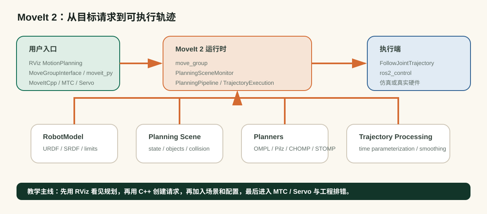

# MoveIt 2 实战

目标：沿着 MoveIt 官方 Tutorials 的路线，跑通 MoveIt 2 的入门环境、RViz 交互规划、第一段 C++ 规划程序、Planning Scene 绕障规划和 MoveIt Task Constructor 抓放任务。

MoveIt 2 是 ROS 2 生态中最常用的机械臂运动规划框架之一。它不是单独的 RRT、CHOMP 或轨迹平滑算法，而是把机器人模型、运动学、碰撞检测、规划器插件、规划场景、轨迹处理和控制器接口组织起来的系统。你可以把它理解成机械臂从“我想让末端到这里”到“控制器收到一条关节轨迹”的中间层。

本组的具体实战例子只采用 MoveIt 官方 Tutorials 总目录下的内容：

- [Tutorials 总目录](https://moveit.picknik.ai/main/doc/tutorials/tutorials.html)
- [Getting Started](https://moveit.picknik.ai/main/doc/tutorials/getting_started/getting_started.html)
- [MoveIt Quickstart in RViz](https://moveit.picknik.ai/main/doc/tutorials/quickstart_in_rviz/quickstart_in_rviz_tutorial.html)
- [Your First C++ MoveIt Project](https://moveit.picknik.ai/main/doc/tutorials/your_first_project/your_first_project.html)
- [Visualizing In RViz](https://moveit.picknik.ai/main/doc/tutorials/visualizing_in_rviz/visualizing_in_rviz.html)
- [Planning Around Objects](https://moveit.picknik.ai/main/doc/tutorials/planning_around_objects/planning_around_objects.html)
- [Pick and Place with MoveIt Task Constructor](https://moveit.picknik.ai/main/doc/tutorials/pick_and_place_with_moveit_task_constructor/pick_and_place_with_moveit_task_constructor.html)

<div class="concept-note concept-green">阅读路线：跟官方 Tutorials 跑一遍，再用中文解释每一步为什么这样做</div>

## 本节为什么放在这里

前面三节分别讲了采样式规划、优化式规划和轨迹时间参数化。这些概念在 MoveIt 2 里都不是孤立出现的：采样或优化规划器要放进 planning pipeline，碰撞检测要依赖 Planning Scene，轨迹时间参数化要把几何路径变成带时间戳的轨迹，执行端还要对接 ROS 2 controller。

所以本节不再推导一次 RRT 或 CHOMP，而是回答一个更工程的问题：

```text
URDF / SRDF / joint state / scene objects
      ↓
MoveIt 2 planning request
      ↓
planning pipeline + collision checking + trajectory processing
      ↓
JointTrajectory / FollowJointTrajectory / ros2_control
```


<div class="image-caption">MoveIt 2 的价值在于集成：它把机器人描述、规划场景、规划器插件、轨迹处理和控制器接口接成一条可调试的工程链路。</div>

## 学习路径

| 小节 | 对应官方 Tutorials | 学习产出 |
|---|---|---|
| [MoveIt 2 引入：定位、源码地图与第一次规划](01-moveit2-practice/01-introduction-and-first-plan.md) | Tutorials 总目录、Getting Started、Quickstart in RViz | 能说清 MoveIt 2 负责什么，并完成官方教程环境准备 |
| [基础规划实战：从 RViz 交互到 C++ MoveGroupInterface](01-moveit2-practice/02-rviz-and-move-group-interface.md) | Quickstart in RViz、Your First C++ MoveIt Project、Visualizing In RViz | 能从 RViz 和 C++ 两个入口发起一次规划 |
| [Planning Scene 实战：添加障碍物并绕障规划](01-moveit2-practice/03-planning-scene-config-and-planners.md) | Planning Around Objects | 能添加碰撞物并观察绕障规划 |
| [任务规划实战：MoveIt Task Constructor 抓放任务](01-moveit2-practice/04-task-constructor-and-servo.md) | Pick and Place with MoveIt Task Constructor | 能理解抓放任务的 stage 结构和失败定位方式 |
| [排错、安全与速查：把 MoveIt 2 当工程系统使用](01-moveit2-practice/05-debugging-safety-and-reference.md) | 汇总前四个教程中出现的现象、命令和检查项 | 能按现象定位问题，而不是盲目更换 planner |

## 怎么读

如果你第一次接触 MoveIt 2，建议按顺序读。第一节先建立地图并准备官方教程环境；第二节把“在 RViz 中拖动机械臂并点击 Plan”翻译成 C++ 规划程序；第三节加入环境物体，让规划器真正绕障；第四节进入抓放任务，把单次规划组合成多阶段任务；第五节把常见问题整理成速查表。

## 本节边界

为了和官方 Tutorials 保持一致，本节前四篇实战页面不展开 Servo、MoveItCpp、Setup Assistant 或自定义机器人配置。这些内容可以作为后续进阶方向出现，但不作为本组的主实战来源。这样做的好处是：读者可以一边看本课程中文解释，一边打开官方 Tutorials 逐步复现。
