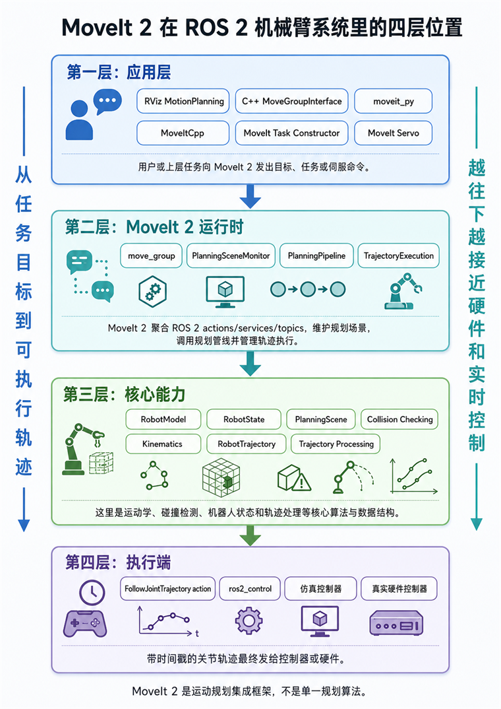
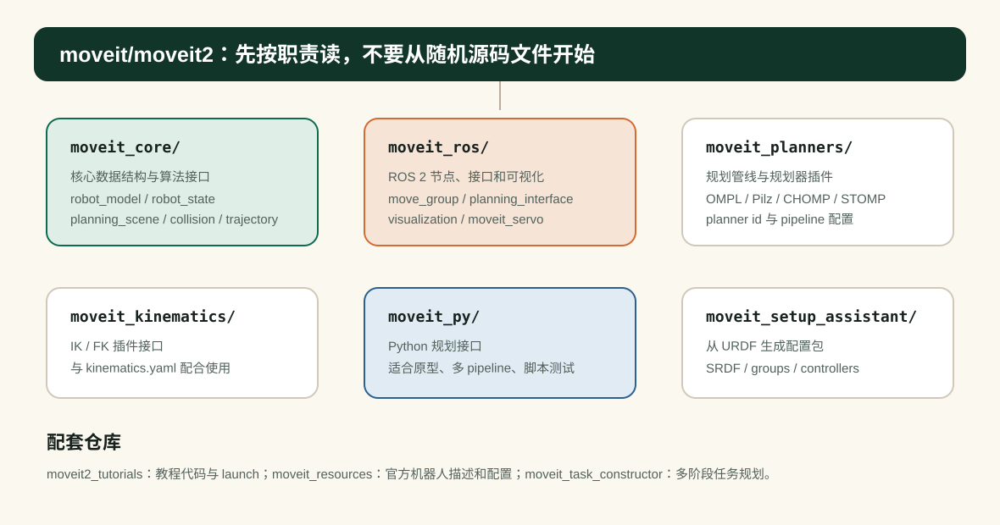
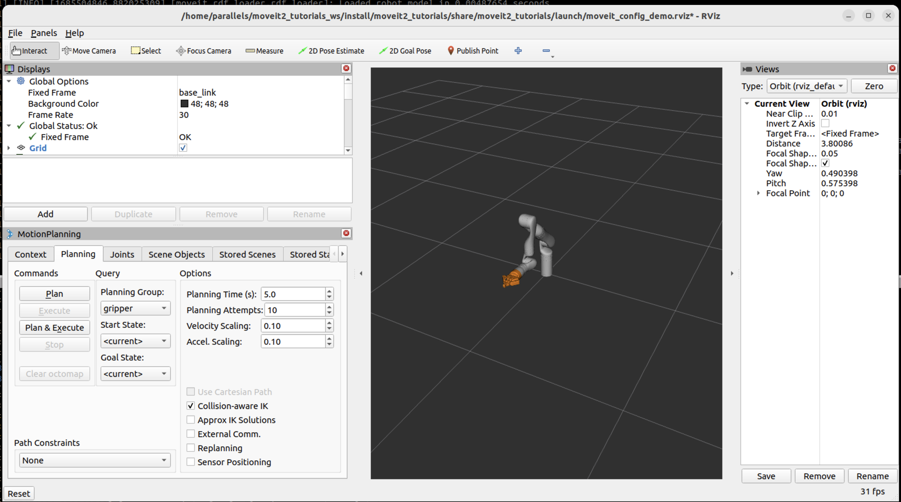

# MoveIt 2 引入：定位、源码地图与第一次规划

目标：理解 MoveIt 2 的系统定位、官方仓库结构和最小运行路径，并用官方 demo 完成一次可观察的规划。

先把一个误会拆掉：MoveIt 2 不是“一个规划器”。它更像机械臂运动规划的集成框架。你给它机器人模型、当前关节状态、世界里的障碍物和目标，它会通过规划管线生成一条轨迹，再把轨迹交给执行端。至于规划管线内部用 OMPL、Pilz、CHOMP、STOMP 还是别的插件，是配置问题，不是 MoveIt 2 的全部。

<div class="concept-note concept-green">定位：MoveIt 2 是集成层，不是单一算法</div>

本组具体实战只跟随官方 Tutorials 总目录下的教程：Getting Started、MoveIt Quickstart in RViz、Your First C++ MoveIt Project、Visualizing In RViz、Planning Around Objects、Pick and Place with MoveIt Task Constructor。这样做的好处是，读者可以打开官方页面逐步复现，本课程负责把每一步背后的系统概念讲清楚。

## 一个直观任务

假设你想让机械臂末端移动到杯子旁边。人脑里这是一个简单动作，但机器人系统里至少有这些问题：

| 问题 | MoveIt 2 中对应的部分 |
|---|---|
| 机器人有哪些关节、连杆和限位？ | URDF、SRDF、RobotModel、RobotState |
| 末端目标能不能通过关节角实现？ | kinematics、IK plugin、planning group |
| 机械臂会不会撞到自己或桌子？ | Planning Scene、collision detection |
| 从当前状态到目标状态怎么走？ | Planning Pipeline、OMPL / Pilz / CHOMP / STOMP |
| 路径点什么时候到达？ | trajectory processing、time parameterization |
| 轨迹怎么发给硬件或仿真？ | trajectory execution、FollowJointTrajectory、ros2_control |

这也是 MoveIt 2 对初学者有价值的地方：它让你先使用一条完整链路，再逐层理解每个部件。

## MoveIt 2 在系统里的位置

典型 MoveIt 2 应用可以理解为一条从用户目标到可执行轨迹的链路：上层应用提出目标，MoveIt 2 维护机器人模型和规划场景，规划管线生成可行轨迹，最后由执行端把轨迹交给仿真或真实控制器。

官方文档把 `move_group` 描述为一个关键集成节点：它把各个能力聚合起来，并通过 ROS actions 和 services 给用户使用。用户可以通过 RViz MotionPlanning 插件，也可以通过 C++ 的 MoveGroupInterface 与它通信。


<div class="image-caption">MoveIt 2 位于机器人应用、规划场景、运动规划管线和执行控制之间，负责把任务目标转成可检查、可执行的机器人运动。</div>

## 了解 MoveIt 2 仓库


```text
moveit2/
├── moveit_core/                 # 核心数据结构与算法接口
│   ├── robot_model/             # 机器人模型：link、joint、group
│   ├── robot_state/             # 当前关节状态、FK、状态更新
│   ├── planning_scene/          # 机器人状态 + 世界几何 + 碰撞矩阵
│   ├── collision_detection*/    # FCL / Bullet 等碰撞检测实现
│   ├── kinematic_constraints/   # 位姿、关节、可见性等约束
│   ├── robot_trajectory/        # MoveIt 内部轨迹表示
│   └── trajectory_processing/   # 时间参数化与轨迹处理
├── moveit_ros/                  # ROS 2 封装层
│   ├── move_group/              # 核心集成节点 move_group
│   ├── planning_interface/      # MoveGroupInterface 等用户接口
│   ├── planning/                # PlanningSceneMonitor 等运行时组件
│   ├── visualization/           # RViz MotionPlanning 可视化
│   ├── moveit_servo/            # 实时伺服控制
│   └── perception/              # 3D 感知和场景更新相关接口
├── moveit_planners/             # OMPL、CHOMP、STOMP、Pilz 等规划器插件
├── moveit_kinematics/           # IK / FK 插件
├── moveit_py/                   # Python API
├── moveit_setup_assistant/      # 从 URDF 生成 MoveIt 配置包的图形工具
├── moveit_configs_utils/        # launch 中加载 MoveIt 配置的工具
└── moveit_runtime/              # 运行时依赖集合包
```

面对原始的官方仓库，可以先抓住六个最常用的入口：

- `moveit_core/`：MoveIt 2 的“算法和数据结构底座”，机器人模型、机器人状态、规划场景、碰撞检测和轨迹处理都在这里。
- `moveit_ros/`：把核心能力接进 ROS 2 运行时，包含 `move_group`、规划接口、RViz 可视化、感知和 Servo 等节点或组件。
- `moveit_planners/`：规划器插件所在的位置，用来接入 OMPL、Pilz、CHOMP、STOMP 等不同规划管线。
- `moveit_kinematics/`：运动学插件入口，主要负责 IK / FK 相关求解能力。
- `moveit_py/`：Python API，适合脚本化实验、快速原型和教学中的小规模验证。
- `moveit_setup_assistant/`：配置自己机器人时会用到的图形工具，用 URDF 生成 SRDF、planning group、自碰撞矩阵和控制器配置。


<div class="image-caption">仓库阅读顺序建议：先看核心数据结构和 ROS 封装，再看规划器、Python 接口、Setup Assistant 与 Servo。</div>


配套仓库也很重要：

- `moveit2_tutorials`：官方教程代码和 launch 文件，写课程代码时优先从这里核对。
- `moveit_resources`：官方示例机器人描述和配置包，如 Panda、Fanuc、PRBT 等资源。
- `moveit_task_constructor`：复杂任务分解和抓放任务的官方实现。

## 第一次跑通：官方 demo

官方 Getting Started 的目标是从源码构建 MoveIt 和 tutorials：创建 colcon workspace，下载 tutorials 和其依赖仓库，然后构建整个工作区。官方说明 MoveIt 2 主要支持安装在 Ubuntu 22.04 或 24.04 上的 ROS 版本；下面命令按页面中的 Jazzy 示例写出。

首先 source 你安装的 ROS 2 版本。官方页面示例是 Jazzy：

```bash
source /opt/ros/jazzy/setup.bash
```

安装并初始化 `rosdep`：

```bash
sudo apt install python3-rosdep
```

```bash
sudo rosdep init
rosdep update
sudo apt update
sudo apt dist-upgrade
```

安装 `colcon` 和 mixin 支持：

```bash
sudo apt install python3-colcon-common-extensions
sudo apt install python3-colcon-mixin
colcon mixin add default https://raw.githubusercontent.com/colcon/colcon-mixin-repository/master/index.yaml
colcon mixin update default
```

安装 `vcstool`：

```bash
sudo apt install python3-vcstool
```

创建 colcon workspace：

```bash
mkdir -p ~/ws_moveit/src
```

进入 workspace 并下载 tutorials 源码。这里的 `<branch>` 按官方说明选择：例如 ROS Humble 用 `humble`，想跟随最新 tutorials 用 `main`。

```bash
cd ~/ws_moveit/src
git clone -b <branch> https://github.com/moveit/moveit2_tutorials
```

下载 MoveIt 其余源码依赖：

```bash
vcs import --recursive < moveit2_tutorials/moveit2_tutorials.repos
```

构建前，官方建议先移除已经安装的 MoveIt 二进制包，避免源码构建和二进制安装混在一起：

```bash
sudo apt remove ros-$ROS_DISTRO-moveit*
```

安装 workspace 中源码包需要的系统依赖：

```bash
sudo apt update && rosdep install -r --from-paths . --ignore-src --rosdistro $ROS_DISTRO -y
```

构建 workspace：

```bash
cd ~/ws_moveit
colcon build --mixin release
```

构建完成后 source 工作区：

```bash
source ~/ws_moveit/install/setup.bash
```

也可以按官方文档把这条 source 命令加入 `.bashrc`：

```bash
echo 'source ~/ws_moveit/install/setup.bash' >> ~/.bashrc
```

完成 Getting Started 后，下一步进入官方 `MoveIt Quickstart in RViz`。Quickstart 会启动 demo，并从空 RViz 世界开始，引导你添加 `MotionPlanning` display，把 Fixed Frame 设置为 `/base_link`，再进行第一次交互规划。



<div class="image-caption">来源：MoveIt Tutorials - <a href="https://moveit.picknik.ai/main/doc/tutorials/quickstart_in_rviz/quickstart_in_rviz_tutorial.html">MoveIt Quickstart in RViz</a>。这就是后续几节使用的官方 Kinova Gen3 入门场景。</div>

## 运行证据应该记录什么

不要只写“能打开 RViz”。建议记录下面这些证据：

```bash
ros2 node list
ros2 topic list | grep -E "planning_scene|joint_states|display_planned_path"
ros2 action list | grep -E "follow_joint_trajectory|move_action"
```

重点看几类信号：

| 证据 | 说明 |
|---|---|
| RViz 中出现机器人模型 | `robot_description` 和可视化配置基本正常 |
| MotionPlanning 面板可选择 planning group | SRDF、planning group、MoveIt config 被正确加载 |
| `/joint_states` 有数据 | 当前机器人状态能被 MoveIt 2 读取 |
| `/monitored_planning_scene` 存在 | PlanningSceneMonitor 正在发布场景 |
| 点击 Plan 后出现轨迹 | planning pipeline、IK、碰撞检测、时间参数化至少跑通一条链 |
| 点击 Execute / Plan & Execute 后仿真机器人运动 | 轨迹执行端和控制器连接正常 |

<div class="concept-note concept-orange">第一次成功：看到轨迹只是开始</div>

第一次跑通后，读者最容易误以为“MoveIt 2 就是 RViz 插件”。其实 RViz 只是用户入口之一。后面的几节会把同一个规划请求拆开：**先用 RViz 看见，再用 C++ 写出来，然后加入场景、配置机器人和规划管线，最后进入抓放任务与闭环控制。**

## 小结

MoveIt 2 是机械臂运动规划的工程集成层。它把机器人描述、当前状态、世界环境、规划器插件、轨迹处理和控制器接口接在一起。第一次学习时不要急着改规划器参数，先确保官方 demo 能跑、RViz 能显示、planning group 能选择、轨迹能规划和执行。

## 自查问题

1. MoveIt 2 和 OMPL 的关系是什么？
2. `moveit_core` 和 `moveit_ros` 的职责有什么区别？
3. 为什么只有 URDF 还不能完整描述一个 MoveIt 2 规划问题？
4. 第一次运行官方 demo 时，你至少应该记录哪些证据？

## 参考资料

- [MoveIt 2 GitHub](https://github.com/moveit/moveit2)
- [MoveIt 2 Tutorials GitHub](https://github.com/moveit/moveit2_tutorials)
- [MoveIt Tutorials](https://moveit.picknik.ai/main/doc/tutorials/tutorials.html)
- [MoveIt Getting Started](https://moveit.picknik.ai/main/doc/tutorials/getting_started/getting_started.html)
- [MoveIt Quickstart in RViz](https://moveit.picknik.ai/main/doc/tutorials/quickstart_in_rviz/quickstart_in_rviz_tutorial.html)
