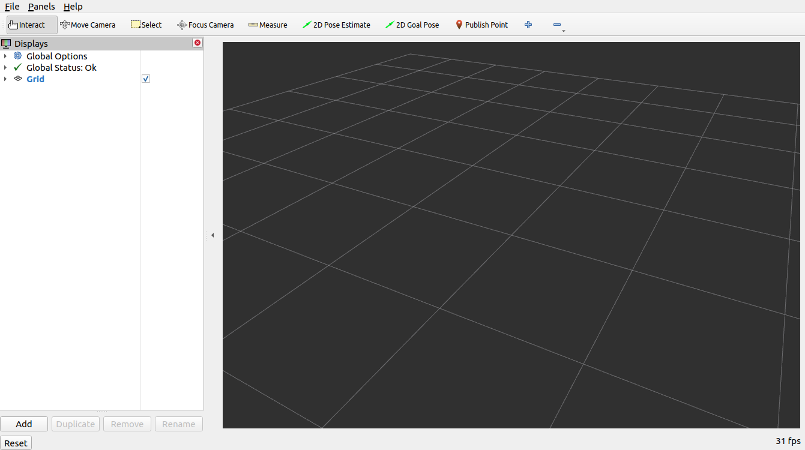
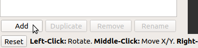
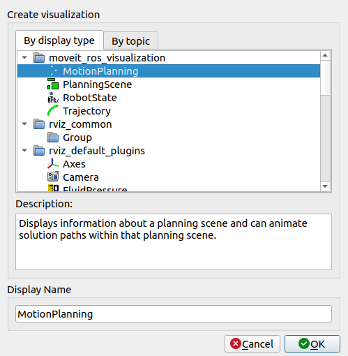
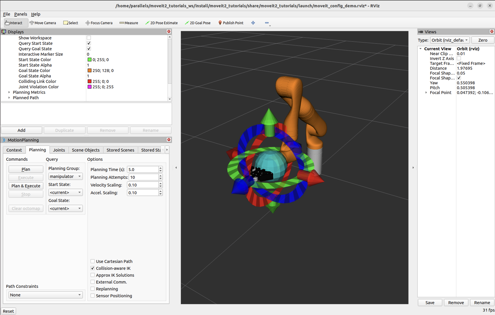
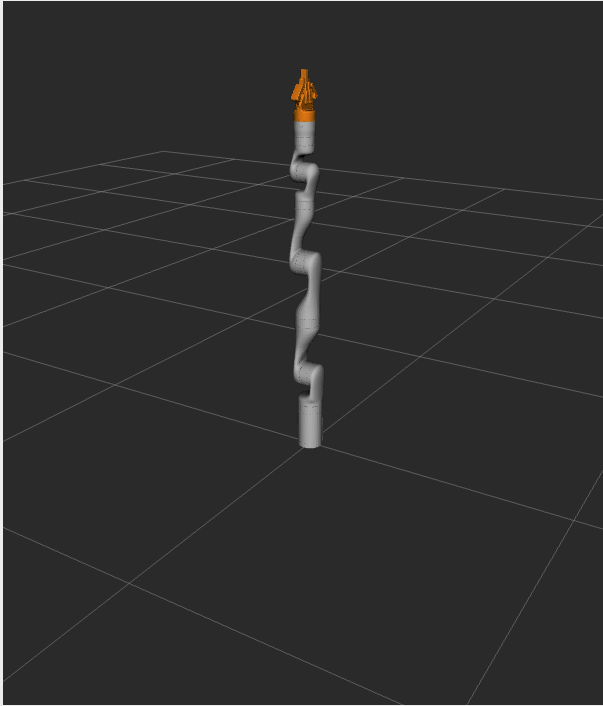
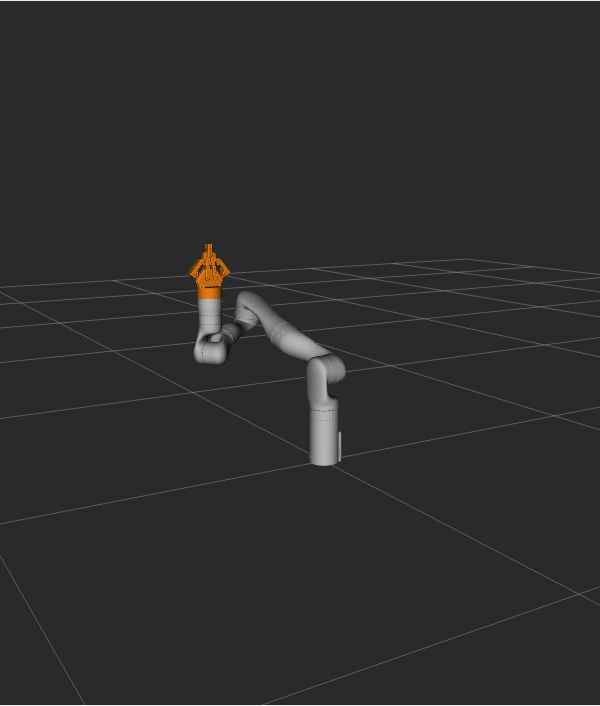
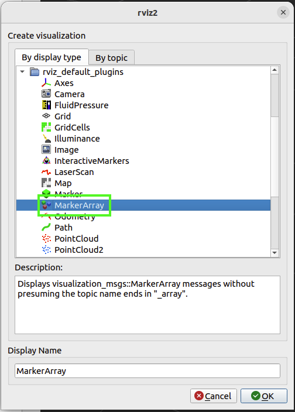

# 基础规划实战：从 RViz 交互到 C++ MoveGroupInterface

目标：从 RViz 和 C++ 两个入口发起一次 MoveIt 2 运动规划请求，并理解 start state、goal state、planning group、planned path 和执行之间的关系。

这一页只处理一个核心问题：**怎样让 MoveIt 2 计算并执行一次机械臂运动？** 先在 RViz 里用鼠标拖动目标、观察规划结果，再把同样的流程翻译成 C++ `MoveGroupInterface` 节点。这样做的好处是：你先看见系统在做什么，再去读代码里每一行为什么存在。


## 先把 RViz 里的“几台机器人”看清楚

打开 RViz 后，你可能会看到好几个半透明或不同颜色的机器人模型。它们不是重复渲染的 bug，而是 MoveIt 2 用来解释规划请求的不同状态。

| 可视化对象 | 代表什么 | 初学时怎么理解 |
|---|---|---|
| Scene Robot | `/monitored_planning_scene` 里的当前机器人状态 | MoveIt 2 认为机器人“现在”在哪里 |
| Start State | 本次规划请求的起点 | 轨迹从这里开始，不一定永远等于当前状态 |
| Goal State | 本次规划请求的目标 | 拖动橙色交互 marker 时，通常是在改它 |
| Planned Path | 规划器给出的轨迹 | 一串沿轨迹展开的机器人姿态 |

一个非常重要的直觉是：**拖动 goal state 不等于机器人运动**。拖动目标只是修改 planning request；点击 `Plan` 才会计算轨迹；点击 `Execute` 或 `Plan & Execute` 才会把轨迹交给控制器。在 demo 环境中，执行对象是仿真机器人。

## 启动 demo，并添加 MotionPlanning 插件

确保已经按上一页完成 `~/ws_moveit` 的构建和环境加载，然后启动 MoveIt Tutorials demo：

```bash
ros2 launch moveit2_tutorials demo.launch.py
```

如果 RViz 打开后只看到空世界，先在左侧 `Displays` 面板点击 `Add`，在 `moveit_ros_visualization` 分类下选择 `MotionPlanning`。




<div class="image-caption">MotionPlanning display 是 RViz 里发起 MoveIt 2 交互规划的入口。</div>


<div class="image-caption">添加后，RViz 可以订阅规划场景、显示机器人状态，并提供 Planning 面板。</div>

添加后重点检查这些配置。它们决定 RViz 是否能正确读到机器人模型、规划场景和规划结果：

| 字段 | 应使用的值 | 作用 |
|---|---|---|
| Fixed Frame | `/base_link` | RViz 所有可视化对象的参考坐标系 |
| Robot Description | `robot_description` | 从 ROS 参数中读取 URDF 机器人模型 |
| Planning Scene Topic | `/monitored_planning_scene` | 订阅 MoveIt 2 当前维护的规划场景 |
| Trajectory Topic | `/display_planned_path` | 订阅规划出来、用于显示的轨迹 |
| Planning Group | `manipulator` | 本次操作的机械臂规划组 |

`Planning Group` 尤其关键。MoveIt 2 不是永远规划整台机器人，而是对某个 group 规划。Kinova Gen3 demo 中使用的是 `manipulator`，后面 C++ 代码里的字符串也要和这里一致。

## 在 RViz 中做四个小实验

这一组操作的目标不是“赶快点出一条轨迹”，而是让你把 MoveIt 2 的几个核心概念看成可观察的东西。

### 实验一：切换不同状态的可视化

在 MotionPlanning display 里分别打开或关闭 scene robot、planned path、start state、goal state 的显示。你会看到不同颜色、不同透明度的机器人模型叠在一起。


<div class="image-caption">绿色和橙色机器人帮助你区分规划起点和目标。</div>

观察时可以按这个顺序理解：

1. `Scene Robot` 是 MoveIt 2 的当前世界状态。
2. `Start State` 是本次 request 的起点，可通过 `Update` 同步到当前状态。
3. `Goal State` 是你准备让末端到达的目标。
4. `Planned Path` 只有在规划后才有意义，它不是当前状态。

### 实验二：把 start state 更新为当前状态

在 Planning 面板中切到 `Planning` tab，使用 `Start State` 相关按钮把起点设为当前状态。这个动作在真实任务里非常常见：如果机器人已经运动过，下一次规划必须从新的关节状态开始，否则会出现“规划起点和机器人实际位置不一致”的问题。

### 实验三：拖动 goal state，观察 IK 和碰撞

拖动末端交互 marker 时，MoveIt 2 会尝试求解一个关节配置，让末端达到目标位姿。这里同时涉及两个问题：

| 现象 | 说明 |
|---|---|
| 末端拖到某些位置后机器人不再跟随 | 目标可能超出工作空间，或 IK 无解 |
| 某些 link 变红 | 当前状态发生自碰撞或与环境碰撞 |
| 勾选 `Use Collision-Aware IK` 后姿态变化 | IK 求解会考虑碰撞约束 |
| 通过 Joints tab 改关节角 | 可以直接指定关节目标，而不是只拖末端 |

对七自由度机械臂来说，还可以观察 null-space 行为：末端位姿不变时，某些关节仍然有自由度可以调整。这一点对理解“同一个末端目标可能有多个关节解”很有帮助。

### 实验四：Plan、检查轨迹、Execute

设置好 start state 和 goal state 后，按这个顺序做一次完整规划：

1. 确认起点和目标没有明显红色碰撞提示。
2. 点击 `Plan`，只计算轨迹，不执行。
3. 打开 `Show Trail`，看 planned path 中一系列中间姿态。
4. 使用 `Trajectory - Trajectory Slider` 逐 waypoint 检查轨迹。
5. 点击 `Execute`，或直接使用 `Plan & Execute`。

<div class="concept-note concept-green">直觉：Plan 负责“算出怎么走”，Execute 负责“真的发给控制器”。</div>

Planning 面板中还有 velocity scaling 和 acceleration scaling。它们会影响轨迹时间参数化后的速度和加速度上限。在真实机器人上，这不是展示选项，而是安全边界的一部分；学习 demo 时也建议保守设置。

如果想保存当前 RViz 配置，可以使用 `File -> Save Config As`。之后通过下面的方式加载自己的配置：

```bash
ros2 launch moveit2_tutorials demo.launch.py rviz_config:=your_rviz_config.rviz
```

## 用 C++ 写出同一件事

RViz 交互适合学习和调试，但真实应用最终往往要写成节点。我们把刚才的鼠标操作翻译成 C++ 程序：创建节点、创建 `MoveGroupInterface`、设置目标、规划、执行。

先在 `~/ws_moveit/src` 下创建 package：

```bash
ros2 pkg create \
  --build-type ament_cmake \
  --dependencies moveit_ros_planning_interface rclcpp \
  --node-name hello_moveit hello_moveit
```

这个命令做了三件事：

| 部分 | 作用 |
|---|---|
| `--build-type ament_cmake` | 使用 ROS 2 常见的 CMake package 结构 |
| `--dependencies moveit_ros_planning_interface rclcpp` | 声明会用到 MoveIt 2 planning interface 和 ROS 2 C++ 客户端库 |
| `--node-name hello_moveit` | 创建一个同名 C++ 节点入口文件 |

节点启动时需要允许从 launch 文件传入参数。MoveIt 2 的 robot description、SRDF、planning pipeline 等信息通常通过参数提供：

```cpp
auto const node = std::make_shared<rclcpp::Node>(
  "hello_moveit",
  rclcpp::NodeOptions().automatically_declare_parameters_from_overrides(true));
```

然后创建 `MoveGroupInterface`。这里的 `"manipulator"` 必须和 RViz 里选的 planning group 一致：

```cpp
using moveit::planning_interface::MoveGroupInterface;

auto move_group_interface = MoveGroupInterface(node, "manipulator");
```

目标位姿可以用 `geometry_msgs::msg::Pose` 表示。Kinova demo 中的一个入门目标如下：

```cpp
auto target_pose = geometry_msgs::msg::Pose();
target_pose.orientation.w = 1.0;
target_pose.position.x = 0.28;
target_pose.position.y = -0.2;
target_pose.position.z = 0.5;
move_group_interface.setPoseTarget(target_pose);
```

最后进行规划与执行：

```cpp
auto const [success, plan] = [&move_group_interface] {
  moveit::planning_interface::MoveGroupInterface::Plan msg;
  auto const ok = static_cast<bool>(move_group_interface.plan(msg));
  return std::make_pair(ok, msg);
}();

if (success)
{
  move_group_interface.execute(plan);
}
else
{
  RCLCPP_ERROR(rclcpp::get_logger("hello_moveit"), "Planning failed!");
}
```

这里不要省略 `success` 检查。规划失败时继续执行没有意义，真实系统里还可能触发危险的错误处理路径。

构建并加载工作空间：

```bash
cd ~/ws_moveit
colcon build --mixin debug
source install/setup.bash
```

运行时需要两个终端。第一个终端启动 demo 环境：

```bash
ros2 launch moveit2_tutorials demo.launch.py
```

第二个终端运行你的节点：

```bash
ros2 run hello_moveit hello_moveit
```

如果直接运行节点而没有启动 demo，常见错误是找不到 `robot_description`。这不是 C++ 语法错，而是 MoveIt 2 没有拿到机器人模型、SRDF 和 planning pipeline 参数。


<div class="image-caption">C++ 节点发起规划后，RViz 可以显示轨迹。</div>


<div class="image-caption">执行后仿真机械臂移动到目标附近。</div>

## 给代码加上 RViz 可视化提示

`moveit_visual_tools` 可以把文本、轨迹线和交互提示发布到 RViz。它非常适合教学：程序不会一口气跑完，而是等你在 RVizVisualToolsGui 里点击 `Next` 后继续。

先给 `package.xml` 加依赖：

```xml
<depend>moveit_visual_tools</depend>
```

再在 `CMakeLists.txt` 中查找并链接依赖：

```cmake
find_package(moveit_visual_tools REQUIRED)

ament_target_dependencies(
  hello_moveit
  "moveit_ros_planning_interface"
  "moveit_visual_tools"
  "rclcpp"
)
```

C++ 文件中加入头文件：

```cpp
#include <moveit_visual_tools/moveit_visual_tools.h>
```

为了让 visual tools 的交互按钮能够收到回调，节点需要一个 executor 在后台 spin：

```cpp
rclcpp::executors::SingleThreadedExecutor executor;
executor.add_node(node);
auto spinner = std::thread([&executor]() { executor.spin(); });
```

创建可视化工具时要指定参考坐标系、marker topic 和机器人模型：

```cpp
namespace rvt = rviz_visual_tools;

auto moveit_visual_tools = moveit_visual_tools::MoveItVisualTools{
  node, "base_link", rvt::RVIZ_MARKER_TOPIC,
  move_group_interface.getRobotModel()};

moveit_visual_tools.deleteAllMarkers();
moveit_visual_tools.loadRemoteControl();
```

常用的三个动作是：

| 动作 | 用法 |
|---|---|
| 显示标题或说明文字 | `publishText(...)` |
| 等待用户点击 Next | `prompt("Press 'Next' in the RvizVisualToolsGui window")` |
| 画出末端轨迹线 | `publishTrajectoryLine(plan.trajectory_, joint_model_group)` |

完成后重新构建：

```bash
cd ~/ws_moveit
colcon build --mixin debug
source install/setup.bash
```

运行方式仍然是先启动 demo，再运行 `hello_moveit`。如果终端停在等待 `Next`，说明程序正在等 RVizVisualToolsGui 的按钮输入；在 RViz 中添加对应 panel 后点击即可继续。


<div class="image-caption">marker array 能把文字和轨迹线显示在 RViz 中，让程序步骤更清楚。</div>

## 小结

这一页的主线是：先在 RViz 里看懂一次 planning request，再用 C++ 写出等价的最小程序，最后用 `moveit_visual_tools` 把程序执行过程可视化。RViz 让你观察 start、goal、collision 和 planned path；`MoveGroupInterface` 让你把目标、规划和执行写进节点；visual tools 让每个步骤都能停下来检查。

## 自查问题

1. Scene Robot、Start State、Goal State、Planned Path 分别代表什么？
2. `Plan` 和 `Execute` 的差别是什么？
3. `MoveGroupInterface(node, "manipulator")` 里的 group 名称来自哪里？
4. 为什么 C++ 节点需要 demo launch 提供 `robot_description`？
5. `moveit_visual_tools` 为什么需要 executor spin？

## 参考资料

- [MoveIt Quickstart in RViz](https://moveit.picknik.ai/main/doc/tutorials/quickstart_in_rviz/quickstart_in_rviz_tutorial.html)
- [Your First C++ MoveIt Project](https://moveit.picknik.ai/main/doc/tutorials/your_first_project/your_first_project.html)
- [Visualizing In RViz](https://moveit.picknik.ai/main/doc/tutorials/visualizing_in_rviz/visualizing_in_rviz.html)
