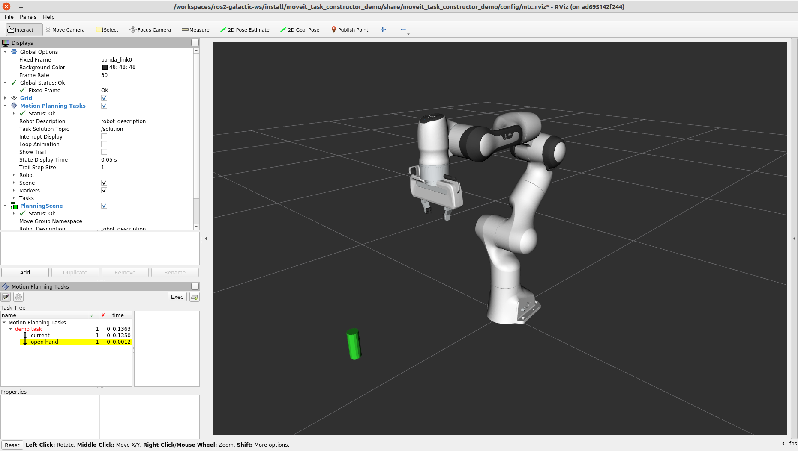
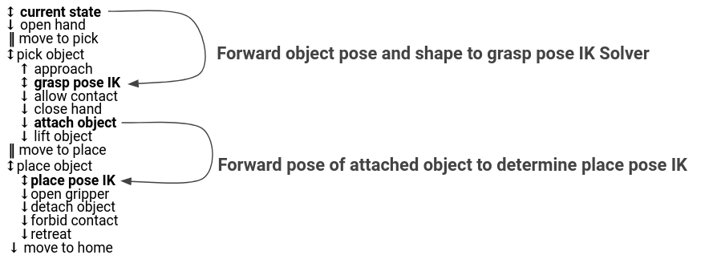

# 任务规划实战：MoveIt Task Constructor 抓放任务

目标：理解 MoveIt Task Constructor 如何把抓放任务拆成可观察、可组合、可调试的 stage，并能沿着 demo 运行、阅读和扩展一个 pick-and-place 任务。

到这里，我们已经能做两件事：发起一次单次规划请求，以及把障碍物加入 Planning Scene。但抓放任务通常不是“移动到一个目标点”就结束。它包含靠近物体、张开夹爪、生成抓取姿态、计算 IK、闭合夹爪、附着物体、抬起、移动到放置区、放下物体等阶段。MoveIt Task Constructor, MTC 的价值就是把这些阶段组织成一棵可搜索的任务树。

<div class="concept-note concept-green">边界：本页实战聚焦 MoveIt Task Constructor；Servo 作为后续方向放在最后，不混入本页代码。</div>

## 为什么抓放不适合只写一串 move()

最直觉的写法可能是：

```text
move_to_pregrasp()
open_gripper()
move_to_grasp()
close_gripper()
lift()
move_to_place()
open_gripper()
```

这类写法在简单 demo 里能跑，但一旦失败就很难定位。抓放任务至少会遇到这些不确定性：

| 子问题 | 为什么麻烦 |
|---|---|
| 抓取姿态 | 一个物体通常有多个候选 grasp pose，需要生成和筛选 |
| IK | 某个抓取姿态看起来合理，但机械臂可能不可达 |
| 碰撞关系 | 夹爪接触物体应当允许，手臂撞桌子不应允许 |
| 附着物体 | 抓住物体后，物体要成为机器人状态的一部分 |
| 阶段连接 | 从当前状态到 pre-grasp、从 pick 到 place 都需要规划 |
| 失败解释 | 总任务失败时，要知道失败发生在哪个子问题 |

MTC 的核心思想是：把复杂任务拆成一系列 `Stage`。每个 stage 只解决一个较小的问题，并把成功或失败的解传给相邻 stage。


<div class="image-caption">来源：MoveIt Tutorials - Pick and Place with MoveIt Task Constructor。不同 stage 类型负责生成、传播或连接状态。</div>

## MTC 的基本概念

先建立一张概念表。读 MTC 代码时，只要能把每个对象放回这张表里，就不会迷路。

| 概念 | 作用 | 例子 |
|---|---|---|
| `Task` | 一个完整任务容器 | pick and place |
| `Stage` | 一个子问题 | 打开夹爪、靠近物体、计算 IK |
| `Generator` | 独立生成候选状态 | 生成多个 grasp pose |
| `Propagator` | 从一个状态向前或向后传播 | 笛卡尔接近、抬起、退回 |
| `Connector` | 连接两个已有状态 | 从当前状态规划到 pick 前状态 |
| `SerialContainer` | 顺序组织一组 stage | pick container、place container |
| `Wrapper` | 包装并增强另一个 stage | `ComputeIK` 包住 `GenerateGraspPose` |

MTC 不是替代 MoveIt 2 的规划器，而是在更高一层组织任务搜索。stage 内部仍然会使用规划器、IK、Planning Scene 和碰撞检测。

## 准备和运行 demo

如果工作空间还没有 MTC，需要把 `moveit_task_constructor` 放进 `~/ws_moveit/src`，安装依赖并重新构建：

```bash
cd ~/ws_moveit/src
git clone -b <branch> https://github.com/moveit/moveit_task_constructor.git
rosdep install --from-paths . --ignore-src --rosdistro $ROS_DISTRO

cd ~/ws_moveit
colcon build --mixin release
source install/setup.bash
```

`<branch>` 应与当前 MoveIt Tutorials 使用的 ROS 2 / MoveIt 分支一致。前面 Getting Started 已经用过相同的分支约定，避免把不同发行版的源码混在一起。

先启动 MTC demo 环境：

```bash
ros2 launch moveit_task_constructor_demo demo.launch.py
```

再在另一个终端运行任务节点。可以先从不同 demo 看 stage 行为：

```bash
ros2 launch moveit_task_constructor_demo run.launch.py exe:=cartesian
ros2 launch moveit_task_constructor_demo run.launch.py exe:=modular
ros2 launch moveit_task_constructor_demo run.launch.py exe:=pick_place_demo
```

RViz 中的 `Motion Planning Tasks` 面板会显示 stage 树。展开每个 stage，可以查看候选解、失败数量和可视化轨迹。


<div class="image-caption">stage 面板可以逐层查看任务求解过程。</div>

## 创建自己的 MTC package

用下面的命令创建一个最小 C++ package：

```bash
ros2 pkg create \
  --build-type ament_cmake \
  --dependencies moveit_task_constructor_core rclcpp \
  --node-name mtc_node mtc_tutorial
```

这个 package 的节点通常包含三块逻辑：

| 函数或类 | 作用 |
|---|---|
| `MTCTaskNode` | 持有 ROS node，并组织任务创建与执行 |
| `setupPlanningScene()` | 在场景中创建待抓取物体 |
| `createTask()` | 创建 `Task`，并逐个加入 stage |
| `doTask()` | 调用 `task.plan()`，成功后执行解 |

最小节点需要的核心 include 包括：

```cpp
#include <moveit/planning_scene/planning_scene.hpp>
#include <moveit/planning_scene_interface/planning_scene_interface.hpp>
#include <moveit/task_constructor/task.h>
#include <moveit/task_constructor/stages.h>
#include <moveit/task_constructor/solvers.h>
#include <rclcpp/rclcpp.hpp>
```

## 设置待抓取物体

MTC 抓放 demo 会先在 Planning Scene 中放一个圆柱体。这个物体的 `id` 后面会被 grasp stage、collision stage 和 attach stage 反复使用，所以名字必须稳定。

```cpp
moveit_msgs::msg::CollisionObject object;
object.id = "object";
object.header.frame_id = "world";
object.primitives.resize(1);
object.primitives[0].type = shape_msgs::msg::SolidPrimitive::CYLINDER;
object.primitives[0].dimensions = { 0.1, 0.02 };

geometry_msgs::msg::Pose pose;
pose.position.x = 0.5;
pose.position.y = -0.25;
pose.orientation.w = 1.0;
object.pose = pose;

moveit::planning_interface::PlanningSceneInterface psi;
psi.applyCollisionObject(object);
```

这段代码和上一页的 box 很像，但有两个抓放任务特有的点：

| 点 | 说明 |
|---|---|
| `object.id = "object"` | 后续 stage 会按这个名字生成抓取姿态、允许碰撞、附着和分离 |
| `CYLINDER` | 圆柱体常用于演示抓取，因为抓取姿态可以围绕物体采样 |

## 创建 Task 和规划器

`createTask()` 中首先创建 `Task`，加载机器人模型，并设置常用属性：

```cpp
moveit::task_constructor::Task task;
task.stages()->setName("demo task");
task.loadRobotModel(node);

const auto& arm_group_name = "panda_arm";
const auto& hand_group_name = "hand";
const auto& hand_frame = "panda_hand";

task.setProperty("group", arm_group_name);
task.setProperty("eef", hand_group_name);
task.setProperty("ik_frame", hand_frame);
```

然后准备不同 stage 会用到的 planner：

| planner | 适合的动作 |
|---|---|
| `PipelinePlanner` | 常规关节空间规划，连接较远状态 |
| `JointInterpolationPlanner` | 简单关节插值，如打开或关闭夹爪 |
| `CartesianPath` | 笛卡尔直线运动，如接近、抬起、退回 |

`CartesianPath` 通常还会设置速度、加速度和步长，例如最大速度缩放、最大加速度缩放和 `step_size`。这会影响靠近物体、抬起物体这类短距离直线动作的质量。

## 从第一个 stage 开始

不要一开始就堆完整抓放任务。先加入当前状态和打开夹爪两个 stage，确认 RViz 面板能显示解：

```cpp
auto current_state = std::make_unique<stages::CurrentState>("current");
task.add(std::move(current_state));

auto open_hand = std::make_unique<stages::MoveTo>("open hand", interpolation_planner);
open_hand->setGroup(hand_group_name);
open_hand->setGoal("open");
task.add(std::move(open_hand));
```


<div class="image-caption">来源：MoveIt Tutorials - Pick and Place with MoveIt Task Constructor。先从少量 stage 开始，便于确认任务框架和 RViz 面板工作正常。</div>

这一步如果失败，先不要写后面的 grasp。优先检查：

1. Panda 机器人模型是否加载成功。
2. `hand_group_name` 是否和 SRDF 中的 group 名称一致。
3. `open` 这个 named state 是否存在。
4. RViz 的 Motion Planning Tasks 面板是否已经添加。

## Pick 部分：靠近、采样抓取、计算 IK、附着物体

pick 通常用一个 `SerialContainer` 包起来，表示这些 stage 按顺序构成“抓取物体”这个子任务。

一个典型 pick container 包含：

| stage | 类型 | 作用 |
|---|---|---|
| `move to pick` | `Connect` | 从当前状态连接到抓取前状态 |
| `approach object` | `MoveRelative` | 沿夹爪坐标系接近物体 |
| `generate grasp pose` | `GenerateGraspPose` | 围绕物体生成候选抓取姿态 |
| `grasp pose IK` | `ComputeIK` wrapper | 为每个抓取姿态求 IK |
| `allow collision` | `ModifyPlanningScene` | 允许夹爪和物体发生合理接触 |
| `close hand` | `MoveTo` | 闭合夹爪 |
| `attach object` | `ModifyPlanningScene` | 把物体附着到夹爪 |
| `lift object` | `MoveRelative` | 抓住后向上抬起 |

`approach object` 这类笛卡尔动作会设置方向和距离范围。例如沿 `hand_frame` 的 z 方向接近，最短距离 `0.1`，最长距离 `0.15`。这表达的是“夹爪沿自己的前进方向靠近物体”，比直接给一个末端目标更贴近抓取动作。

`GenerateGraspPose` 会围绕 `object` 采样多个 grasp pose，常见设置包括：

```cpp
auto grasp_generator = std::make_unique<stages::GenerateGraspPose>("generate grasp pose");
grasp_generator->setObject("object");
grasp_generator->setAngleDelta(M_PI / 12);
grasp_generator->setPreGraspPose("open");
```

然后用 `ComputeIK` 包住它，为候选抓取姿态求解关节角：

```cpp
auto grasp = std::make_unique<stages::ComputeIK>("grasp pose IK", std::move(grasp_generator));
grasp->setMaxIKSolutions(8);
grasp->setMinSolutionDistance(1.0);
grasp->setIKFrame(grasp_frame_transform, hand_frame);
```

这就是 MTC 很有教学价值的地方：如果 grasp 生成了很多候选，但 IK 全失败，你能直接在 stage 面板看到失败发生在 `ComputeIK`，而不是只得到一个“任务失败”。

## Place 部分：移动到放置区、放下、撤退

place 部分同样可以放进 `SerialContainer`。它通常包括：

| stage | 类型 | 作用 |
|---|---|---|
| `move to place` | `Connect` | 从 pick 后状态连接到放置前状态 |
| `generate place pose` | `GeneratePlacePose` | 生成放置目标 |
| `place pose IK` | `ComputeIK` wrapper | 为放置姿态求 IK |
| `open hand` | `MoveTo` | 打开夹爪 |
| `forbid collision` | `ModifyPlanningScene` | 取消夹爪与物体的允许碰撞 |
| `detach object` | `ModifyPlanningScene` | 物体从夹爪分离回世界 |
| `retreat` | `MoveRelative` | 夹爪退出物体附近 |
| `return home` | `MoveTo` | 回到 named state，例如 `ready` |

放置姿态一般以物体为参考设置目标位置。例如把物体移动到新的 y 位置，并保持单位四元数：

```cpp
geometry_msgs::msg::PoseStamped target_pose_msg;
target_pose_msg.header.frame_id = "object";
target_pose_msg.pose.position.y = 0.5;
target_pose_msg.pose.orientation.w = 1.0;
```

注意这里和普通 `MoveGroupInterface` 的目标很不一样：MTC 不只是“末端到一个 pose”，而是在维护“物体、夹爪、场景状态”之间的关系。attach、detach、允许碰撞、禁止碰撞都属于任务逻辑的一部分。


<div class="image-caption">来源：MoveIt Tutorials - Pick and Place with MoveIt Task Constructor。完整任务由多个 stage 顺序组合而成，每个 stage 都可以单独查看解和失败。</div>

## 运行自己的 MTC 节点

完成 package 和 launch 文件后，可以先启动 Panda 的 MTC demo 环境：

```bash
ros2 launch moveit2_tutorials mtc_demo.launch.py
```

再启动自己的节点：

```bash
ros2 launch mtc_tutorial pick_place_demo.launch.py
```

如果只想启动最小环境，也可以使用：

```bash
ros2 launch moveit2_tutorials mtc_demo_minimal.launch.py
```

运行后不要只看机械臂有没有动。更重要的是打开 Motion Planning Tasks 面板，逐层展开 stage 树：

1. 看每个 stage 是否有 solution。
2. 点击某个 solution，在 RViz 中查看对应轨迹。
3. 对失败 stage 查看 failure count 和错误位置。
4. 比较不同候选 grasp / place pose 的差异。

## 如何读 stage 失败

MTC 最适合教学的一点，是它把“任务失败”拆成更细的失败：

| 失败位置 | 常见含义 | 优先排查 |
|---|---|---|
| `GenerateGraspPose` 没有候选 | 物体名字、几何或采样参数不合适 | `object` id、圆柱体尺寸、angle delta |
| `ComputeIK` 失败 | 候选姿态不可达或 IK frame 设置错 | `hand_frame`、grasp frame transform、group 名 |
| `Connect` 失败 | 两个状态之间没有可行路径 | 障碍物、起点/终点状态、pipeline planner |
| `ModifyPlanningScene` 后失败 | 碰撞关系变化导致后续不可行 | allowed collision、attach object、detach |
| `MoveRelative` 失败 | 笛卡尔方向或距离不可行 | direction frame、min/max distance、碰撞 |
| `Place` 失败 | 放置姿态不可达或与环境冲突 | target pose frame、place pose、退回方向 |

这比一串 `move()` 的优势大很多：你不只知道任务失败了，还知道失败发生在哪一类子问题。

## 后续方向：Servo

MoveIt Servo 解决的是另一类问题：给定连续的速度指令或遥操作输入，让机器人实时跟随，同时做碰撞检查和速度限制。它适合视觉伺服、手柄遥操作、末端小范围连续调整等场景。

本页不放 Servo 代码，因为这里的实战来源集中在 MTC pick-and-place。更合适的学习顺序是：先把 MTC 的离散任务树理解清楚，再单独用 MoveIt Servo 文档学习连续控制。两者并不冲突：真实系统里常见组合是用 MTC 做高层阶段组织，用 Servo 或控制器做局部连续调整。

## 小结

MoveIt Task Constructor 把抓放任务变成一棵可观察的 stage 树。对初学者来说，MTC 的价值不只是“能抓放”，而是让复杂任务的失败位置变得清楚：是没有 grasp pose、IK 无解、连接规划失败，还是 attach 后碰撞关系变了。

## 自查问题

1. 为什么复杂抓放不适合只写成一串 `move()`？
2. Generator、Propagator、Connector 分别解决什么问题？
3. `GenerateGraspPose` 为什么通常要再包一层 `ComputeIK`？
4. attach object 和 allow collision 分别改变了 Planning Scene 的哪部分？
5. MTC stage 面板为什么适合调试任务失败？

## 参考资料

- [Pick and Place with MoveIt Task Constructor](https://moveit.picknik.ai/main/doc/tutorials/pick_and_place_with_moveit_task_constructor/pick_and_place_with_moveit_task_constructor.html)
