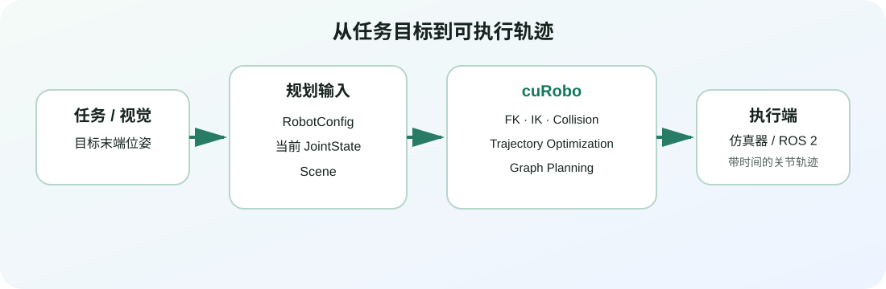

# cuRobo 实战

目标：在一张 NVIDIA GPU 上，从环境安装开始，依次跑通 Franka Panda 的正运动学、批量逆运动学、无碰撞求解和完整避障轨迹规划，并理解如何把同一套方法迁移到自定义机器人。

cuRobo 是 NVIDIA Research 开源的 CUDA 加速机器人运动生成库。它把机械臂规划中计算最密集的部分——运动学、碰撞查询、逆运动学、轨迹优化和图搜索——组织成能够在 GPU 上并行执行的求解流水线。这里的“并行”不是训练神经网络：它主要指一次同时处理多组关节状态、多个目标位姿或多个优化初值（seed）。

版本边界：本组使用 cuRoboV2（v0.8.x）公开 API。旧版 v0.7.x 文档中的 <code>CudaRobotModel</code>、<code>IKSolver</code>、<code>WorldConfig</code> 和 <code>MotionGen</code> 不能直接复制到本组代码中。

官方仓库明确说明 cuRoboV2 是一次重大重写，公共 API 与 v1 不兼容。若你正在维护旧项目，应固定到 `v0.7.8`；若是新项目，则从 v2 的 `Kinematics`、`InverseKinematics`、`Scene` 和 `MotionPlanner` 开始。本组代码按官方仓库提交 `a35a708ecfbb26eb9ab2d7ef22c65919c4fae4a9` 核对，正式复现时仍建议固定一个具体的 v0.8.x release tag。

## 为什么接在 MoveIt 2 后面

MoveIt 2 教会我们如何把机器人描述、Planning Scene、规划器插件、轨迹处理和 ROS 2 控制器接成工程系统。cuRobo 关注的是其中另一条轴线：怎样把大量候选解、碰撞查询和优化 rollout 放进 GPU，以较低延迟求出可行运动。

目标位姿、机器人当前状态和场景共同进入 cuRobo，最终得到可交给仿真器或控制器执行的关节轨迹。

因此 cuRobo 不等于 Isaac Sim，也不等于 ROS 2 控制器。它可以独立作为 Python 库运行；仿真器负责提供场景和机器人状态，控制器负责执行轨迹，cuRobo 负责计算。

## 学习路径

| 小节 | 核心问题 | 可验证产出 |
|---|---|---|
| [cuRobo 入门：从运动规划问题到 GPU 求解流水线](02-curobo-practice/01-curobo-mental-model-and-ecosystem.md) | cuRobo 解决什么，和 MoveIt 2、ROS 2、Isaac Sim 有什么关系？ | 能画出输入、求解器与输出之间的数据流 |
| [环境实战：用 Conda 安装 cuRoboV2 并完成 GPU 自检](02-curobo-practice/02-installation-and-first-validation.md) | 驱动、CUDA、PyTorch 和 cuRobo 如何正确配套？ | 在单 GPU 环境通过 import、CUDA 和官方测试 |
| [运动学实战：加载 Franka，跑通 FK、单目标 IK 与批量 IK](02-curobo-practice/03-robot-model-fk-and-ik.md) | 关节角怎样变成位姿，目标位姿又怎样变回可行关节角？ | 完成单次/批量 FK、单目标/批量 IK，并读懂 tensor shape |
| [碰撞实战：从 collision spheres 到可动态更新的 Scene](02-curobo-practice/04-collision-scene-and-checking.md) | 怎样让 IK 同时避开机器人自身和环境障碍物？ | 建立桌面/障碍物场景，运行无碰撞 IK 并更新障碍物 |
| [轨迹规划实战：使用 MotionPlanner 生成并检查避障轨迹](02-curobo-practice/05-motion-planning-and-trajectory.md) | 怎样从当前关节状态生成平滑、可执行的避障轨迹？ | 生成并读取插值轨迹，画出关节曲线并按层排错 |
| [工程实战：导入自定义机器人并接入仿真/机器人系统](02-curobo-practice/06-custom-robot-and-integration.md) | 怎样从 URDF 生成配置，并把结果接到真实工程边界？ | 拟合碰撞球、导出 YAML/XRDF，完成 FK→IK 最小验收 |

## 本组统一实验口径

| 项目 | 默认设置 |
|---|---|
| 操作系统 | Ubuntu 22.04；官方要求 Ubuntu 20.04+ |
| Python | 3.11，使用 Conda 创建环境 |
| GPU | 1 张 NVIDIA GPU；入门示例不需要多卡 |
| CUDA | 根据驱动选择 cuRobo 的 `cu12` 或 `cu13` extra，二选一 |
| 机器人 | Franka Panda，配置文件 `franka.yml` |
| 浮点类型 | CUDA `float32` |
| 四元数 | `(w, x, y, z)` |
| 长度/角度 | 米、弧度 |
| 随机种子 | 教学脚本默认 `42` |

这里的 batch 指“同一张 GPU 上一次求解多少组输入”，不是深度学习训练的 batch size。批量 FK 默认 1000 组关节状态；批量 IK 默认 100 个目标，每个目标使用 32 个优化 seed。目标数量和 seed 数同时增加时，显存需求会明显上升。

## 怎么读

如果你第一次接触 GPU 机器人规划，请严格按顺序阅读。第二节先把环境变量缩小到“纯 Python + 单 GPU”；第三节只处理运动学；第四节再加入碰撞；第五节才把它们组合成完整规划器。这样遇到失败时，能判断问题来自环境、机器人模型、目标位姿、碰撞场景还是轨迹优化，而不是把所有报错都归因于 CUDA。

如果你已经能运行 cuRoboV2，可以从第三节开始，但仍应阅读入口页的版本边界。网络上大量示例仍使用 v0.7.x 类名，混用两套 API 是最常见、也最隐蔽的坑之一。

## 本组边界

本组只完成单臂 Franka 从运动学到无碰撞规划的闭环。MPC/MPPI、深度相机 TSDF/ESDF、feature mapping、人形机器人 retargeting、多机械臂和完整 Isaac Sim 应用开发留作进阶内容。最后一节会解释这些系统的接口边界，但不会把旧版 Isaac Sim 命令包装成 v2 教程。

## 参考资料

- [cuRoboV2 最新官方文档](https://nvlabs.github.io/curobo/latest/)
- [NVlabs/curobo 官方仓库](https://github.com/NVlabs/curobo)
- [cuRoboV2 Python API](https://nvlabs.github.io/curobo/latest/reference/api_overview.html)
- [cuRobo releases](https://github.com/NVlabs/curobo/releases)
- [cuRobo v0.7.x legacy 文档](https://curobo.org/)
