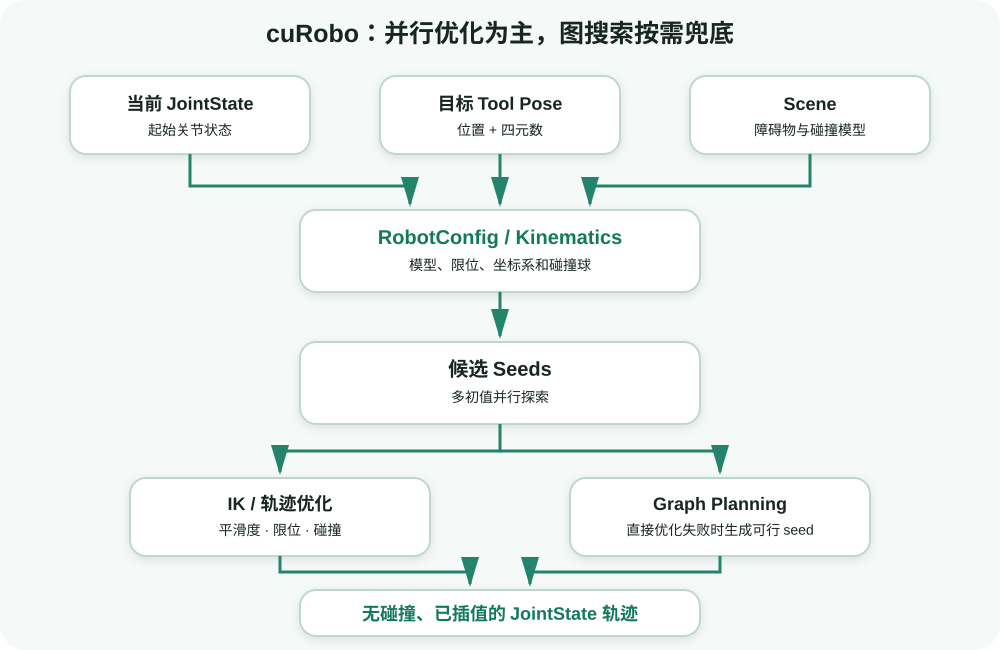
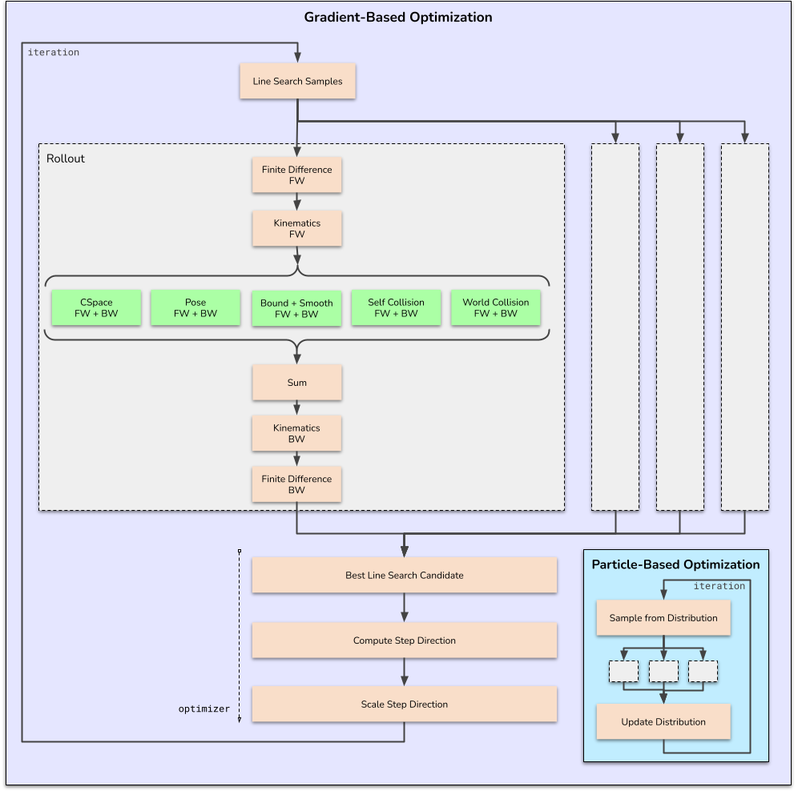

# cuRobo 入门：从运动规划问题到 GPU 求解流水线

目标：建立 cuRoboV2 的系统心智模型，能够说清一次机械臂运动规划请求的输入、内部求解阶段、输出，以及 cuRobo 与 MoveIt 2、ROS 2、Isaac Sim 的分工。

## 先从一个具体任务开始

假设 Franka Panda 的末端夹爪现在位于桌子左侧，我们希望它移动到杯子上方。对人来说，这是“移动到杯子上方”一句话；对运动规划器来说，至少要补齐四类信息：

1. **机器人现在在哪里**：当前关节角、关节速度，通常表示成 `JointState`。
2. **机器人要到哪里**：末端位置和姿态，通常表示成 `Pose` 或按 tool frame 组织的 `GoalToolPose`。
3. **机器人能怎样动**：URDF/机器人 YAML 中的关节拓扑、关节限位、tool frame 和碰撞球。
4. **世界里有什么**：桌面、墙、工装、杯子等场景几何体，组织成 `Scene`。

只有目标位姿而没有机器人模型，求解器不知道哪些关节能动；只有机器人模型而没有场景，求出的轨迹可能穿过桌面；只有起点和终点而没有时间参数，控制器也不知道每个时刻应该到哪里。



<div class="image-caption">cuRobo 将机器人状态、末端目标和场景约束组织成一条 GPU 求解管线；直接优化不可行时，可由图搜索提供新的轨迹 seed。</div>

## cuRobo 到底加速了什么

cuRobo 的核心价值不是“把一个普通 Python for-loop 搬到 GPU”。机器人规划里天然存在大量可以并行的维度：

- 同时计算一批关节状态的正运动学；
- 同时尝试多个 IK 初始解；
- 同时评估多个目标位姿或抓取候选；
- 同时对多条候选轨迹计算平滑性、关节限位和碰撞成本；
- 同时查询大量机器人碰撞球与环境几何体的距离。

GPU 在这些“大量结构相同的小计算”上有优势。cuRoboV2 用 PyTorch、CUDA 和 Warp 组织这些计算，并将常用求解器封装成高层 API。初学者无需先理解 CUDA kernel，也能使用下面四个入口：

| 能力 | v2 入口 | 输入 | 输出 |
|---|---|---|---|
| 正运动学 | `Kinematics` | `JointState` | 各 link/tool frame 的位姿和机器人状态 |
| 逆运动学 | `InverseKinematics` | `GoalToolPose` | 可行关节解、success mask、误差 |
| 场景与碰撞 | `Scene`、`SceneCollision` | 几何体、机器人碰撞球 | 距离/碰撞成本与梯度 |
| 运动规划 | `MotionPlanner` | 起始 `JointState`、目标 pose、scene | 优化轨迹与插值轨迹 |

## FK、IK 和轨迹规划不是一回事

初学者经常把“机械臂到达某个位置”统称为 IK。实际上三者回答的问题不同。

### 正运动学：给关节角，末端在哪里

正运动学（Forward Kinematics, FK）是确定性映射：

$$
\mathbf{x}_{ee}=f(\mathbf{q})
$$

`q` 是所有关节角，`x_ee` 是末端位姿。只要模型和关节角确定，结果也确定。FK 常用于状态显示、误差验证、碰撞球位姿更新和优化器内部 rollout。

### 逆运动学：给末端位姿，关节角可以是什么

逆运动学（Inverse Kinematics, IK）要寻找：

$$
\mathbf{q}^{*}=\arg\min_{\mathbf{q}}\;d(f(\mathbf{q}),\mathbf{x}_{goal})
$$

同一个末端位姿可能对应多组关节角，也可能完全不可达。cuRobo 会从多个 seed 出发并行优化，然后返回成功解。`num_seeds=32` 表示每个 IK 问题尝试 32 个初值；它不是 32 个目标，也不是训练 batch。

### 轨迹规划：从当前关节角怎样安全走到目标

IK 只给终点附近的关节解，不保证从当前状态到这个解的中间过程安全。轨迹规划还要处理：

- 整条路径的机器人—环境碰撞；
- 自碰撞；
- 关节位置、速度、加速度和 jerk；
- 轨迹平滑性；
- 窄通道或局部最小值。

cuRoboV2 的 `MotionPlanner` 会组合目标 IK、轨迹优化和必要时的图规划。图规划不是每次都运行的唯一算法，而是优化直接种子无法找到可行路径时的重要补充。


<div class="image-caption">多个候选 seed 经过并行探索和梯度优化，最后选择满足约束的解。</div>

## 三种“并行规模”不要混淆

cuRobo 代码里经常同时出现 batch、seed 和 horizon。

| 维度 | 含义 | 例子 | 增大后的主要代价 |
|---|---|---|---|
| batch | 一次有多少个独立输入问题 | 同时求 100 个目标位姿的 IK | 显存与计算量增加 |
| seed | 每个问题尝试多少个初始候选 | 每个目标使用 32 个 IK seed | 成功率可能提高，但显存/延迟增加 |
| horizon / waypoint | 一条轨迹离散成多少个时间点 | 一条轨迹优化 32 个 knot，再插值到 250 点 | 优化变量和碰撞查询增加 |

粗略地说，批量 IK 的工作量与 `batch × num_seeds` 相关。100 个目标、每个 32 个 seed，并不等于只运行 100 次优化。显存不足时，应先减少目标 batch，再减少 seed，并记录成功率变化。

## 数据类型和 shape 是调试地图

后续代码会频繁使用以下数据类型：

### `JointState`

它不仅能存位置，还可以存速度、加速度、jerk 和 joint names。最小的单状态位置 tensor 常写成：

```text
position.shape == (1, dof)
```

批量 1000 个状态则是 `(1000, dof)`。joint names 决定每一列对应哪个关节；列顺序错了，即使数值范围正确，机器人姿态也会错误。

### `Pose`

位姿由位置和四元数组成：

```text
position.shape   == (B, 3)
quaternion.shape == (B, 4)
```

cuRobo 使用 `(w, x, y, z)`。很多视觉库或仿真器使用 `(x, y, z, w)`，直接复制会造成姿态旋转错误，而位置看起来仍然正常，因此尤其难排查。

### `GoalToolPose`

机器人可能有一个或多个 tool frame。`GoalToolPose` 将目标 pose 与具体 link 名称绑定，还能表示一个 goal set。这样求解器知道“这个目标是给 panda_hand，还是给另一只机械臂的末端”。

### `Scene`

v2 用 `Scene` 聚合 `Cuboid`、`Sphere`、`Mesh` 等障碍物。场景中的 pose 必须统一到机器人基坐标系；单位默认是米。

## cuRobo 与周边系统的关系

| 系统 | 主要职责 | 与 cuRobo 的接口 |
|---|---|---|
| MoveIt 2 | ROS 2 运动规划框架、Planning Scene、规划器/控制器集成 | 可将 cuRobo 类能力作为规划后端，或在应用层交换状态、场景和轨迹 |
| ROS 2 | 消息、节点、TF、控制器和硬件接口 | 提供 `JointState`/TF/目标，消费关节轨迹 |
| Isaac Sim | USD 场景、机器人仿真、传感器和物理执行 | 提供场景与机器人状态，执行 cuRobo 轨迹 |
| cuMotion | NVIDIA Isaac ROS 中面向 ROS 2 的运动生成产品组件 | 面向 ROS 2 产品化使用；不要与 cuRobo Python 库混称 |
| Viser | 浏览器中的轻量 3D 可视化 | v2 官方入门示例用于显示机器人、目标、障碍物和轨迹 |

<div class="concept-note concept-blue">一个稳妥的工程边界是：上游负责把任务变成目标 pose，中间的 cuRobo 负责把目标变成无碰撞关节轨迹，下游控制器负责安全执行。规划成功不等于真机执行安全。</div>

## 为什么先不用 Isaac Sim

如果一开始同时安装 CUDA、cuRobo、Isaac Sim、ROS 2 和机器人驱动，任何一层的问题都会表现为“机械臂不动”。本教程先使用官方纯 Python 示例和 Viser：

1. 环境页只验证 Python、PyTorch、CUDA 和 cuRobo；
2. FK/IK 页只验证机器人模型和目标；
3. 碰撞页再加入场景；
4. MotionPlanner 页组合完整流水线；
5. 最后才讨论仿真器和 ROS 2 的接入边界。

这种顺序不是降低目标，而是让每一步都有独立的成功条件。

## 版本迁移提醒

看到以下导入时，应先检查教程版本：

```python
# v0.7.x 常见写法，本组不直接使用
from curobo.cuda_robot_model.cuda_robot_model import CudaRobotModel
from curobo.wrap.reacher.ik_solver import IKSolver
from curobo.wrap.reacher.motion_gen import MotionGen
```

本组使用的 v2 入口是：

```python
from curobo.kinematics import Kinematics, KinematicsCfg
from curobo.inverse_kinematics import InverseKinematics, InverseKinematicsCfg
from curobo.motion_planner import MotionPlanner, MotionPlannerCfg
from curobo.scene import Scene, Cuboid, Sphere, Mesh
```

不要通过“改一个 import 名称”强行迁移旧代码。配置对象、结果类型和方法名都可能变化，应以同一 release 的官方 example 为模板。

## 自查问题

1. 为什么 IK 成功不能证明从当前状态到 IK 解的路径无碰撞？
2. `batch=100` 与 `num_seeds=32` 分别表示什么？
3. `JointState` 中 joint names 顺序错误会产生什么后果？
4. 为什么四元数顺序错误通常比位置单位错误更隐蔽？
5. cuRobo、Isaac Sim 和 ROS 2 控制器分别负责哪一段？

## 参考资料

- [cuRoboV2 官方首页](https://nvlabs.github.io/curobo/latest/)
- [cuRoboV2 Python API](https://nvlabs.github.io/curobo/latest/reference/api_overview.html)
- [cuRoboV2 Optimization Solvers](https://nvlabs.github.io/curobo/latest/concepts/optimization_solver.html)
- [cuRoboV2 Graph Planner](https://nvlabs.github.io/curobo/latest/concepts/graph_planner.html)
- [NVlabs/curobo README](https://github.com/NVlabs/curobo)
