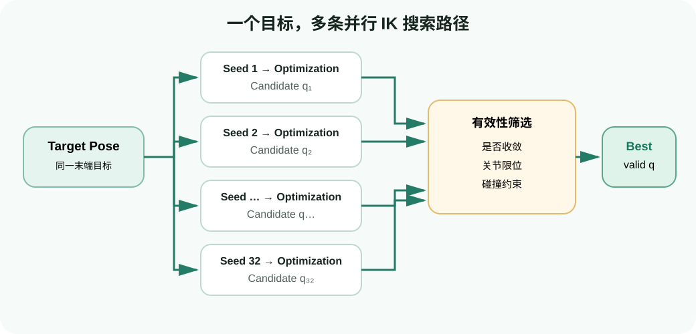

# 运动学实战：加载 Franka，跑通 FK、单目标 IK 与批量 IK

目标：使用 cuRoboV2 加载 Franka 配置，完成单次与批量正运动学、单目标与批量逆运动学，并能根据 tensor shape、joint order、四元数和误差判断结果是否可信。

## 前置条件

- 已完成上一节的 Conda 环境和 CUDA 自检；
- 当前目录是 `NVlabs/curobo` 仓库根目录；
- 当前进程只暴露 1 张 GPU；
- 代码基线为 cuRoboV2 v0.8.x。

本页先不加入环境障碍物。这样 IK 失败时，变量只剩机器人模型、目标位姿、seed 和收敛阈值。

## 先认清三个坐标对象

### 关节状态 `JointState`

Franka Panda 有一组按固定顺序排列的活动关节。关节位置 tensor 的最后一维必须与 `robot.joint_names` 完全一致：

```text
single: (1, dof)
batch:  (B, dof)
```

角度单位是弧度。不要把 ROS 消息里另一种 joint 顺序的数组直接塞进 cuRobo；应先按名称重排。

### 位姿 `Pose`

```text
position:   (..., 3), unit = meter
quaternion: (..., 4), order = (w, x, y, z)
```

单位四元数 `[1, 0, 0, 0]` 表示无旋转。若外部系统给的是 `(x, y, z, w)`，应显式转换，而不是“看结果大概对”就继续。

### tool frame

机器人配置可以定义一个或多个 tool frame。FK 会给出这些 frame 的位姿；IK 必须知道目标 pose 约束的是哪个 frame。官方 Franka 配置通过 `tool_frames` 暴露默认末端 frame，代码里不要硬猜名称。

## 实战一：加载 Franka 配置

```python
from curobo.kinematics import Kinematics, KinematicsCfg

config = KinematicsCfg.from_robot_yaml_file("franka.yml")
robot = Kinematics(config)

print("dof:", robot.get_dof())
print("joint names:", robot.joint_names)
print("tool frames:", robot.tool_frames)
```

`franka.yml` 不只是 URDF 路径。它还组织了 cuRobo 需要的运动学、关节限位、tool frame 和碰撞几何配置。后面迁移自定义机器人时，第一步不是改求解器，而是先保证这份配置能独立通过 FK。

## 实战二：单次 FK

```python
import torch

from curobo.types import JointState

q = torch.zeros(
    1,
    robot.get_dof(),
    device="cuda",
    dtype=torch.float32,
)

state = robot.compute_kinematics(
    JointState.from_position(q, joint_names=robot.joint_names)
)
ee_pose = state.tool_poses.get_link_pose(robot.tool_frames[0])

print("position:", ee_pose.position)
print("quaternion wxyz:", ee_pose.quaternion)
```

逐行理解：

1. `torch.zeros(1, dof)` 表示一组零位关节状态；
2. tensor 必须与求解器在同一 CUDA device 和 dtype；
3. `JointState.from_position` 将数值和 joint names 绑定；
4. `compute_kinematics` 计算整条运动链，而不只是末端；
5. `get_link_pose` 从 tool pose 集合中取出指定 link。

成功不能只看“没报错”。至少检查：

```python
assert ee_pose.position.shape[-1] == 3
assert ee_pose.quaternion.shape[-1] == 4
assert torch.isfinite(ee_pose.position).all()
assert torch.isfinite(ee_pose.quaternion).all()
```

## 实战三：批量 FK

官方示例一次计算 1000 组关节状态：

```python
batch_size = 1000
torch.manual_seed(42)

q_batch = torch.rand(
    batch_size,
    robot.get_dof(),
    device="cuda",
    dtype=torch.float32,
)

torch.cuda.synchronize()
start = torch.cuda.Event(enable_timing=True)
end = torch.cuda.Event(enable_timing=True)
start.record()

state_batch = robot.compute_kinematics(
    JointState.from_position(q_batch, joint_names=robot.joint_names)
)

end.record()
torch.cuda.synchronize()

print("elapsed ms:", start.elapsed_time(end))
print("tool positions:", state_batch.tool_poses.position.shape)
```

### 为什么计时前后要 synchronize

CUDA kernel 默认异步提交。若只用 Python 的 `time.time()` 包住调用，CPU 可能在 GPU 真正完成之前就读到结束时间。CUDA Event 加 `torch.cuda.synchronize()` 才能衡量这段 GPU 工作。

### 随机关节角是否一定合法

上面是官方教学示例的简化写法，用于展示 batch shape。真实应用不应默认 `[0, 1)` 内每个数都是合适的关节采样。更严谨的 benchmark 应从配置中的关节上下限采样，并检查碰撞和有限值。

运行课程脚本：

```bash
python labs/04-curobo/fk_batch.py --batch-size 1000 --seed 42
```

显存不足时先改为：

```bash
python labs/04-curobo/fk_batch.py --batch-size 128 --seed 42
```

一次只改 batch size，记录吞吐和最大显存，避免把 GPU 型号、batch 和代码版本同时改变。

## 从 FK 到 IK

FK 是 `q → pose`；IK 是寻找满足 `pose → q` 的解。由于机器人有冗余、关节限位和非线性，IK 通常需要从多个初值优化。



<div class="image-caption">同一目标位姿从多个 seed 并行开始优化，再经过收敛、关节限位和碰撞约束筛选，得到最优有效关节解。</div>

## 实战四：单目标 IK

```python
import torch

from curobo.inverse_kinematics import InverseKinematics, InverseKinematicsCfg
from curobo.types import GoalToolPose, Pose

ik_cfg = InverseKinematicsCfg.create(
    robot="franka.yml",
    num_seeds=32,
)
ik = InverseKinematics(ik_cfg)
target_link = ik.tool_frames[0]

goal_pose = Pose(
    position=torch.tensor(
        [[0.4, 0.0, 0.4]], device="cuda", dtype=torch.float32
    ),
    quaternion=torch.tensor(
        [[1.0, 0.0, 0.0, 0.0]], device="cuda", dtype=torch.float32
    ),
)

goal = GoalToolPose.from_poses(
    {target_link: goal_pose},
    num_goalset=1,
)
result = ik.solve_pose(goal)

print("success:", result.success)
if result.success.item():
    print("joint solution:", result.js_solution.position)
    print("position error mm:", result.position_error.item() * 1000)
```

### `num_seeds=32` 是什么

这是**一个目标**的 32 个并行初值。提高 seed 数通常能增加复杂目标找到解的机会，但会增加显存和计算量。初学阶段保持官方值；如果 4 GB 显存机器 OOM，再逐级尝试 16、8，并同时记录成功率。

### 为什么还要用 FK 回代

求解器给出的 `position_error` 已经提供收敛信息，但在工程接口接入阶段，最好用同一机器人模型再做一次 FK：

```python
solved_state = ik.kinematics.compute_kinematics(result.js_solution)
solved_pose = solved_state.tool_poses.get_link_pose(target_link)
fk_error = torch.linalg.norm(solved_pose.position - goal_pose.position, dim=-1)
print("FK check mm:", fk_error * 1000)
```

这能发现 joint names/order 在结果传递时被破坏的问题。

<video controls loop muted preload="metadata" class="doc-video">
  <source src="assets/get-started-ik.webm" type="video/webm">
</video>
<div class="image-caption">拖动末端目标后，求解器更新关节解；移动障碍物时可观察无碰撞解如何变化。</div>

## 实战五：批量 IK

现在沿 x 轴生成 100 个目标：

```python
n_poses = 100

ik_cfg = InverseKinematicsCfg.create(
    robot="franka.yml",
    num_seeds=32,
    max_batch_size=n_poses,
)
ik = InverseKinematics(ik_cfg)
target_link = ik.tool_frames[0]

positions = torch.zeros(n_poses, 3, device="cuda", dtype=torch.float32)
positions[:, 0] = torch.linspace(0.2, 0.8, n_poses)
positions[:, 2] = 0.4

quaternions = torch.zeros(n_poses, 4, device="cuda", dtype=torch.float32)
quaternions[:, 0] = 1.0

goal_poses = Pose(position=positions, quaternion=quaternions)
goal = GoalToolPose.from_poses(
    {target_link: goal_poses},
    num_goalset=1,
)
result = ik.solve_pose(goal)

success = result.success.squeeze()
n_success = int(success.sum().item())
print(f"solved: {n_success}/{n_poses}")

if n_success:
    errors_mm = result.position_error[success] * 1000
    print("mean error mm:", errors_mm.mean().item())
    print("max error mm:", errors_mm.max().item())
```

这里有两个规模参数：

```text
target batch = 100
seeds per target = 32
```

它们共同影响显存。`max_batch_size` 是求解器初始化时预留/允许的目标 batch 容量，不应小于本次实际目标数。

## 可达性图是批量 IK 的自然应用

批量 IK 不只是为了 benchmark。把目标点铺在空间网格上，并用 success mask 着色，就能得到工作空间可达性图：绿色表示存在 IK 解，红色表示未找到解。加入碰撞后，这张图还会反映障碍物和自碰撞约束。

<video controls loop muted preload="metadata" class="doc-video">
  <source src="assets/get-started-reachability.webm" type="video/webm">
</video>
<div class="image-caption">同一张 GPU 批量求解网格目标，并用颜色显示可达区域。</div>

官方交互命令：

```bash
python -m curobo.examples.getting_started.inverse_kinematics --reachability
```

浏览器默认打开 `http://localhost:8080`。远程服务器使用 SSH 时，需要端口转发：

```bash
ssh -L 8080:127.0.0.1:8080 user@server
```

## IK 失败的诊断顺序

### 目标 frame 是否正确

目标 pose 必须相对于机器人基坐标系表达。视觉系统输出的是 camera frame 时，应先做外参变换。

### 四元数顺序和归一化

```python
norm = torch.linalg.norm(goal_pose.quaternion, dim=-1)
print(norm)
```

应接近 1。`xyzw` 误当 `wxyz` 会改变目标姿态。

### 目标是否在工作空间内

将明显可达的目标（如官方 `[0.4, 0, 0.4]`）作为基线。若基线也失败，先查环境和模型；若只有远处目标失败，才考虑不可达。

### seed 是否太少

先保持目标不变，把 `num_seeds` 从 8 增到 16、32；如果成功率改善，说明问题与初值覆盖有关。但不要无限加 seed 掩盖模型或 frame 错误。

### batch 是否超过配置

实际 batch 大于 `max_batch_size` 时，求解器可能报 shape/buffer 错误。构造 solver 时按最大预期 batch 配置；运行期大幅变化时重新评估缓存和 CUDA Graph。

### 结果的 success 维度

批量结果不能用一个 `.item()` 判断。先 `squeeze()` 到对应目标维度，再用 mask 统计和索引误差。

## 参数建议

| 场景 | 目标 batch | seeds/目标 | 说明 |
|---|---:|---:|---|
| 学习单目标 | 1 | 32 | 与官方示例一致 |
| 抓取候选预筛 | 32～100 | 16～32 | 先根据显存测试 |
| 可达性网格 | 数百 | 8～32 | 网格密度、刷新率和成功率权衡 |
| 4 GB 显存排错 | 16 | 8 | 只用于先跑通，不代表最终配置 |

这些是起点而不是安全保证。不同机器人自由度、碰撞球数量和场景复杂度都会改变显存与求解难度。

## 自查问题

1. 为什么 `JointState.position` 的最后一维必须与 joint names 对齐？
2. 批量 FK 的 CUDA 计时为什么要 synchronize？
3. 100 个目标、每个 32 个 seed 与“batch size 3200”有什么相同和不同？
4. 为什么要用 FK 回代验证 IK？
5. IK success 为 False 时，为什么不应立刻增加 seed？

## 参考资料

- [cuRoboV2 Forward Kinematics 示例源码](https://github.com/NVlabs/curobo/blob/main/curobo/examples/getting_started/forward_kinematics.py)
- [cuRoboV2 Inverse Kinematics 教程](https://nvlabs.github.io/curobo/latest/getting-started/inverse_kinematics.html)
- [cuRoboV2 Inverse Kinematics 示例源码](https://github.com/NVlabs/curobo/blob/main/curobo/examples/getting_started/inverse_kinematics.py)
- [cuRoboV2 Python API](https://nvlabs.github.io/curobo/latest/reference/api_overview.html)
