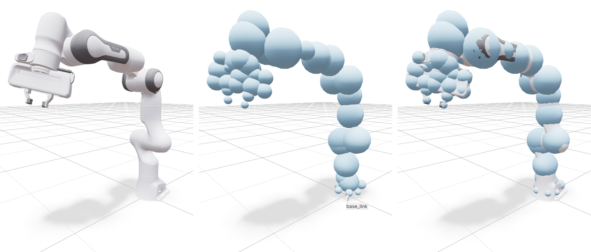
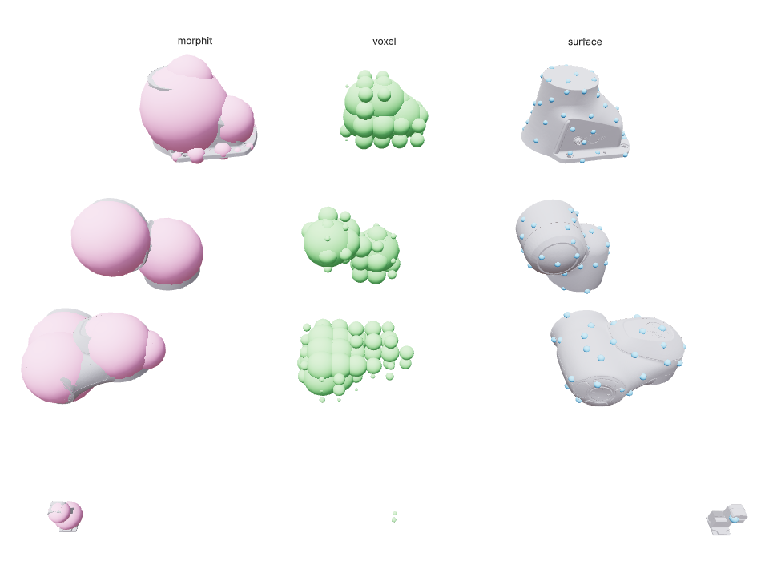
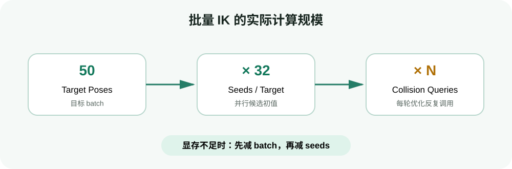

# 碰撞实战：从 collision spheres 到可动态更新的 Scene

目标：理解 cuRoboV2 的机器人碰撞球和场景表示，完成带桌面、自碰撞和运行期障碍物更新的无碰撞 IK，并能按坐标系、缓存和几何近似定位失败原因。

## 为什么上一节的 IK 还不够

上一节只要求末端到达目标位姿。它可能返回这样的关节解：

- 机械臂穿过桌面；
- 前臂与上臂互相穿透；
- 夹爪从障碍物内部到达目标；
- 数学上满足末端 pose，但没有安全路径可以从当前状态走过去。

本页先解决“终点关节状态是否无碰撞”。下一页再解决“从起点到终点的整条轨迹是否无碰撞”。

## 两类碰撞

### 自碰撞

机器人 link 之间的碰撞。例如 Franka 的手腕绕回去碰到前臂。相邻 link 的几何体常常天然重叠，某些 link 对由于机械结构永远不会相撞，因此配置中需要 `self_collision_ignore`，避免检查无意义的 pair。

### 环境碰撞

机器人与桌面、墙、夹具、货架等世界物体的碰撞。cuRoboV2 用 `Scene` 管理 `Cuboid`、`Sphere`、`Mesh` 等几何体，并用场景碰撞检查器为 IK/轨迹优化提供距离和梯度。

## 为什么机器人用 collision spheres

精确 mesh-mesh 查询开销高，而且不易为优化器提供稳定梯度。cuRobo 将每个 robot link 近似为一组球：


<div class="image-caption">左侧是 Franka mesh，右侧是用于 GPU 碰撞查询的 collision spheres。</div>

球—球、球—基本几何体的距离计算简单，GPU 可以同时处理大量 sphere pair。代价是几何近似：

- 球太少，可能漏掉细长或凹形区域；
- 球太大或突出 mesh，可能产生保守的“假碰撞”；
- 球太多，碰撞查询和显存开销增加。


<div class="image-caption">Sphere fitting 展示几何体如何被球集合近似。拟合质量直接影响规划可行性和保守程度。</div>

cuRoboV2 默认还能给球增加自碰撞 buffer。官方 self-collision 文档当前给出的默认 buffer 是 2 cm。这个 padding 让检查更保守，但它不是控制器误差、标定误差和制动距离的完整安全模型。

<div class="concept-note concept-red">碰撞优化成本不等于安全认证。真机仍需要保守几何、速度/加速度限制、独立的安全监控、急停和现场风险评估。</div>

## `Scene` 中的 pose 和尺寸

一个长方体障碍物：

```python
from curobo.scene import Cuboid, Scene

box = Cuboid(
    name="box_1",
    pose=[0.5, 0.0, 0.3, 1.0, 0.0, 0.0, 0.0],
    dims=[0.1, 0.3, 0.2],
)
scene = Scene(cuboid=[box])
```

字段含义：

```text
pose = [x, y, z, qw, qx, qy, qz]
dims = [size_x, size_y, size_z]
unit = meter
```

pose 应表达在机器人基坐标系下。若物体来自相机坐标系：

$$
{}^{base}T_{object} = {}^{base}T_{camera}\,{}^{camera}T_{object}
$$

先完成外参变换，再构造 `Scene`。不应通过反复微调障碍物数字来“试出一个不碰撞的位置”。

## 实战一：带桌面的单目标无碰撞 IK

官方仓库提供 `collision_table.yml`。用它创建 collision-aware IK：

```python
import torch

from curobo.inverse_kinematics import InverseKinematics, InverseKinematicsCfg
from curobo.types import GoalToolPose, Pose

goal_pose = Pose(
    position=torch.tensor(
        [[0.4, 0.0, 0.4]], device="cuda", dtype=torch.float32
    ),
    quaternion=torch.tensor(
        [[1.0, 0.0, 0.0, 0.0]], device="cuda", dtype=torch.float32
    ),
)

config = InverseKinematicsCfg.create(
    robot="franka.yml",
    scene_model="collision_table.yml",
    num_seeds=32,
    self_collision_check=True,
)
ik = InverseKinematics(config)
target_link = ik.tool_frames[0]

goal = GoalToolPose.from_poses(
    {target_link: goal_pose},
    num_goalset=1,
)
result = ik.solve_pose(goal)

print("success:", result.success)
if result.success.item():
    print("position error mm:", result.position_error.item() * 1000)
```

与上一节相比，新增的关键项是：

- `scene_model`：环境几何；
- `self_collision_check=True`：机器人自身碰撞约束；
- robot YAML 中的 collision spheres 与 ignore pair 配置。

若同一目标在普通 IK 中成功、在本例中失败，这是有价值的信息：目标的数学 IK 可达，但所有找到的候选都违反了碰撞约束，或碰撞模型过于保守。

## 实战二：运行期更新障碍物

如果物体会移动，不能每次都重建整个求解器。初始化时为可能出现的障碍物类型预留缓存：

```python
from curobo.scene import Cuboid, Scene

config = InverseKinematicsCfg.create(
    robot="franka.yml",
    scene_model="collision_table.yml",
    num_seeds=32,
    self_collision_check=True,
    collision_cache={"cuboid": 10},
)
ik = InverseKinematics(config)

new_obstacle = Cuboid(
    name="box_1",
    pose=[0.5, 0.0, 0.3, 1.0, 0.0, 0.0, 0.0],
    dims=[0.1, 0.3, 0.2],
)
ik.update_world(Scene(cuboid=[new_obstacle]))
result = ik.solve_pose(goal)
```

`collision_cache={"cuboid": 10}` 表示为 cuboid 预留容量。它不是“场景中必须有 10 个盒子”，而是运行期能在预分配结构中容纳的上限。缓存太小会导致更新失败或需要重建；缓存过大则占用更多内存。

<div class="concept-note concept-orange">把 `update_world` 视为提交当前版本的场景，而不是假设它一定与旧场景做增量合并。需要保留的桌面、墙和动态物体应按当前 cuRobo 版本的 Scene 更新语义完整组织，并用可视化确认。</div>

工程中通常还要保持稳定的障碍物名称。检测器每帧随机生成新 name，会使更新、启用/禁用和日志追踪都变得困难。

## 实战三：50 个目标的无碰撞 IK

```python
n_poses = 50

positions = torch.zeros(n_poses, 3, device="cuda", dtype=torch.float32)
positions[:, 0] = torch.linspace(0.3, 0.7, n_poses)
positions[:, 2] = 0.4

quaternions = torch.zeros(n_poses, 4, device="cuda", dtype=torch.float32)
quaternions[:, 0] = 1.0

goal_poses = Pose(position=positions, quaternion=quaternions)

config = InverseKinematicsCfg.create(
    robot="franka.yml",
    scene_model="collision_table.yml",
    num_seeds=32,
    max_batch_size=n_poses,
    self_collision_check=True,
)
ik = InverseKinematics(config)
target_link = ik.tool_frames[0]

result = ik.solve_pose(
    GoalToolPose.from_poses(
        {target_link: goal_poses},
        num_goalset=1,
    )
)

success = result.success.squeeze()
print(f"collision-free IK: {int(success.sum())}/{n_poses}")
```

运行课程脚本：

```bash
python labs/04-curobo/ik_batch_collision.py \
  --batch-size 50 \
  --num-seeds 32
```

这里同时存在三类开销：



<div class="image-caption">批量目标和每个目标的 seed 会同时放大优化规模，而每条候选解在优化过程中还要反复执行自碰撞与环境碰撞查询。</div>

因此无碰撞 IK 比普通 IK 更容易触发 OOM。缩放顺序建议：目标 batch 50→25→10，随后 seed 32→16→8。每一步记录成功率，避免只留下一个“能跑但几乎找不到解”的配置。

## 自碰撞 ignore 不是随意白名单

某些相邻 link 在 URDF 几何中持续重叠，若不 ignore，会让所有状态都被判为碰撞；另一些 link 由于机械限位永远碰不到，跳过可节省计算。但将真实可能相撞的 link pair 写进 ignore，会直接制造危险盲区。

cuRobo 的 RobotBuilder 可以采样关节配置并辅助生成 self-collision ignore matrix。自动结果仍应：

1. 用 Viser 检查碰撞球；
2. 检查关节上下限是否真实；
3. 对已知危险姿态做回归；
4. 保留生成参数和随机种子。

## safety buffer 应怎样理解

碰撞球 padding/safety buffer 相当于将机器人几何膨胀：

$$
r_{\mathrm{effective}}=r_{\mathrm{sphere}}+d_{\mathrm{buffer}}
$$

增大 buffer：

- 优点：对模型误差更保守；
- 代价：窄通道可能不再可行，IK/规划成功率下降。

减小 buffer：

- 优点：可通过更窄空间；
- 风险：无法覆盖标定误差、控制跟踪误差和柔性变形。

不要为了让一个目标成功就把 buffer 降到 0。先检查障碍物 frame、尺寸、机器人 collision spheres 和目标是否合理。

## 现象到原因的排错表

| 现象 | 优先检查 | 不要先做什么 |
|---|---|---|
| 所有目标都失败 | 机器人初始状态是否自碰撞、桌面是否与 base 球重叠 | 无限增加 seed |
| 普通 IK 成功、无碰撞 IK 全失败 | Scene frame/单位、sphere protrusion、ignore matrix | 关闭全部碰撞 |
| 更新场景时报容量问题 | `collision_cache` 的类型和数量 | 每帧重建 solver |
| 障碍物移动后结果不变 | 是否调用 `update_world`、名称/pose 是否更新 | 怀疑 GPU 缓存“坏了” |
| 明显穿模仍 success | 是否使用正确 Scene、相关 link 是否被错误 ignore | 只看末端误差 |
| 目标放到障碍物内部 | 目标 pose、tool 几何、允许接触策略 | 调大迭代次数 |

## 从无碰撞 IK 到完整轨迹

本页只验证终点状态满足约束。即使起点和终点都无碰撞，它们之间的直线插值仍可能穿过障碍物。下一节的 `MotionPlanner` 会对整条轨迹评估碰撞、平滑性和关节约束，并在直接优化困难时使用图规划提供绕行种子。

## 自查问题

1. 为什么 robot mesh 通常要拟合成 collision spheres？
2. 自碰撞 ignore matrix 中错误增加一个 pair 有什么风险？
3. `collision_cache={"cuboid": 10}` 是场景里障碍物的当前数量吗？
4. 为什么普通 IK 成功、无碰撞 IK 失败不一定是 bug？
5. 起点和终点都无碰撞，为什么仍需要轨迹规划？

## 参考资料

- [cuRoboV2 Inverse Kinematics](https://nvlabs.github.io/curobo/latest/getting-started/inverse_kinematics.html)
- [cuRoboV2 Robot Self-Collision](https://nvlabs.github.io/curobo/latest/reference/self_collision.html)
- [cuRoboV2 Sphere Fitting](https://nvlabs.github.io/curobo/latest/reference/sphere_fitting.html)
- [cuRoboV2 inverse_kinematics.py](https://github.com/NVlabs/curobo/blob/main/curobo/examples/getting_started/inverse_kinematics.py)
