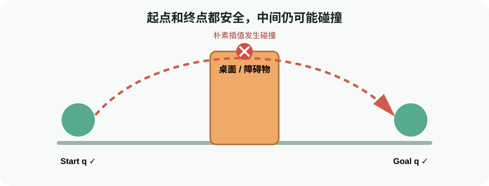
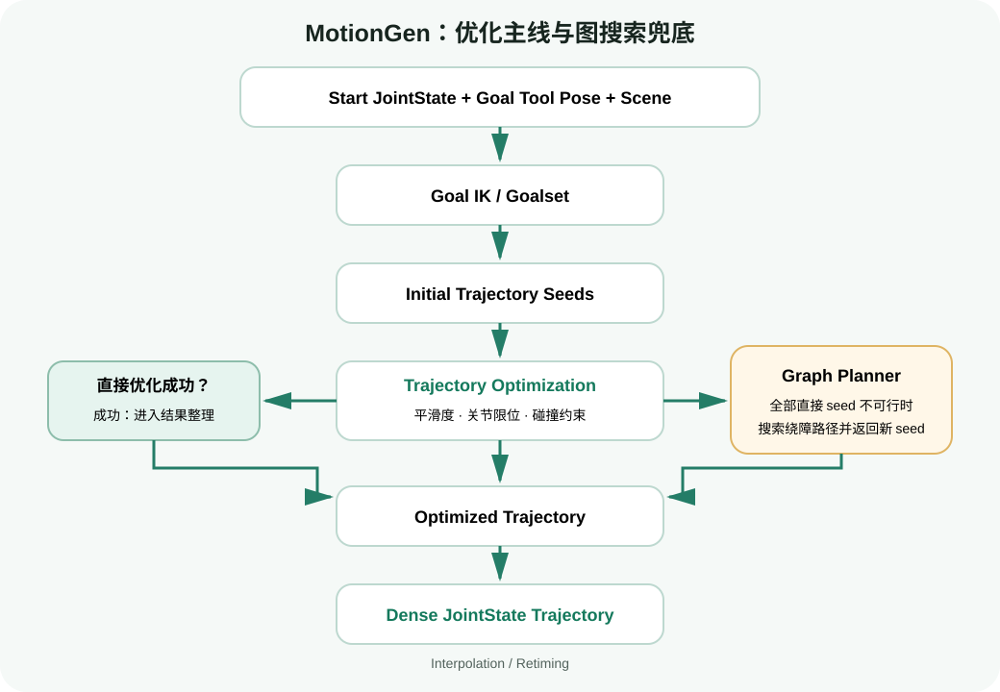
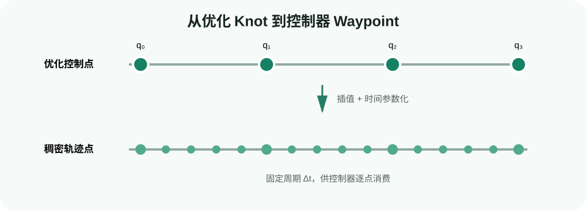

# 轨迹规划实战：使用 MotionPlanner 生成并检查避障轨迹

目标：使用 cuRoboV2 `MotionPlanner` 为 Franka 生成从当前关节状态到目标末端位姿的无碰撞轨迹，读取插值结果、检查时间与关节曲线，并按输入、IK、碰撞、优化和图规划分层定位失败。

## 本页要解决的缺口

上一页得到的是“无碰撞终点关节解”。但下面这条路径仍可能失败：



<div class="image-caption">只检查起点和终点是不够的：朴素关节插值仍可能让机械臂在中途穿过桌面或障碍物。</div>

完整运动规划要检查整个时间序列，而不是只检查两端。它还应让速度、加速度和 jerk 合理，避免控制器收到跳变命令。

## MotionPlanner 的输入与输出

| 对象 | 作用 | 本页实例 |
|---|---|---|
| robot config | 运动学、限位、碰撞球、tool frame | `franka.yml` |
| scene model | 桌面和障碍物 | `collision_test.yml` |
| start state | 当前关节位置 | `planner.default_joint_state` |
| goal | 目标 tool pose | `[0.5, 0.0, 0.3]` + 单位四元数 |
| result | success、求解耗时、优化轨迹 | `MotionPlannerResult` |
| interpolated plan | 更密的时间序列 | 控制器/绘图使用 |

### 为什么目标不是一个普通 `(1, 7)` tensor

运动规划器可能同时处理多个环境、多个 tool frame 和多个 goal candidate，因此 `GoalToolPose` 保留这些维度。官方单目标示例的位置 tensor 写成：

```python
position=torch.tensor([[[[[0.5, 0.0, 0.3]]]]], device="cuda")
```

不要靠肉眼数方括号。更稳妥的方式是使用 `GoalToolPose.from_poses(...)`，或在构造后打印 shape 并对照 API。

## 一次规划内部发生什么



<div class="image-caption">MotionGen 先求目标 IK 并优化多条轨迹 seed；直接优化失败时，图搜索负责绕开障碍并提供可行 seed，最后再插值和时间参数化。</div>

cuRoboV2 的图规划器采用 GPU 加速 PRM 思路，在配置空间中构图和寻找可行路径。它更像困难场景中的全局绕行补充，不等于每次请求都只跑 PRM。

## 实战一：初始化规划器

```python
from curobo.motion_planner import MotionPlanner, MotionPlannerCfg

config = MotionPlannerCfg.create(
    robot="franka.yml",
    scene_model="collision_test.yml",
)
planner = MotionPlanner(config)
```

创建配置时，cuRobo 会解析机器人 YAML、优化器 YAML 和 scene model。配置失败通常不是“规划算法不好”，而是路径、资源、API 版本或配置字段不匹配。

## 实战二：warmup

```python
planner.warmup(
    enable_graph=True,
    num_warmup_iterations=5,
)
```

warmup 会为后续求解准备 buffer，并可捕获 CUDA Graph。官方 getting-started 示例使用 5 次 warmup iteration。

记录性能时要分开：

| 指标 | 包含内容 | 用途 |
|---|---|---|
| initialization time | 配置解析、模型/scene 建立 | 部署启动成本 |
| warmup time | buffer、kernel/CUDA Graph 准备 | 进程预热成本 |
| first plan time | 首个真实请求 | cold request 观察 |
| subsequent plan time | 已预热后的连续请求 | 在线规划主要指标 |

如果每次请求都重新构建 `MotionPlanner`，就失去了缓存和 warmup 的意义。在线服务应尽量复用 planner，只更新状态、目标和场景。

## 实战三：构造起点

```python
from curobo.types import JointState

q_start = JointState.from_position(
    planner.default_joint_state.position.unsqueeze(0),
    joint_names=planner.joint_names,
)
```

官方示例使用配置的默认关节状态，便于复现。真实系统应从机器人状态接口获得当前位置，并完成：

1. 按 `planner.joint_names` 重排；
2. 转成弧度；
3. 检查 NaN、过期时间戳和关节限位；
4. 判断起点是否已经碰撞；
5. 若规划器需要速度/加速度，按接口补齐真实值而不是默认伪造。

## 实战四：构造目标 tool pose

```python
import torch

from curobo.types import GoalToolPose

goal_pose = GoalToolPose(
    tool_frames=planner.tool_frames,
    position=torch.tensor(
        [[[[[0.5, 0.0, 0.3]]]]],
        device="cuda",
        dtype=torch.float32,
    ),
    quaternion=torch.tensor(
        [[[[[1.0, 0.0, 0.0, 0.0]]]]],
        device="cuda",
        dtype=torch.float32,
    ),
)
```

再次确认：米、wxyz、机器人 base frame。若目标来自视觉系统，还应记录相机时间戳和外参版本；目标 pose 正确但过期，同样会导致机器人规划到错误位置。

## 实战五：发起规划

```python
result = planner.plan_pose(goal_pose, q_start)

if result is None or not result.success.any():
    raise RuntimeError("planning failed")

print("planning time s:", result.total_time)
```

`result is not None` 与 `result.success` 是两层检查。批量规划时 success 可能是 tensor，不能假设每个请求都成功；应按 request 维度保留 mask。

课程脚本可以直接运行：

```bash
python labs/04-curobo/motion_plan_franka.py \
  --output runs/04-curobo/motion-plan.json
```

当前课程仓库不会伪造 GPU 结果。脚本需要在已安装 cuRoboV2 的 Ubuntu/NVIDIA GPU 环境中运行，输出版本、设备、success、规划耗时、waypoint 数量和轨迹时长。

## 读取插值轨迹

```python
interpolated = result.get_interpolated_plan()
interp_dt = planner.trajopt_solver.config.interpolation_dt

n_waypoints = interpolated.position.shape[-2]
duration = n_waypoints * interp_dt

print("position shape:", interpolated.position.shape)
if interpolated.velocity is not None:
    print("velocity shape:", interpolated.velocity.shape)
if interpolated.acceleration is not None:
    print("acceleration shape:", interpolated.acceleration.shape)
print("waypoints:", n_waypoints)
print("dt:", interp_dt)
print("duration s:", duration)
```

官方示例的典型说明输出是约 250 个 waypoint、约 5 秒，但具体结果与版本、机器人配置、插值 dt 和目标有关。正确做法是检查 shape、有限值和限位，而不是硬编码必须等于 250。

### 优化 knot 与插值 waypoint

轨迹优化通常在较少的 knot 上求解，随后插值成更密的控制序列：



<div class="image-caption">优化器只需处理较稀疏的控制点；插值和时间参数化再将它们转换成控制器按固定周期消费的稠密轨迹点。</div>

插值不会自动修复一条错误轨迹。碰撞和动力学约束应在规划/验证阶段得到保证；控制器执行前仍应按系统合同再次检查。

## 轨迹至少检查什么

```python
assert torch.isfinite(interpolated.position).all()
assert interpolated.position.shape[-1] == len(planner.joint_names)
assert n_waypoints > 1
assert interp_dt > 0
```

工程验收还应包括：

- 每个关节位置在限位内；
- 速度、加速度、jerk 不超过机器人/控制器约束；
- 起点与实际当前状态足够接近；
- 终点 FK 满足目标误差；
- 每个 waypoint/连续段无碰撞；
- 时间戳严格单调；
- joint names 与控制器期望顺序一致。

## 画出关节曲线

官方示例会将插值轨迹保存为 PDF。最小绘图逻辑：

```python
import matplotlib.pyplot as plt

q = interpolated.position.squeeze(0).detach().cpu()
t = torch.arange(q.shape[0]) * interp_dt

for i, joint_name in enumerate(planner.joint_names):
    plt.plot(t, q[:, i], label=joint_name)

plt.xlabel("time [s]")
plt.ylabel("joint position [rad]")
plt.legend(ncol=2)
plt.tight_layout()
plt.savefig("runs/04-curobo/trajectory.pdf")
```

看图时重点找：

- 首尾跳变；
- 某个关节突然绕远路；
- 高频锯齿；
- 长时间贴着关节限位；
- 不同规划请求之间不连续。

位置曲线平滑也不能证明速度和加速度满足约束，应同时检查对应字段。

## Viser 交互规划

```bash
python -m curobo.examples.getting_started.motion_planning --visualize
```

浏览器打开 `http://localhost:8080` 后，可以拖动目标 frame 和障碍物，再触发 Move。这个入口适合回答三个问题：

1. 目标 pose 是否落在预期位置；
2. 障碍物坐标是否正确；
3. 规划器是否选择了合理绕行方向。

<video controls loop muted preload="metadata" class="doc-video">
  <source src="assets/get-started-motion-plan.webm" type="video/webm">
</video>
<div class="image-caption">在 Viser 中移动目标和障碍物，可触发并观察无碰撞轨迹规划。</div>

可视化不是安全验证器，但能快速发现 frame、尺寸和目标姿态错误。

## 规划失败的五层诊断

### 第一层：起点

- joint names/order 是否正确；
- 起点是否在关节限位内；
- 起点是否与 scene 或自身碰撞；
- 真实机器人是否仍在该起点附近。

### 第二层：目标

- base frame、米/毫米和 wxyz 是否正确；
- 目标是否可达；
- tool frame 是否正确；
- 目标是否位于障碍物内部。

### 第三层：目标 IK

先用上一节相同 scene 的 `InverseKinematics` 单独求目标。若目标 IK 全失败，继续调轨迹优化没有意义。

### 第四层：直接轨迹优化

目标 IK 成功但规划失败，检查从起点到目标的拓扑是否需要绕过大障碍物、碰撞球是否过度保守，以及 trajectory seed/优化配置。

### 第五层：图规划 fallback

窄通道或必须明显绕行时，检查图规划是否启用、scene 是否正确以及起点/目标是否在同一可行连通区域。图规划也无法解决被障碍物完全封闭的目标。

<div class="concept-note concept-green">排错原则：先证明输入可行，再调整求解参数。增加 seed 只能提高搜索覆盖，不能修复错误坐标系、碰撞中的起点或不可达目标。</div>

## 参数调整顺序

| 问题 | 第一调整项 | 第二调整项 | 同时记录 |
|---|---|---|---|
| OOM | 减少 batch/并发请求 | 减少 seed/cache | 峰值显存、成功率 |
| 目标 IK 偶发失败 | 增加 IK seed | 检查目标容差/姿态 | IK 成功率、误差 |
| 大障碍物绕不过 | 检查/启用 graph path | 增加合理 seed | graph 是否触发、总时延 |
| 轨迹过密/过长 | 检查 interpolation dt | 检查优化时间设置 | waypoint、duration、控制周期 |
| 在线首请求很慢 | 复用 planner + warmup | 固定 shape/CUDA Graph | cold/warm 延迟 |

不要一次改变所有 optimizer YAML 参数。每次实验固定机器人、scene、start、goal 和随机种子，才知道变化来自哪里。

## 进阶：三阶段抓取规划

官方 `plan_grasp` 将一个抓取拆成：

1. **Approach**：到预抓取位姿；
2. **Grasp**：沿接近方向进入抓取位姿；
3. **Lift**：抓取后沿抬升方向离开表面。

```bash
python -m curobo.examples.getting_started.motion_planning --mode grasp
```

抓取阶段可能需要对夹爪 link 碰撞采取任务相关策略。不要把“为接触临时禁用某些碰撞”扩展为全程关闭碰撞；应限制到明确 link、明确阶段和明确物体。

## 真机执行前的接口检查

`MotionPlanner` 返回的是规划结果，不是硬件安全许可。发送给控制器前至少确认：

1. 控制器 joint names、顺序和单位；
2. 控制周期与 `interpolation_dt`；
3. 当前状态与轨迹起点偏差；
4. 速度/加速度缩放；
5. 场景更新时间和传感器延迟；
6. 急停、watchdog 和独立碰撞监控；
7. 先在仿真、低速、无负载条件执行。

## 自查问题

1. 无碰撞 IK 解为什么不能替代轨迹规划？
2. warmup 时间和在线 solve 时间为什么要分开记录？
3. 优化 knot 与插值 waypoint 有什么区别？
4. 目标 IK 失败时，为什么不应先调图规划器？
5. `result.success` 为 True 后，还要对轨迹检查哪些条件？

## 参考资料

- [cuRoboV2 Motion Planning](https://nvlabs.github.io/curobo/latest/getting-started/motion_planning.html)
- [cuRoboV2 motion_planning.py](https://github.com/NVlabs/curobo/blob/main/curobo/examples/getting_started/motion_planning.py)
- [cuRoboV2 Graph Planner](https://nvlabs.github.io/curobo/latest/concepts/graph_planner.html)
- [cuRoboV2 Optimization Solvers](https://nvlabs.github.io/curobo/latest/concepts/optimization_solver.html)
