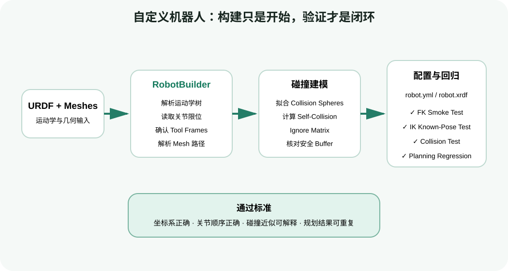
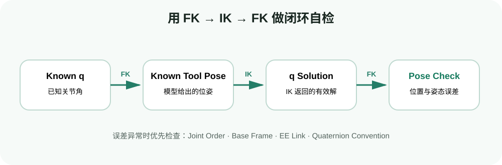
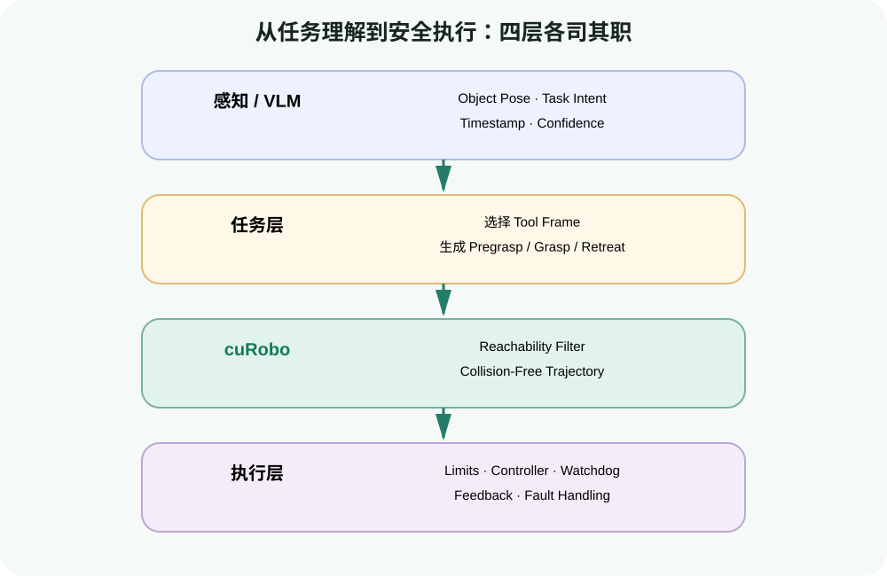
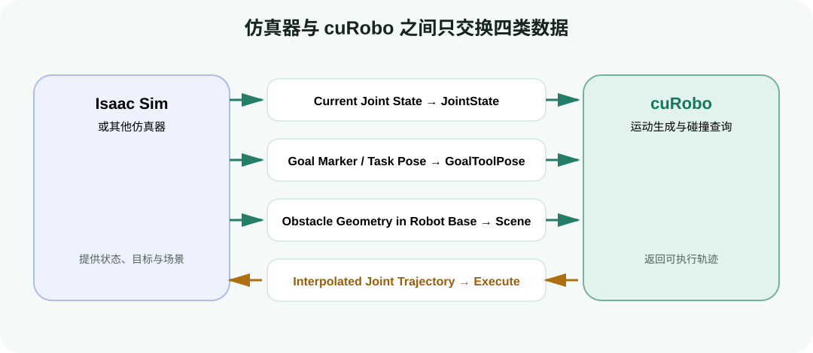

# 工程实战：导入自定义机器人并接入仿真/机器人系统

目标：从 URDF 和 mesh 生成 cuRoboV2 机器人配置，拟合并检查 collision spheres、导出 YAML/XRDF，完成 FK→IK 最小验收，并明确与视觉、Isaac Sim、ROS 2 和控制器的接口边界。

## 为什么“有 URDF”还不够

URDF 能描述 link、joint、visual/collision mesh 和关节关系，但 cuRobo 的 GPU 求解还需要：

- 明确的 base/root 与 tool frames；
- 活动关节顺序和限位；
- 每个 link 的 collision spheres；
- self-collision ignore matrix；
- mesh 资源可解析的路径；
- 可选的浮动基座/额外 link 配置。

因此自定义机器人导入不是“把 URDF 路径填进 `MotionPlanner`”。稳妥流程是：



<div class="image-caption">自定义机器人接入不是简单转换文件：解析模型后，还要拟合碰撞球、生成自碰撞忽略矩阵，并通过 FK、IK、碰撞和规划回归测试。</div>

## 第一步：整理输入资产

建议目录：

```text
my_robot/
├── urdf/
│   └── robot.urdf
└── meshes/
    ├── base.stl
    ├── link1.stl
    └── ...
```

检查清单：

| 项 | 要求 | 常见坑 |
|---|---|---|
| 长度单位 | URDF 和 mesh 使用一致尺度，cuRobo 按米理解 | CAD 导出 mm，机器人放大 1000 倍 |
| mesh 路径 | `package://` 前缀能映射到 `--asset-path` | 路径在 ROS 中可用，在独立 Python 中找不到 |
| joint axis | 方向和 parent/child frame 正确 | FK 姿态镜像或旋转方向相反 |
| joint limits | 与真实硬件一致 | 规划器产生硬件拒绝的关节角 |
| collision mesh | 简化且封闭更易拟合 | 视觉高模、薄片或空 mesh 导致拟合差 |
| tool frame | 明确夹爪/工具中心 | IK 对准 wrist 而不是 TCP |

先用 URDF 工具或 RViz 检查模型，不要把明显错误的 URDF 交给 sphere fitting。

## 第二步：用官方 RobotBuilder 生成配置

cuRoboV2 提供官方命令：

```bash
python -m curobo.examples.getting_started.build_robot_model \
  --urdf my_robot/urdf/robot.urdf \
  --asset-path my_robot \
  --tool-frames tool0 \
  --output my_robot.yml \
  --compute-metrics \
  --seed 42
```

`--asset-path` 应是能够解析 URDF mesh 剩余相对路径的目录。若 URDF 写的是：

```xml
<mesh filename="package://my_robot/meshes/link1.stl"/>
```

官方 builder 会处理 `package://` 前缀，但 asset path 仍要指到能找到 `my_robot/meshes/link1.stl` 的位置。最可靠的方法是打印最终解析路径并检查文件存在。

### Franka 官方基线命令

在修改自己的机器人前，先用仓库自带 Franka 跑通：

```bash
python -m curobo.examples.getting_started.build_robot_model \
  --urdf curobo/content/assets/robot/franka_description/franka_panda.urdf \
  --asset-path curobo/content/assets/robot/franka_description \
  --output /tmp/franka_custom.yml \
  --clip-link panda_link0 z 0.0 \
  --compute-metrics \
  --seed 42
```

如果 Franka 基线都失败，先修环境/版本；只有 Franka 成功而自定义机器人失败，才集中排查自定义资产。

## collision sphere 拟合参数

RobotBuilder 会为每个 link 的 mesh 拟合球集合。官方推荐的 MorphIt 会在覆盖率与突出量之间优化。

| 参数 | 含义 | 调大后的影响 |
|---|---|---|
| `--sphere-density` | 自动球数量的倍率，默认 1.0 | 覆盖更细，但查询和显存开销增加 |
| coverage weight | 惩罚 mesh 内部未覆盖区域 | 球更倾向填满几何体 |
| protrusion weight | 惩罚球突出 mesh | 更少假碰撞，但可能留下覆盖空洞 |
| `--clip-link LINK z 0.0` | 限制球不越过 link-local 平面 | 适合固定底座，防止球伸入地面 |
| `--seed 42` | 固定 NumPy/PyTorch 随机性 | 便于复现与比较 |

球多并不自动等于更安全。一个位置错误的大球比多个精确球更糟；质量评估要结合可视化和指标。

## 阅读拟合质量指标

`--compute-metrics` 会输出每个 link 的指标：

| 指标 | 解释 | 过差时的风险 |
|---|---|---|
| coverage | 内部采样点被球覆盖的比例 | 过低可能漏碰撞 |
| protrusion | 球表面突出 mesh 的比例 | 过高造成保守假碰撞 |
| protrusion distance | 突出点距 mesh 的距离 | 某些方向留出过大虚假体积 |
| surface gap | mesh 表面到最近球表面的空隙 | 过大可能漏掉接触 |
| volume ratio | 球总体积与 mesh 体积之比 | 只能辅助，不宜单独判断 |

不要只追求 coverage=100%。机器人规划更关心在任务工作空间、常见姿态和接触区域中的几何误差。

## 用 Viser 检查碰撞球

```bash
python -m curobo.examples.getting_started.build_robot_model \
  --urdf my_robot/urdf/robot.urdf \
  --asset-path my_robot \
  --tool-frames tool0 \
  --output my_robot.yml \
  --compute-metrics \
  --seed 42 \
  --visualize
```

浏览器访问 `http://localhost:8080`，逐 link 检查：

- 球是否覆盖真实 collision geometry；
- 是否有球漂到远处，通常意味着 mesh scale/origin 错误；
- base 球是否伸入地面/安装台；
- 夹爪指尖是否过度膨胀；
- 左右对称 link 是否出现明显不对称拟合。


<div class="image-caption">Franka collision sphere 可视化。自定义机器人应达到同样“能逐 link 解释每个球为何在这里”的可审计程度。</div>

## self-collision ignore matrix

RobotBuilder 会采样关节配置，识别：

- 始终重叠但机械上允许的相邻 link；
- 在关节限位内采样时从不相撞、可跳过检查的 pair；
- 需要保留检查的真实风险 pair。

增加采样数可提高覆盖，但仍不能数学证明某 pair 永不相撞。对于双臂、人形或带长工具机器人，应添加任务相关危险姿态回归。

如果要手工 ignore 某 pair，先保存可复现案例和可视化证据。不要因为“规划总失败”就批量 ignore link。

## 导出 YAML 与 XRDF

```bash
python -m curobo.examples.getting_started.build_robot_model \
  --urdf my_robot/urdf/robot.urdf \
  --asset-path my_robot \
  --tool-frames tool0 \
  --output my_robot.yml \
  --export-xrdf \
  --seed 42
```

- YAML 是 cuRobo 原生配置入口；
- XRDF 是 NVIDIA 机器人生态中常见的机器人描述扩展，可用于 Isaac Sim/Isaac Lab 相关集成；
- 两种文件都应与 URDF、mesh 和生成命令一起版本化；
- 不要只提交生成文件而丢失输入资产和生成参数。

## 最小验收一：FK

```python
import torch

from curobo.kinematics import Kinematics, KinematicsCfg
from curobo.types import JointState

robot = Kinematics(KinematicsCfg.from_robot_yaml_file("my_robot.yml"))
q = torch.zeros(1, robot.get_dof(), device="cuda", dtype=torch.float32)
state = robot.compute_kinematics(
    JointState.from_position(q, joint_names=robot.joint_names)
)

tool_pose = state.tool_poses.get_link_pose(robot.tool_frames[0])
assert torch.isfinite(tool_pose.position).all()
assert torch.isfinite(tool_pose.quaternion).all()
print(robot.joint_names)
print(robot.tool_frames)
print(tool_pose.position, tool_pose.quaternion)
```

与独立 FK 工具/厂商标称姿态对比。有限值只证明数学计算没有 NaN，不证明 frame 定义正确。

## 最小验收二：已知位姿 IK

不要一上来随便设一个空间目标。先从一组已知安全关节角做 FK 得到目标，再让 IK 求回去：



<div class="image-caption">用已知关节角做 FK，再对所得位姿做 IK，最后再次做 FK；这个闭环能快速暴露坐标系、关节顺序和 tool frame 配置错误。</div>

这个 round trip 能验证：

- tool frame 可被 IK 约束；
- 关节限位和名称可用；
- solver 能找到同一位姿的某个合法解；
- FK 回代误差在容差内。

注意 IK 解不一定等于原始 q，因为冗余机器人可用不同关节姿态到达同一末端 pose。

## 最小验收三：碰撞和规划

按顺序增加复杂度：

1. 无场景单目标 IK；
2. 开启 self collision；
3. 加一个远离机器人的桌面；
4. 把桌面移到真实位置；
5. `MotionPlanner` 从 default/retract state 到已知目标；
6. 加入一个需要明显绕行的盒子。

若直接从第 1 步跳到第 6 步，失败时无法区分模型、sphere、scene 还是 planner。

## 与视觉/VLM 的接口

上游感知或 VLM 不应直接输出未经约束的关节轨迹。更清晰的合同是：



<div class="image-caption">上层负责理解目标和生成任务意图，cuRobo 负责可达性与无碰撞运动，执行层负责限位、控制、监控与反馈。</div>

目标 pose 还应带 frame id 和时间戳。只有 `[x,y,z,qw,qx,qy,qz]` 数组而没有 frame，不能构成可靠接口。

## 与 ROS 2 / MoveIt 2 的接口

典型数据映射：

| ROS/MoveIt 侧 | cuRobo 侧 | 关键检查 |
|---|---|---|
| `sensor_msgs/JointState` | `JointState` | 名称重排、时间戳、弧度 |
| TF 中目标 pose | `Pose` / `GoalToolPose` | 转到 robot base frame、wxyz |
| Planning Scene 障碍物 | `Scene` | 几何支持、名称、增量/全量语义 |
| cuRobo 插值轨迹 | controller trajectory | joint 顺序、dt、限位和起点连续性 |

MoveIt 2 可以继续负责 ROS 2 生命周期、场景维护和控制器接口，cuRobo 负责 GPU 求解。选择“替代”还是“组合”取决于项目，不应在教程中宣称一方天然取代另一方。

## 与 Isaac Sim 的边界

旧版 v0.7.x 官方文档展示了 `UsdHelper → WorldConfig → MotionGen` 流程，但这些 API 属于 legacy 文档。当前 v2 入门仓库以 Viser、`Scene`、`MotionPlanner` 和 XRDF 为主；因此本组只规定稳定的数据边界：



<div class="image-caption">仿真器向规划端提供当前关节状态、目标和统一坐标系下的障碍物；cuRobo 返回插值后的关节轨迹供仿真器执行。</div>

<div class="concept-note concept-orange">除非项目明确固定到 v0.7.8，否则不要复制 legacy 页面里的 <code>examples/isaac_sim/motion_gen_reacher.py</code> 并与 v2 安装步骤混用。先在所选 cuRobo/Isaac Sim 版本组合上找到官方可运行示例，再写适配层。</div>

## 真机部署检查表

1. 机器人 YAML/URDF 与真实硬件固件和工具一致；
2. TCP、相机外参和 base frame 已标定；
3. joint limits、速度和加速度限制与控制器一致；
4. 场景包含桌面、底座、夹具和固定设施；
5. 动态障碍物有延迟/不确定性处理；
6. 轨迹起点与实时状态偏差受控；
7. 有独立 watchdog、急停和硬件安全限制；
8. 先仿真，再低速、短距离、无负载执行；
9. 记录每次规划的输入、scene 版本、solver 版本和结果；
10. 规划失败时保持安全状态，不执行旧轨迹。

## 自查问题

1. 为什么标准 URDF 不能直接提供完整的 cuRobo 碰撞配置？
2. coverage 高而 protrusion 也高时，会带来什么规划现象？
3. `--clip-link base_link z 0.0` 解决哪类问题？
4. 为什么已知 q→FK→IK 的 round trip 比随便指定目标更适合首次验收？
5. 旧版 Isaac Sim 示例为什么不能直接接到 cuRoboV2？

## 参考资料

- [cuRoboV2 build_robot_model.py](https://github.com/NVlabs/curobo/blob/main/curobo/examples/getting_started/build_robot_model.py)
- [cuRoboV2 Sphere Fitting](https://nvlabs.github.io/curobo/latest/reference/sphere_fitting.html)
- [cuRoboV2 Robot Self-Collision](https://nvlabs.github.io/curobo/latest/reference/self_collision.html)
- [cuRoboV2 Python API](https://nvlabs.github.io/curobo/latest/reference/api_overview.html)
- [cuRobo v0.7.x Using with Isaac Sim（legacy）](https://curobo.org/get_started/2b_isaacsim_examples.html)
