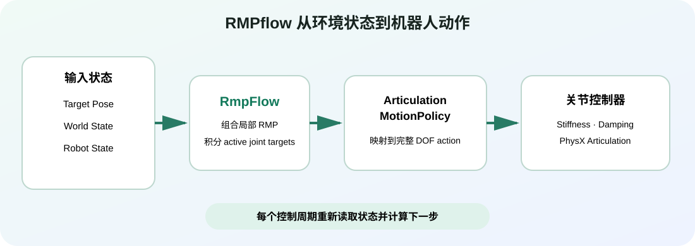

# RMPflow 实战

目标：在 Isaac Sim 4.5 中，从零搭建 Lula RMPflow 环境，让 Franka 跟随末端目标、实时绕开动态障碍物，并掌握控制循环调试和自定义机器人配置方法。

RMPflow 是一种反应式运动策略：它持续读取机器人和世界的当前状态，在每个控制周期重新计算下一步关节目标。它擅长“目标正在变化、障碍物也可能移动”的局部运动生成，但不承诺像全局规划器那样在复杂迷宫中一定找到路径。

目标、世界状态和机器人状态进入 RmpFlow，经过 ArticulationMotionPolicy 映射成完整关节动作，最后由 articulation controller 执行。

## 为什么接在 MoveIt 2 和 cuRobo 后面

三者解决的问题有交集，但观察世界的方式不同：

| 工具 | 更像什么 | 适合的主任务 | 需要警惕的误解 |
|---|---|---|---|
| MoveIt 2 | ROS 2 规划集成框架 | Planning Scene、规划管线、轨迹执行和工程集成 | 不只是一个 OMPL 规划器 |
| cuRobo | GPU 加速运动生成库 | 批量 IK、碰撞查询和全轨迹优化 | 不是仿真器，也不是控制器 |
| RMPflow | 逐帧反应式 motion policy | 目标跟随、局部避障、关节限位和阻尼组合 | 不是完备全局规划器 |

一个常见工程组合是：全局规划器给出较远期的路线或中间目标，RMPflow 在执行阶段持续跟踪当前目标并对局部变化作出反应。是否这样组合，应由任务、安全要求和控制接口决定，而不是把它们强行理解成互斥替代品。

## 学习路径

| 小节 | 核心问题 | 可验证产出 |
|---|---|---|
| [RMPflow 入门：从局部运动策略到反应式控制管线](03-rmpflow-practice/01-rmpflow-mental-model-and-ecosystem.md) | 多个互相竞争的运动策略怎样合成一个关节动作？ | 能解释 RMP、Lula、MotionPolicy 和控制器的职责 |
| [环境与首个实战：安装 Isaac Sim 4.5 并让 Franka 跟随目标](03-rmpflow-practice/02-installation-and-first-target.md) | Conda 环境怎样搭，最小目标跟随循环怎样写？ | 完成安装自检并运行 Franka 目标跟随 |
| [动态避障实战：维护 World State、障碍物与机器人基座](03-rmpflow-practice/03-dynamic-obstacles-and-world-state.md) | 为什么 Stage 中有障碍物，RMPflow 却不一定知道？ | 注册、移动和更新障碍物，正确同步 base pose |
| [控制循环实战：从 RmpFlow 输出到机械臂真实运动](03-rmpflow-practice/04-control-loop-and-articulation-policy.md) | 策略输出如何变成 9 DOF 机械臂动作，时间步怎样配？ | 读懂 active joints 映射并比较不同控制周期 |
| [调试与调参实战：看见 collision spheres，分离策略与控制问题](03-rmpflow-practice/05-debugging-and-parameter-tuning.md) | 机械臂表现异常时，问题在策略还是 PD 控制器？ | 使用可视化和 ignore state updates 完成分层诊断 |
| [自定义机器人实战：从 URDF 到可调试的 RMPflow 配置](03-rmpflow-practice/06-custom-robot-configuration.md) | 自己的机械臂需要哪些配置，如何验收？ | 建立 URDF、robot description、RMP config 三文件闭环 |

## 本组统一实验口径

| 项目 | 默认设置 |
|---|---|
| Isaac Sim | 4.5.0 |
| Python | 3.10，独立 Conda 环境 `isaacsim-rmpflow` |
| 操作系统 | Ubuntu 20.04/22.04 为主，补充 Windows 10/11 命令 |
| GPU | 1 张带 RT Core 的 NVIDIA RTX GPU |
| 最低硬件 | 32 GB RAM、50 GB SSD、RTX 3070、8 GB VRAM |
| 机器人 | Franka Emika Panda |
| 任务规模 | 1 台机器人、1 个当前目标、少量动态障碍物 |
| 单位 | 米、弧度、秒；四元数按 Isaac Sim API 约定核对 |

RMPflow 不是训练模型，没有 epoch、optimizer 或训练 `batch_size`。本组不设置多卡；真正需要记录的是 physics dt、控制回调 dt、render dt 和 RMPflow 的 `maximum_substep_size`。如果看到教程要求填写 batch size，先确认它讲的是不是 Isaac Lab 并行环境，而不是本章的 Lula RMPflow。

版本边界：本组固定 Isaac Sim 4.5.0。Isaac Sim 5.x 的包名、资产路径和 API 可能变化，不要把 latest 文档中的代码直接混入 4.5.0 环境。

## 怎么读

第一次使用 Isaac Sim 时，请按顺序阅读。第二页先把“能启动 Isaac Sim”和“RMPflow 代码正确”分开验证；第三页才加入世界状态；第四页再拆控制时间步；第五页专门处理最容易混淆的策略/控制器问题。已有受支持机器人可以跳过最后一页，但不要跳过调试页。

本组示例按官方 4.5.0 文档核对。只有在相同版本、受支持 RTX GPU 上实际运行并保存证据后，才把结果称为本课程实测；页面中的官方界面图不能当作本机运行证明。

## 参考资料

- [Lula RMPflow 官方教程](https://docs.isaacsim.omniverse.nvidia.com/4.5.0/manipulators/manipulators_rmpflow.html)
- [RMPflow 概念与配置](https://docs.isaacsim.omniverse.nvidia.com/4.5.0/manipulators/concepts/rmpflow.html)
- [Motion Policy Algorithm](https://docs.isaacsim.omniverse.nvidia.com/4.5.0/manipulators/concepts/motion_policy.html)
- [RMPflow Tuning Guide](https://docs.isaacsim.omniverse.nvidia.com/4.5.0/manipulators/concepts/rmpflow_tuning_guide.html)
