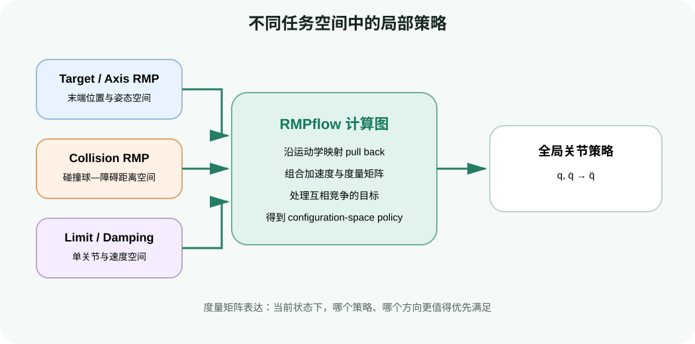
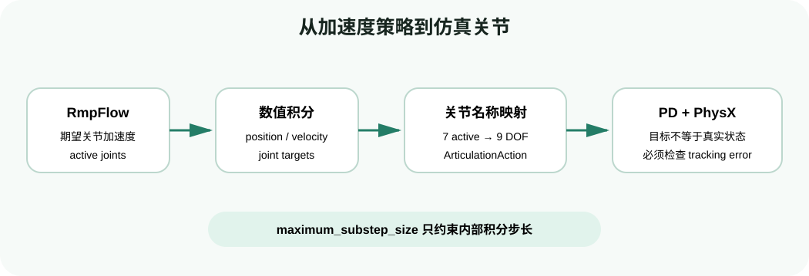

# RMPflow 入门：从局部运动策略到反应式控制管线

目标：理解 RMPflow 如何组合目标跟随、避障、限位和阻尼策略，并能说清 Lula 算法、Isaac Sim articulation 与 PD 控制器之间的数据边界。

## 先从一个会变化的任务开始

假设机械臂正伸向桌上的零件。人把零件向左移动，同时一个盒子进入机械臂前方。此时系统不能只执行几秒前生成的固定动作：它需要持续读取目标、障碍物和机器人当前状态，再决定下一小步怎么动。

RMPflow 的思路不是先生成一条很长的离散路径，而是不断回答：

> 在当前状态下，为了接近目标、远离障碍、避开关节限位并保持平滑，下一瞬间最合适的关节加速度是什么？

官方 `MotionPolicy` 接口要求算法在每一帧接收世界与机器人状态，并在几毫秒级计算下一帧的关节位置/速度目标。这正是后面所有代码循环的核心。

## 一个 RMP 包含什么

一个 Riemannian Motion Policy 可以先粗略理解为一对量：

$$\mathcal{R}=(\mathbf{a},\mathbf{M})$$

- $\mathbf{a}$：该局部策略希望产生的加速度。例如目标策略想把末端拉向目标，碰撞策略想把碰撞球推离障碍物。
- $\mathbf{M}$：度量矩阵，表达策略在当前状态下关注哪些方向、权重有多大。它不是机器人 URDF 中的真实惯量矩阵。

如果多个策略已经在同一空间，直观合成可写成：

$$\mathbf{a}_{\mathrm{combined}}=\left(\sum_i \mathbf{M}_i\right)^{\dagger}\left(\sum_i \mathbf{M}_i\mathbf{a}_i\right)$$

$\dagger$ 表示伪逆。真实 RMPflow 还要把末端空间、碰撞距离空间、单关节空间等不同 task space 的策略沿计算图 pull back 到机器人 configuration space。初学阶段先抓住一句话：每个局部策略不仅提出“想怎么动”，还表达“现在这件事有多重要、哪些方向更重要”。

目标吸引、障碍排斥、关节限位和阻尼在各自任务空间工作，RMPflow 将它们统一合成关节空间策略。

## Lula 实现提供哪些局部策略

| RMP | 主要作用 | 何时权重应明显上升 |
|---|---|---|
| `target_rmp` | 驱动末端位置靠近目标 | 目标存在，尤其接近目标时需要稳定收敛 |
| `axis_target_rmp` | 对齐末端坐标轴和目标姿态 | 同时给定 orientation target 时 |
| `collision_rmp` | 让机器人 collision spheres 远离障碍物 | 距离障碍物进入作用半径且速度朝向障碍物时 |
| `joint_limit_rmp` | 避免接近 URDF 上下限 | 关节靠近限位时 |
| `joint_velocity_cap_rmp` | 接近最大速度时增加阻尼 | 关节速度进入 damping region 时 |
| `cspace_target_rmp` | 把冗余自由度偏向默认姿态 | 多组关节解都能达到同一目标时 |
| `damping_rmp` | 抑制过快运动和振荡 | 末端相对目标运动过快时 |

这些策略可能竞争：目标在障碍物另一侧时，target RMP 想直走，collision RMP 想绕开；手臂接近关节限位时，c-space 偏好也会改变姿态。RMPflow 的价值就在于把竞争关系变成连续、随状态变化的加权组合。

## 从加速度到机器人动作

RMPflow 内部产生加速度策略，但普通 articulation controller 通常接收关节位置和速度目标。Lula 使用数值积分将策略向前推进，再由 `ArticulationMotionPolicy` 完成关节映射。

RmpFlow 只控制配置中声明的 active joints；包装层将结果放回完整 DOF 向量，再交给关节控制器。

各对象的职责：

| 对象 | 负责什么 | 不负责什么 |
|---|---|---|
| `RmpFlow` | 保存目标和障碍物、组合 RMP、计算 active joint targets | 不直接驱动 USD articulation |
| `ArticulationMotionPolicy` | 读取机器人关节状态、映射 active joints、生成 `ArticulationAction` | 不决定 RMP 参数 |
| `ArticulationAction` | 携带完整 articulation 的位置/速度目标 | 不是已执行的真实状态 |
| articulation controller | 用 stiffness/damping/effort 驱动仿真关节 | 不负责理解障碍物和目标 |

## Active joints 与 watched joints

Franka articulation 有 9 个 DOF：7 个手臂关节和 2 个夹爪关节。RMPflow 的任务是移动手臂，通常只把前 7 个关节设为 active；夹爪可以由抓取逻辑单独控制。

- `get_active_joints()`：RMPflow 直接输出目标的关节。
- `get_watched_joints()`：算法需要读取但不直接控制的关节。
- 未由 RMPflow 控制的 DOF 在包装动作中不应被随意覆盖。

这解释了为什么“RMPflow 返回 7 维，机器人却有 9 DOF”不是 shape 错误。真正需要核对的是关节名称和顺序，而不是盲目补两个零。

## World State 与 Stage 不是一回事

Isaac Sim 的 USD Stage 是场景事实来源，但 `RmpFlow` 不会自动把所有 prim 当作障碍物。程序必须通过 `add_obstacle()` 注册受支持对象，并用 `update_world()` 触发位置更新。机器人 base pose 也要通过 `set_robot_base_pose()` 明确同步，尤其是移动底座。

官方 4.5.0 文档说明 RMPflow 世界表示支持 sphere、capsule 和 cuboid。把一个 cone 放入 Stage 并不代表它会被避开；未实现类型会打印 warning。这个边界将在动态避障页实际验证。

## 它为什么不是全局规划器

RMPflow 根据当前局部几何和目标连续反应。在 U 形障碍、狭窄通道或需要先远离目标才能绕行的场景中，它可能停在局部平衡点。MoveIt 2 或 cuRobo 可以负责生成全局路径、中间 waypoint 或可行轨迹，RMPflow 再负责局部跟踪与扰动响应。

判断是否该用 RMPflow，可以问：

- 任务是否需要每帧响应移动目标或动态障碍？
- 局部避障失败时，系统是否有全局重规划或人工恢复机制？
- 控制器能否稳定跟随 RMPflow 给出的关节目标？
- 安全要求是否允许仅依赖仿真 collision spheres？

## 小结与自查

读到这里，你应能回答：

1. 为什么 RMP 中除了期望加速度还需要度量矩阵？
2. `collision_rmp` 和 `target_rmp` 冲突时，RMPflow 在做什么？
3. 为什么 Franka 的 RMPflow 输出可能是 7 维，而 articulation 有 9 DOF？
4. 为什么 Stage 中看得见一个障碍物，RMPflow 仍可能撞上它？

下一页开始搭建环境并完成第一次目标跟随。

## 参考资料

- [RMPflow 概念与配置](https://docs.isaacsim.omniverse.nvidia.com/4.5.0/manipulators/concepts/rmpflow.html)
- [Motion Policy Algorithm](https://docs.isaacsim.omniverse.nvidia.com/4.5.0/manipulators/concepts/motion_policy.html)
- [RMPflow 论文](https://arxiv.org/abs/1811.07049)
