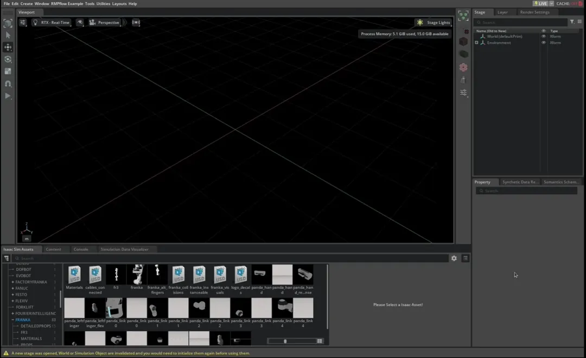

# 环境与首个实战：安装 Isaac Sim 4.5 并让 Franka 跟随目标

目标：创建独立的 Isaac Sim 4.5 Conda 环境，完成 GUI/headless 自检，并运行一个可移动目标驱动的 Franka RMPflow 控制循环。

## 本页运行口径

| 项目 | 设置 |
|---|---|
| Isaac Sim | 4.5.0 |
| Python | 3.10 |
| GPU | 1 张受支持 RTX GPU；不使用多卡 |
| 任务规模 | 1 台 Franka、1 个目标；无 batch size |
| 初始目标 | 位置 `[0.5, 0.0, 0.7]` m，姿态由欧拉角 `[0, π, 0]` 转换 |
| RMPflow 内部最大子步长 | 官方 Franka 示例 `0.00334` s |

预计耗时：已有 Isaac Sim 缓存约 30～60 分钟；首次下载完整包和 extension 可能更久。至少预留 50 GB SSD 空间。

## 安装前不要只看显存

Isaac Sim 4.5 官方最低要求包括 32 GB RAM、RTX 3070、8 GB VRAM 和 50 GB SSD。GPU 必须带 RT Core；A100、H100 即使显存很大也不受支持。

```bash
nvidia-smi
python --version
df -h
```

Windows 可用 PowerShell 检查：

```powershell
nvidia-smi
python --version
Get-PSDrive -PSProvider FileSystem
```

如果使用已安装的 Isaac Sim Workstation 包，优先运行其 Compatibility Checker。Linux 还应确认 GLIBC 2.34+；Windows 应开启 long path support，避免深层 extension 路径安装失败。

## 为什么不用课程通用环境

Isaac Sim 固定 Python 3.10，并包含大量 Omniverse/Kit 依赖。把它直接装进通用 `embodied` 环境，容易与 PyTorch、NumPy、ROS 或其他仿真器版本冲突。因此单独创建环境：

```bash
conda create -n isaacsim-rmpflow python=3.10 -y
conda activate isaacsim-rmpflow
python -m pip install --upgrade pip
```

安装 4.5.0 完整包和 extension cache：

```bash
pip install 'isaacsim[all]==4.5.0' --extra-index-url https://pypi.nvidia.com
pip install 'isaacsim[extscache]==4.5.0' --extra-index-url https://pypi.nvidia.com
```

PowerShell 中单引号同样可用。`extscache` 不是另一套 Isaac Sim；它把常用 Kit/physics extension 缓存提前安装，减少第一次运行时从 registry 下载的等待。

<div class="concept-note concept-orange">不要省略版本号。直接安装 latest 可能得到 Isaac Sim 5.x，而本组代码、资产路径和截图按 4.5.0 核对。</div>

## EULA 与第一次启动

第一次 import `isaacsim` 会要求接受 Omniverse License Agreement。交互式终端可以阅读后输入确认；CI 或 headless 环境只有在使用者已经同意许可时，才设置：

```bash
export OMNI_KIT_ACCEPT_EULA=YES
```

Windows：

```powershell
$env:OMNI_KIT_ACCEPT_EULA = "YES"
```

第一次启动仍可能花数分钟初始化 shader/cache。不要因为窗口短时间无响应就强制结束；先观察终端是否仍在下载或编译。

## 最小安装自检

配套脚本：`labs/04-rmpflow/check_isaacsim_install.py`。

```bash
python labs/04-rmpflow/check_isaacsim_install.py --headless
```

脚本的正确生命周期是：先创建 `SimulationApp`，再导入依赖 Kit 的 Isaac Sim 模块，最后在 `finally` 中关闭应用。

```python
from isaacsim import SimulationApp

simulation_app = SimulationApp({"headless": True})
try:
    import isaacsim.robot_motion.motion_generation as motion_generation

    print("motion_generation:", motion_generation.__name__)
finally:
    simulation_app.close()
```

成功标准不是某个固定 FPS，而是：进程能初始化 Kit、导入 motion generation extension、正常关闭且退出码为 0。

## 第一次目标跟随的五个阶段

完整脚本：`labs/04-rmpflow/first_target.py`。运行 GUI：

```bash
python labs/04-rmpflow/first_target.py
```

无窗口运行：

```bash
python labs/04-rmpflow/first_target.py --headless --steps 600
```

### 创建仿真和资源

```python
simulation_app = SimulationApp({"headless": args.headless})

world = World(stage_units_in_meters=1.0)
world.scene.add_default_ground_plane()

robot_usd = get_assets_root_path() + "/Isaac/Robots/Franka/franka.usd"
add_reference_to_stage(robot_usd, "/World/Franka")
robot = world.scene.add(Articulation("/World/Franka", name="franka"))
```

`get_assets_root_path()` 返回 `None` 时，不要继续字符串拼接；这通常表示资产服务器不可用或网络配置有问题。

### 加载受支持机器人配置

```python
config = load_supported_motion_policy_config("Franka", "RMPflow")
rmpflow = RmpFlow(**config)
articulation_policy = ArticulationMotionPolicy(robot, rmpflow)
```

官方也演示了手动传入 `robot_description_path`、`urdf_path`、`rmpflow_config_path`、`end_effector_frame_name` 和 `maximum_substep_size=0.00334`。对于受支持机器人，优先使用 loader，减少路径拼错；自定义机器人页再手动管理三份配置。

### 每帧更新目标并执行

```python
target_position, target_orientation = target.get_world_pose()
rmpflow.set_end_effector_target(target_position, target_orientation)

action = articulation_policy.get_next_articulation_action(step_size)
robot.apply_action(action)
```

这里的 `step_size` 是本帧经过的仿真时间，不是目标 batch，也不是固定写死的装饰参数。它影响 RMPflow 内部积分。

### Reset 和关闭

在 `world.reset()` 之后重新初始化 articulation 句柄并恢复目标。普通模式下 RMPflow基本无状态；如果后面启用了 `set_ignore_state_updates(True)`，reset 时必须调用 `rmpflow.reset()`。

## 你应该观察到什么



<div class="image-caption">目标 frame 改变后，Franka 持续生成平滑关节目标；后续章节将在同一循环中加入障碍物和调试可视化。</div>

GUI 中拖动目标 frame 后，机械臂应逐步追踪目标。Headless 模式至少检查：

- `get_supported_robot_policy_pairs()` 中存在 Franka/RMPflow 配置；
- action 的 joint indices、positions 或 velocities 不是空值；
- 数组中没有 NaN/Inf；
- 运行指定 steps 后正常关闭。

## 常见问题

| 现象 | 优先检查 |
|---|---|
| `No matching distribution` | Python 是否为 3.10、是否添加 NVIDIA extra index、系统是否受支持 |
| 首次启动长时间等待 | extension 是否仍在下载；是否安装 `extscache`；代理与证书是否可用 |
| `get_assets_root_path()` 为 `None` | 资产服务器连接、网络和 Isaac Sim 资源配置 |
| import 顺序报错 | 是否在 `SimulationApp` 创建前导入了依赖 Kit 的模块 |
| 目标移动但机器人不动 | timeline 是否播放、world 是否 step、articulation 是否 initialize、action 是否 apply |
| 机器人剧烈振荡 | physics/control dt、articulation PD gains、目标是否突变；不要先乱改 RMP 参数 |
| 程序退出后仍有进程 | 是否在 `finally` 中调用 `simulation_app.close()` |

## 自查

1. 为什么 Isaac Sim 环境要固定 Python 3.10？
2. `extscache` 解决的是运行期下载还是 RMPflow 算法性能？
3. `load_supported_motion_policy_config()` 替你准备了哪些配置？
4. 为什么 `step_size` 不能被理解成 batch size？

## 参考资料

- [Python Environment Installation](https://docs.isaacsim.omniverse.nvidia.com/4.5.0/installation/install_python.html)
- [Isaac Sim Requirements](https://docs.isaacsim.omniverse.nvidia.com/4.5.0/installation/requirements.html)
- [Lula RMPflow Tutorial](https://docs.isaacsim.omniverse.nvidia.com/4.5.0/manipulators/manipulators_rmpflow.html)
