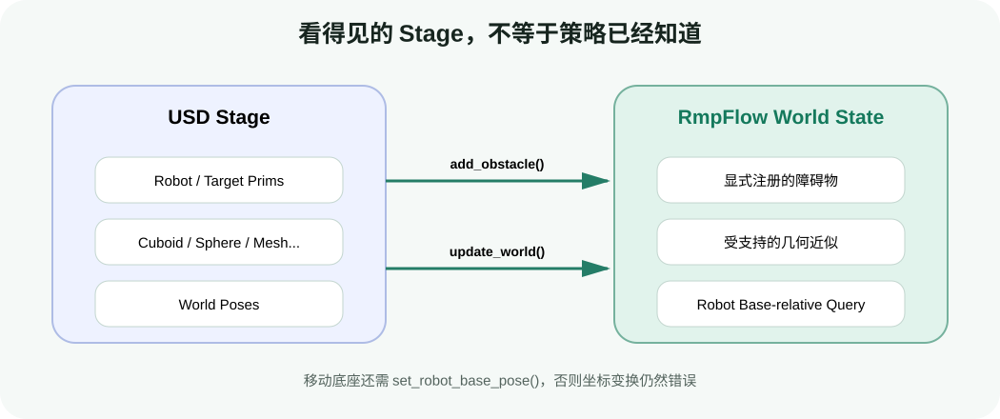

# 动态避障实战：维护 World State、障碍物与机器人基座

目标：在目标跟随循环中注册并移动障碍物，正确调用 `update_world()` 和 `set_robot_base_pose()`，让 RMPflow 使用与 USD Stage 一致的世界状态。

## 本页运行口径

| 项目 | 设置 |
|---|---|
| GPU | 1 张 RTX GPU |
| 场景 | 1 台 Franka、1 个目标、1 个 `FixedCuboid` |
| batch size | 不适用；每帧更新一个场景状态 |
| 更新频率 | 与控制 callback 一致 |
| 坐标 | USD world pose；长度单位米 |

上一页只有目标，没有障碍物。现在加入一个蓝色立方体，并允许它在仿真过程中移动。

## 两份“世界”必须显式同步



<div class="image-caption">USD Stage 保存可见场景，RmpFlow 只跟踪显式注册的受支持障碍物；每帧更新会读取这些对象的新位姿。</div>

把物体放进 Stage 只解决“仿真中存在这个 prim”。RMPflow 要避开它，还需要：

1. 用 Isaac Sim object wrapper 表示障碍物；
2. 调用 `add_obstacle()` 注册；
3. 障碍物移动后调用 `update_world()`；
4. 移动基座时同步 base pose。

漏掉任何一步，都可能出现“画面里明明有盒子，机械臂却穿过去”。

## 创建并注册障碍物

完整脚本：`labs/04-rmpflow/dynamic_obstacle.py`。

```python
from isaacsim.core.api.objects import FixedCuboid

obstacle = world.scene.add(
    FixedCuboid(
        prim_path="/World/obstacle",
        name="obstacle",
        position=np.array([0.4, 0.0, 0.65]),
        size=0.05,
        color=np.array([0.0, 0.2, 1.0]),
    )
)

accepted = rmpflow.add_obstacle(obstacle)
if accepted is False:
    raise RuntimeError("RMPflow did not accept the obstacle")
```

对象 wrapper 很重要：RMPflow 会通过它在运行时查询 USD pose。不要只把 `/World/obstacle` 字符串传给算法，也不要把视觉 mesh 默认当作碰撞表示。

官方 MotionPolicy 文档指出，RMPflow 当前支持 sphere、capsule 和 cuboid。其他对象 adder 若未实现会产生 warning。教程遇到 cone、复杂 mesh 或自定义 prim 时，应先转换为受支持的保守近似，而不是忽略 warning。

## 每帧更新的正确顺序

```python
target_position, target_orientation = target.get_world_pose()
rmpflow.set_end_effector_target(target_position, target_orientation)

rmpflow.update_world()

base_position, base_orientation = robot.get_world_pose()
rmpflow.set_robot_base_pose(base_position, base_orientation)

action = articulation_policy.get_next_articulation_action(step_size)
robot.apply_action(action)
```

推荐固定这个顺序：先把本帧目标和世界状态交给策略，再计算动作。若先计算动作、后更新障碍物，策略至少会使用上一帧的障碍物位置；低频控制或快速障碍物下，这个延迟会变得明显。

`update_world()` 查询的是已经注册的障碍物，不是遍历 Stage。障碍物没有移动时仍可调用，代码更简单；在严格性能预算下可以降低世界更新频率，但必须明确最坏延迟。

## 让障碍物移动

教学脚本使用正弦轨迹，便于复现：

```python
t = frame_index * step_size
position = np.array([0.42, 0.18 * np.sin(0.8 * t), 0.62])
obstacle.set_world_pose(position=position)
```

在 GUI 中也可以拖动 cuboid。无论由代码还是鼠标修改，只要每帧调用 `update_world()`，RMPflow 都会读取新位姿。

测试时不要一开始放很多障碍物。先按以下顺序增加难度：

1. 障碍物远离直线路径，确认目标跟随仍正常；
2. 障碍物静止在路径侧面，观察末端绕行；
3. 障碍物缓慢横穿路径；
4. 障碍物速度提高，但不瞬移到机械臂内部；
5. 目标和障碍物同时移动。

## 移动底座为什么要单独处理

障碍物 wrapper 返回 world pose，而 RMPflow 的机器人模型以 robot base 为参考。固定在世界原点的机械臂可以依赖默认假设；机械臂装在移动平台上时，必须同步：

```python
base_position, base_orientation = robot.get_world_pose()
rmpflow.set_robot_base_pose(base_position, base_orientation)
```

若不更新，RMPflow 会把世界障碍物投影到错误的机器人坐标系中。常见症状是：底座平移后避障方向明显错误，或者 collision sphere 可视化与机器人 mesh 分离。

<div class="concept-note concept-orange">不要把末端目标先手工变换到 base frame，同时又把 base pose 传给 RMPflow；重复变换会造成新的坐标错误。遵循 API 的 world-pose 合同。</div>

## 启用、禁用和移除障碍物

运行时可能需要暂时忽略一个物体。使用 MotionPolicy 的 obstacle 管理接口，而不是只隐藏 prim：

- disable：对象仍注册，但暂不参与策略；
- enable：重新参与；
- remove：从策略的跟踪集合删除；
- 删除 USD prim 前，先从策略移除对应 wrapper。

这些调用应检查返回值或 warning。名字不匹配、对象未注册或类型不受支持时，不要假设操作已经成功。

## 怎样判断避障成功

仅看末端有没有撞到蓝色方块不够。至少检查：

- collision spheres 没有进入障碍物；
- 机器人 link mesh 没有明显穿透；
- 末端仍在障碍物移开后继续接近目标；
- 关节目标没有 NaN/Inf；
- 目标被完全封死时，机器人能减速或停住，而不是数值爆炸。

RMPflow collision spheres 是近似模型，不是安全认证。真实机器人还需要独立的限位、碰撞监测、速度限制和急停链路。

## 失败诊断表

| 现象 | 可能原因 | 检查方式 |
|---|---|---|
| 完全不避障 | 忘记 `add_obstacle()` | 检查返回值和注册时 warning |
| 只避开初始位置 | 忘记 `update_world()` | 在每帧更新前后打印障碍物 pose |
| 移动底座后方向错误 | 未更新 base pose | 可视化 collision spheres 与 mesh 是否重合 |
| 某种几何体被忽略 | 类型不受支持 | 查看 warning；改成 sphere/capsule/cuboid 近似 |
| 目标附近抖动 | 目标/障碍物瞬移，或控制器跟不上 | 限制移动速度，转到调试页分离策略和 PD |
| 机器人停住不绕行 | 局部平衡或目标不可达 | 移开障碍、增加中间目标，必要时用全局规划器 |

## 自查

1. `update_world()` 会自动发现 Stage 中的新 prim 吗？
2. 为什么移动底座时，仅更新障碍物还不够？
3. 隐藏一个 cuboid 的视觉属性是否等于从 RMPflow 删除它？
4. RMPflow 停在障碍物前为什么不一定是软件错误？

## 参考资料

- [Lula RMPflow：World State](https://docs.isaacsim.omniverse.nvidia.com/4.5.0/manipulators/manipulators_rmpflow.html)
- [Motion Policy：Inputs World State](https://docs.isaacsim.omniverse.nvidia.com/4.5.0/manipulators/concepts/motion_policy.html)
