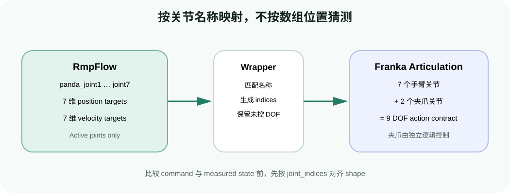

# 控制循环实战：从 RmpFlow 输出到机械臂真实运动

目标：拆开 motion policy、关节映射和 PD 控制三层，正确设置控制时间步，并能判断“策略目标正确但机器人没跟上”的问题。

## 本页运行口径

| 项目 | 设置 |
|---|---|
| GPU | 1 张 RTX GPU |
| 机器人 | Franka 9 DOF articulation；RMPflow 控制 7 个手臂关节 |
| 默认实验 | 比较 60 Hz 与 120 Hz 控制回调 |
| RMPflow 参数 | 使用官方 Franka 配置，不在本页改 RMP gains |
| 重点变量 | physics dt、control dt、render dt、`maximum_substep_size` |

## 一条动作经历了什么



<div class="image-caption">RMPflow 只为 active joints 计算目标，包装层根据关节名称映射到完整 DOF；夹爪关节保留给独立控制逻辑。</div>

在官方 Franka 示例中：

```python
rmpflow = RmpFlow(**config)
articulation_policy = ArticulationMotionPolicy(robot, rmpflow)

action = articulation_policy.get_next_articulation_action(step_size)
robot.apply_action(action)
```

三行代码背后有三层合同：

1. `RmpFlow` 根据 active/watched joint states 和世界状态计算下一步 active joint targets；
2. `ArticulationMotionPolicy` 根据关节名称把 7 维目标映射到 Franka 的 9 DOF；
3. articulation controller 用 drive stiffness、damping 和 effort limit 追踪这些目标。

不要手工假设“前 7 个就是手臂，后 2 个就是夹爪”。先检查：

```python
print("active:", rmpflow.get_active_joints())
print("watched:", rmpflow.get_watched_joints())
print("articulation:", robot.dof_names)
```

名称或顺序不一致时，应修配置或映射，不能靠补零碰运气。

## 四个容易混淆的时间量

| 时间量 | 作用 | 典型错误 |
|---|---|---|
| physics dt | PhysX 每次推进的时间 | 以为它自动等于渲染帧率 |
| render dt | 画面刷新时间 | 为提高 FPS 改它，却误判控制策略变化 |
| control dt / `step_size` | 相邻两次策略输出间隔 | 写死为 1/60，但实际 callback 丢帧或频率不同 |
| `maximum_substep_size` | RMPflow 内部 Euler integration 最大步长 | 把它当成 physics dt 或 batch size |

若控制步长为 $\Delta t$，内部最大子步长为 $h_{max}$，RMPflow 至少需要：

$$N_{substep}=\left\lceil\frac{\Delta t}{h_{max}}\right\rceil$$

例如官方 Franka 示例的 `maximum_substep_size=0.00334` s；当控制周期约 1/60 s 时，内部会拆成多个更小积分步。更小的最大子步可能改善数值稳定性，但增加计算量；更大则更快，却可能在高速或强避障场景中变得粗糙。

## 60 Hz 与 120 Hz 对照实验

配套脚本：`labs/04-rmpflow/inspect_control_loop.py`。

```bash
python labs/04-rmpflow/inspect_control_loop.py --control-hz 60 --steps 600
python labs/04-rmpflow/inspect_control_loop.py --control-hz 120 --steps 1200
```

不要只看“哪个更顺”。记录：

- 实际 `step_size` 的均值、最大值和抖动；
- 目标位姿与实际末端位姿误差；
- active joint target 与实际 joint position 误差；
- 最大关节速度；
- 每次 `get_next_articulation_action()` 耗时；
- 是否发生 NaN、限位或 effort saturation。

两组实验应尽量覆盖相同的仿真时长和目标运动。120 Hz 运行 1200 步与 60 Hz 运行 600 步，才能比较约 10 秒行为。

## 策略输出和真实状态不能混为一谈

假设 RMPflow 给出关节目标 $q_d$，PD controller 大致产生：

$$\tau=K_p(q_d-q)+K_d(\dot q_d-\dot q)$$

如果 $K_p$ 太小或 effort limit 太低，机器人会明显滞后；如果 damping 不足，可能振荡。此时提高 `target_rmp` gain 只会让策略更激进，不会自动修好底层控制器。

建议同时记录：

```python
command = action.joint_positions
measured = robot.get_joint_positions()
tracking_error = command - measured
```

注意 `ArticulationAction` 可能通过 `joint_indices` 只描述部分 DOF。比较前先按 indices 对齐，不能直接让 7 维和 9 维数组相减。

## GUI、Headless 与 Extension callback

- GUI：适合拖动目标和看 collision spheres，但渲染负载会影响墙钟时间。
- Headless：适合重复实验和记录指标；仍需正确创建 `SimulationApp` 与推进 world。
- Extension callback：适合交互式工具。callback 接收的 step 应来自仿真框架，不要用 `time.time()` 临时猜测。

算法比较应优先使用仿真时间，而不是画面 FPS。GUI 卡顿不一定代表 control dt 变大；要读实际 callback step。

## Reset 的正确顺序

一个稳妥的 reset 流程：

1. 暂停控制 callback；
2. `world.reset()`；
3. 重新初始化 articulation/controller 句柄；
4. 恢复目标和障碍物状态；
5. 若启用了内部 rollout，调用 `rmpflow.reset()`；
6. 同步 base pose 与 world state；
7. 恢复 callback。

Reset 后继续使用失效的 articulation view，是“第一次运行正常，第二次全是 NaN”的常见原因。

## 分层排错

| 检查层 | 问题 | 证据 |
|---|---|---|
| Motion policy | active joint target 是否合理？ | action 有限、连续、不越界 |
| Joint mapping | 名称和 indices 是否对齐？ | active names 与 DOF names 一一对应 |
| Controller | 实际关节是否跟上目标？ | tracking error、effort saturation |
| Physics | dt、碰撞和 drive 是否稳定？ | physics warnings、接触穿透、速度异常 |
| Rendering | 只是画面卡还是仿真时间也慢？ | 仿真 step 与 wall time 分开记录 |

## 自查

1. `maximum_substep_size` 和 physics dt 有什么区别？
2. 为什么 7 维 action 不能直接与 9 维 measured joints 相减？
3. RMPflow 轨迹平滑但 mesh 明显落后，优先调哪一层？
4. 为什么比较 60 Hz/120 Hz 时要保持相同仿真时长？

## 参考资料

- [Motion Policy：Robot Joint Targets](https://docs.isaacsim.omniverse.nvidia.com/4.5.0/manipulators/concepts/motion_policy.html)
- [Lula RMPflow Tutorial](https://docs.isaacsim.omniverse.nvidia.com/4.5.0/manipulators/manipulators_rmpflow.html)
