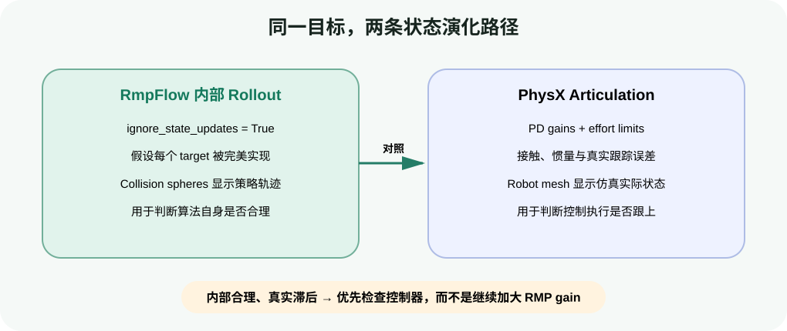

# 调试与调参实战：看见 collision spheres，分离策略与控制问题

目标：使用 RMPflow 内置可视化和内部 rollout 分离算法与控制器问题，并按可重复顺序调节 target、collision、限位和阻尼参数。

## 本页运行口径

| 项目 | 设置 |
|---|---|
| GPU | 1 张 RTX GPU |
| 场景 | Franka、移动目标、单个 cuboid |
| batch size | 不适用 |
| 初始配置 | 官方 Franka RMPflow 配置 |
| 调参原则 | 一次只改一组参数；保存 dt、PD gains 和场景 |

机械臂表现异常时，至少有三种完全不同的原因：

1. RMPflow 的内部机器人/世界表示错了；
2. RMPflow 策略本身给出了不理想的关节目标；
3. 关节目标合理，但 articulation controller 没跟上。

如果不先分层，常见结果是同时修改 RMP gain、PD stiffness、physics dt 和 collision spheres，最后即使“看起来好了”也无法解释原因。

## 先让内部状态可见

完整示例：`labs/04-rmpflow/debug_rmpflow.py`。

```python
rmpflow.visualize_collision_spheres()
rmpflow.visualize_end_effector_position()
```

停止显示时使用对应接口：

```python
rmpflow.stop_visualizing_collision_spheres()
rmpflow.stop_visualizing_end_effector()
```

Collision spheres 应随每个 link 一起运动，并对 mesh 做合理覆盖。重点看：

- 是否有 link 完全没有球；
- 球是否离开对应 link；
- 球是否过大，导致明明有间隙却始终被判为靠近障碍；
- 夹爪 fixed joint 状态是否与生成 robot description 时一致；
- base 移动后，球是否与 mesh 分离。

末端位置可视化显示的是 RMPflow 内部相信的 nominal end-effector position。它和实际末端差距很大时，优先检查 URDF、joint order、base pose、controller tracking 和 reset，而不是先调 obstacle repulsion。

## 用 ignore state updates 分离策略和控制器

```python
rmpflow.set_ignore_state_updates(True)
rmpflow.visualize_collision_spheres()
```

普通模式下，每帧 `compute_joint_targets(...)` 会读取仿真 articulation 的 active joint state。开启 ignore 后，RMPflow 不再相信仿真反馈，而是假设自己上一次返回的目标被完美执行，并在内部继续 rollout。

这不是正常运行模式，而是诊断工具。它回答的问题是：

> 如果机器人能完美跟随每个关节目标，RMPflow 自己计划出的运动是否合理？



<div class="image-caption">内部 collision spheres 显示策略相信的机器人，mesh 显示 PhysX 中的真实 articulation；二者差距可暴露控制跟踪问题。</div>

| 内部可视化 | 真实机器人 | 更可能的问题 |
|---|---|---|
| 轨迹合理 | 跟随合理 | 基线正常 |
| 轨迹合理 | 明显滞后/振荡 | PD gains、effort limit、physics 或 joint mapping |
| 轨迹撞障碍/不收敛 | 忠实跟随 | RMP 参数、collision model、目标或世界状态 |
| 二者都异常 | 无法直接归因 | 先修模型/坐标/reset，再重复分离实验 |

关闭诊断或 reset 时：

```python
rmpflow.set_ignore_state_updates(False)
rmpflow.reset()
```

若忘记 reset，内部 rollout 状态可能与 reset 后的 articulation 不一致。

## 故意制造一个 PD 问题

官方教程通过显著降低 proportional gains 演示“策略正常、机器人落后”：

```python
controller = robot.get_articulation_controller()
kps, kds = controller.get_gains()
controller.set_gains(kps=kps / 50.0, kds=kds)
```

只在教学场景中这样做，并保存原始 gains，结束后恢复。观察 collision spheres 与 mesh：内部策略可能平滑绕障，但真实机器人明显落后。这证明算法输出和控制执行必须分别验证。

## 调 RMPflow 前先固定实验

每次调参至少记录：

```text
Isaac Sim version / robot config / target pose / obstacle pose
physics dt / control dt / maximum_substep_size
articulation Kp, Kd and effort limits
RMP parameters changed in this run
minimum obstacle distance / final pose error / max joint speed
oscillation, local minimum or limit warning
```

固定目标和障碍轨迹，重复相同仿真时长。一次只改一组参数，并把原配置保存在版本控制中。

## 官方建议的逐项启用思路

RMPflow 配置有 50 多个参数。官方 Tuning Guide 建议先把各 RMP 的 `metric_scalar` 或 `metric_weight` 设为 0（target RMP 还涉及多个 metric scalar），再从简单行为逐项启用。教学上采用以下顺序：

1. `target_rmp`：只验证末端能否平稳接近位置目标；
2. `cspace_target_rmp` 与 `damping_rmp`：处理冗余姿态和速度衰减；
3. `collision_rmp`：加入单个静态障碍；
4. `axis_target_rmp`：再加入 orientation target；
5. `joint_limit_rmp`：把目标放到容易靠近限位的位置；
6. `joint_velocity_cap_rmp`：验证高速目标跟随时的减速区。

每完成一步，都重新跑无障碍基线，避免新增策略破坏已有行为。

## 重点参数怎样理解

### Target RMP

| 参数 | 作用 | 过大时常见表现 | 过小时常见表现 |
|---|---|---|---|
| `accel_p_gain` | 朝目标的加速度强度 | 目标附近过冲，要求控制器追踪更激进动作 | 靠近目标太慢 |
| `accel_d_gain` | 对末端速度的阻尼 | 动作迟缓 | 振荡、过冲 |
| `accel_norm_eps` | 远近区域的过渡长度 | 需要结合机器人尺度理解 | 不能脱离单位盲抄 |
| metric scalars | 相对其他 RMP 的优先级 | 压制避障或限位策略 | 目标吸引被其他策略淹没 |

### Collision RMP

| 参数 | 作用 | 调节提示 |
|---|---|---|
| `metric_scalar` | 避障相对权重 | 官方建议先设为与 target 的最大 metric scalar 同量级再观察 |
| `metric_modulation_radius` | 距障碍多远开始产生作用 | 太大可能过度保守，太小可能来不及反应 |
| `repulsion_gain` | 位置排斥 | 不能替代正确 collision spheres |
| `damping_gain` | 朝向障碍运动时的速度阻尼 | 动态障碍场景尤其重要 |

### Joint limit 与 velocity cap

- `joint_limit_buffers` 在 URDF 限位内再留安全边界，数组长度必须等于 c-space 维数；
- `max_velocity` 是每个关节的速度上限口径；
- `velocity_damping_region` 表示距离上限多远开始阻尼；
- revolute joint 使用 rad/rad·s⁻¹，prismatic joint 使用 m/m·s⁻¹，不能混用。

## 什么时候不该继续调参

以下问题应先修模型或接口：

- collision spheres 和 link 明显错位；
- active joint 名称/顺序不对；
- base pose 或目标坐标系错误；
- unsupported obstacle 被 warning 忽略；
- controller 长期饱和，无法跟上任何合理目标；
- 局部策略被 U 形障碍困住，需要全局路径或中间 waypoint。

参数不能修复错误的事实模型。

## 自查

1. `set_ignore_state_updates(True)` 为什么只能用来调试？
2. collision spheres 正常、mesh 明显落后时，优先检查哪一层？
3. 为什么不能一次同时调整 target metric、collision gain 和 PD stiffness？
4. `metric_modulation_radius` 太大可能出现什么行为？

## 参考资料

- [RMPflow Debugging Features](https://docs.isaacsim.omniverse.nvidia.com/4.5.0/manipulators/concepts/rmpflow.html#rmpflow-debugging-features)
- [RMPflow Tuning Guide](https://docs.isaacsim.omniverse.nvidia.com/4.5.0/manipulators/concepts/rmpflow_tuning_guide.html)
- [Lula RMPflow Tutorial：Debugging Features](https://docs.isaacsim.omniverse.nvidia.com/4.5.0/manipulators/manipulators_rmpflow.html)
