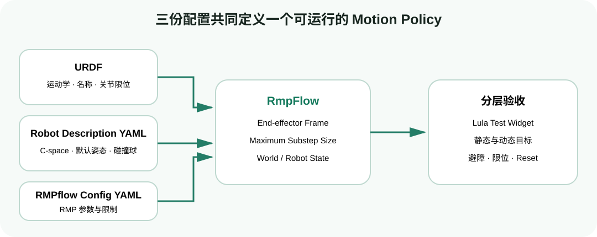
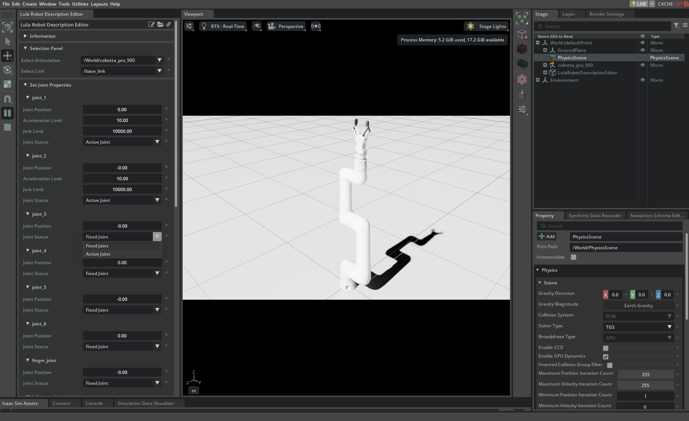
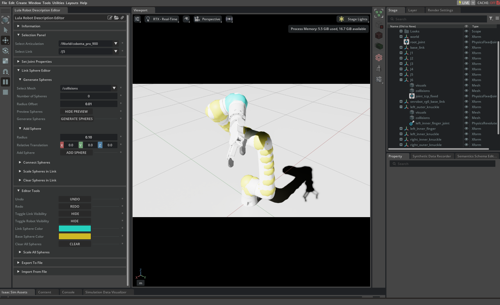
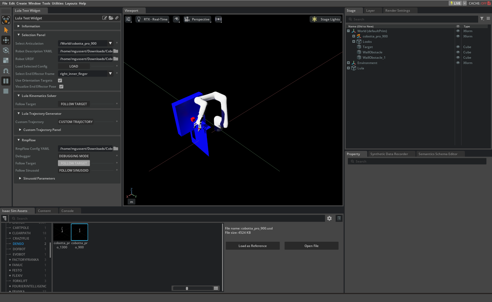

# 自定义机器人实战：从 URDF 到可调试的 RMPflow 配置

目标：理解自定义机械臂接入 RMPflow 所需的三份配置，使用 Robot Description Editor 建立 c-space 和 collision spheres，并通过 Lula Test Widget 完成分层验收。

## 本页运行口径

| 项目 | 设置 |
|---|---|
| Isaac Sim | 4.5.0 GUI |
| GPU | 1 张 RTX GPU |
| 输入 | 已能在 Stage 中正常运动的机器人 USD/Articulation，以及对应 URDF |
| 输出 | `robot_description.yaml`、`rmpflow_config.yaml`、可运行加载代码 |
| 验收 | 静态目标、移动目标、障碍物、关节限位和 reset 五组测试 |

## 三份文件缺一不可



<div class="image-caption">URDF 定义运动学与限位，Robot Description 补充 Lula c-space 和碰撞球，RMPflow Config 定义局部策略及参数。</div>

| 文件 | 关键内容 | 常见误区 |
|---|---|---|
| URDF | kinematic tree、joint/link names、position limits | RMPflow 不依赖这里的 visual/collision mesh 做环境避障 |
| `robot_description.yaml` | active/fixed joints、default c-space、collision spheres | 不是 RMP 参数文件 |
| `rmpflow_config.yaml` | target、collision、limit、damping 等 RMP 参数 | 不能替代 collision sphere 几何配置 |

还需要在构造 `RmpFlow` 时给出 `end_effector_frame_name` 和 `maximum_substep_size`。frame 必须能在 URDF 链中解析，不能只存在于 USD 的视觉层级。

## 先保证 USD 与 URDF 一致

进入 RMPflow 配置前先检查：

- USD articulation 的关节名称与 URDF 一致；
- 关节 axis、origin、上下限和单位正确；
- base link 与 end-effector link 明确；
- 机器人在 Stage 中 Play 后能正常读取 joint positions；
- mesh scale 与 stage units 没有 1000 倍错误；
- 固定关节和 mimic/gripper 关系已明确。

如果 USD 与 URDF 描述的是不同版本机器人，后面再精细的 RMP 参数也救不了坐标错位。

## 使用 Robot Description Editor

打开机器人 USD，推荐把资产以 reference 放到空 Stage，而不是直接打开嵌套资产。点击 Play，然后进入：

```text
Tools → Robotics → Lula Robot Description Editor
```



<div class="image-caption">先选择 Stage 中的 articulation，再为每个关节指定 active/fixed 状态和默认位置。</div>

### 选择 active 与 fixed joints

- 机械臂用于定位的关节通常设为 active；
- 夹爪关节通常设为 fixed，由抓取控制器单独处理；
- 至少有一个 active joint；
- active joint 的位置组成 default configuration；
- fixed joint 的位置会被 Lula 永久假设为固定值，仍会影响 collision spheres 的空间关系。

默认姿态应在机器人前方、远离关节限位，并避免自碰撞。对于 7 DOF 手臂，它还决定冗余解析时偏向哪种肘部姿态。

### 添加 collision spheres



<div class="image-caption">Collision spheres 逐 link 附着，中心坐标保存在 link frame 中；数量越多不一定越好。</div>

编辑器提供三种主要方式：

1. Add Sphere：在选中 link 上放一个球，适合手工精修；
2. Connect Spheres：在两个球之间插值，适合细长圆柱 link；
3. Generate Spheres：根据 mesh 自动生成指定数量的球，适合复杂几何。

逐 link 检查：

- 球是否覆盖可能发生碰撞的外表面；
- 是否大幅伸出 mesh，导致过度保守；
- 关节运动后球是否仍附着在正确 link；
- 工具、法兰和开放状态的夹爪是否覆盖；
- 球数量是否在覆盖质量和运行开销之间合理。

RMPflow 可以在没有 collision spheres 时运行，但不会正确避开外部障碍物。

### 导出 Lula Robot Description

在 `Export To File` 中选择 `Export to Lula Robot Description File`，保存为 `.yaml`。一个简化结构类似：

```yaml
api_version: 1.0
cspace:
  - joint_1
  - joint_2
  - joint_3
root_link: base_link
default_q: [0.0, -0.6, 1.2]
cspace_to_urdf_rules: []
collision_spheres:
  - link_1:
      - center: [0.0, 0.0, 0.12]
        radius: 0.06
```

这是结构示意，不应复制成自己机器人的配置。`cspace`、`default_q` 长度、link names、sphere centers 和 radii 都必须来自实际模型。

## 建立 RMPflow Config

官方建议从形态和尺度相近的 Franka 或 UR10 配置开始，而不是从 50 多个参数的全零文件猜起。最小关注段落：

```yaml
joint_limit_buffers: [0.01, 0.01, 0.01]

rmp_params:
  cspace_target_rmp:
    metric_scalar: 50.0
    position_gain: 100.0
    damping_gain: 50.0
  target_rmp:
    accel_p_gain: 30.0
    accel_d_gain: 85.0
  joint_velocity_cap_rmp:
    max_velocity: 1.0
    velocity_damping_region: 0.3
  collision_rmp:
    metric_scalar: 1.0
```

示例只展示层级。正式文件应从 Isaac Sim 4.5 的 template/相似机器人配置复制完整字段，再按官方 Tuning Guide 调整。

必须核对：

- `joint_limit_buffers` 长度等于 c-space 维数；
- revolute/prismatic joint 参数单位不同；
- 机器人尺寸相差很大时，带米单位的 length scale 不能照抄；
- `max_velocity` 不应高于硬件或 USD drive 能安全跟随的范围；
- 修改 metric/gain 前先用上一节方法固定测试场景。

## 自碰撞、Body Cylinders 与 Tool Frame

官方 Cobotta 配置教程进一步使用 body cylinders 和 body collision controllers 处理自碰撞。它们与外部障碍物 collision spheres 不是同一个概念：

- collision spheres 表示机器人哪些体积需要远离世界障碍；
- body cylinders/controller 用于约束机器人身体部分之间的自碰撞关系；
- tool frame 决定 target RMP 控制哪个 frame。

如果目标 frame 只存在于 USD 而不在 Lula 使用的 URDF 中，应先在机器人描述链路中建立可解析 frame。不要通过在目标位姿上硬编码一个神秘偏移来长期绕过错误 tool frame。

## 用 Lula Test Widget 逐层验收

启用对应 extension，然后打开：

```text
Tools → Robotics → Lula Test Widget
```



<div class="image-caption">Widget 可加载 articulation、URDF、Robot Description 和 RMPflow Config，适合在写应用代码前单独验证配置。</div>

按以下顺序测试：

1. 无障碍静态目标：确认 FK、joint order、end-effector frame；
2. 移动目标：确认策略连续且 default c-space 合理；
3. 单个 cuboid：确认 collision spheres 和外部避障；
4. 近关节限位目标：确认 buffer 和 limit RMP；
5. 高速移动目标：确认 velocity cap 与 damping；
6. reset/reload：确认文件路径、状态清理和重复加载稳定。

一次只增加一个变量。第一步都无法到达目标时，不要进入复杂动态障碍测试。

## 手动加载自定义配置

```python
rmpflow = RmpFlow(
    robot_description_path="configs/robot_description.yaml",
    urdf_path="configs/robot.urdf",
    rmpflow_config_path="configs/rmpflow_config.yaml",
    end_effector_frame_name="tool0",
    maximum_substep_size=0.00334,
)
```

路径应转成绝对路径或相对脚本位置解析，不要依赖“恰好从某个 cwd 启动”。加载后立即打印 active/watched joints，并开启 collision sphere 可视化做 smoke test。

## Robot Description 与 XRDF 不要混用

Robot Description Editor 也能导出 XRDF。XRDF 是 cuMotion 的主要配置，包含 Lula Robot Description 的超集，但 Isaac Sim 4.5 文档仍明确区分两种工作流。RMPflow 教学主线使用 Lula Robot Description YAML；除非所用 API 明确支持并经过验证，不要把 XRDF 文件路径直接填进 `robot_description_path`。

## 最终检查表

- [ ] USD 与 URDF 的 joint/link names 一致；
- [ ] active/fixed joints 与控制职责一致；
- [ ] default configuration 远离限位和自碰撞；
- [ ] collision spheres 覆盖充分且不过度外扩；
- [ ] end-effector frame 在 URDF 中存在；
- [ ] 三份配置能在 Lula Test Widget 分别加载；
- [ ] 静态目标、动态目标、障碍物、限位和 reset 均通过；
- [ ] 应用代码中的 base pose、dt 和 controller gains 已记录。

## 参考资料

- [Lula Robot Description and XRDF Editor](https://docs.isaacsim.omniverse.nvidia.com/4.5.0/manipulators/manipulators_robot_description_editor.html)
- [Configuring RMPflow for a New Manipulator](https://docs.isaacsim.omniverse.nvidia.com/4.5.0/manipulators/manipulators_configure_rmpflow_denso.html)
- [RMPflow Configuration](https://docs.isaacsim.omniverse.nvidia.com/4.5.0/manipulators/concepts/rmpflow.html#rmpflow-configuration)
