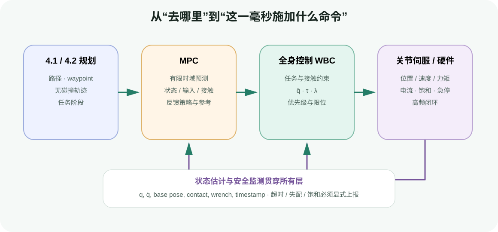

# 控制方法

目标：理解规划结果怎样进入实时闭环，掌握模型预测控制（MPC）与全身控制（Whole-Body Control, WBC）的输入、输出、时间尺度和安全边界，并能沿着 OCS2、Pink、TSID 的真实接口继续实践。

4.1 和 4.2 主要回答“从当前状态到目标是否存在一条可行运动、怎样生成路径或局部策略”。本节继续向执行端走一步：机器人收到参考以后，怎样利用最新测量反复修正运动，又怎样在同一时刻协调基座、手、脚、质心、接触力和关节限位。



<div class="image-caption">规划层给出较长时间尺度的路径与任务参考；MPC 在有限时域内预测未来；WBC 在更高频率下满足全身动力学、任务与接触约束；最底层伺服器驱动执行器。状态估计和安全监测贯穿整条链路。</div>

## 用两个场景理解本节

### 场景一：移动机械臂绕过人后继续抓取

MoveIt 2 或 cuRobo 已经给出一条无碰撞轨迹。执行时，移动底座受到地面扰动，末端位置偏离参考；同时障碍距离发生变化。MPC 可以利用系统模型预测未来一段时间的状态和控制输入，在速度、加速度、输入与碰撞约束下滚动修正。它不是重新讲一遍 RRT/CHOMP，而是把“预测—优化—只执行第一步—重新测量”变成闭环。

### 场景二：四足机器人伸手操作阀门

上层给出手部目标和站立/迈步计划，但机器人还要同时保持支撑脚不滑、质心与动量稳定、关节不越界、手对准阀门，并在可用摩擦范围内分配地面反力。WBC 把这些任务和接触约束放进同一个 QP/HQP，在每个控制周期求出全身加速度、关节力矩和接触力。

## 两类控制器的核心差异

| 维度 | MPC | WBC |
|---|---|---|
| 主要问题 | 未来一段时间怎样演化和控制？ | 当前周期怎样协调全身任务、接触和动力学？ |
| 时间结构 | 有限预测时域，反复滚动 | 通常是单周期 QP/HQP，高频重复 |
| 常见变量 | 状态轨迹、输入轨迹、接触模式/时间 | 关节/基座加速度、力矩、接触力，或关节速度 |
| 典型频率 | 数十到数百 Hz，取决于模型和求解器 | 数百 Hz 到 kHz 级，取决于任务和硬件 |
| 典型输出 | 开环输入序列、状态参考、反馈策略 | `v`、`q̈`、`τ`、接触 wrench `λ` |
| 代表实现 | OCS2 | Pink（速度级）、TSID（逆动力学级） |
| 主要风险 | 模型失配、策略过期、求解超时、约束不可行 | 任务冲突、接触状态错误、单位/坐标不一致、QP 不可行 |

二者经常串联：MPC 负责较长时域的质心、基座、足端和接触力参考，WBC 负责把这些参考落实为当前周期的全身命令。也可以只有其中一层，例如固定基座机械臂用 Pink 做多任务 differential IK，或简单系统直接用线性 MPC 输出关节/底盘控制。

## 学习路径

| 主小节 | 次一级页面 | 学习结果 |
|---|---|---|
| [模型预测控制（MPC）](03-control-methods/01-mpc-control.md) | 滚动时域基础；约束与 OCS2 实时求解；机器人集成与调试 | 能定义一个最优控制问题，解释 OCS2 MPC/MRT 数据流，并判断策略是否过期或不可行 |
| [全身控制（WBC）](03-control-methods/02-whole-body-control.md) | 浮动基动力学；任务优先级与 Pink/TSID；接触集成与调试 | 能区分速度级 WBC 和逆动力学 WBC，写出接触动力学 QP，并正确连接 MPC/规划与执行端 |

## 本节不重复什么

- 不重复 4.1 的构型空间搜索、碰撞表示和时间参数化推导；这里只讨论它们怎样变成控制参考或在线约束。
- 不重复 4.2 MoveIt 2、cuRobo、RMPflow 的完整安装与实战；这里只比较接口边界。RMPflow 是局部加速度策略，MPC 是跨时域最优控制，二者不能只按“都能避障”归为同一种方法。
- 不提前展开 4.4 的导航栈和移动操作任务编排；这里只说明底盘/手臂或腿/手怎样在控制层耦合。

## 统一实验口径

本节提供两个纯 NumPy/SciPy/Matplotlib 教学实验：

```bash
python labs/04-control-methods/mpc_double_integrator.py
python labs/04-control-methods/weighted_vs_hierarchy.py
```

第一个实验展示受限加速度、滚动窗口、warm start、扰动恢复和求解时间；第二个实验比较加权任务与严格优先级的差异。它们用于隔离概念，不声称替代 OCS2、Pink 或 TSID。

## 贯穿本节的验收信号

控制算法不能只以“画面里机器人动了”作为成功标准。至少保留：

- 输入状态、参考和接触模式的时间戳；
- 求解时间的中位数、P95/P99 与控制周期预算；
- 每项代价、任务残差、等式/不等式约束残差；
- 控制饱和比例、关节/接触限位余量；
- 预测状态与真实测量的偏差；
- 策略年龄、warm-start 是否重置、求解器状态码；
- 降级、保持、阻尼和急停分别由什么条件触发。

<div class="concept-note concept-orange">求解器返回 success 只说明数值问题达到其终止条件，不代表传感器新鲜、模型正确、接触真实或命令适合真机。安全层必须独立于优化器存在。</div>
