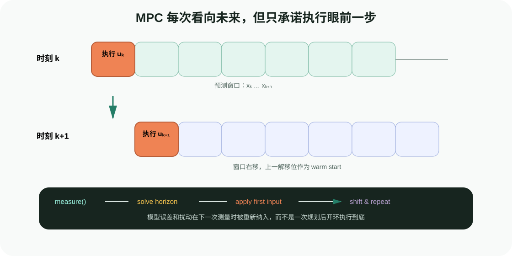
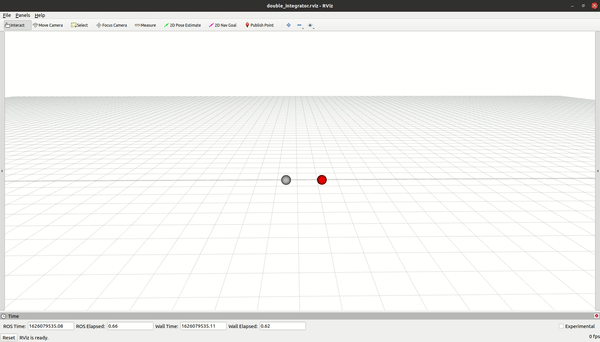

# 模型预测控制（MPC）：用有限未来做当前决策

目标：建立 MPC 的完整心智模型，能够说清模型、状态、输入、代价、约束、预测时域、滚动执行与反馈策略之间的关系，并知道何时应转入 OCS2 等机器人最优控制框架。

## 一句话抓住 MPC

MPC 在每个控制周期执行同一件事：读取最新状态，从现在开始预测有限时域内的系统演化，求一段满足约束的最优输入，只执行第一小段，然后重新测量并再次求解。



<div class="image-caption">窗口不断向前移动。上一周期的解可以移位作为 warm start，但必须使用本周期的新测量重新求解；否则 MPC 会退化成陈旧的开环轨迹回放。</div>

这三个词缺一不可：

- **Model**：没有模型就无法预测不同输入会造成什么未来状态；
- **Predictive**：优化对象跨越一段时间，而不是只看当前误差；
- **Control**：优化结果进入闭环，每次测量都会修正后续决策。

## 从一个受限小车开始

考虑一维点质量，状态和输入为：

$$
\mathbf{x}=\begin{bmatrix}p\\v\end{bmatrix},\qquad u=a
$$

离散动力学：

$$
\mathbf{x}_{k+1}=\begin{bmatrix}1&\Delta t\\0&1\end{bmatrix}\mathbf{x}_k+
\begin{bmatrix}\frac{1}{2}\Delta t^2\\\Delta t\end{bmatrix}u_k
$$

我们希望位置到达目标、速度回到 0，又不能超过最大加速度。一个有限时域问题是：

$$
\min_{u_0,\ldots,u_{N-1}}
\sum_{k=0}^{N-1}
(x_k-x_k^{ref})^TQ(x_k-x_k^{ref})+u_k^TRu_k
+(x_N-x_N^{ref})^TQ_f(x_N-x_N^{ref})
$$

满足：

$$
x_{k+1}=f(x_k,u_k),\qquad |u_k|\le u_{max}
$$

`Q` 大表示更在意状态跟踪，`R` 大表示更不愿使用激烈输入，`Qf` 强调预测窗口末端不要留下大误差。权重决定行为取舍，不是越大越稳定。

## 为什么 MPC 不等于轨迹优化

4.1.3 的轨迹优化通常在给定起终点和场景下离线改善一整条路径；MPC 把系统动力学、当前测量和控制输入放入滚动闭环，并持续解决未来有限时域问题。

| 对比项 | 路径/轨迹优化 | MPC |
|---|---|---|
| 当前状态 | 常在请求开始时固定 | 每个周期更新 |
| 动力学 | 可能只使用运动学和平滑代价 | 通常显式进入预测模型 |
| 输出 | 完整路径或带时轨迹 | 输入序列、状态轨迹和/或反馈策略 |
| 执行 | 规划后交给控制器 | 只执行第一步，再滚动求解 |
| 扰动 | 需要重规划或下层跟踪处理 | 下一周期直接根据新状态修正 |

二者可以组合：全局规划器提供无碰撞 seed/reference，MPC 在局部时域内跟踪并处理输入、动力学与在线约束。

## MPC 与 RMPflow 的边界

RMPflow 根据当前状态组合目标吸引、避障、限位和阻尼，输出局部加速度策略。它不显式优化长度为 `N` 的未来输入序列，也不天然处理“现在暂时远离目标，几步后总体更好”的跨时域权衡。

MPC 可以把未来状态、输入、障碍与终端代价放进同一问题，但建模和求解成本更高。动态障碍很近、控制频率很高且只需局部反应时，RMPflow 可能更轻；接触、输入约束和跨时域耦合重要时，MPC 更有表达力。工程中也可用 MPC 给参考、RMPflow/WBC 做高频局部跟踪，但必须定义清楚谁拥有最终约束与停止权。

## 什么时候值得使用 MPC

适合的信号包括：

- 输入、速度、加速度、力矩或摩擦锥需要显式处理；
- 机器人动力学或底盘/手臂耦合影响明显；
- 需要预测接触切换、质心或负载运动；
- 扰动和参考持续变化，开环轨迹很快过时；
- 能获得足够新鲜的状态估计，并有可接受的在线计算预算。

不适合一开始就上复杂 MPC 的情况：模型和执行接口尚未验证、状态时间戳不可靠、连简单 PD/LQR 都无法稳定、控制周期没有测量，或安全要求依赖尚不存在的约束。

## 本组学习路径

| 页面 | 核心问题 | 可验证产出 |
|---|---|---|
| [滚动时域基础：从模型、代价到第一次受限 MPC](01-mpc-control/01-receding-horizon-and-first-mpc.md) | 有限时域问题如何在每个控制周期滚动？ | 运行双积分器 MPC，观察输入饱和、扰动恢复与求解时间 |
| [约束与实时求解：从 DDP/SQP 到 OCS2](01-mpc-control/02-constraints-solvers-and-ocs2.md) | 非线性机器人问题如何组织，OCS2 怎样把 OCP 与运行时分开？ | 读懂 `OptimalControlProblem`、MPC/MRT、ReferenceManager 和求解器选择 |
| [机器人 MPC 集成：模型层级、延迟预算与失败恢复](01-mpc-control/03-robot-integration-and-debugging.md) | 怎样将 MPC 接入规划、状态估计、WBC 和硬件？ | 建立调试仪表盘、频率预算、降级策略和验收清单 |

## 参考实现：OCS2 的位置

OCS2 是面向机器人和 switched systems 的 C++ 最优控制工具箱，提供 SLQ/iLQR、SQP、IPM、SLP 等算法、自动微分、URDF/Pinocchio 接口、ROS 工具以及 MPC/MRT 运行时接口。它包含 double integrator、cartpole、ballbot、quadrotor、移动操作和腿足机器人示例。



<div class="image-caption">OCS2 官方 double-integrator 示例把最简单的线性动力学、二次代价和滚动控制闭环完整接起来，适合作为阅读源码的第一站。</div>

学习 OCS2 时不要直接从腿足机器人包开始。建议顺序是：

1. 看懂 double integrator 的 `A/B/Q/R/Q_final`；
2. 理解 `OptimalControlProblem` 怎样收集 dynamics、cost 和 constraints；
3. 再看 MPC Interface 与 MRT Interface 怎样跨线程交换测量和策略；
4. 最后进入 mobile manipulator 或 legged robot 的 Pinocchio、接触模式与同步模块。

## 配套轻量实验

无需安装 OCS2 即可运行：

```bash
python labs/04-control-methods/mpc_double_integrator.py \
  --output runs/04-control-methods/mpc_double_integrator.png
```

脚本使用 SciPy 在每个周期优化有界加速度序列，执行中间注入一次速度扰动，并输出成功求解次数、求解时间中位数/P95、输入饱和比例和最终状态。下一页会逐行拆解。

## 小结与自查

1. MPC 为什么只执行最优序列的第一步？
2. 上一解 warm start 与直接开环执行上一解有什么区别？
3. `Q`、`R`、`Qf` 分别在塑造什么行为？
4. MPC 和 4.1 的轨迹优化为何不能只按“都做优化”混为一谈？
5. RMPflow 的局部加速度策略与 MPC 的预测时域有什么根本差异？
6. 什么时候模型复杂度会成为负担而不是优势？

## 参考资料

- [OCS2 Introduction](https://leggedrobotics.github.io/ocs2/)
- [OCS2 Getting Started](https://leggedrobotics.github.io/ocs2/getting-started.html)
- [OCS2 Robotic Examples](https://leggedrobotics.github.io/ocs2/robotic_examples.html)
- [OCS2 GitHub](https://github.com/leggedrobotics/ocs2)
