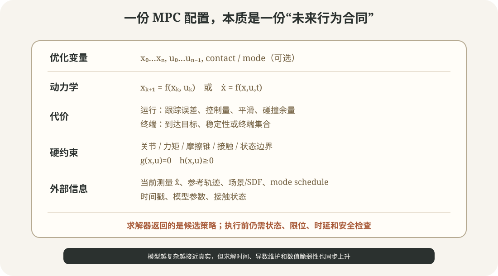

# 滚动时域基础：从模型、代价到第一次受限 MPC

目标：能够独立定义状态、输入、动力学、运行/终端代价和约束，理解预测时域、控制周期、warm start 与反馈的关系，并运行一个可观察的受限 MPC 闭环。

## 先把最优控制问题的零件摆齐



<div class="image-caption">MPC 配置不是一组“神奇权重”。模型、代价、约束、参考、当前测量和时间口径共同定义未来行为；其中任意一项语义错误，求解器仍可能返回数值上的成功。</div>

### 状态 `x`

状态必须足以预测下一时刻。双积分器用位置和速度；机械臂动力学 MPC 可能使用关节位置/速度；腿足 centroidal MPC 可能使用基座姿态、质心动量、关节状态和接触模式。

常见错误是把“传感器能测到的全部量”都塞进状态，却没有为它们定义动力学；或者漏掉速度，只用位置预测受惯性影响的系统。

### 输入 `u`

输入是模型真正接受的控制量：加速度、关节力矩、接触力、轮速，或某种虚拟控制。它不一定等于硬件最终接收的命令。centroidal MPC 输出接触力后，仍需 WBC 将其落实为全身加速度和执行器力矩。

### 动力学 `f`

连续模型：

$$
\dot{x}=f(x,u,t)
$$

离散模型：

$$
x_{k+1}=f_d(x_k,u_k)
$$

离散步长过大时，快速动态和约束可能被跨过；过小时，预测节点数和求解成本上升。控制周期、模型离散步长和求解器内部积分步长可以不同，但必须分别记录。

### 运行代价与终端代价

运行代价影响整个时域，终端代价塑造窗口末端。预测时域较短时，如果没有合理终端代价，控制器可能只顾眼前便宜，不愿提前制动或绕行。

### 约束

硬约束定义允许的可行域；soft constraint/penalty 允许违反但增加代价。把安全相关约束全部改成软代价，只能得到“优化器偏好安全”，不能得到硬保证。

## 预测时域长短怎样改变行为

设控制周期 `dt=0.05 s`：

- `N=10`：只看 0.5 秒；求解快，但可能来不及看到制动需求；
- `N=50`：看 2.5 秒；能提前规划，但变量和计算量增加；
- 物理时域相同而减小 `dt`：节点更多，离散更细，求解也更重。

比较不同配置时要同时报告 `N`、`dt` 和 `T=N·dt`。只说“horizon=20”没有物理意义。

## 开环序列与反馈策略

求解器可能只返回名义序列 $u_k^*$，也可能返回局部反馈策略：

$$
u_k(x)=u_k^*+K_k(x-x_k^*)
$$

反馈增益 `K` 可以在两个 MPC 求解时刻之间修正小偏差。OCS2 的 MRT 提供按时间插值名义状态/输入，某些求解器启用 feedback policy 后还可按当前状态评估策略。

这不取消滚动求解：局部反馈只在名义轨迹附近可信，模型、参考或接触模式显著改变时仍要更新 MPC。

## 第一次实战：运行受限双积分器

在项目根目录执行：

```bash
python labs/04-control-methods/mpc_double_integrator.py \
  --output runs/04-control-methods/mpc_default.png
```

默认设置：

| 参数 | 值 | 含义 |
|---|---:|---|
| `dt` | 0.05 s | 控制与离散周期 |
| `horizon` | 24 | 预测 24 个输入段，即 1.2 s |
| `steps` | 120 | 仿真 6 s |
| `max-acceleration` | 1.2 m/s² | 输入 box constraint |
| `target` | 1.5 m | 位置目标，目标速度为 0 |

日志示例：

```text
successful_solves=120/120
median_solve_ms=...
p95_solve_ms=...
control_saturation_fraction=...
final_state=[... ...]
```

图中包含位置、速度、加速度和每周期求解时间。仿真中点会注入一次负向速度扰动，后续 MPC 应根据新状态重新恢复，而不是继续回放扰动前的预测。

<div class="concept-note concept-blue">本脚本使用通用 Python/SciPy 优化器来暴露算法步骤，不以实时性为目标。在普通桌面环境中，P95 求解时间可能超过默认 50 ms 周期；这正是需要测量 deadline 的示例，不应通过隐藏超时把它包装成实时控制器。OCS2 等 C++ 框架和结构化求解器才是后续工程入口。</div>

## 逐行理解滚动循环

### 第一步：根据当前状态优化

```python
result = minimize(
    objective,
    warm_start,
    args=(state.copy(),),
    method="L-BFGS-B",
    bounds=bounds,
)
```

教学脚本只有输入上下界，因此使用 L-BFGS-B。一般非线性等式/不等式约束需要其他求解器和问题结构；不要把这个选择复制到腿足 MPC。

### 第二步：只应用第一个输入

```python
controls = np.asarray(result.x)
control = float(controls[0])
state = A @ state + B[:, 0] * control
```

剩余控制只是本次预测，不是必须执行的承诺。

### 第三步：移位 warm start

```python
warm_start = np.r_[controls[1:], controls[-1]]
```

上一解通常接近下一周期的新解，移位可以减少迭代。但以下情况应考虑重置或重新初始化：目标突变、接触模式变化、状态跳变、上次求解失败、策略已过期或新约束使旧解严重不可行。

### 第四步：测量求解预算

```python
started = perf_counter()
result = minimize(...)
solve_ms.append((perf_counter() - started) * 1000.0)
```

只看平均求解时间会隐藏尾部超时。至少比较 P95/P99 与控制周期；实际系统还要把状态传输、预计算、锁竞争、策略发布和 WBC 时间计入端到端预算。

## 三组对照实验

### 缩短时域

```bash
python labs/04-control-methods/mpc_double_integrator.py \
  --horizon 8 \
  --output runs/04-control-methods/mpc_short_horizon.png
```

观察控制器是否更晚制动、输入饱和比例是否变化。短时域未必不稳定，但对终端代价和参考更敏感。

### 收紧输入约束

```bash
python labs/04-control-methods/mpc_double_integrator.py \
  --max-acceleration 0.35 \
  --output runs/04-control-methods/mpc_tight_input.png
```

系统到达更慢，饱和比例增加。若参考要求在有限时域内必须到达，问题甚至可能不可行；本脚本用 soft tracking cost，所以会留下误差而不是宣告硬终端约束失败。

### 加密离散

```bash
python labs/04-control-methods/mpc_double_integrator.py \
  --dt 0.02 \
  --horizon 60 \
  --steps 300 \
  --output runs/04-control-methods/mpc_fine_grid.png
```

物理时域仍为 1.2 s，但优化变量从 24 增至 60。比较求解 P95，而不是只比较曲线外观。

## 参数调节的顺序

推荐顺序：

1. 单步验证动力学：给定 `x,u`，预测与仿真/日志下一帧一致；
2. 在无约束、无扰动情况下验证 LQR/稳定趋势；
3. 加输入约束并检查饱和；
4. 设置可解释的 `Q/R/Qf`，分别打印代价分项；
5. 改时域和离散，测求解时间与闭环性能；
6. 加扰动和模型偏差；
7. 最后加入非线性约束、碰撞或模式切换。

若一开始同时修改模型、权重、约束、时域和求解器，任何失败都会只剩一句“调不出来”。

## 常见坑

| 现象 | 原因候选 | 优先检查 |
|---|---|---|
| 状态越控越远 | `B` 符号/单位错、状态顺序错 | 用单步手算对齐模型 |
| 到目标后振荡 | `R` 太小、速度状态权重低、延迟 | 画速度和输入，不只看位置 |
| 总在输入上限 | 目标/时域不可达、`Q/R` 比例极端 | 统计 saturation，放宽时域而非放宽硬件限制 |
| 平均很快但偶发卡顿 | 非线性迭代、内存/线程抖动 | P95/P99、迭代数、cold/warm start |
| 扰动后不恢复 | 没有使用新测量、仍回放旧输入 | 打印每次求解的 `x0` 与 timestamp |
| solver success 但约束超限 | 约束是 soft、容差/缩放错误 | 打印原始单位下的 residual |

## 小结与自查

1. `N`、`dt` 和物理预测时域有什么关系？
2. 为什么只执行第一步是 MPC 闭环的关键？
3. warm start 在哪些事件后可能有害？
4. 输入持续饱和意味着权重问题、可达性问题还是两者都可能？
5. 为什么求解时间必须看尾部分位数？
6. soft terminal cost 和 hard terminal constraint 的失败语义有什么区别？

## 参考资料

- [OCS2 Getting Started：Optimal Control Formulation](https://leggedrobotics.github.io/ocs2/getting-started.html)
- [OCS2 Double Integrator Example](https://leggedrobotics.github.io/ocs2/robotic_examples.html#double-integrator)
