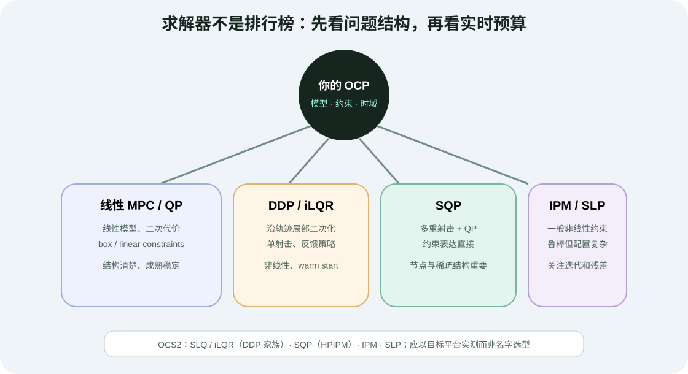
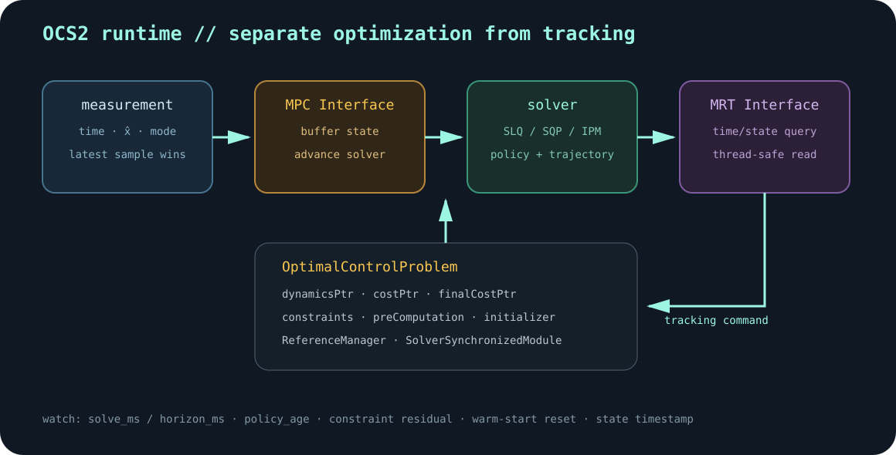
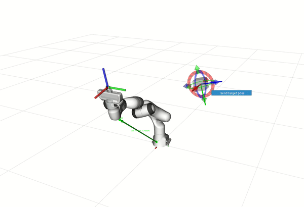

# 约束与实时求解：从 DDP、SQP 到 OCS2

目标：理解机器人非线性 MPC 的离散、射击、约束与求解器选择，能够从 OCS2 的 `OptimalControlProblem`、ReferenceManager、MPC/MRT 接口和官方示例定位一条完整运行链路。

## 从线性小车走向机器人 OCP

机器人最优控制一般写成：

$$
\min_{x(\cdot),u(\cdot)}\ \phi(x(t_f))+\int_{t_0}^{t_f}l(x(t),u(t),t)dt
$$

满足：

$$
\dot{x}=f_i(x,u,t),\qquad g_i(x,u,t)=0,\qquad h_i(x,u,t)\ge0
$$

下标 `i` 表示模式。四足机器人在站立、左前腿摆动、对角小跑等模式中，有效接触和约束不同；模式切换还可能带 jump map。固定基座机械臂通常只有单一模式，问题会简化很多。

真正困难的不是把公式写长，而是决定：

- 哪个模型复杂度足够而不过度；
- 怎样离散连续动力学；
- 状态和输入在哪些节点独立优化；
- 硬约束、软约束和 penalty 如何分工；
- 一次求解能否在控制预算内稳定完成。

## 单射击与多重射击

### Single shooting

只把输入序列作为优化变量，从初始状态向前 rollout 得到全部状态。优点是动力学天然满足、变量少；缺点是长时域和不稳定系统中，末端状态对早期输入极其敏感。

### Multiple shooting

把多个节点状态也作为变量，用动力学缺陷约束连接：

$$
x_{k+1}-f_d(x_k,u_k)=0
$$

变量更多，但稀疏结构清楚，状态/路径约束表达直接。SQP 常配合 multiple shooting，把当前轨迹附近的非线性问题线性/二次近似为 QP 子问题。

### Collocation

直接在区间内设置配点并约束动力学残差，适合离线轨迹优化和某些 NMPC。实时机器人系统选哪种方法，取决于模型、约束、稀疏求解器和代码生成，而不是“节点越多越精确”。

## 约束怎样进入求解器

| 类型 | 机器人例子 | 常见处理 |
|---|---|---|
| 输入 box | 关节力矩、轮速、加速度上下界 | 原生 bounds / QP box constraints |
| 状态约束 | 关节位置、速度、倾角 | 原生不等式、barrier、augmented Lagrangian |
| 状态-输入等式 | 刚性接触、动力学关系 | 消元、projection、SQP equality |
| 非线性不等式 | 摩擦锥、碰撞距离 | 线性化、relaxed barrier、soft constraint |
| 模式约束 | 摆动脚零力、支撑脚零速度 | mode-dependent term / reference manager |

硬约束不可行时，求解器应明确报告 infeasible 或残差超限。soft constraint 则会在代价与违反量之间折中。将碰撞或摩擦约束软化时，要设计独立的最终安全检查和 fallback。

## DDP/iLQR、SQP 与其他方法怎么选



<div class="image-caption">先根据模型、约束、射击结构和实时预算筛选方法，再在目标硬件和任务集上测量。求解器名称无法代替对迭代数、残差和尾部延迟的实测。</div>

### DDP / iLQR / SLQ

沿名义轨迹线性化动力学、二次化代价，通过 backward pass 得到局部反馈增益，再 forward rollout 和 line search 更新轨迹。对非线性机器人和 warm start 很有吸引力，并能自然产生反馈策略；一般约束需要 barrier、augmented Lagrangian、projection 等额外机制。

OCS2 提供连续时间 constrained DDP 的 SLQ 和离散时间 constrained DDP 的 iLQR。

### SQP

在当前解附近构建 QP 子问题，迭代更新。multiple shooting SQP 对路径约束、接触和大规模稀疏结构表达直接。OCS2 的 SQP 使用 HPIPM 作为底层 QP 求解组件。

### IPM / SLP

内点法通过 barrier 处理不等式，可处理一般非线性约束；SLP 则反复求线性规划近似。它们并非“更高级”的统一替代品，应依据约束和数值结构选择。

## OCS2 的问题对象怎样组织

官方 `OptimalControlProblem` 以集合方式管理各项模块：

```cpp
OptimalControlProblem problem;

problem.dynamicsPtr = std::make_unique<MyDynamics>(...);
problem.costPtr->add(
    "tracking",
    std::make_unique<MyStateInputCost>(...)
);
problem.finalCostPtr->add(
    "terminal",
    std::make_unique<MyTerminalCost>(...)
);
problem.equalityConstraintPtr->add("contact", ...);
problem.inequalityConstraintPtr->add("limits", ...);
problem.preComputationPtr = std::make_unique<MyPreComputation>(...);
```

准确成员和构造函数应以所用 OCS2 commit 为准，但结构思想稳定：dynamics、running/final cost、hard/soft constraints 和 pre-computation 是独立模块，可以按名称增加或启停。

OCS2 官方 double-integrator 源码的核心更简单：

```cpp
problem_.costPtr->add(
    "cost",
    std::make_unique<QuadraticStateInputCost>(Q, R)
);
problem_.finalCostPtr->add(
    "finalCost",
    std::make_unique<QuadraticStateCost>(Qf)
);
problem_.dynamicsPtr.reset(new LinearSystemDynamics(A, B));
```

先读这段，再进入自动微分、Pinocchio 和接触约束，会更容易判断复杂代码究竟在添加哪一个 OCP 部件。

## ReferenceManager 与同步模块

优化问题不仅依赖固定配置，还要接收运行期信息：目标轨迹、gait/mode schedule、模型参数、SDF 地图和任务开关。

- `ReferenceManager` 管理目标轨迹和模式计划；
- `SolverSynchronizedModule` 在求解前后安全更新需要与 solver 同步的数据；
- 每个 cost/constraint term 可以根据模式或外部状态决定是否 active。

不要在任意控制线程直接修改 solver 内部对象。目标更新与求解同时发生时，缺少同步会得到一半旧、一半新的问题数据。

## OCS2 运行时：MPC 与 MRT 分工



<div class="image-caption">MPC Interface 安全地把最新测量送入求解器；MRT Interface 安全读取最新策略，并按时间或状态查询控制。优化频率和跟踪频率可以不同。</div>

官方设计解决两个实际问题：

1. 求解器尚未完成时又来了新测量，应该保留最新状态而不是排长队处理过期状态；
2. 跟踪线程读取策略时，不能读到 solver 正在修改的一半数据。

同机非 ROS 部署可使用 `MpcMrtInterface`；优化和跟踪跨进程/机器时，可使用 `MpcRosInterface` 与 `MrtRosInterface`。具体类名和 ROS 版本要按当前分支核对。

MRT 有两种典型查询：

- time-based：按查询时间在线性插值后的名义状态/输入轨迹取值；
- state-based：在求解器支持并启用 feedback policy 时，用当前状态评估局部反馈策略。

## 官方示例的频率配置怎样读

OCS2 double-integrator 的 `task.info` 示例包含：

```text
mpc
{
  timeHorizon          2.5
  coldStart            false
  mpcDesiredFrequency  100
  mrtDesiredFrequency  400
}
```

这表示期望 MPC 以 100 Hz 更新策略，MRT 以 400 Hz 查询/跟踪；它不是硬实时保证。若 P99 solve time 超过 10 ms，100 Hz 目标会被打破。

`coldStart=false` 允许复用上一解。模式跳变或严重不可行时，warm start 可能需要重新初始化；不能把 cold/warm start 当作只影响速度、不影响鲁棒性的开关。

## 安装与运行官方 double-integrator

OCS2 官方 1.0.0 文档当前说明的主要验证环境是 Ubuntu 20.04、ROS Noetic 与 catkin。不要在 ROS 2/Jazzy 环境里直接复制命令后把所有错误归因于 MPC。

按官方环境准备 workspace 后：

```bash
cd ~/catkin_ws/src
git clone https://github.com/leggedrobotics/ocs2.git
cd ~/catkin_ws
catkin build ocs2_double_integrator_ros
source devel/setup.bash
roslaunch ocs2_double_integrator_ros double_integrator.launch
```

先确认：

```bash
rospack find ocs2_double_integrator_ros
rosnode list | grep -E "mpc|mrt|dummy"
rostopic list | grep ocs2
```

若构建失败，优先核对：OCS2 commit、ROS 发行版、Eigen/Boost/GLPK、catkin、Pinocchio/HPP-FCL 是否确实需要，以及 workspace 中是否混有另一套 ABI 的依赖。

## 从 double integrator 到移动操作



<div class="image-caption">OCS2 官方移动操作示例展示了 Franka 的在线最优控制。进入这个示例前，应先能在 double integrator 中解释每个状态、输入、代价和频率参数。</div>

OCS2 的移动操作示例提供 kinematic model，用于末端跟踪、自碰撞与无碰撞运动；腿足示例则使用 switched-system 与 centroidal model，增加 gait schedule、摩擦锥、支撑/摆动脚约束和足端轨迹。

模型升级时建议逐层：

1. 替换 state/input 和 dynamics，暂时只保留二次跟踪代价；
2. 在 dummy simulator 中验证 rollout；
3. 加 URDF/Pinocchio kinematics 和 frame tracking；
4. 加一个约束并记录残差；
5. 加 ReferenceManager 的动态参考；
6. 再接 MRT、WBC 或真实机器人。

## 自动微分与代码生成的坑

OCS2 可用 CppAD/CppADCodeGen 为 dynamics、cost 和 constraints 生成导数代码。常见问题：

- 模型结构或维度变化后没有重新生成库；
- 多个工作区加载了同名旧 `.so`；
- 临时/生成目录无写权限；
- 在 AD 图里调用不支持或有数据依赖分支的函数；
- 只验证函数值，没有对比有限差分导数。

新增自定义 term 时先做 derivative check：随机采样小扰动，对比解析/AD Jacobian 与中心差分；误差随步长应有合理趋势。

## 求解器选型记录模板

```text
model: kinematic / dynamic / centroidal
state_dim, input_dim, nodes, physical_horizon
solver: SLQ / iLQR / SQP / IPM / SLP
hard_constraints: ...
soft_constraints: ...
warm_start: yes/no + reset conditions
feedback_policy: yes/no
median/p95/p99 solve_ms
iterations, cost, equality_residual, inequality_min_margin
hardware, threads, compiler flags, OCS2 commit
```

## 常见失败与排错

| 现象 | 可能原因 | 优先动作 |
|---|---|---|
| rollout 数值爆炸 | 动力学、积分步长、状态尺度错误 | 单独跑一步/短 rollout，打开 stability check |
| 代价正常但约束恶化 | penalty 太弱、约束未 active、模式错 | 打印 term 名称和逐项 residual |
| SQP 第一次迭代就失败 | 初值严重不可行、线性化尺度差 | 检查 initializer 和变量 scaling |
| warm start 比 cold start 更差 | 参考/模式突变、上一策略过期 | 定义明确 reset 条件 |
| MPC 有策略但 MRT 无输出 | 接口同步、policy update、查询时间错误 | 打印 policy timestamp 和 MRT 状态 |
| 自动微分加载旧模型 | 生成目录/库缓存未刷新 | 清理特定生成产物并重新编译，不要删整个 workspace |
| 目标更新偶发撕裂 | 跨线程直接修改问题对象 | 通过 ReferenceManager/同步模块提交 |

## 小结与自查

1. single shooting 与 multiple shooting 的变量和风险有什么区别？
2. DDP/iLQR 为什么容易产生局部反馈策略？
3. OCS2 中 MPC Interface 与 MRT Interface 分别解决什么并发问题？
4. ReferenceManager 与 SolverSynchronizedModule 为什么不能用普通全局变量替代？
5. `mpcDesiredFrequency=100` 为什么不等于 100 Hz 硬实时保证？
6. 从 double integrator 迁移到移动操作时，应该按什么顺序增加复杂度？

## 参考资料

- [OCS2 Optimal Control Modules](https://leggedrobotics.github.io/ocs2/optimal_control_modules.html)
- [OCS2 Getting Started：MPC/MRT](https://leggedrobotics.github.io/ocs2/getting-started.html)
- [OCS2 Installation](https://leggedrobotics.github.io/ocs2/installation.html)
- [OCS2 Robotic Examples](https://leggedrobotics.github.io/ocs2/robotic_examples.html)
