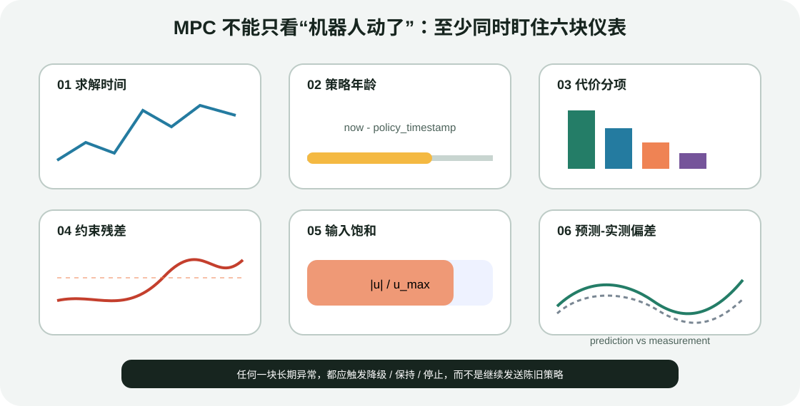

# 机器人 MPC 集成：模型层级、延迟预算与失败恢复

目标：能够为机械臂、移动操作和腿足系统选择合适模型，设计规划—MPC—WBC—硬件接口，建立求解时间、策略年龄、约束残差和模型误差的调试闭环，并定义可执行的降级策略。

## 第一个选择不是求解器，而是模型层级

### Kinematic model

状态通常是关节/底盘位姿，输入是速度。适合固定/移动机械臂的末端跟踪、自碰撞和局部无碰撞运动。优点是快；缺点是无法预测力矩、惯性和接触力。

### Full rigid-body dynamics

状态包含位置和速度，输入是力矩或广义力，可预测质量、惯性、科氏、重力和接触。表达完整但状态/输入维度、导数和接触约束成本高。

### Centroidal model

聚焦浮动基和质心动量，把关节运动或接触力简化。腿足 MPC 常用它在预测能力与实时性之间折中，再由 WBC 恢复全身关节加速度和力矩。

| 问题 | 建议起点 |
|---|---|
| 固定基机械臂末端在线修正 | kinematic MPC 或更简单的 differential IK/servo |
| 移动底盘 + 机械臂协同可达 | kinematic mobile-manipulator MPC |
| 高速关节/重载力矩控制 | full dynamics，先验证参数与 torque interface |
| 四足/人形质心和接触力规划 | centroidal MPC + WBC |

模型越复杂不一定越好。若惯量、摩擦、时延和状态估计不可信，复杂模型可能更自信地给出错误预测。

## 与 4.1、4.2 的接口

### 接全局规划器

MoveIt 2/cuRobo 输出可以转为 MPC 的 reference trajectory 或 waypoint，但要明确：

- joint names/order 是否一致；
- path/trajectory 的时间戳和 MPC 当前时间是否对齐；
- MPC 是否允许偏离参考；偏离后碰撞约束由谁检查；
- 场景版本是否与规划时一致；
- 新全局路径到来时 warm start 怎样重置。

MPC 不会自动继承 PlanningScene。若需要在线避障，应显式把障碍表示、SDF 或安全走廊作为 cost/constraint 输入，并处理更新同步。

### 接 RMPflow

两者同时输出局部控制时会争夺命令权。更清晰的组合是：MPC 提供末端/基座参考，RMPflow 或 WBC 作为下层跟踪；或者由 supervisor 在不同模式中选择其一。不要把两个输出简单相加。

### 接 WBC

腿足/人形常见接口：MPC 输出 base/CoM/foot trajectories、mode schedule 与接触力参考；WBC 使用当前全身状态和真实接触约束求 `q̈, τ, λ`。下一主小节会详细展开。

## 频率预算：优化、跟踪和伺服可以不同频

一个示意配置：

```text
state estimator      400 Hz
MPC solver            50 Hz   (20 ms 周期)
MRT policy query     400 Hz
WBC / inverse dyn    500 Hz
joint torque loop   1000 Hz
```

这不是通用推荐值。每层必须定义：输入最大年龄、输出有效期、deadline miss 的处理、插值方法和线程优先级。

端到端延迟为：

$$
T_{e2e}=T_{sensor}+T_{estimate}+T_{queue}+T_{solve}+T_{publish}+T_{wbc}+T_{actuator}
$$

求解器只占其中一段。优化 8 ms 不代表 10 ms 周期一定安全；传感器时间戳晚 15 ms 时，控制器预测起点已经落后真实系统。

## 策略年龄比“最近一次成功”更重要

每份策略应携带：

```text
measurement_time
solve_start / solve_finish
policy_valid_from / valid_until
reference_version
mode_schedule_version
model_version
```

控制线程计算 `now - policy_timestamp`。超过阈值时，不能继续使用“最后一次成功策略”而不报告。可根据系统进入：

- 短时 hold/interpolate；
- 阻尼/重力补偿模式；
- 速度逐步降为零；
- 保持接触并冻结任务；
- 硬件安全停止。

阈值要根据系统动力学和制动能力设计，不是随意设成 1 秒。

## 调试仪表盘



<div class="image-caption">MPC 调试至少同时观察求解时间、策略年龄、代价分项、约束残差、控制饱和和预测—实测偏差。只画目标跟踪曲线会漏掉正在积累的风险。</div>

### 求解时间与迭代

记录 median/P95/P99/max、迭代数、line-search/trust-region 接受率和 cold/warm start。尾部延迟决定 deadline，而不是平均值。

### 策略年龄

记录测量到策略发布和策略发布到执行的年龄。跨机器 ROS/网络部署还要处理时钟同步。

### 代价分项

总 cost 下降可能掩盖碰撞、姿态或控制 effort 某一项上升。每项使用原始物理单位和归一化后数值各记录一份。

### 约束残差

至少记录最大等式残差和最小不等式 margin，并按 term 名称分组。solver 的内部容差要映射回米、弧度、牛顿和牛米解释。

### 控制饱和

长期饱和说明参考不可达、模型不对、权重不合理或硬件能力不足。执行端裁剪会让实际输入与 MPC 预测输入不同，模型误差随即积累。

### 预测—实测偏差

比较一步预测：

$$
e_{model,k}=x_{measured,k+1}-f_d(x_{measured,k},u_{applied,k})
$$

要使用执行端真正应用的 `u_applied`，而不是求解器请求的 `u_commanded`。二者在限幅、通信丢包和低层保护触发时不同。

## 模型验证顺序

1. 静态：重力、零输入、接触力分配是否合理；
2. 单步：给定状态和输入，预测下一帧与仿真接近；
3. 开环短 rollout：误差如何随时域增长；
4. 简单闭环：固定参考下是否稳定；
5. 约束边界：输入/状态接近限制时是否符合预期；
6. 扰动：施加可复现 impulse/负载变化；
7. 模式切换：接触或任务改变时是否出现残差尖峰。

模型误差不可避免。目标不是让 2 秒开环预测与真实完全一致，而是确认误差在滚动反馈能修正的范围内，且不让安全约束依赖虚假的预测精度。

## 参考与约束不可行时怎么办

常见不可行来源：

- 目标在时域内无法到达；
- 速度/力矩/摩擦约束互相冲突；
- 接触模式与真实状态不一致；
- 安全走廊或障碍更新把当前状态置于约束外；
- 初始状态不满足模型/约束；
- 上层同时要求手保持姿态、脚不动、质心移动到不可能位置。

处理策略应分层：

1. 先检查输入和坐标，不要立刻松约束；
2. 区分安全硬约束与可放松任务；
3. 使用 slack 时记录 slack 的物理含义和上限；
4. 降低非关键 reference gain/weight；
5. 请求上层重新规划或改变 contact schedule；
6. 在规定时间内仍无可行策略时进入 fallback。

## 一个运行时 supervisor 骨架

```python
measurement = state_estimator.latest()

if measurement.age > max_state_age:
    return safety.stop("stale state")

mpc.submit(measurement, reference_snapshot)
policy = mpc.latest_policy()

if policy is None or policy.age > max_policy_age:
    return safety.damped_hold("stale policy")

if not policy.solver_ok:
    return safety.damped_hold("solver failure")

if policy.max_eq_residual > eq_limit:
    return safety.damped_hold("constraint residual")

command = policy.evaluate(now, measurement.state)
command = wbc.track(command, measurement)
return actuator.apply_checked(command)
```

真实系统还要区分瞬时抖动和持续故障，并避免 fallback 在两种模式间高频振荡。

## 从仿真到真机的阶梯

1. OCS2 dummy simulator：只验证策略数据流；
2. 与 MPC 同模型 rollout：验证闭环和接口；
3. 不同物理仿真器：暴露模型失配；
4. 真机 shadow mode：计算但不下发，比较预测与测量；
5. 低速度、低力矩、扩大安全区；
6. 逐步增加任务难度并保留回退配置。

shadow mode 仍要保护计算资源，避免试验节点影响现有控制线程。

## 现象到原因的排错表

| 现象 | 优先检查 | 不要先做什么 |
|---|---|---|
| 机器人周期性抖动 | 端到端延迟、策略更新率、低层饱和 | 盲目增大状态权重 |
| 仿真好、真机漂移 | 动力学参数、摩擦、真实 applied input | 只提高求解迭代数 |
| 接触切换瞬间发散 | mode schedule、接触估计、warm-start reset | 把摩擦系数设得更大 |
| 偶发使用旧策略 | 锁/线程/网络和 timestamp | 只看 solver success 日志 |
| 碰撞约束长期擦边 | SDF 时间戳、模型 padding、预测误差 | 取消安全余量 |
| WBC 经常拒绝 MPC 参考 | 两层模型/接触/顺序不一致 | 在 WBC 中无限增大 tracking weight |
| solver infeasible 后仍运动 | fallback 未接管、旧命令保持 | 继续使用 last command |

## 验收清单

- 状态、参考、策略、接触模式均有时间戳和版本；
- median/P95/P99 求解时间满足预算并有 deadline miss 统计；
- 一步预测误差和 applied command 可关联；
- 所有硬约束残差按物理单位记录；
- warm-start reset 条件已测试；
- state/policy stale、solver fail、WBC fail 有不同错误码；
- fallback 能在仿真与真机低风险条件下触发并恢复；
- 与 4.1/4.2 的路径、frame、joint order 和 scene version 合同有测试。

## 小结与自查

1. kinematic、full dynamics、centroidal model 分别牺牲和保留了什么？
2. 为什么 solver 8 ms 不等于 10 ms 控制周期安全？
3. policy age 应从哪个时间戳计算？
4. 为什么要比较 `u_applied` 而不是只保存 `u_commanded`？
5. MPC 与 WBC 模型不一致会出现什么现象？
6. 哪些约束可以加 slack，哪些不应随意软化？
7. shadow mode 能验证哪些问题，不能验证哪些问题？

## 参考资料

- [OCS2 Getting Started](https://leggedrobotics.github.io/ocs2/getting-started.html)
- [OCS2 From URDF to OCP](https://leggedrobotics.github.io/ocs2/from_urdf_to_ocp.html)
- [OCS2 Profiling](https://leggedrobotics.github.io/ocs2/)
- [OCS2 Robotic Examples](https://leggedrobotics.github.io/ocs2/robotic_examples.html)
