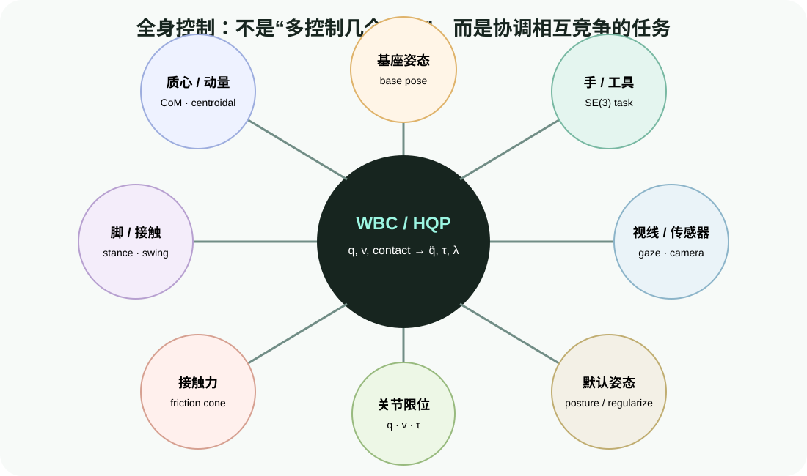
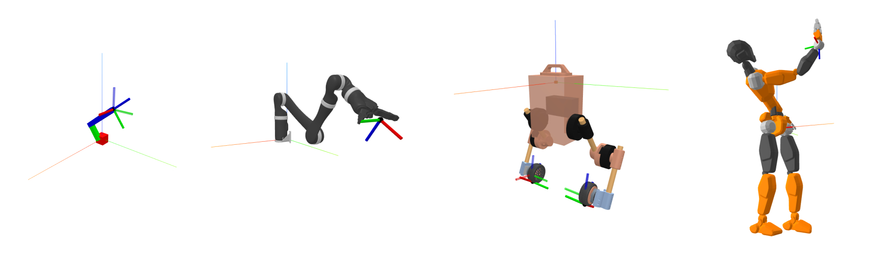

# 全身控制：在任务、接触与限位之间协调所有自由度

目标：建立全身控制的分层心智模型，理解任务空间、冗余、浮动基、接触力、加权/严格优先级和逆动力学 QP，并能区分 Pink 与 TSID 的输入输出及适用边界。

## 为什么“每条腿一个控制器”不够

人形机器人右手伸向阀门时，右臂运动会改变质心和角动量；若同时抬起左脚，支撑区域和可用地面反力又会变化。下面这些要求彼此耦合：

- 右手跟踪目标 pose；
- 支撑脚保持不动且不滑；
- 摆动脚按轨迹落到下一步位置；
- 质心/动量维持平衡；
- 基座保持合理姿态；
- 关节、速度、力矩和接触力不越界；
- 冗余自由度靠近可恢复、远离奇异和限位的姿态。

单独为每个末端算 IK，再把关节命令相加，会产生冲突。全身控制把任务和物理约束放进统一优化问题，在每个周期寻找兼容的全身动作。



<div class="image-caption">WBC 同时接收基座、质心/动量、手、脚、视线、接触力、关节限位与默认姿态任务。核心不是任务数量，而是如何处理冲突、优先级和物理可行性。</div>

## WBC 不是单一算法名称

“全身控制”描述问题范围，具体求解层级不同：

| 层级 | 优化变量 | 依赖模型 | 典型输出 | 代表实现 |
|---|---|---|---|---|
| 速度级 differential IK | `v` 或 `Δq` | 运动学、Jacobian、limits | 关节/基座速度 | Pink |
| 加速度级 WBC | `q̈` | 运动学二阶项、部分动力学 | 目标加速度 | 自定义 QP/HQP |
| 逆动力学 WBC | `q̈, τ, λ` | 完整刚体动力学、接触 | 加速度、力矩、接触力 | TSID |
| 力矩/阻抗组合 | `τ` 或 task wrench | 动力学、阻抗与接触 | 执行器力矩 | 各机器人控制栈 |

速度级方法适合快速原型、姿态协调和位置/速度接口；逆动力学方法能显式处理接触力和力矩，但需要可靠惯性参数、接触状态与 torque interface。

## 任务空间控制的共同语言

任务误差写成 $e(q)$，Jacobian 为：

$$
J(q)=\frac{\partial e}{\partial q}
$$

速度级希望：

$$
J(q)v=-\alpha e(q)
$$

加速度级希望：

$$
J(q)\ddot{q}+\dot{J}(q,\dot{q})\dot{q}=a^*_{task}
$$

其中 $a^*_{task}$ 常由参考加速度加 PD 反馈组成：

$$
a^*=a_{ref}+K_p e+K_d\dot{e}
$$

同一个“手部 FrameTask”，在速度级和逆动力学级中的输出语义并不相同。把 Pink 的速度直接当 torque 发送是严重接口错误。

## Pink：加权 differential IK

Pink 基于 Pinocchio，把多个任务和 limits 组成 QP，求关节/浮动基速度，使任务误差在当前线性化附近尽量下降。它提供 Frame、CoM、Posture 等任务，configuration/velocity/acceleration limits 和 barrier。



Pink 的优势是 Python API 清晰，适合从 URDF、任务 Jacobian 和加权 QP 入门。它是局部 differential IK：目标远、任务不可行或被限位包围时，可能停在局部最优；它不替代全局运动规划，也不计算满足接触动力学的关节力矩。

## TSID：任务空间逆动力学

TSID 基于 Pinocchio，把刚体动力学、接触、运动任务和力任务组织为分层 QP。官方 quadruped demo 使用：

```python
invdyn = tsid.InverseDynamicsFormulationAccForce("tsid", robot, False)
invdyn.addRigidContact(contact, force_weight, 1.0, priority)
invdyn.addMotionTask(com_task, com_weight, priority, transition)
invdyn.addMotionTask(posture_task, posture_weight, priority, transition)

hqp_data = invdyn.computeProblemData(t, q, v)
solution = solver.solve(hqp_data)
tau = invdyn.getActuatorForces(solution)
dv = invdyn.getAccelerations(solution)
```

这里的 `tau` 和 `dv` 来自同一个动力学/接触可行问题，而不是先求 IK、再独立做逆动力学。

## 本组学习路径

| 页面 | 核心问题 | 可验证产出 |
|---|---|---|
| [浮动基动力学与接触：WBC 的物理地基](02-whole-body-control/01-floating-base-dynamics-and-contacts.md) | 为什么关节力矩、基座运动和接触力必须一起求？ | 写出动力学、接触加速度和摩擦约束，调用 Pinocchio 核心量 |
| [任务优先级实战：加权 QP、Pink 与 TSID](02-whole-body-control/02-task-priority-pink-and-tsid.md) | 任务冲突怎样折中或严格分层？Pink/TSID 如何落地？ | 运行加权/层级实验，搭建 Pink differential IK 和 TSID HQP 骨架 |
| [控制栈集成：MPC、WBC、接触切换与调试](02-whole-body-control/03-integration-contact-switching-and-debugging.md) | 上层参考怎样变成安全全身命令？ | 定义 MPC/WBC 接口、接触状态机、日志和失败恢复 |

## 配套轻量实验

```bash
python labs/04-control-methods/weighted_vs_hierarchy.py \
  --output runs/04-control-methods/weighted_vs_hierarchy.png
```

二维三连杆同时执行末端目标和姿态偏好。加权求解器用一个目标函数折中，层级求解器把次任务投影到主任务零空间。实验是运动学示例，用于理解优先级，不包含浮动基、接触力或 torque。

## 与规划、MPC、RMPflow 的分工

| 上游 | 给 WBC 什么 | WBC 不应该假设什么 |
|---|---|---|
| MoveIt 2 / cuRobo | 关节/末端参考、任务阶段 | 路径天然满足当前接触与动力学 |
| RMPflow | 局部末端或关节目标 | RMPflow 输出就是全身 torque |
| MPC | base/CoM/foot trajectory、mode、force reference | MPC 和 WBC 模型、frame、接触编号自动一致 |
| VLA/技能层 | 操作目标、技能参数 | 语言目标可以绕过限位与安全监督 |

WBC 负责把参考投影到当前物理可行域，但不应默默修复任意不合理上游目标。持续大残差应该反馈给上层重新规划，而不是无限提高任务权重。

## 小结与自查

1. 为什么 WBC 不是“每个末端分别算 IK”？
2. 速度级、加速度级和逆动力学级的变量与输出有什么区别？
3. Pink 能保证接触力和关节力矩满足动力学吗？
4. TSID 为什么要同时求 `q̈, τ, λ`？
5. WBC 遇到持续不可行任务时，应该只提高权重吗？
6. MPC 与 WBC 串联时，哪些接口语义必须显式对齐？

## 参考资料

- [Pink Documentation](https://stephane-caron.github.io/pink/)
- [Pink GitHub](https://github.com/stephane-caron/pink)
- [TSID Documentation](https://gepettoweb.laas.fr/doc/stack-of-tasks/tsid/devel/doxygen-html/)
- [TSID GitHub](https://github.com/stack-of-tasks/tsid)
- [Pinocchio](https://stack-of-tasks.github.io/pinocchio/)
