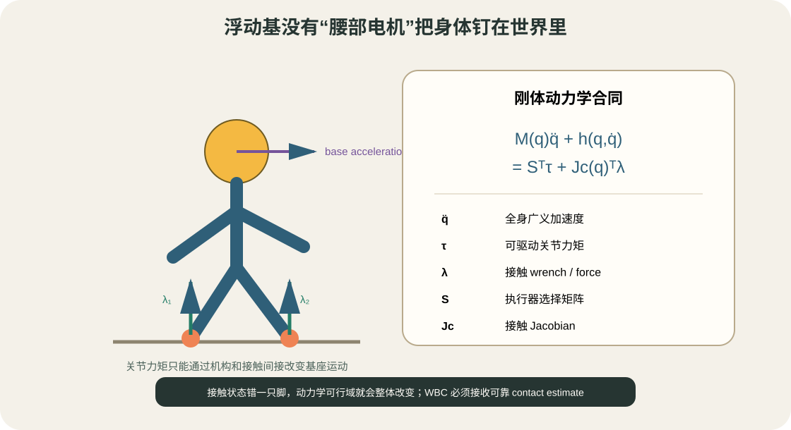
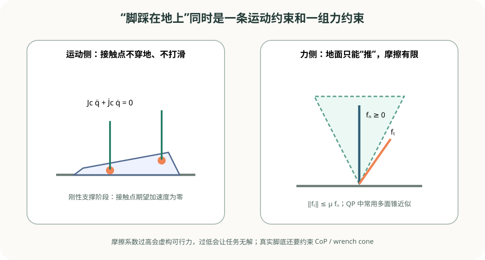

# 浮动基动力学与接触：WBC 的物理地基

目标：理解浮动基坐标、广义速度、刚体动力学、接触 Jacobian、摩擦锥与质心动量，能够解释逆动力学 WBC 为什么联合求解加速度、力矩和接触力。

## 固定基与浮动基差在哪里

固定机械臂的 base 被刚性安装在桌面上，基座自由度不进入可动状态。人形、四足和空中的自由飞行机器人没有固定在世界的基座，需要用 free-flyer 表示 3D 位置与姿态。

以 Pinocchio 常见 free-flyer 为例：

- configuration `q` 中包含基座位置 3、四元数 4 和关节位置；
- tangent velocity `v` 中基座只有 6 维 twist，再加关节速度；
- 因此 `nq` 可能不等于 `nv`，不能用普通 `q + dt*v` 更新姿态；
- 应使用 `pin.integrate(model, q, dt*v)` 或 Pink `Configuration.integrate_inplace()`。

四元数顺序还要核对。Pink/Pinocchio free-flyer 配置通常使用 `[x,y,z,qx,qy,qz,qw,...]`，而其他库可能使用 `wxyz`。数值长度相同并不代表能直接复制。

## 浮动基动力学方程



<div class="image-caption">浮动基本身没有直接执行器。关节力矩通过机构和地面/环境接触间接产生基座加速度，因此接触力与全身运动必须一起考虑。</div>

广义动力学：

$$
M(q)\ddot{q}+h(q,\dot{q})=S^T\tau+J_c(q)^T\lambda
$$

- $M(q)$：广义质量矩阵；
- $h$：科氏、离心和重力等非线性项；
- $S$：选择可驱动关节，浮动基 6 维对应行没有执行器；
- $\tau$：执行器关节力矩；
- $J_c$：接触 Jacobian；
- $\lambda$：接触力或 wrench；
- $\ddot{q}$：全身广义加速度。

对固定基 fully actuated manipulator，给定期望 `q̈` 可以用 inverse dynamics 求 torque。对浮动基机器人，base 行无法由 `τ` 直接满足，必须依靠接触项 $J_c^T\lambda$ 平衡。

## 刚性接触的运动约束

支撑脚不动时，其速度为：

$$
J_c(q)\dot{q}=0
$$

对时间求导：

$$
J_c(q)\ddot{q}+\dot{J}_c(q,\dot{q})\dot{q}=0
$$

这是一条加速度级等式约束。数值误差和接触柔性会产生漂移，工程中常加入位置/速度反馈稳定项：

$$
J_c\ddot{q}+\dot{J}_c\dot{q}=a_c^{ref}-K_p e_c-K_d\dot{e}_c
$$

增益过高会把微小状态噪声放大为巨大加速度/力矩；过低则脚底漂移。先确认 frame、Jacobian 和接触参考，再调增益。

## 接触力约束



<div class="image-caption">支撑接触同时要求接触点运动学上保持、力学上满足单边接触和摩擦。WBC 必须在同一个可行问题中处理两侧。</div>

最简单点接触满足：

$$
f_n\ge0,\qquad \|f_t\|\le\mu f_n
$$

地面可以推机器人，不能用负法向力“拉住”脚；切向力受摩擦系数限制。QP 常用多面锥近似圆锥，例如：

$$
|f_x|\le\mu f_z,\quad |f_y|\le\mu f_z,\quad f_z\ge f_{min}
$$

脚掌是有限面积接触，还可能需要：

- center of pressure 位于支撑多边形；
- 接触 wrench cone；
- 法向力上下界；
- 扭转摩擦限制；
- 多接触间力分配和正则化。

`mu` 不是让优化更容易的自由参数。设得过高会预测现实中不可能的横向力，设得过低会造成不必要不可行。应来自接触材料/试验，并保留安全折扣。

## 任务空间加速度

某个 frame 的空间速度：

$$
v_{task}=J(q)\dot{q}
$$

空间加速度：

$$
a_{task}=J(q)\ddot{q}+\dot{J}(q,\dot{q})\dot{q}
$$

WBC 将 hand、foot、base、CoM 等参考转成期望 $a^*_{task}$，再把它写成对 `q̈` 的线性任务。若漏掉 $\dot{J}\dot{q}$，高速运动时会出现系统性跟踪误差。

SE(3) 姿态误差必须使用李群 log/map 或库提供的 frame task，不要直接相减四元数。误差和 Jacobian 还要在同一 reference frame 表达。

## 质心与 centroidal momentum

质心位置任务只控制 3 维位置，不包含整体角动量。centroidal momentum 写成：

$$
h_g=A_g(q)\dot{q}
$$

其变化：

$$
\dot{h}_g=A_g(q)\ddot{q}+\dot{A}_g(q,\dot{q})\dot{q}
$$

`h_g` 包含线动量和绕质心角动量。腿足 MPC 常规划 centroidal dynamics，WBC 再通过全身关节实现参考。只控制 CoM 而忽略角动量时，上身/手臂快速动作可能让姿态失稳。

## Pinocchio 提供哪些底层量

Pinocchio 实现 RNEA、CRBA、ABA、Jacobian、质心和 centroidal 动量等算法。

```python
import numpy as np
import pinocchio as pin

model = pin.buildModelFromUrdf(urdf_path, pin.JointModelFreeFlyer())
data = model.createData()

q = pin.neutral(model)
v = np.zeros(model.nv)
dv = np.zeros(model.nv)

pin.computeAllTerms(model, data, q, v)
M = pin.crba(model, data, q)
h = pin.nonLinearEffects(model, data, q, v)
tau_generalized = pin.rnea(model, data, q, v, dv)
```

注意事项：

- `crba` 可能只填质量矩阵的一侧，按当前 API 文档确认是否需要对称化；
- `rnea` 返回广义力，free-flyer 前 6 维不是可发送执行器的 torque；
- `data` 与 `model` 必须配对，模型结构变化后重新创建；
- 计算 frame Jacobian 前要执行所需的 kinematics/Jacobian 更新；
- reference frame（WORLD、LOCAL、LOCAL_WORLD_ALIGNED）必须与任务误差一致。

## 逆动力学 WBC 的典型变量

一种 QP 变量：

$$
z=\begin{bmatrix}\ddot{q}\\\tau\\\lambda\end{bmatrix}
$$

最高优先级/硬约束：

- 刚体动力学等式；
- 刚性接触加速度；
- 摩擦锥和单边接触；
- 关节位置/速度/力矩安全约束。

任务目标：

- base/CoM/centroidal momentum；
- hand/foot frame acceleration；
- posture 和关节正则；
- 接触力参考与均匀分配。

求解后提取 `τ` 发送 torque controller，`q̈` 用于状态预测/积分，`λ` 用于检查接触力分配。任何一个量异常都应阻止命令下发。

## 自碰撞与 WBC

4.1 已经介绍碰撞距离。WBC 中可以把距离变化率/加速度写成 inequality/barrier，但它通常只做局部回避，无法解决需要绕到障碍另一侧的全局拓扑问题。

更稳妥的分工：MoveIt 2/cuRobo 提供全局无碰撞参考，MPC/WBC 使用局部安全余量避免小偏差，距离持续逼近阈值时减速并请求重规划。

## 常见坑

| 现象 | 原因候选 | 优先检查 |
|---|---|---|
| base 加速度看起来可控但 torque 不合理 | 忘了浮动基不可驱动、`S` 错 | 检查变量顺序和动力学残差 |
| 支撑脚缓慢漂移 | 接触 Jacobian/frame 错、稳定项太弱 | 画接触 pose/velocity/error |
| 脚底力出现负值 | 未加单边接触或法向方向反了 | 检查 contact normal 与 λ 顺序 |
| 横向力过大仍“可行” | 摩擦约束漏掉或 `mu` 虚高 | 打印 friction margin |
| 手部任务高速误差大 | 漏掉 `Jdot*v`、状态/参考延迟 | 单独核对 task acceleration |
| `nq`/`nv` shape 错 | free-flyer 四元数与 tangent 维度不同 | 使用 model.nq/model.nv 和 `integrate` |
| torque 数值突然跳变 | 接触瞬时切换、任务层级变化 | 做 force/task ramp，记录 active set |

## 小结与自查

1. 为什么 free-flyer 的 `nq` 和 `nv` 通常不同？
2. 浮动基方程中为什么需要选择矩阵 `S`？
3. 刚性接触为什么既有运动约束又有力约束？
4. 只控制 CoM 与控制 centroidal momentum 有什么不同？
5. `rnea` 的前 6 维能直接发送给人形机器人的电机吗？
6. `Jdot*v` 在什么情况下尤其重要？
7. WBC 的局部碰撞任务为什么不能替代全局规划？

## 参考资料

- [Pinocchio Overview](https://docs.ros.org/en/rolling/p/pinocchio/doc/Overview.html)
- [Pinocchio Dynamics Algorithms](https://docs.ros.org/en/ros2_packages/rolling/api/pinocchio/doc/a-features/g-dynamic.html)
- [Pink Introduction](https://stephane-caron.github.io/pink/introduction.html)
- [TSID Documentation](https://gepettoweb.laas.fr/doc/stack-of-tasks/tsid/devel/doxygen-html/)
