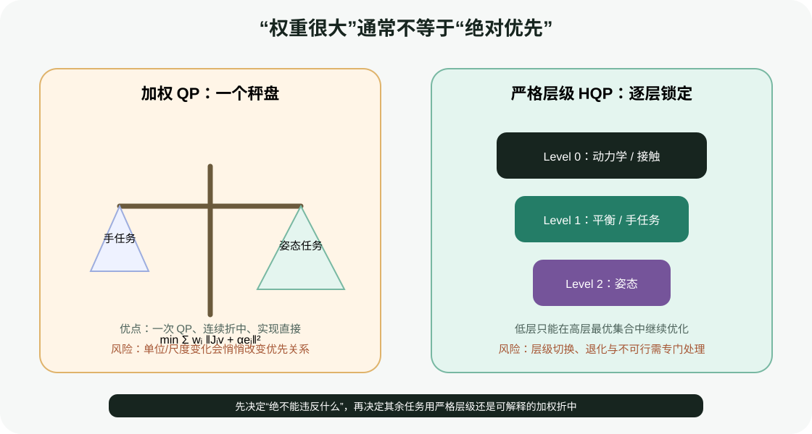
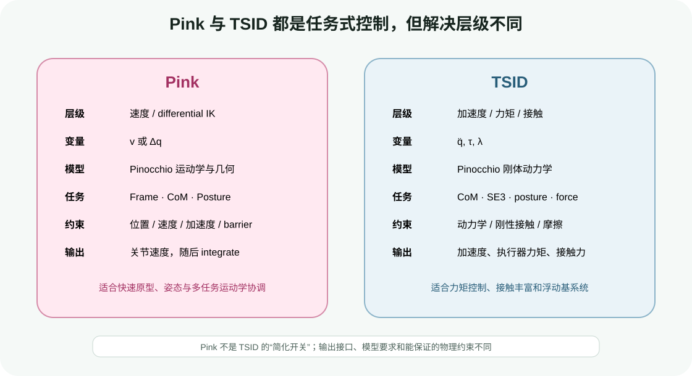

# 任务优先级实战：加权 QP、Pink 与 TSID

目标：理解任务冲突、归一化、加权折中、零空间和严格层级，能够运行加权/层级对照实验，并按官方接口搭建 Pink differential IK 与 TSID inverse-dynamics HQP 的最小骨架。

## 为什么任务一定会冲突

三自由度平面机械臂的末端二维位置任务占用两个方向，理论上还剩一个零空间方向可以调整姿态。但当末端接近奇异、关节限位或速度上限时，这个冗余会缩小；若同时要求末端位置、姿态、关节默认姿态和避障，所有任务不可能都精确满足。

人形机器人冲突更明显：双脚固定、基座竖直、双手到达、质心移动、视线跟踪与关节限位可能同时争夺相同自由度和接触力。

WBC 必须回答：

1. 哪些是绝不能违反的物理/安全约束？
2. 哪些任务可以按权重折中？
3. 哪些任务有严格先后顺序？
4. 不可行时留下多少残差、反馈给谁？

## 加权 QP

速度级任务可写成：

$$
\min_v \sum_i\frac{1}{2}\|J_i(q)v+\alpha_i e_i(q)\|_{W_i}^{2}+\frac{\epsilon}{2}\|v\|^2
$$

满足 limits：

$$
G(q)v\le h(q)
$$

所有任务进入一个目标函数，QP 返回折中解。优点是一次求解、行为连续、容易加入正则；缺点是严格优先级只能近似。

### 权重首先是单位换算

FrameTask 的位置误差单位是米，姿态误差单位是弧度，posture 是关节弧度。若直接使用相同数字权重，并不表示“同等重要”。Pink 明确把 task cost 表达为每米、每弧度等归一化代价。

调权重前先回答：1 cm 位置误差与 1° 姿态误差，在任务上哪个更贵？再把它换成数值；不要从 `1e6` 和 `1e-6` 的随机试验开始。

## 严格层级与零空间

对主任务 `J1 v = b1`，一个解可以写成：

$$
v=J_1^{\#}b_1+N_1z,\qquad N_1=I-J_1^{\#}J_1
$$

`N1` 将次任务更新限制在主任务零空间中，使它不改变主任务的一阶结果。多个层级可以递归构建，或直接用 hierarchical QP：先求 Level 0 的最优集合，再在该集合中优化 Level 1。



<div class="image-caption">加权 QP 像一个秤盘，任务会连续折中；严格层级把高层最优结果锁定，低层只能使用剩余自由度。很大的权重仍可能因尺度、正则和约束而让高层任务产生误差。</div>

零空间公式在没有 inequality 时直观，但关节限位和接触不等式激活后，可用零空间会随 active set 改变。HQP 比单纯伪逆更适合处理这些约束。

## 最小实验：同一任务的两种优先级

运行：

```bash
python labs/04-control-methods/weighted_vs_hierarchy.py \
  --output runs/04-control-methods/weighted_vs_hierarchy.png
```

实验设置：

- 3R 平面机械臂；
- 主任务：末端到达二维目标；
- 次任务：关节靠近默认姿态；
- 加权控制器：将 `J_ee` 与 `I` 堆叠成一次 least-squares；
- 层级控制器：先求末端速度，再把姿态速度投影到末端零空间。

输出：

```text
weighted_final_ee_error=...
hierarchy_final_ee_error=...
weighted_final_posture_error=...
hierarchy_final_posture_error=...
```

图中比较末端轨迹、主任务残差和姿态残差。两种方法都可能成功，但折中分配不同。

## 读懂加权代码

```python
matrix = np.vstack((
    w_ee * J,
    w_posture * np.eye(3),
    np.sqrt(damping) * np.eye(3),
))
vector = np.r_[
    w_ee * ee_command,
    w_posture * posture_command,
    np.zeros(3),
]
velocity = np.linalg.lstsq(matrix, vector, rcond=None)[0]
```

这是无 inequality 的 least-squares 教学版。生产 QP 还要加入 joint/velocity limits、collision barriers、solver status 和数值 scaling。

## 读懂层级代码

```python
J_pinv = np.linalg.pinv(J)
primary = J_pinv @ ee_command
N = np.eye(3) - J_pinv @ J
secondary = N @ np.linalg.pinv(N) @ (posture_command - primary)
velocity = primary + secondary
```

`primary` 完成末端任务，`secondary` 只用零空间调整姿态。接近奇异时伪逆会放大速度，实际实现需要 damping、限位和可行性处理。

<div class="concept-note concept-orange">脚本最后用 `np.clip` 限制关节速度。裁剪会破坏严格层级，因为每个关节被独立修改。正确做法是把速度限制放入 QP/HQP 约束，而不是求解后裁剪。</div>

## Pink：从 URDF 到 differential IK

### 安装

官方推荐 Conda：

```bash
conda create -n pink-wbc python=3.11 -y
conda activate pink-wbc
conda install -c conda-forge pink -y
```

或 PyPI：

```bash
pip install pin-pink qpsolvers daqp robot-descriptions viser loop-rate-limiters
```

不要同时从 Conda 和 pip 安装两套 Pinocchio/eigenpy；出现 undefined symbol 时先检查库来源和 `PYTHONPATH/LD_LIBRARY_PATH`。

### 加载 Panda 与配置

下面按 Pink 当前官方 Panda example 的 API 组织：

```python
import qpsolvers
from robot_descriptions.loaders.pinocchio import load_robot_description

import pink
from pink import solve_ik
from pink.tasks import DampingTask, FrameTask, PostureTask

robot = load_robot_description("panda_description", root_joint=None)
configuration = pink.Configuration(robot.model, robot.data, robot.q0)
```

若 `robot.q0` 不存在或不是期望姿态，使用 `pin.neutral(model)` 或官方 `custom_configuration_vector`，并检查关节顺序。

### 定义任务

```python
end_effector = FrameTask(
    "panda_hand_tcp",
    position_cost=1.0,       # cost / m
    orientation_cost=1.0,    # cost / rad
    lm_damping=1.0,
)
posture = PostureTask(cost=1e-3)
damping = DampingTask(cost=1e-3)
tasks = [end_effector, posture, damping]

end_effector.set_target_from_configuration(configuration)
posture.set_target_from_configuration(configuration)
```

frame 名必须存在：

```python
assert robot.model.existFrame("panda_hand_tcp")
```

### 控制循环

```python
solver = "daqp" if "daqp" in qpsolvers.available_solvers else qpsolvers.available_solvers[0]
dt = 1.0 / 200.0

while True:
    velocity = solve_ik(configuration, tasks, dt, solver=solver)
    if not np.all(np.isfinite(velocity)):
        raise RuntimeError("non-finite Pink velocity")
    configuration.integrate_inplace(velocity, dt)
```

在纯模型/可视化中这样积分。接真实机器人时，应从测量 `q` 更新 `configuration`，把 velocity 发送到有安全限制的 velocity controller；不要只积分内部状态并假设机器人完美跟随。

## Pink limits 与 barriers

Pink 的 limits 构建：

$$
G(q)\Delta q\le h(q)
$$

VelocityLimit 将 URDF 速度限位换成 `dt` 内允许的 displacement；ConfigurationLimit 防止越过位置边界；AccelerationLimit 还考虑上一周期 displacement 和制动距离。`dt` 错一倍，约束尺度也会错。

barrier 可用于碰撞、位置或其他安全函数，但仍是局部方法。若目标在障碍另一侧，需要 4.1/4.2 全局规划提供 waypoint。

## TSID：从动力学与接触构建 HQP

### 安装

官方 Conda 安装：

```bash
conda create -n tsid-wbc python=3.11 -y
conda activate tsid-wbc
conda install -c conda-forge tsid -y
```

先验证：

```bash
python -c "import tsid, pinocchio; print(tsid.__file__); print(pinocchio.__version__)"
```

### 创建机器人与 formulation

```python
import numpy as np
import pinocchio as pin
import tsid

package_dirs = pin.StdVec_StdString()
package_dirs.extend([models_dir])
robot = tsid.RobotWrapper(
    urdf_path,
    package_dirs,
    pin.JointModelFreeFlyer(),
    False,
)

q = np.zeros(robot.nq)
q[6] = 1.0
v = np.zeros(robot.nv)
t = 0.0

invdyn = tsid.InverseDynamicsFormulationAccForce("tsid", robot, False)
invdyn.computeProblemData(t, q, v)
```

四元数和初始脚高必须有效。官方 quadruped demo 会用 frame pose 调整 base 高度，让脚落在地面。

### 添加接触与任务

```python
contact = tsid.ContactPoint(
    "FL_contact",
    robot,
    "FL_contact",
    np.array([0.0, 0.0, 1.0]),
    mu,
    f_min,
    f_max,
)
contact.setKp(kp_contact * np.ones(3))
contact.setKd(2.0 * np.sqrt(kp_contact) * np.ones(3))
invdyn.addRigidContact(contact, force_regularization_weight, 1.0, 1)

com_task = tsid.TaskComEquality("task-com", robot)
com_task.setKp(kp_com * np.ones(3))
com_task.setKd(2.0 * np.sqrt(kp_com) * np.ones(3))
invdyn.addMotionTask(com_task, com_weight, 1, 0.0)
```

参数位置和 contact 类随 TSID 版本/接触模型变化，复制前对照安装版本的 demo。

### 求解并检查

```python
hqp = invdyn.computeProblemData(t, q, v)
solution = solver.solve(hqp)
if solution.status != 0:
    raise RuntimeError(f"TSID QP failed: {solution.status}")

tau = invdyn.getActuatorForces(solution)
dv = invdyn.getAccelerations(solution)
```

不要在 `status != 0` 时继续使用未初始化的 `tau/dv`，也不要默认继续发送上一周期 torque。fallback 必须明确。

## Pink 与 TSID 不是互相替代的开关



<div class="image-caption">Pink 求速度级 differential IK，适合任务运动学与快速原型；TSID 联合动力学和接触求加速度、力矩与接触力。选择取决于控制接口和物理约束，而不只是语言偏好。</div>

| 问题 | Pink | TSID |
|---|---|---|
| 机器人只有 position/velocity interface | 合适 | torque 输出无法直接利用 |
| 需要显式摩擦锥/接触力 | 不负责 | 合适 |
| 想快速验证多 frame/posture task | 合适 | 配置更重 |
| 浮动基高动态运动 | 只能做运动学协调 | 逆动力学级更合适 |
| 惯性参数不可信 | 影响较小 | 会直接影响 torque/force |

## 常见失败与排错

| 现象 | 优先检查 | 不要先做什么 |
|---|---|---|
| Pink 速度剧烈跳变 | 任务不可行、奇异、LM damping、dt | 把所有 cost 同时乘 1000 |
| Pink 到不了远目标 | differential IK 局部最优/限位 | 认为需要更高频率；先用规划器给 waypoint |
| 权重变化导致行为反转 | 米/弧度尺度、任务 residual | 只比较权重数字大小 |
| TSID QP infeasible | 接触、初态、摩擦、任务冲突 | 放大 `mu` 或删除硬约束 |
| torque 合理但仿真发散 | 积分、低层控制、模型/仿真参数 | 只调 TSID task gain |
| contact force 分配极端 | force regularization、接触 frame/normal | 求解后直接 clip λ |
| 不同机器结果不同 | solver、Pinocchio/eigenpy/TSID ABI | 混装 pip/Conda/robotpkg |

## 小结与自查

1. 为什么加权 QP 中相同权重不代表任务同等重要？
2. 求解后裁剪 velocity 为什么破坏严格层级？
3. Pink 的 `lm_damping` 解决什么，代价是什么？
4. Pink 为什么适合 differential IK 而不负责 contact torque？
5. TSID 中 `addRigidContact` 和 `addMotionTask` 分别给 HQP 增加什么？
6. QP status 失败后为什么不能继续用本周期 `tau`？
7. 何时应该从 Pink 升级到 TSID，何时不必？

## 参考资料

- [Pink Introduction and Task Formalism](https://stephane-caron.github.io/pink/introduction.html)
- [Pink Limits](https://stephane-caron.github.io/pink/limits.html)
- [Pink GitHub Examples](https://github.com/stephane-caron/pink/tree/main/examples)
- [TSID GitHub](https://github.com/stack-of-tasks/tsid)
- [TSID Doxygen](https://gepettoweb.laas.fr/doc/stack-of-tasks/tsid/devel/doxygen-html/)
