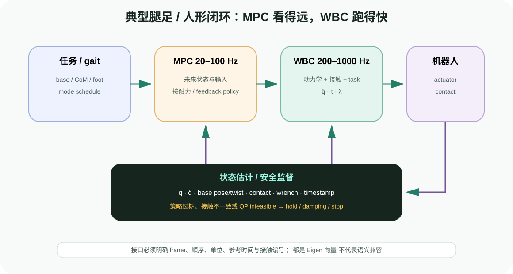
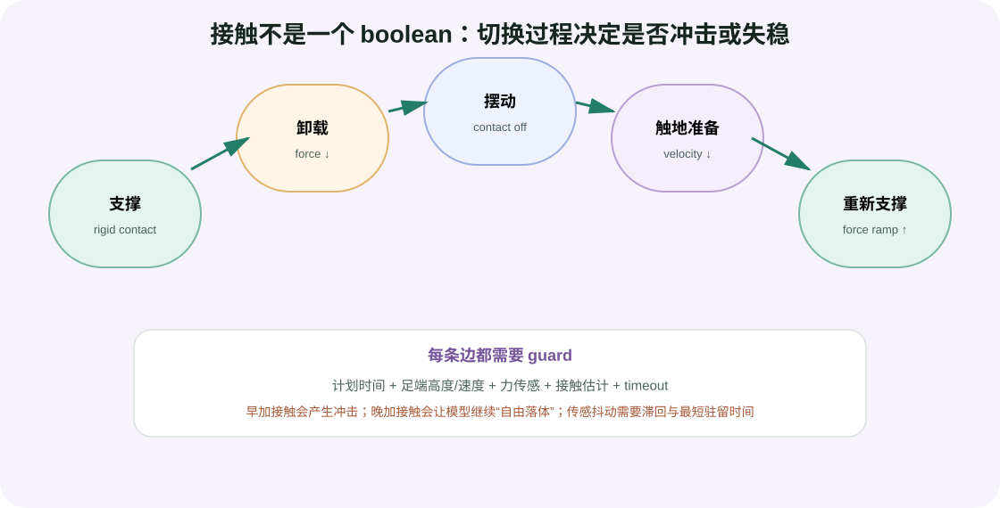

# 控制栈集成：MPC、WBC、接触切换与调试

目标：能够设计 MPC/规划到 WBC 的数据合同，理解接触建立与解除的过渡过程，制定多频率运行、失败恢复和安全验收方案，并定位“上层参考正确但机器人仍不稳定”的跨层问题。

## 一个典型 MPC + WBC 闭环



<div class="image-caption">MPC 以较低频率预测未来 base/CoM/foot/force reference，WBC 以更高频率把当前参考投影到全身动力学和接触可行域，关节控制器执行；状态估计与安全监督闭环反馈。</div>

常见腿足接口：

| MPC 输出 | WBC 消费方式 |
|---|---|
| base pose/twist trajectory | base frame task/reference |
| CoM / centroidal momentum | CoM/centroidal task |
| foot position/velocity/acceleration | swing-foot task |
| mode/contact schedule | 激活/移除 rigid contact 与 force task |
| contact force reference | force regularization/tracking task |
| feedback policy | 在当前状态附近修正参考/输入 |

固定基/移动操作接口则可能是 joint/EE trajectory、base velocity 与 collision margin。无论哪种，都要明确 frame、单位、顺序和时间。

## 数据合同：不要只传一个 Eigen/NumPy 向量

推荐消息/结构体至少含：

```text
timestamp
sequence / reference_version
frame_id
joint_names / contact_names
state or reference vector
mode_id / active_contacts
valid_from / valid_until
source_status
```

常见跨层错误：

- MPC 使用 `[base, joints]`，WBC 使用 `[joints, base]`；
- 一层四元数 `xyzw`，另一层 `wxyz`；
- contact index 0 在 MPC 是左前脚，在 WBC 是右前脚；
- foot reference 在 world frame，WBC 当作 base frame；
- force 在牛顿，另一层先做了体重归一化；
- reference 的时刻在未来，但 WBC 当成当前值。

为每个接口写 shape、unit、frame、order、timestamp 的自动测试，比在运行时看机器人摔倒后猜原因有效得多。

## 接触切换不是开关瞬间翻转



<div class="image-caption">支撑脚离地和摆动脚落地需要卸载、速度匹配和力渐变。只在某一帧把 contact 从 true 改为 false，会让 QP 可行域和 torque 突然跳变。</div>

### 支撑到摆动

1. 上层 mode schedule 宣布即将离地；
2. 接触力参考逐渐下降；
3. 确认法向力/CoP 和其他支撑足可承受负载；
4. 解除 rigid contact；
5. 激活 swing-foot trajectory task。

### 摆动到支撑

1. 足端接近目标，降低下降速度；
2. 结合计划时间、足高、速度、力/触觉判断触地；
3. 建立接触时设置合理 reference，避免位置瞬跳；
4. 接触力从小到大 ramp；
5. 逐步降低 swing task，进入稳定支撑。

早建立接触会让优化器假设脚已被地面支撑，产生冲击；晚建立接触会让模型继续按自由摆动计算，机器人已经受力却没有 contact wrench 变量。

## 接触估计需要滞回与超时

单一力阈值会在噪声附近反复切换。可使用：

```text
enter_contact: force > high_threshold 持续 N_enter 帧
leave_contact: force < low_threshold  持续 N_leave 帧
high_threshold > low_threshold
```

再结合最短驻留时间、计划 mode 和 foot kinematics。传感器故障或事件长期未发生时，必须超时并请求上层恢复，不能永远停留在“等待触地”。

## 规划轨迹怎样变成 WBC task

MoveIt/cuRobo 关节轨迹可以直接成为 posture/joint task reference，也可以通过 FK 转成末端 reference。但要注意：

- 规划时机器人可能固定基座，WBC 当前是浮动基/移动底座；
- 规划的 trajectory 已包含时间，WBC 不能每周期只取最近 waypoint 而忽略速度/加速度；
- WBC 添加接触和力矩约束后可能无法精确跟踪，残差应反馈给上层；
- 附着物/负载改变惯量和 CoM 后，动力学模型要更新；
- 4.1 的最终碰撞检查仍应在 WBC 实际/预测轨迹上监测。

## WBC 运行循环骨架

```python
state = estimator.latest()
reference = reference_buffer.sample(state.timestamp)

if state.is_stale or reference.is_stale:
    return safety.damped_hold()

contact_manager.update(
    planned_mode=reference.mode,
    measured_forces=state.contact_forces,
    foot_kinematics=state.foot_states,
)

tasks = task_manager.build(reference, state, contact_manager.mode)
hqp = formulation.compute_problem(state.q, state.v, tasks)
solution = solver.solve(hqp)

if not solution.ok or solution.max_residual > residual_limit:
    return safety.contact_safe_hold()

command = extract_and_validate_torque(solution, state)
return actuator.send(command)
```

`contact_safe_hold` 不能简单把全部 torque 清零；腿足机器人在支撑中突然零力矩可能更危险。fallback 需要按硬件设计重力补偿、阻尼、支撑任务或安全落地。

## 任务生命周期也需要渐变

手部 task 权重从 0 瞬间变成 1000，或 target pose 瞬移，会造成 velocity/acceleration/torque jump。可使用：

- target position/orientation interpolation；
- task weight ramp；
- TSID task transition duration；
- reference velocity/acceleration feedforward；
- 对任务启停设置状态机和最小持续时间。

渐变不能掩盖非法目标。目标在关节限位外时，应拒绝或请求重规划，而不是用更慢 ramp 让它长期推向限位。

## 多频率数据如何采样

假设 MPC 50 Hz、WBC 500 Hz：一个 MPC policy 要被 WBC 查询约 10 次。WBC 应按当前时间插值 reference，并检查 validity；不应在 20 ms 内一直重复同一个离散状态点。

状态估计 400 Hz 而 WBC 500 Hz 时，一部分 WBC 周期会复用最新测量或做短预测。必须记录 state age，并定义最大允许复用次数。

## 联调顺序

### 第一阶段：WBC 单独验证

- 固定 reference，验证姿态/支撑；
- 单独激活一个 hand/foot task；
- 检查动力学和接触 residual；
- 人工触发一个受控 task ramp。

### 第二阶段：回放 MPC 日志

- 不运行在线 MPC，离线回放已保存 reference；
- 检查 frame/order/time；
- 测 WBC 对 reference 的可行性和残差。

### 第三阶段：在线但不下发

- MPC + WBC 全链运行；
- shadow mode 比较 torque/force 与当前控制器；
- 注入 reference delay、solver failure、contact mismatch。

### 第四阶段：仿真/低风险真机

- 低速、小目标、保守力矩；
- 独立急停和 workspace；
- 每次只增加一个任务或接触切换。

## 必须记录的 WBC 信号

```text
timestamp, state_age, reference_age, mode, active_contacts
solver_status, solve_us, active_set / HQP level
task_name, task_error, task_velocity_error, task_weight/priority
dynamics_residual, contact_acceleration_residual
friction_margin, normal_force, CoP margin
q, v, dv, tau_command, tau_applied, torque_margin
fallback_state, transition_progress, failure_reason
```

只记录 `tau` 无法判断 torque 大是因为任务参考、接触错误、动力学补偿还是求解器数值问题。

## 跨层故障定位

| 现象 | 可能层 | 定位方式 |
|---|---|---|
| MPC reference 平滑、torque 跳变 | WBC task/contact transition | 画 active task/contact 与 torque 同时序 |
| WBC residual 小、机器人不跟踪 | 低层/硬件/模型 | 比较 tau command/applied、qdd predicted/measured |
| 触地瞬间弹起 | contact timing/normal/frame | 对齐 foot height、force、mode 与 λ |
| 手任务误差大但平衡稳定 | 优先级/可行域 | 查看高层 task 是否占满自由度与摩擦裕度 |
| 所有 task 同时恶化 | state/frame/order 或 QP failure | 检查时间戳、q/v 顺序、solver status |
| force 合理但脚滑 | `mu` 虚高、地面模型/估计错误 | 比较 friction margin 与真实切向运动 |
| 规划无碰撞但 WBC 执行贴障 | 跟踪偏差/局部 task | 监测实际最小距离并触发降速重规划 |

## 安全与恢复层级

可按严重度设计：

1. soft warning：任务残差短时升高，记录但继续；
2. degrade：降低非关键手/姿态 task，保留接触和平衡；
3. hold：冻结目标，进入阻尼/姿态保持；
4. safe landing/stance：腿足机器人完成受控落脚/站稳；
5. hardware stop：状态失效、torque/速度越界或通信中断。

恢复也要有条件：状态重新新鲜、接触稳定、reference 重新同步、solver 连续成功若干周期后，才逐步恢复任务，避免故障模式抖动。

## 与 4.4 移动操作的衔接

4.4 会讨论导航到位、base placement 和移动操作。进入移动操作时，本节提供控制层接口：底盘与手臂可作为同一 kinematic WBC/Pink 问题协调，或由 MPC 预测 base+arm，再由 WBC/关节控制执行。导航层负责长距离路径和 costmap，WBC 不应承担全局导航。

## 验收清单

- MPC/WBC joint/contact 顺序、frame、单位有自动测试；
- reference/state/policy 有时间戳与最大年龄；
- 接触进入/退出有 ramp、滞回、最短驻留和 timeout；
- task 启停有 target/weight transition；
- QP/HQP failure 不会继续发送未验证或陈旧 torque；
- dynamics/contact/friction/torque residual 全部有日志；
- fallback 保留必要支撑与阻尼，并经过仿真触发测试；
- 实际碰撞距离和上层重规划信号已接通；
- shadow mode、低速真机和恢复流程均可复现。

## 小结与自查

1. 为什么接触切换不能只翻转一个 boolean？
2. MPC 50 Hz、WBC 500 Hz 时，WBC 应怎样消费参考？
3. 为什么 torque QP 失败后“沿用上一帧 torque”可能危险？
4. task weight ramp 与非法目标拒绝分别解决什么问题？
5. WBC residual 小但机器人不跟踪时，故障可能在哪一层？
6. contact-safe fallback 为什么不一定是 torque 置零？
7. WBC 与 4.4 导航/移动操作的边界是什么？

## 参考资料

- [OCS2 Getting Started：MPC/MRT](https://leggedrobotics.github.io/ocs2/getting-started.html)
- [OCS2 Legged Robot Example](https://leggedrobotics.github.io/ocs2/robotic_examples.html#legged-robot)
- [Pink Documentation](https://stephane-caron.github.io/pink/)
- [TSID Quadruped Demo](https://github.com/stack-of-tasks/tsid/blob/devel/demo/demo_quadruped.py)
- [Stack of Tasks Overview](https://stack-of-tasks.github.io/)
