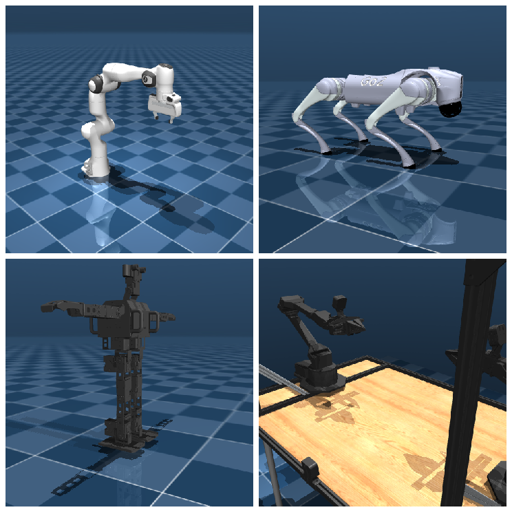

# MuJoCo 是什么

前面我们说 MuJoCo 轻量、好上手，适合拿来快速试想法，但还没正面回答最基本的问题：它到底是什么。它的名字其实已经说了一半。MuJoCo 是 **Mu**lti-**Jo**int dynamics with **Co**ntact 的缩写，直译是“带接触的多关节动力学”，本质上是一个**物理引擎**：我们把机器人和场景写进一个文件交给它，它就按物理规律（重力、碰撞、摩擦等）一步步算出物体接下来怎么动。名字里特意点出“多关节”和“接触”，是因为机械臂、机器人正是一节节连杆经关节连起来的，干活时又免不了和别的物体碰、抓、推，这两件事恰好是它最擅长的。

## 本节目标

知道了它是什么，本节再围绕下面几个问题展开：

1. MuJoCo 是从哪来的，又以什么形态提供给我们：是要装个大软件，还是 `import` 一下就能用？
2. 它有哪些突出特点，为什么在机器人控制和强化学习里常常是它，而不是别的仿真器？
3. 和 Isaac Sim、SAPIEN、Genesis 这些平台相比，它的定位在哪？什么任务适合用它，什么任务又不该硬用？

## 来历与形态

MuJoCo 最初由 Emo Todorov 开发，并通过 Roboti LLC 商业化，2021 年 10 月被 Google DeepMind 收购并免费开放，2022 年 5 月以 Apache 2.0 协议开源。现在它由 DeepMind 持续维护，代码托管在 [google-deepmind/mujoco](https://github.com/google-deepmind/mujoco)。

从技术形态上说，MuJoCo 是一个带 C API 的 C/C++ 库，同时提供了 Python 绑定（通过 `pip install mujoco` 安装）。它不像一些大型仿真平台那样需要先启动图形应用或加载复杂的 UI，在 Python 里 `import mujoco` 就能直接使用，这让它显得轻量、启动快、适合嵌入到各种自动化流程里。

## 核心特点

MuJoCo 有几个比较突出的特点，这也是它在机器人学和 RL 社区里常见的原因：

**广义坐标 + 现代接触动力学。** 传统上，物理引擎分为两派：机器人学引擎用广义坐标（关节坐标），精确但不擅长处理接触；游戏引擎用笛卡尔坐标，擅长碰撞但关节约束容易漂移。MuJoCo 较早地把两者结合起来，在广义坐标里做关节运动，同时用基于优化的方法求解接触力。这使得它在处理精细的关节结构（比如机械臂、灵巧手）时比较稳定，同时接触计算也相对可靠。

**仿真速度快，启动轻量。** MuJoCo 的运行时在初始化之后不分配任何堆内存，所有工作区都预分配在 `mjData` 里。一台没有独立显卡的笔记本也能驱动机械臂运动，这对快速迭代实验很友好。

**确定性较好。** 在相同模型、相同初始状态和相同输入下，重复运行通常能得到一致的结果。这对需要复现实验的研究场景很重要。不过要提醒的是，确定性依赖于我们也把随机种子和初始条件固定好，MuJoCo 本身不引入随机性，但如果我们的控制器里有随机成分，结果自然会有差异。

**MJCF 建模语言。** MuJoCo 用自己的 XML 格式（MJCF）描述模型。MJCF 有一个类似 CSS 的 `<default>` 继承机制，让模型文件比很多其他格式更简短。这一点在第二章会详细展开。

**CPU 与 GPU 双后端。** 除了 C 引擎（CPU），MuJoCo 还提供了 MJX（基于 JAX）和 MuJoCo Warp（基于 NVIDIA Warp）两种 GPU 加速后端。CPU 上跑单个环境做调试，GPU 上批量并行跑几万个环境做训练，模型格式通用，切换成本很低。

**模型与数据分离。** `mjModel` 存不变的结构，`mjData` 存每步变化的状态，这一点 [MuJoCo 程序怎么运转](02-mental-model.md) 一页会详细展开。分离之后，多个环境共享一份 `mjModel`、各自维护一份 `mjData`，天然支持多线程采样。

## 和同类工具的定位差异

下面是一张粗略的定位对照表。需要说明的是，各个仿真器都在快速迭代，这里描述的是截至写作时的大致印象，更多是从"适合什么场景"的角度来区分，而不是说谁比谁好。

| 仿真器 | 核心定位 | 渲染能力 | 适合的场景 |
|---|---|---|---|
| MuJoCo | 轻量物理引擎，广义坐标+优化接触 | 基础 OpenGL，够用但不以渲染见长 | 控制、RL、机械臂、运动控制（locomotion）研究 |
| Isaac Sim | NVIDIA Omniverse 之上的机器人仿真平台 | 高保真光线追踪（RTX） | 需要逼真传感数据（RGB-D、语义分割）、与 ROS/Isaac SDK 深度集成的项目 |
| SAPIEN | 面向交互式物体操作的仿真 | 中等，基于 Vulkan | 物体操作、部件交互、大规模数据集生成 |
| Genesis | 较新的通用仿真平台 | 中等 | 多场景快速原型 |

概括地说：如果关注点在于控制策略、RL 训练、快速迭代，MuJoCo 的轻量和速度是主要优势；如果任务里高度依赖逼真的视觉传感（比如需要照片级的深度图或语义分割），那 Isaac Sim 这类平台可能更匹配。各平台更详细的比较见 [平台选择](../../01-platform-selection.md)。

## 适合做什么、不太适合做什么

下面这几类机器人在 MuJoCo 里都有现成、校准好的模型，机械臂、四足、人形、双臂操作平台都能直接加载：

**MuJoCo 比较适合：**

- 机械臂、四足、人形机器人的运动控制研究
- 强化学习和模仿学习（单环境调试快，也支持 GPU 批量并行）
- 需要快速迭代的算法原型开发
- 抓取、灵巧操作等需要接触建模的任务
- 需要在无 GPU 环境下也能跑仿真的场景（比如 CI/CD 流水线里的自动化测试）

**MuJoCo 不太适合：**

- 需要照片级渲染质量的应用（比如要生成训练视觉模型的合成数据，且对渲染保真度要求很高）
- 超大规模场景（比如整座工厂或城市级别的仿真，这类更适合游戏引擎出身的平台）
- 需要丰富的 GUI 拖拽式建模（MuJoCo 的建模偏向文本/代码驱动）

另外，MuJoCo 的物理模型有自己的简化假设（比如碰撞用的 mesh 会被取凸包，复杂凹形需要拆分或换成简单几何），对某些特殊场景可能需要额外建模技巧。这些会在后续章节中结合实际例子来说明。

## 小结

- MuJoCo 是一个轻量、快速的物理引擎，广义坐标 + 优化接触是它和游戏引擎在物理模型上最主要的区别。
- `pip install mujoco` 就能用，不用启动图形环境，适合嵌入自动化流程。
- 它在控制、RL、机械臂操作等场景里很常见；渲染不是它的主要长项。
- 模型与数据分离的设计，让它天然支持多线程并行采样和 GPU 迁移。

## 参考资料

- [MuJoCo Documentation: Overview](https://mujoco.readthedocs.io/en/stable/overview.html)
- [MuJoCo（GitHub）](https://github.com/google-deepmind/mujoco)
- [Todorov et al., "MuJoCo: A physics engine for model-based control", IROS 2012](https://homes.cs.washington.edu/~todorov/papers/TodorovIROS12.pdf)
- [MuJoCo Menagerie（GitHub）](https://github.com/google-deepmind/mujoco_menagerie)

## 导航

- 上一节：[认识 MuJoCo](../01-overview.md)
- 返回上级：[认识 MuJoCo](../01-overview.md)
- 下一节：[MuJoCo 程序怎么运转](02-mental-model.md)
