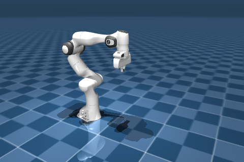

# MuJoCo 安装与第一个仿真实验

在各类仿真器里，MuJoCo 的安装算是格外省心的：`pip install mujoco` 一句话就好，编译好的库都打包在里面，连 C++ 依赖都不用单独装。所以这一页节奏很轻，5 到 10 分钟就能从零跑出第一个仿真。看到 `qpos` 数组打印出来、或者渲染出一帧画面，就说明环境已经就绪。

## 本节目标

本节的目标，是让我们在自己的机器上真正把 MuJoCo 跑起来：装好运行环境、跑通第一个最小仿真。顺带也把两件容易卡住新手的事说清楚，一是几个常用配套包的版本该怎么搭配，二是没有显示器、安装报错这类常见问题该怎么应对。

## 安装 mujoco

MuJoCo 的 Python 包已经发布在 PyPI 上，推荐直接用 pip 安装：

```bash
pip install mujoco
```

这个包自带 MuJoCo 库的编译好的二进制文件，不需要额外下载或单独安装任何 C++ 库。安装完成后，在 Python 里验证一下：

```python
import mujoco
print(mujoco.__version__)
```

如果正常输出版本号（写作时是 `3.8.1`），说明安装成功。

常用配套包的安装：

```bash
pip install dm_control         # DeepMind 的任务封装库（可选）
pip install gymnasium          # Gym 风格接口（可选）
pip install mujoco-mjx         # MJX (JAX 后端)，需单独安装（可选）
```

## 版本与依赖对照

下面是本节示例所用的环境版本：

| 项目 | 版本 / 说明 |
|---|---|
| Python | 3.10 |
| MuJoCo | 3.8.1 |
| dm_control | 1.0.41（可选） |
| gymnasium | 1.2.3（可选） |
| 渲染后端 | EGL（通过 `MUJOCO_GL=egl`，无显示器也能出图） |

几个版本相关的说明：

- **MuJoCo 3.x** 是目前的主流大版本。如果看到一些旧教程里用 `mujoco_py`，那是 MuJoCo 2.x 时代的第三方 Python 绑定，现在已经不维护了，建议迁移到官方的 `mujoco` 包。
- **dm_control** 依赖 `mujoco` 包，它的 `suite` 里收录了一批经典 RL 任务。dm_control 的版本和 MuJoCo 版本有对应关系，安装时 pip 会自动解析兼容版本。
- **MJX**（MuJoCo XLA，GPU 加速后端）需要单独安装 `mujoco-mjx`，并且依赖 JAX。第七章会详细展开。

## 最小可跑示例

下面是一段不到 20 行的脚本，用一段内联 XML 定义一个简单场景（一个带 free joint 的方块，初始悬在平面上方），跑 100 步，打印最后的状态：

```python
import mujoco

xml = """
<mujoco>
  <worldbody>
    <light diffuse=".5 .5 .5" pos="0 0 3" dir="0 0 -1"/>
    <geom type="plane" size="1 1 0.1" rgba=".9 0 0 1"/>
    <body pos="0 0 1">
      <joint type="free"/>
      <geom type="box" size=".1 .2 .3" rgba="0 .9 0 1"/>
    </body>
  </worldbody>
</mujoco>
"""

model = mujoco.MjModel.from_xml_string(xml)
data = mujoco.MjData(model)

for _ in range(100):
    mujoco.mj_step(model, data)

print(f"time = {data.time:.3f}")
print(f"qpos = {data.qpos}")
```

运行后会打印出 `time = 0.200` 和一串 `qpos`。这个 free joint 方块的 `qpos` 前三个数是它的位置 `(x, y, z)`，其中 z（即 `qpos[2]`）在重力作用下从初始的 `1.0` 降到约 `0.80`。也就是说 0.2 秒（100 步）还不够它落到地面，这会儿它还在下落途中（方块要落到 z≈0.30 才贴上平面）。想看它落地停稳，把步数加大就行，下面的练习会试。能打印出 `time` 和 `qpos`，就说明核心管线已经跑通了。

## 验证安装：跑一个内置模型

MuJoCo 的 Python 包里附带了一些示例模型。我们可以用交互式查看器确认一切正常。在本地有显示器的机器上运行：

```bash
python -m mujoco.viewer --mjcf=/path/to/some/model.xml
```

这会打开一个窗口，渲染出模型，可以用鼠标旋转、缩放视角。如果没有现成的模型文件，MuJoCo 源码仓库的 `model/` 目录下有几十个示例模型可供测试。

如果是在没有显示器的服务器上（比如通过 SSH 登录），可以用离屏渲染来验证。先设置环境变量，再跑一个带渲染的脚本：

```bash
MUJOCO_GL=egl python -c "
import mujoco
xml = '<mujoco><worldbody><geom type=\"plane\" size=\"1 1 0.1\"/><body pos=\"0 0 1\"><joint type=\"free\"/><geom type=\"box\" size=\".1 .2 .3\"/></body></worldbody></mujoco>'
model = mujoco.MjModel.from_xml_string(xml)
data = mujoco.MjData(model)
with mujoco.Renderer(model, height=240, width=320) as renderer:
    mujoco.mj_forward(model, data)
    renderer.update_scene(data)
    pixels = renderer.render()
    print(f'rendered shape: {pixels.shape}')
"
```

如果输出了 `rendered shape: (240, 320, 3)`，说明离屏渲染也正常。`MUJOCO_GL=egl` 指定了用 EGL 后端渲染，不需要显示器。

## 跑一个真实机器人模型

仓库 `labs/04-simulation/mujoco_panda_video.py` 加载 mujoco_menagerie 里的 Franka Panda 模型，从 ready 位姿开始、不额外给控制，渲染它在默认控制量下 200 步的演化成视频。会看到手臂慢慢离开 ready 姿态。这不是"重力下瘫软"，而是 `ctrl` 默认为 0、位置电机把各关节往 0 拉的结果：

```bash
MUJOCO_GL=egl python labs/04-simulation/mujoco_panda_video.py
```

输出第一帧大致如下：



完整过程视频：

<video src="../assets/mujoco-panda-drop.mp4" controls muted loop playsinline style="max-width:100%;height:auto;display:block;margin:0.75em 0"></video>

如果能在自己的机器上跑出类似画面，说明 MuJoCo、mujoco_menagerie 与离屏渲染这条链路都通了。脚本里用到的关键 API 会在第二、第三章逐步展开。

## 常见安装问题

| 现象 | 可能原因 | 处理建议 |
|---|---|---|
| `ImportError: No module named mujoco` | 没安装或在错误的 Python 环境中 | 确认 `pip install mujoco` 在当前环境中执行；检查 `which python` |
| 渲染时报错或黑图 | 无显示器环境，没设置 `MUJOCO_GL` | 先试 `MUJOCO_GL=egl`，不行再试 `MUJOCO_GL=osmesa` |
| `MUJOCO_GL=egl` 报错 | 机器上没有 EGL 库 | NVIDIA 显卡装好驱动后通常自带；CPU 环境可换 `MUJOCO_GL=osmesa` |
| macOS 上 `launch_passive` 卡住 | macOS 要求渲染在主线程执行 | 用 `mjpython` 代替 `python` 启动脚本 |
| `mujoco.FatalError: ...` | 通常是模型文件有问题 | 检查模型路径是否正确、XML 语法是否合法 |

## 小结

- `pip install mujoco` 一行就能装好，包自带编译好的二进制文件。
- 安装完成后，用 `import mujoco` 验证；用最小示例（内联 XML → 跑 100 步 → 打印 `qpos`）确认核心管线。
- 无显示器环境记得设置 `MUJOCO_GL=egl`（或 `osmesa`）才能离屏渲染。
- 目前主流是 MuJoCo 3.x，旧的 `mujoco_py` 已不再维护。

## 动手练习

把 `for _ in range(100)` 改成 `range(1000)`，看方块的位置有什么变化？跑完会看到 `time = 2.000`，`qpos` 的第 3 个数（z）从 100 步时的约 0.80 落到约 0.30，正好是方块的半高（`size` 的第 3 个值），说明它已经落到地面停稳；表示姿态的四元数仍是 `(1, 0, 0, 0)`，没有翻转。

## 参考资料

- [MuJoCo Documentation: Overview](https://mujoco.readthedocs.io/en/stable/overview.html)
- [MuJoCo Documentation: Python Bindings](https://mujoco.readthedocs.io/en/stable/python.html)
- [MuJoCo Menagerie: Franka Emika Panda](https://github.com/google-deepmind/mujoco_menagerie/tree/main/franka_emika_panda)

## 导航

- 上一节：[MuJoCo 程序怎么运转](02-mental-model.md)
- 返回上级：[认识 MuJoCo](../01-overview.md)
- 下一节：[建模](../02-modeling.md)
