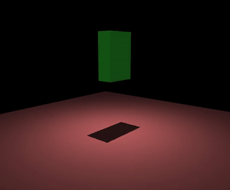

# MJCF 整体骨架

一个能跑起来的 MJCF 文件，可以简单到不到 20 行；而一台真实机器人的模型，往往几百上千行。神奇的是，两者的骨架是同一套。这一页我们先不抠任何具体细节，而是从鸟瞰的角度把这套骨架看清楚，后面每一页再回到它上面，深挖其中的某一块。

## 本节目标

具体来说，本页想说清几个问题：

1. 一个 MJCF 文件最多能有哪些顶层节，哪些是必备的、哪些不写就用默认？
2. `<compiler>`、`<option>` 这种不描述机器人本身的节，到底在管什么？
3. 真实项目里，机器人和场景为什么常拆成两个文件，又怎么用 `<include>` 拼回去？

## 一份最简 MJCF 长什么样

在展开细节之前，先说清楚格式本身：MJCF 是一种 XML（和写网页的 HTML 类似，用成对的尖括号标签、再加上标签里的属性来描述结构）。下面就是一份不到 20 行的 MJCF 文件，它描述了一个很简单的场景：一块地面，加一个从高处落下的方块。这份文件能加载、能跑、能渲染：

```xml
<mujoco>
  <worldbody>                         <!-- 场景的根 -->
    <light diffuse=".5 .5 .5" pos="0 0 3" dir="0 0 -1"/> <!-- 一盏灯 -->
    <geom type="plane" size="1 1 0.1" rgba=".9 0 0 1"/> <!-- 地面 -->
    <body pos="0 0 1">                 <!-- 一个物体，初始悬在 1m 高处 -->
      <joint type="free"/>            <!-- 自由关节：能平移也能旋转 -->
      <geom type="box" size=".1 .2 .3" rgba="0 .9 0 1"/> <!-- 物体的形状：方块 -->
    </body>
  </worldbody>
</mujoco>
```

这份文件的结构很简单：最外层是根元素 `<mujoco>`，里面只放了一个 `<worldbody>`，其它可选的顶层节（`<compiler>`、`<asset>` 等，下一节会一一列出）都没用到。`<worldbody>` 里就是场景的全部内容：一盏灯、一块地面、一个方块。方块上挂了一个 `free` 类型的 joint（关节），所以它能在空间里自由平移和旋转；如果把 `free` 换成 `hinge`，它就只能绕一个轴转了。

这就是 MJCF 的最小骨架：`<mujoco>` 包一个 `<worldbody>`，里面放几何和物体。实际机器人模型会比这复杂得多，但核心结构是一样的。

这份最简 MJCF 跑起来，就是一个方块在重力下下落：



## 顶层节一览

下面是一个完整的 MJCF 顶层节清单。并不是每个文件都需要全部出现，很多节是可选的，不写就用默认值。

| 顶层节 | 必备？ | 一句话定位 | 详讲见 |
|---|---|---|---|
| `<mujoco>` | 是 | 根元素，`model="..."` 属性给模型命名 | 本页 |
| `<compiler>` | 否 | 控制 MJCF 文件怎么被解释：角度单位、网格目录、自动限位等 | 本页 |
| `<option>` | 否 | 物理仿真和可视化的全局设置：时间步长、重力、积分器等 | 本页 + 控制与物理章 |
| `<default>` | 否 | 类似 CSS 的默认值继承，让模型文件更简短 | [default 继承](05-default-inheritance.md) |
| `<asset>` | 否 | 网格、材质、纹理、高度场等外部资源的声明 | [几何与资产](04-geom-and-asset.md) |
| `<worldbody>` | 是 | 场景的根 body，所有物体、几何、灯光、相机都从这里开始嵌套 | [body 树与关节](02-body-and-joint.md) |
| `<actuator>` | 否 | 驱动（电机）的定义，告诉我们怎么让关节动 | [控制与物理](../03-control-and-physics.md) |
| `<sensor>` | 否 | 传感器的定义，声明我们要从仿真里读哪些量 | [观测与渲染](../04-observation-and-rendering.md) |
| `<tendon>` | 否 | 肌腱，用来耦合多个关节（比如夹爪的两根手指联动） | [tendon 与 equality](../03-control-and-physics/03-tendon-and-equality.md) |
| `<equality>` | 否 | 等式约束，表达关节之间的运动关系 | [同上](../03-control-and-physics/03-tendon-and-equality.md) |
| `<keyframe>` | 否 | 预设姿态的快照，方便一键重置到某个位姿 | [keyframe 与命名](08-keyframe-and-naming.md) |
| `<contact>` | 否 | 手动指定接触对及其参数（多数情况自动生成） | [控制与物理](../03-control-and-physics.md) |

一个简易的模型通常只用到 `<mujoco>`、`<worldbody>` 和可选的 `<actuator>`。更复杂的模型会逐步引入 `<default>`（减少重复）、`<asset>`（引用外部网格）和 `<sensor>`（定义观测）。

## compiler 与 option：全局设置

`<compiler>` 和 `<option>` 是两个控制全局行为的节，不描述机器人本身，但影响整个文件怎么被理解和仿真怎么跑。

`<compiler>` 的常用属性：

```xml
<compiler angle="radian" meshdir="assets" autolimits="true"/>
```

- `angle`：这个文件里的角度是按**度**（`degree`）还是**弧度**（`radian`）理解。编译进 `mjModel` 后统一是弧度。如果这里写错了，写在文件里的关节角会被误读，数值上往往相差约 57 倍（弧度和度的换算系数）。
- `meshdir`：网格文件（`.stl`、`.obj`）所在的目录，相对于 MJCF 文件位置。
- `autolimits`：设为 `true` 时，只要元素写了 `range`，就自动把对应的 `limited` 置真（没写 `range` 的则不启用限位），省得再手写 `limited`。它推断的是“要不要启用限位”，并不会凭空补出限位数值。

`<option>` 的常用属性：

```xml
<option integrator="implicitfast" timestep="0.002" gravity="0 0 -9.81"/>
```

- `integrator`：数值积分方法。MuJoCo 引擎的全局默认是 `Euler`，而 Panda 等模型会在这里显式写成 `implicitfast`，初学跟随模型自带的设置即可。
- `timestep`：每次 `mj_step` 推进的仿真时间（秒）。MuJoCo 默认就是 `0.002`，Panda 没有单独设、沿用这个默认值。
- `gravity`：重力加速度向量，默认 `0 0 -9.81`（MKS 单位制下的地球重力）。

这些设置也可以在代码里通过 `model.opt.*` 动态修改，但建议先在 MJCF 里设好默认值。

## include 与场景拼装

在实际项目里，机器人模型和场景通常是分开的文件。机器人本体一个文件（比如 `panda.xml`），场景文件（比如 `scene.xml`）用 `<include>` 把机器人引进来，再补上地面、灯光、相机等。下面是 menagerie 的 Panda `scene.xml` 的结构骨架（为看清结构省略了 `<asset>` 等节，`groundplane` 材质就定义在被省略的 asset 里；完整文件见 menagerie）：

```xml
<mujoco model="panda scene">
  <include file="panda.xml"/>

  <worldbody>
    <light pos="0 0 1.5" dir="0 0 -1" directional="true"/>
    <geom name="floor" size="0 0 0.05" type="plane" material="groundplane"/>
  </worldbody>
</mujoco>
```

这种拆分有几个好处：
- 同一个机器人模型可以复用到不同场景（抓取、推、投掷等）。
- 机器人文件可以独立维护和版本管理。
- 场景文件保持简短，容易一眼看清"这个实验做了什么改动"。

`<include>` 本质上就是文本级替换，被引入文件的内容会嵌入到引入位置，然后一起编译。

## 这张骨架后面怎么深入

后面的小节会把这张骨架的每一块拆开来细讲：

- [body 树与关节](02-body-and-joint.md)：`<worldbody>` 的嵌套结构、joint 的四种类型、inertial、site。
- [坐标系与朝向](03-coordinate-frames.md)：坐标约定、四元数顺序、读位置时容易遇到的问题。
- [几何与资产](04-geom-and-asset.md)：geom 类型、visual vs collision、mesh/material/texture。
- [default 继承](05-default-inheritance.md)：`<default>` 的 CSS 式继承机制。
- 之后几页：从 mjModel/mjData 到 keyframe、命名访问、URDF 转换，最后动手改模型。

## 小结

- MJCF 文件以 `<mujoco>` 为根，`<worldbody>` 为必备的顶层节；其余如 `<actuator>`、`<sensor>`、`<default>` 等按需出现。
- `<compiler>` 控制文件怎么被解释（角度单位尤其要留意），`<option>` 控制仿真怎么跑。
- `<include>` 让模型拆分和复用变得简单，"机器人 + scene"是一种常见的拆法。
- 这张骨架是后面各页的共同底图，每一页大致都在深挖其中的某一节。

## 动手练习

给方块换上一个带限位的转动关节，体会“角度单位”的影响：把示例里的 `<joint type="free"/>` 改成 `<joint type="hinge" axis="0 0 1" range="0 90"/>`，并在 `<mujoco>` 顶部加一行 `<compiler angle="degree"/>`，加载后打印 `model.jnt_range`。再把 `angle` 改成 `radian` 重新加载。同一个 `range="0 90"`，两次读出来的限位差很多（前者约 `[0, 1.57]`，后者 `[0, 90]`），这正是读模型时要先扫一眼 `<compiler angle>` 的原因。

## 参考资料

- [MuJoCo Documentation: XML Reference](https://mujoco.readthedocs.io/en/stable/XMLreference.html)
- [MuJoCo Documentation: Modeling](https://mujoco.readthedocs.io/en/stable/modeling.html)

## 导航

- 上一节：[建模](../02-modeling.md)
- 返回上级：[建模](../02-modeling.md)
- 下一节：[body 树与关节](02-body-and-joint.md)
