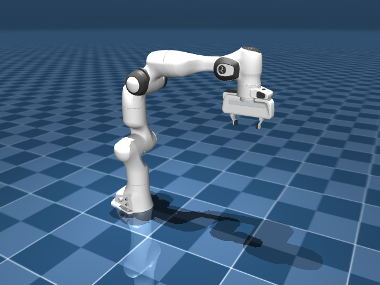

# body 树与关节

在 MuJoCo 里，一台机器人说到底就是一棵 body 树：一节连杆套着下一节，大臂里嵌着小臂，小臂里再嵌着手，一层层往下。这棵树长在 `<worldbody>` 里，每个 body 上还挂着关节、几何和惯性。Panda 就是 `link0 → link1 → … → link7 → hand → 两个手指` 这样一层套一层。读懂这棵树是怎么搭起来的，之后再看任何一个机器人模型，都有了抓手。

## 本节目标

本节围绕这棵树，弄清几个问题：

1. body 之间怎么嵌套？为什么子 body 的 `pos` 写的是相对父 body，而不是世界坐标？
2. `hinge`、`slide`、`ball`、`free` 四种关节分别在什么时候用，各自贡献几个自由度？
3. body 的质量和惯量从哪来？`<inertial>` 不写会怎样？
4. `<site>` 是什么，和 body、geom 又有什么区别？

## body 树：层级与相对位姿

`<worldbody>` 是整棵树的根。所有 body 都直接或间接地嵌套在它里面。关键规则是：**子 body 的位置和朝向始终相对于父 body**。如果把父 body 旋转了 30°，子 body 也会跟着转，不需要手动更新它的坐标。

下面是一个简化示意，两个连杆串在一起：

```xml
<worldbody>
  <body name="base" pos="0 0 0">
    <geom type="box" size="0.1 0.1 0.05"/>
    <body name="link1" pos="0 0 0.1">
      <joint name="j1" type="hinge" axis="0 1 0"/>
      <geom type="capsule" size="0.03" fromto="0 0 0 0 0 0.2"/>
    </body>
  </body>
</worldbody>
```

这里面 `link1` 的 `pos="0 0 0.1"` 是相对于 `base` 的，意思是它就在 base 上方 0.1 米处。如果把 `base` 的 `pos` 改成 `1 0 0`，`link1` 的世界位置也会整体平移。

**如果没有定义 joint，子 body 就焊在父 body 上，不产生任何自由度。** 这是 MuJoCo 和 URDF 的一个重要思维差异：在 MuJoCo 里，joint 是用来**增加**自由度的（默认是焊死），而不是用来"连接"两个 body 的。

## joint 的四种类型

MuJoCo 的常见关节类型有四种：

| 类型 | 自由度 | 直观理解 | 典型用途 |
|---|---|---|---|
| `hinge` | 1（1 个 qpos + 1 个 qvel） | 绕一个轴旋转的门铰链 | 机械臂的转动关节 |
| `slide` | 1（1 个 qpos + 1 个 qvel） | 沿一个轴平动的滑轨 | 夹爪手指、直线模组 |
| `ball` | 3（4 个四元数 qpos + 3 个 qvel） | 球窝关节，能任意旋转 | 肩关节、腕关节 |
| `free` | 6（7 个 qpos + 6 个 qvel） | 完全自由漂浮，能平移能旋转 | 被操作物体、移动基座 |

每种类型的最小 MJCF 片段：

```xml
<!-- hinge：绕 Z 轴转动，范围 ±90° -->
<joint name="elbow" type="hinge" axis="0 0 1" range="-1.57 1.57"/>

<!-- slide：沿 X 轴平动，范围 0~0.05m -->
<joint name="finger" type="slide" axis="1 0 0" range="0 0.05"/>

<!-- ball：球关节，不限制旋转方向 -->
<joint name="shoulder" type="ball"/>

<!-- free：完全自由漂浮 -->
<joint type="free"/>
```

一个 body 上可以有多个 joint，这样就构造出了"复合关节"。比如在同一个 body 上放一个 hinge 和一个 slide，就得到一个既能转、又能滑的关节。不需要像 URDF 那样专门创建一个 dummy link。

下面这张图概括了四种 joint 类型及其 qpos/qvel 维度：

<figure class="doc-figure" aria-label="四种关节类型对照">
  <p class="doc-figure-title">四种 joint 类型对照</p>
  <table>
    <tr><th>类型</th><th>qpos 长度</th><th>qvel 长度</th><th>位置表示</th><th>速度表示</th></tr>
    <tr><td>hinge</td><td>1</td><td>1</td><td>标量角度</td><td>标量角速度</td></tr>
    <tr><td>slide</td><td>1</td><td>1</td><td>标量位移</td><td>标量线速度</td></tr>
    <tr><td>ball</td><td>4</td><td>3</td><td>四元数 (w,x,y,z)</td><td>3D 角速度（局部坐标系）</td></tr>
    <tr><td>free</td><td>7</td><td>6</td><td>3D 位置 + 四元数</td><td>3D 线速度（世界）+ 3D 角速度（局部）</td></tr>
  </table>
  <div class="figure-note">ball 和 free 关节用四元数表示朝向，这就是为什么 qpos 长度比 qvel 多。ball 关节的四元数默认初始值是 (1,0,0,0)（零旋转）。</div>
</figure>

## inertial：质量与惯量

每个 body 上可以定义 `<inertial>`，描述它的质量和惯性矩阵。举个例子：

```xml
<body name="link1">
  <inertial mass="0.5" pos="0 0 0.1" fullinertia="0.001 0.001 0.0001 0 0 0"/>
  ...
</body>
```

- `mass`：质量（千克，如果用的 MKS 单位制）。
- `pos`：质心相对于 body 坐标系的位置。
- `fullinertia`：惯性矩阵的 6 个数（`Ixx Iyy Izz Ixy Ixz Iyz`）。

**不写 inertial 会怎样？** 如果 body 上挂了 geom，而且 geom 有密度（默认是 1000，即水的密度），MuJoCo 会在编译时自动根据 geom 的形状和密度推算出质量和惯性矩阵。这意味着很多情况下我们其实不需要手动写 `<inertial>`，让 MuJoCo 自己算就行。但如果模型没有 geom（或想精确指定质量），就需要手动写上。

## site：辅助标记点

`<site>` 可以理解为**轻量级的 geom**：它有一个位置和朝向，可以被渲染出来，但它不参与碰撞检测，也不参与质量推算。它的作用是在 body 上标记出"关注点"。

常见用法：
- **传感器安装位置**：IMU 传感器的安装位置、触觉传感器的感知范围、相机位姿。
- **腱（tendon）路径点**：空间腱的走线经过哪些位置。
- **末端执行器标记**：机械臂的 TCP（工具中心点），方便用 `data.site("tcp").xpos` 直接读到世界坐标。
- **IK 目标点**：逆向运动学的目标位姿。

添加一个 site 很简单：

```xml
<body name="hand">
  <site name="tcp" pos="0 0 0.1" size="0.01"/>
</body>
```

然后就可以用 `data.site("tcp").xpos` 读取它在世界坐标系中的位置。

## Panda 的 body 树读一遍

以 Panda 为例，它的 body 树结构大致如下（简化）：

```text
worldbody
  └─ link0（底座，无 joint → 焊在世界）
       └─ link1（joint1: hinge，绕 Z 轴）
            └─ link2（joint2: hinge）
                 └─ link3（joint3: hinge）
                      └─ link4（joint4: hinge）
                           └─ link5（joint5: hinge）
                                └─ link6（joint6: hinge）
                                     └─ link7（joint7: hinge）
                                          └─ hand（无 joint）
                                               ├─ left_finger（finger_joint1: slide）
                                               └─ right_finger（finger_joint2: slide）
```

渲染出来就是这台 7 轴机械臂 + 夹爪：



每一层只比上一层多一个 body + 一个 hinge joint。`hand` 是夹爪的基座，它下面挂了两根手指，各有一个 slide joint 来实现开合。这是典型的"链状嵌套"结构。

## 小结

- `<worldbody>` 是一棵 body 树，子 body 的位姿始终相对于父 body。
- MuJoCo 的 joint 用于**增加**自由度（默认 body 焊死在父 body 上），与 URDF 的思维相反。
- 四种常见 joint 类型：hinge（转）、slide（移）、ball（球）、free（自由漂浮）。ball 和 free 由于用了四元数，`qpos` 会比 `qvel` 长。
- `<inertial>` 定义了质量和惯性，不写的话 MuJoCo 会从 geom 自动推算。
- `<site>` 是轻量标记点，常用于传感器安装、腱路径和末端位置读取。

## 动手练习

修改上一页的最小 MJCF 示例：先把 `free` joint 换成 `ball`，加载后打印 `nq`、`nv`，确认是 `nq=4, nv=3`（ball 用四元数，nq 比 nv 多）。再换成“同一个 body 上一个 `hinge` 加一个 `slide`”的复合关节，看 `nq`/`nv` 又是多少。（小提醒：MuJoCo 不允许在 `ball` 后面再接转动关节，所以别在 ball 之后加 hinge。）

## 参考资料

- [MuJoCo Documentation: XML Reference](https://mujoco.readthedocs.io/en/stable/XMLreference.html)
- [MuJoCo Documentation: Computation](https://mujoco.readthedocs.io/en/stable/computation/index.html)
- [MuJoCo Menagerie: Franka Emika Panda](https://github.com/google-deepmind/mujoco_menagerie/tree/main/franka_emika_panda)

## 导航

- 上一节：[MJCF 整体骨架](01-mjcf-skeleton.md)
- 返回上级：[建模](../02-modeling.md)
- 下一节：[坐标系与朝向](03-coordinate-frames.md)
